# Just2Share
## Video:1 ABAP CDS Views Introduction

## Video 2 - HANA Studio Intro, Simple CDS Views, Access in SE38 & SE11

@AbapCatalog.sqlViewName: ''

## Video 3 - CDS with I/P, CDS in SE38, Call CDS from another CDS, CDS to ALV

Input parameters created in cds views are mandatory.

##  Video 4 - About Versions and Explore Standard CDS Views

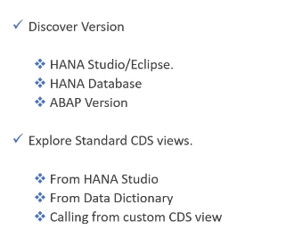

## Video 5 - Session Variable & Simple Data Manipulation in CDS Views

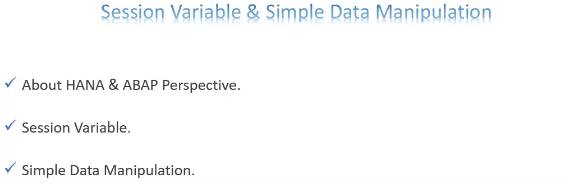

    $session.client

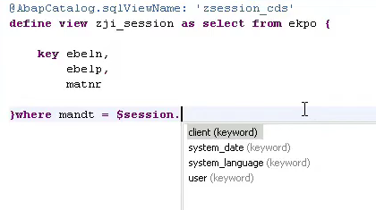
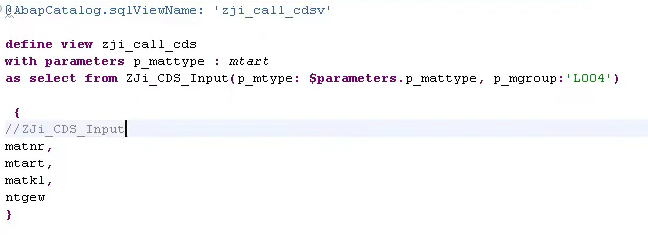

## Video - 6 CDS Views Joins (Inner, left outer and right outer)

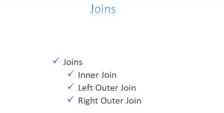

## Video 7 - CDS View Association Part 1

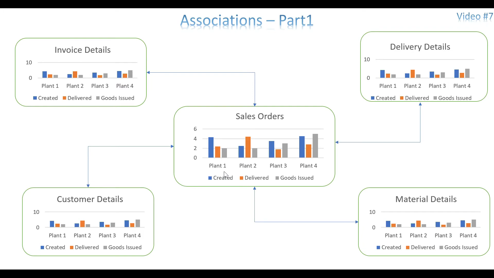

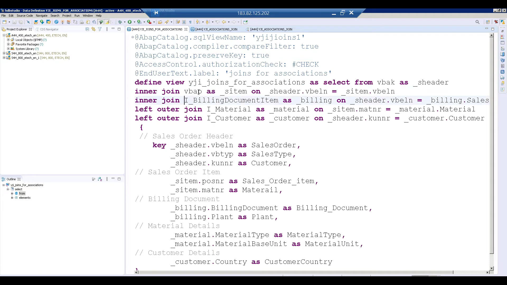
Unnecesarily all the data is pulled, also if someone is not authorized then also it will pull the data

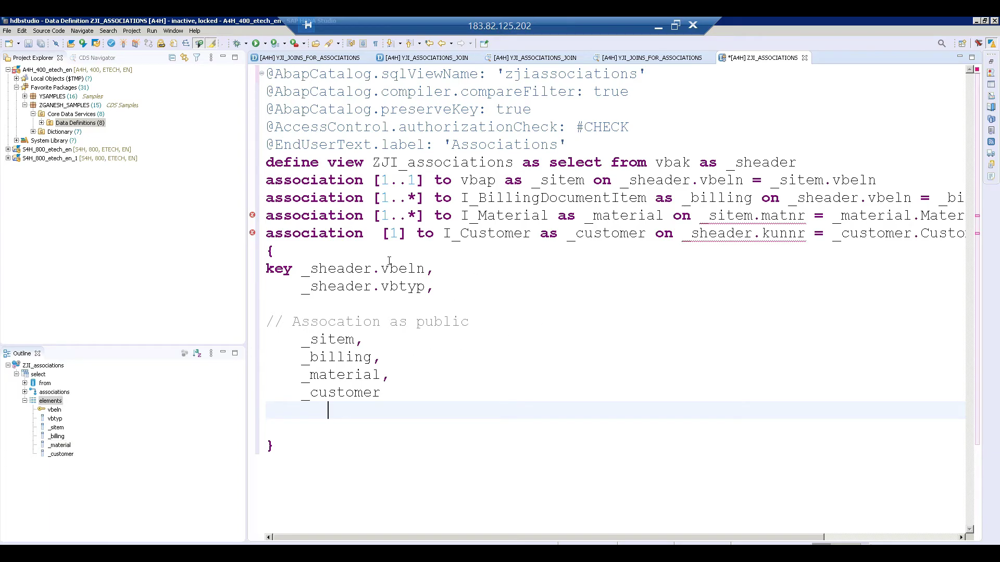
Always make associations public to use them

You should not make any associations with the field which is available in the association part not with the source. Here the source is sheader other all four are association.You always make the connection between your source and association with your basic sheader only

All the fields used in the mapping of association, that should be avl in the projection list

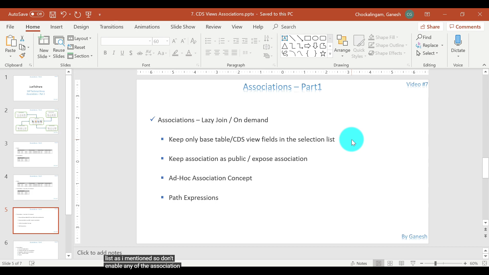

## Video - 8 CDS View Association Part 2

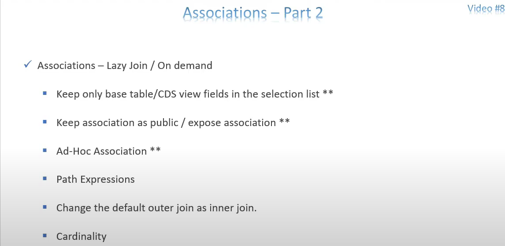

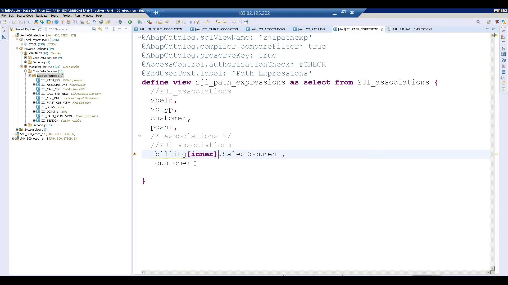
inner join - changed assocition left outer join to inner join, do that the empty field will not come

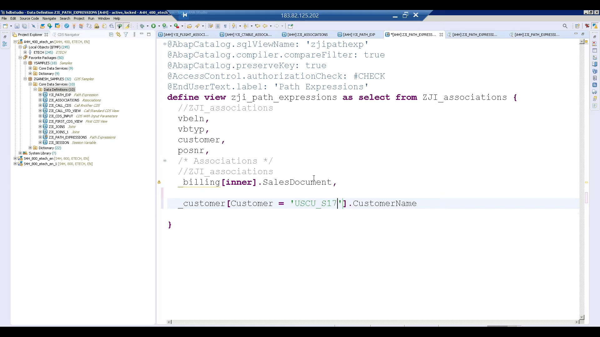
we can use path expressions like this also

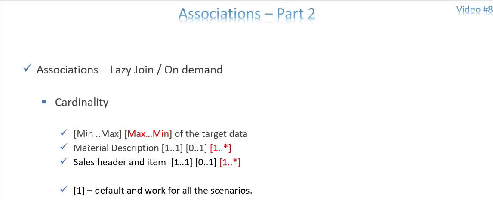
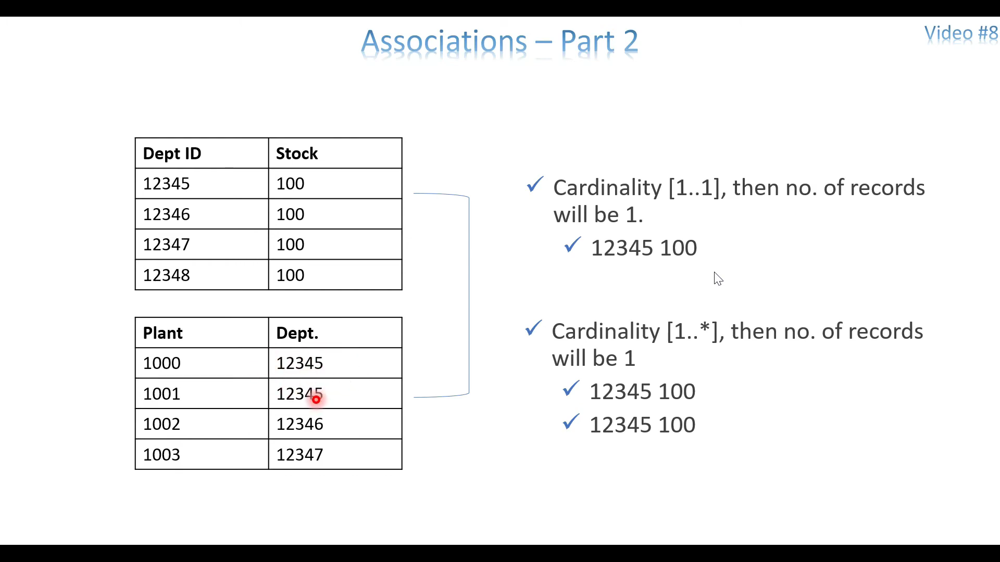

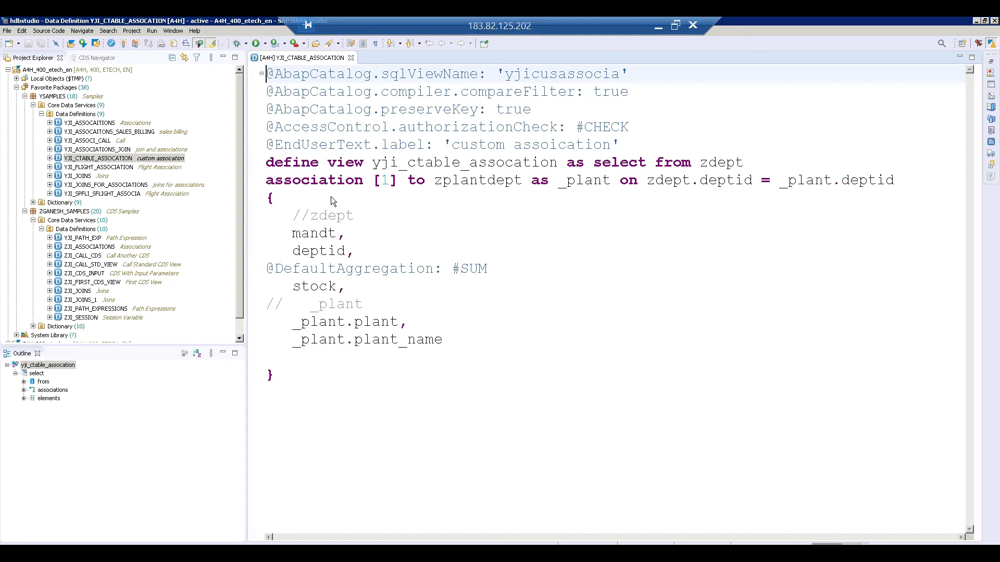
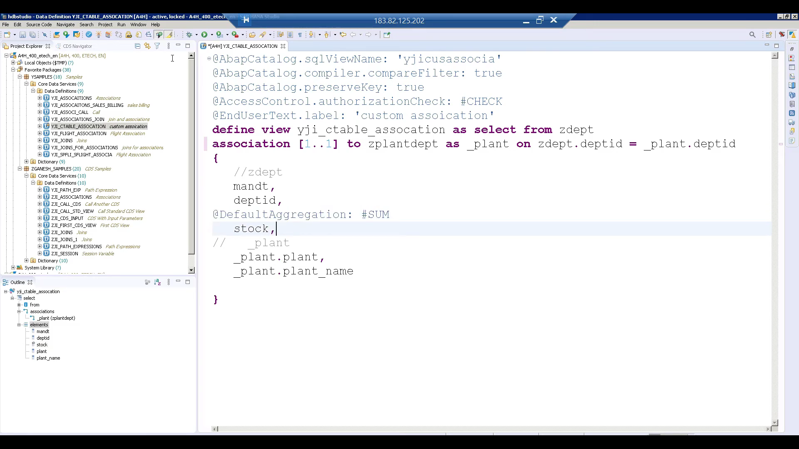
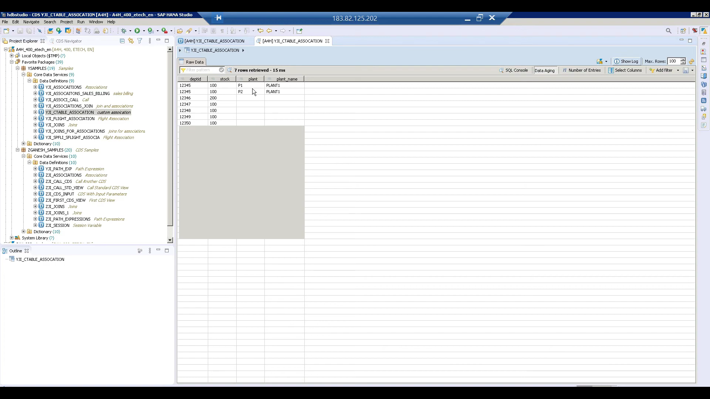

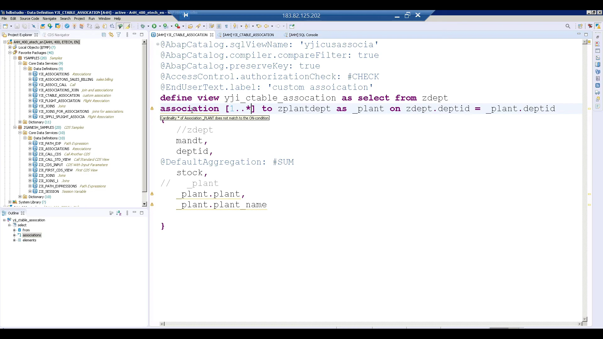
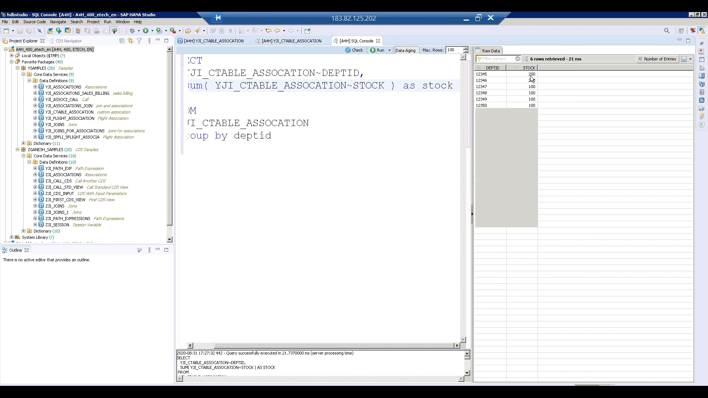
here due to 1..* cardnality we are geting duplicate records

