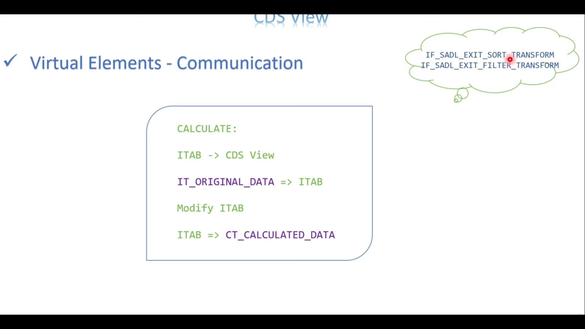

# Just2Share
## Video:1 ABAP CDS Views Introduction

## Video 2 - HANA Studio Intro, Simple CDS Views, Access in SE38 & SE11

@AbapCatalog.sqlViewName: ''

## Video 3 - CDS with I/P, CDS in SE38, Call CDS from another CDS, CDS to ALV

