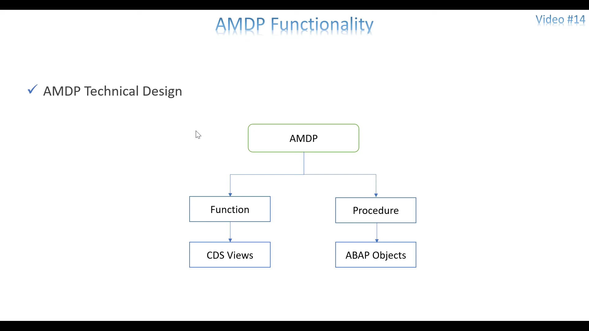
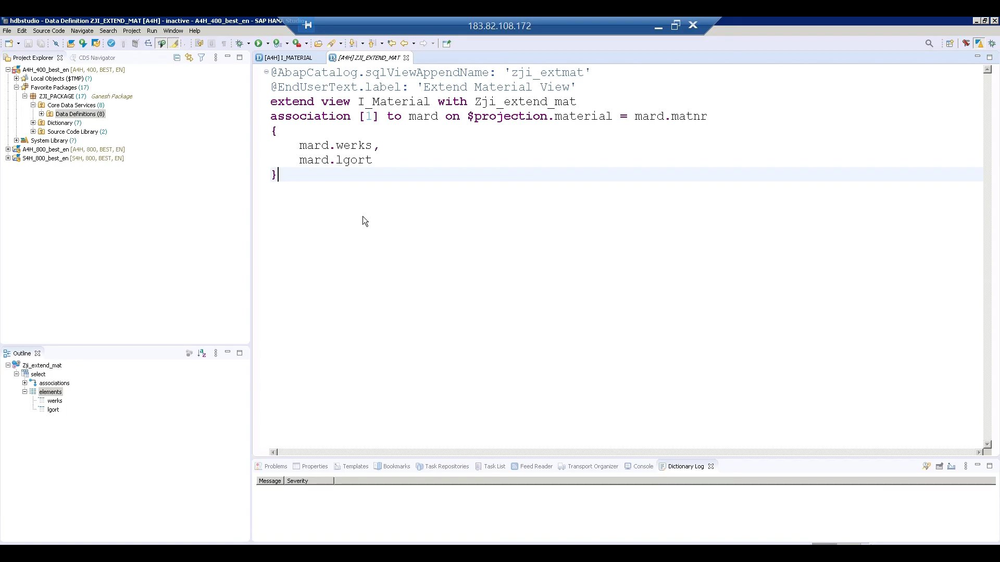
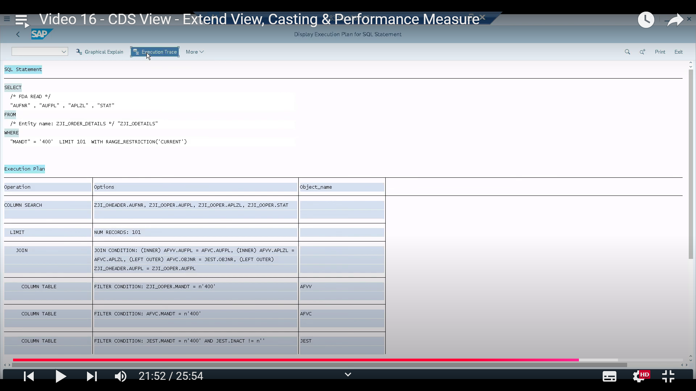
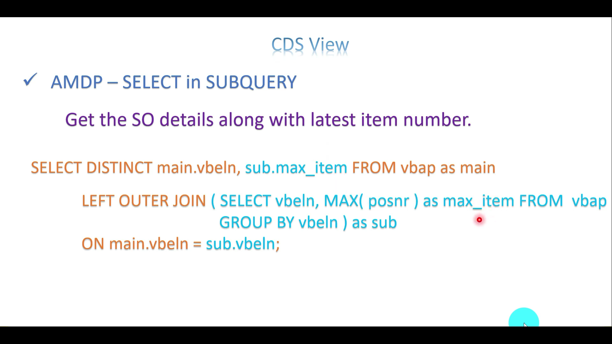
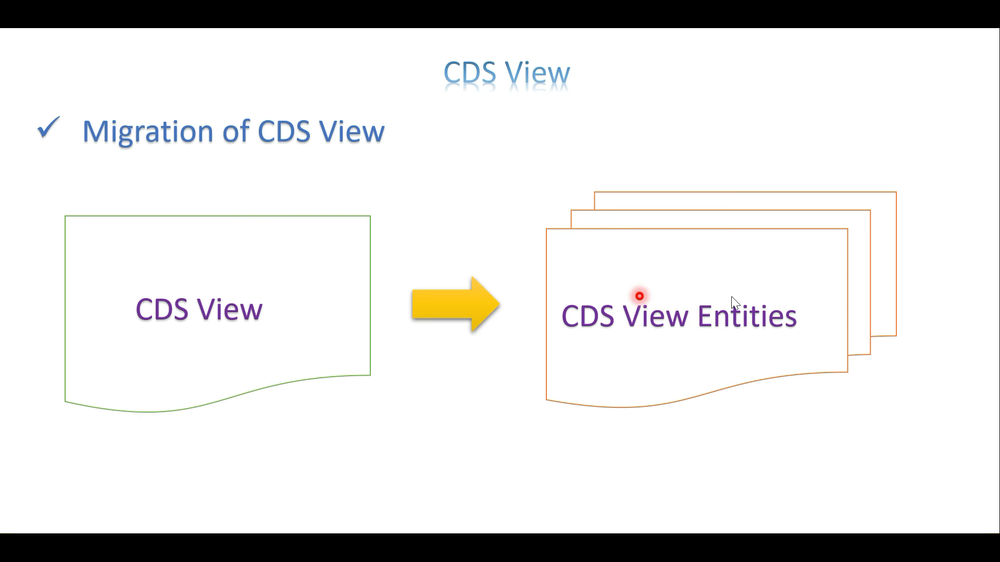
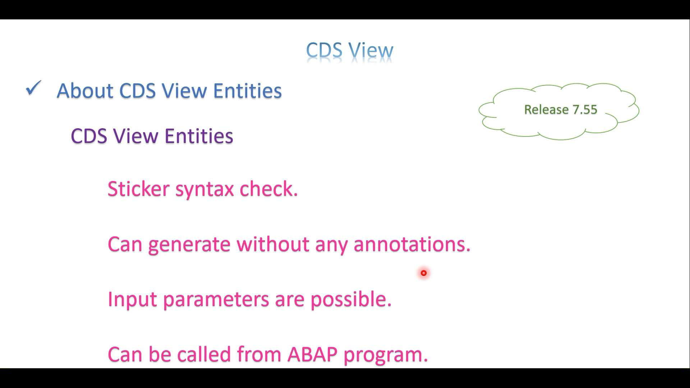
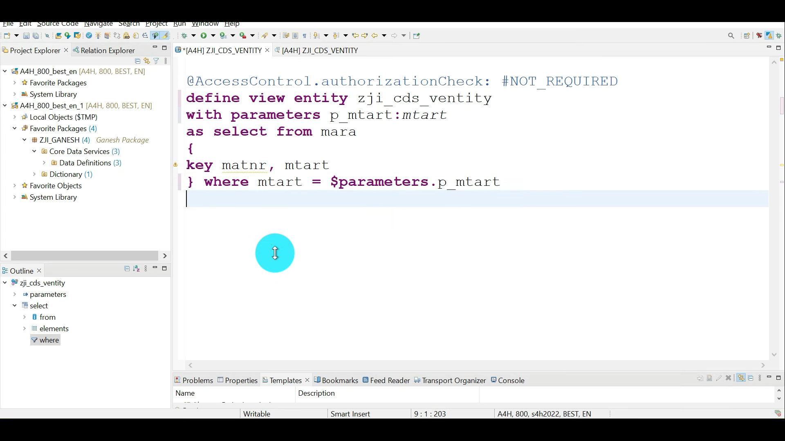
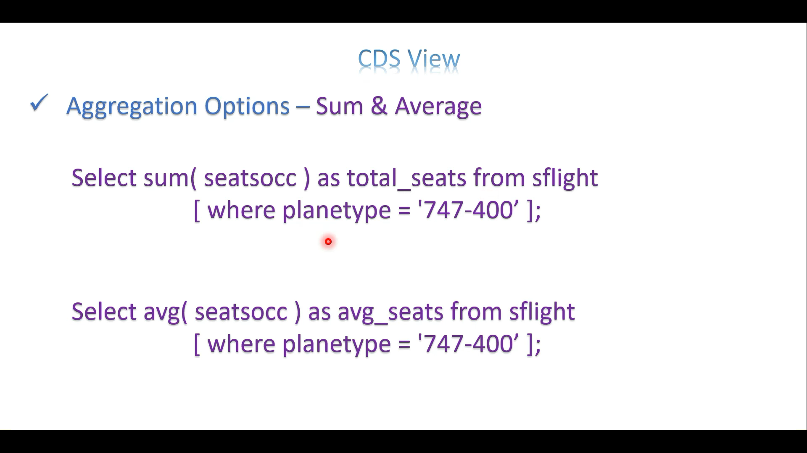
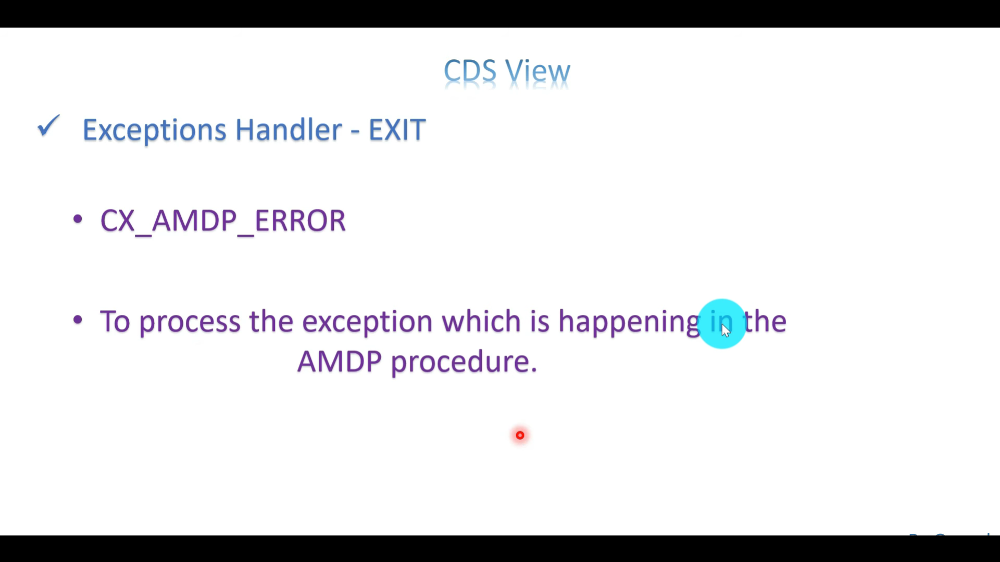

# [Just2Share](https://www.youtube.com/@just2shareji/playlists)

<!-- index-start -->
## Index

- [Video:1 ABAP CDS Views Introduction](#video1-abap-cds-views-introduction)
- [Video 2 HANA Studio Intro, Simple CDS Views, Access in SE38 & SE11](#video-2---hana-studio-intro-simple-cds-views-access-in-se38--se11)
- [Video 3 CDS with I/P, CDS in SE38, Call CDS from another CDS, CDS to ALV](#video-3---cds-with-ip-cds-in-se38-call-cds-from-another-cds-cds-to-alv)
- [Video 4 About Versions and Explore Standard CDS Views](#-video-4---about-versions-and-explore-standard-cds-views)
- [Video 5 Session Variable & Simple Data Manipulation in CDS Views](#video-5---session-variable--simple-data-manipulation-in-cds-views)
- [Video 6 CDS Views Joins (Inner, left outer and right outer)](#video---6-cds-views-joins-inner-left-outer-and-right-outer)
- [Video 7 CDS View Association Part 1](#video-7---cds-view-association-part-1)
- [Video 8 CDS View Association Part 2](#video---8-cds-view-association-part-2)
- [Video 9 CDS View Table Function Part 1](#video-9---cds-view-table-function-part-1)
- [Video 10 CDS View Table Function Part 2](#video-10---cds-view-table-function-part-2)
- [Video 11 CDS View Table Function Part 3](#video-11---cds-view-table-function-part-3)
- [Video 12 CDS View VDM Type and Data Category](#video-12-cds-view---vdm-type-and-data-category)
- [Video 13 CDS View - AMDP Procedure Part 1](#video-13---cds-view---amdp-procedure-part-1)
- [Video 14 CDS View AMDP Procedure Part 2 (Import multiple records, select-options and ranges).](#video-14-cds-view---amdp-procedure-part-2-import-multiple-records-select-options-and-ranges)
- [Video 15 CDS View - AMDP CURD Operations](#video-15---cds-view---amdp-curd-operations)
- [Video 16 CDS View - Extend View, Casting & Performance Measure](#video-16---cds-view---extend-view-casting--performance-measure)
- [Video 17 CDS View consumption in OData Service](#video-17---cds-view-consumption-in-odata-service)
- [Video 20: CDS View Cardinality in association process](#video-20-cds-view-cardinality-in-association-process)
- [Video 21: CDS View with sorting process](#video-21-cds-view-with-sorting-process)
- [Video 25: CDS View Virtual Elements](#video-25-cds-view---virtual-elements)
- [Video 26: CDS View Invalid Key Predicate Issue](#video-26-cds-view---invalid-key-predicate-issue)
- [Video 27: CDS View Date Functionalities](#video-27-cds-view---date-functionalities)
- [Video 28: CDS Views AMDP Exceptions](#video-28-cds-views---amdp-exceptions)
- [Video 29: CDS Views AMDP with Sub Query](#video-29-cds-views---amdp-with-sub-query)
- [Video 30: CDS View How to call a method from AMDP procedure?](#video-30-cds-view---how-to-call-a-method-from-amdp-procedure)
- [Video 31: CDS View Migration to View Entities Part 1](#video-31-cds-view---migration-to-view-entities-part-1)
- [Video 32: CDS View Unit and Currency Conversion](#video-32-cds-view---unit-and-currency-conversion)
- [Video 33: CDS View SQL Aggregation functions](#video-33-cds-view---sql-aggregation-functions)
- [Video 34: CDS View AMDP Procedure - Exit handler](#video-34-cds-view---amdp-procedure---exit-handler)
- [Video 35: CDS View Ranking Functions](#video-35-cds-view---ranking-functions)
- [Video 35: CDS View $parameters options](#video-35-cds-view---parameters-options)
<!-- index-end -->

## Video:1 ABAP CDS Views Introduction


## Video 2 - HANA Studio Intro, Simple CDS Views, Access in SE38 & SE11


@AbapCatalog.sqlViewName: ''

## Video 3 - CDS with I/P, CDS in SE38, Call CDS from another CDS, CDS to ALV


Input parameters created in cds views are mandatory.

##  Video 4 - About Versions and Explore Standard CDS Views


## Video 5 - Session Variable & Simple Data Manipulation in CDS Views


    $session.client


## Video - 6 CDS Views Joins (Inner, left outer and right outer)


## Video 7 - CDS View Association Part 1


Unnecesarily all the data is pulled, also if someone is not authorized then also it will pull the data


Always make associations public to use them

You should not make any associations with the field which is available in the association part not with the source. Here the source is sheader other all four are association.You always make the connection between your source and association with your basic sheader only

All the fields used in the mapping of association, that should be avl in the projection list


## Video - 8 CDS View Association Part 2


inner join - changed assocition left outer join to inner join, do that the empty field will not come


we can use path expressions like this also


here due to 1..* cardnality we are geting duplicate records

## Video 9 - CDS View Table Function Part 1


## Video 10 - CDS View Table Function Part 2


## Video 11 - CDS View Table Function Part 3


Class methods declared for table funtion cannot be tested in SE24

We can simply use the cds for testing

## Video 12 CDS View - VDM Type and Data Category


    @VDM.Viewtype : #BASIC
    @Analytics.dataCategory : #DIMENSION
    @Analytics.dataCategory : #FACT
    @VDM.Viewtype : #COMPOSITE
    @Analytics.dataCategory : #CUBE
    @VDM.Viewtype : #CONSUMPTION
    @OData.publish : true
    


## Video 13 - CDS View - AMDP Procedure Part 1


## Video 14 CDS View - AMDP Procedure Part 2 (Import multiple records, select-options and ranges).


Class and method used in table function cannot be called in any abap object.

For procedure we can use it in abap objects


We can pass select option and range same way

## Video 15 - CDS View - AMDP CURD Operations

table function is an read-only function

Procedures supports CRUD operations


## Video 16 - CDS View - Extend View, Casting & Performance Measure





performance - ST05


Select sql trace in options and activate the trace 

then execute the cds once -> come back to st05 and deactivate the trace -> click on display trace


click in execution plan to see it


to open this in eclipse/hana studio


click on execution trace 


save the trace with plv extension

opren hana studio -> file menu -> open file


click on second tab(executed plan)


## Video 17 - CDS View consumption in OData Service


## Video 20: CDS View Cardinality in association process


## Video 21: CDS View with sorting process


Video 22 to 24 is not present
## Video 25: CDS View - Virtual Elements


We can use the abap object in cds view


Implement both the methods, even if you are not using it.


We have add a service for virtual elements to be used


We can test it using the odata services

## Video 26: CDS View - Invalid Key Predicate Issue

In case we are using cds views with parameter fields treat it as keys field also, because in cds views paramter fields are mandatory to pass.

Keep this in mind while creating odata services and while passing data via url.

## Video 27: CDS View - Date Functionalities


## Video 28: CDS Views - AMDP Exceptions


## Video 29: CDS Views - AMDP with Sub Query





## Video 30: CDS View - How to call a method from AMDP procedure?


## Video 31: CDS View - Migration to View Entities Part 1



CDS view also creates DDIC object 
 





These program are for migration from cds to cds entity, downgrading is not possible with help of this program.




## Video 32: CDS View - Unit and Currency Conversion


## Video 33: CDS View - SQL Aggregation functions





## Video 34: CDS View - AMDP Procedure - Exit handler




this will continue the next steps


we can declare custom exception and raise it with signal statement


custom error code error code range [10000 - 19999]


re signal


in entire procedure we can have only 1 exit handler


Resignal needs to be in begin and end block


## Video 35: CDS View - Ranking Functions


Here when the result set is in groups then the ranking function will work like recursive and generate rank for each group
```
1 A
2 A
3 A
4 B
5 B
6 B
7 C
8 C
9 C

After grouping

1 A
2 A
3 A

1 B
2 B
3 B

1 C
2 C
3 C
```


After the ranking we are further partioning it


Here after partition it has created different result sets so ranking has been done on individual sets


here if duplicate is found, it skip the ranks


## Video 35: CDS View - $parameters options


