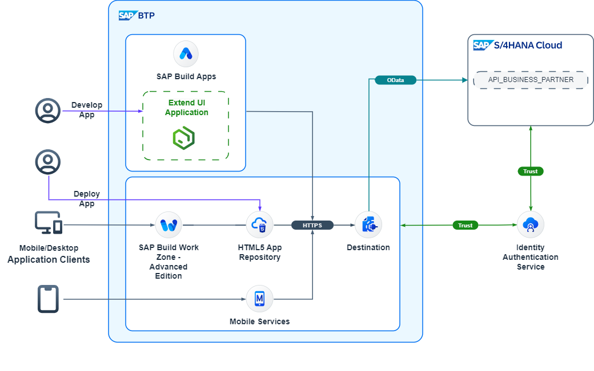
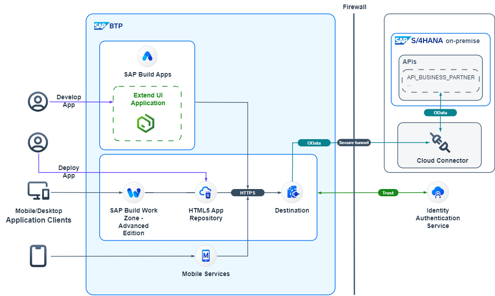

# Keep the Core Clean Using SAP Build Apps with SAP S/4HANA

## Use Case
Use the SAP Build Apps, a no-code platform, to create a unique and innovative UI without changing the core functionality of your SAP S/4HANA Cloud or your SAP S/4HANA on-premise system.

To be able to apply this use case to your needs, look at this sample scenario:

A sales executive meets with various business partners and needs to access the latest business partner information on the go. He needs a simplified, custom application which can run on a mobile device or a tablet.

This mission explains how to create a custom accessible application that provides your employees with business partner details directly from your SAP S/4HANA system in a secured manner, even without having VPN access. You will learn how quickly a new UI application can be developed with the no-code capabilities of SAP Build Apps. You will also find out what the process is for setting up and developing a productive extension application.

## Current Position - What is the challenge?
Business partner data is only available using VPN access. However, sales executives need access to corporate data even outside the company intranet. They usually have special authorizations to view relevant business data from the SAP S/4HANA system.
To access business partner data, an extension application needs to be developed quickly by a business user without prior coding experience.

## Destination - What is the outcome?
Enhance the SAP S/4HANA functionality by developing an extension application that will allow you to access business partner information outside the company intranet.

## How You Get There - What is the solution?
Create a simple UI extension application of SAP S/4HANA and deploy it in SAP BTP. Use the SAP Build Apps no-code platform to accelerate the development process.
If you need support, you can ask the experts listed for this use case.

SOLUTION_DIAGRAM

Solution Diagram SAP S/4HANA on-premise