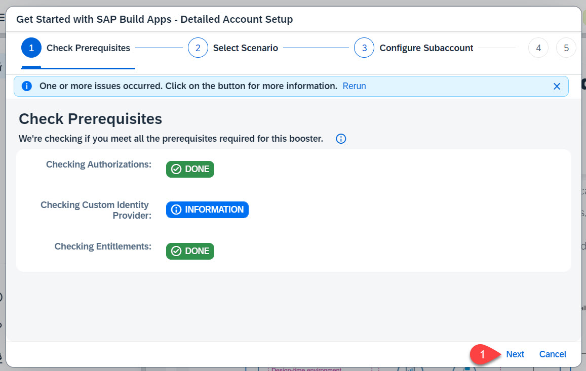
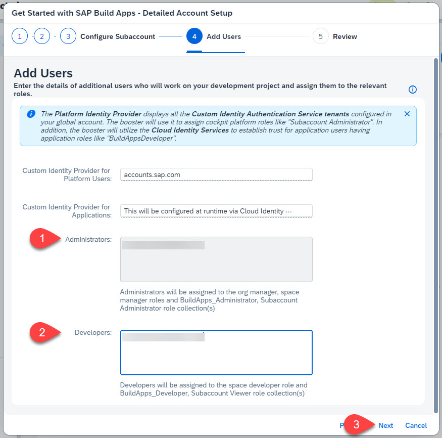
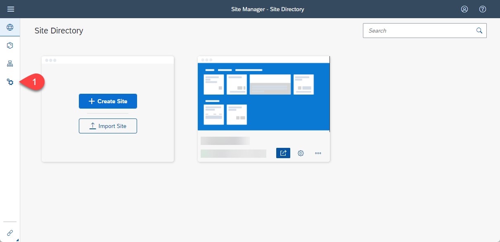

# [Keep the Core Clean Using SAP Build Apps with SAP S/4HANA](https://discovery-center.cloud.sap/protected/index.html#/missiondetail/4024/4228/)

## [Learn the Basics of SAP BTP](https://github.com/SAP-samples/cloud-extension-html5-sample/blob/mission/mission/discover/BTP.md)
- [SAP BTP Product Page](https://help.sap.com/docs/btp?locale=en-US)
- [Basic Platform Concepts](https://help.sap.com/viewer/3504ec5ef16548778610c7e89cc0eac3/Cloud/en-US/73beb06e127f4e47b849aa95344aabe1.html)
    
- [Cloud Foundry Environment](https://help.sap.com/viewer/3504ec5ef16548778610c7e89cc0eac3/Cloud/en-US/9c7092c7b7ae4d49bc8ae35fdd0e0b18.html)
- [Kyma Environment](https://help.sap.com/viewer/65de2977205c403bbc107264b8eccf4b/Cloud/en-US/468c2f3c3ca24c2c8497ef9f83154c44.html)
- [SAP BTP Resource Center Page](https://support.sap.com/en/product/onboarding-resource-center/business-technology-platform.html)

## Sub Mission
- [Setup your Global Account of your SAP BTP Enterprise Account](https://developers.sap.com/tutorials/btp-ea-onboard-02-ga.html)

- [Getting started with SAP BTP Enterprise Account.](https://discovery-center.cloud.sap/missiondetail/3019/3016/)
    - [Enterprise free tier services](https://discovery-center.cloud.sap/viewServices?category=freetierservices&regions=all)
    

    - Visit the [SAP Business Technology Platform](https://www.sap.com/products/technology-platform.html) Home Page

    - SAP BTP on SAP Help Portal:
        - SAP Help - SAP BTP home page [SAP Business Technology Platform](https://help.sap.com/docs/btp/sap-business-technology-platform/btp-getting-started)
        - SAP Help - SAP BTP Getting Started [SAP Business Technology Platform](https://help.sap.com/docs/btp/sap-business-technology-platform/btp-getting-started)
        - SAP Help - Best Practices for SAP BTP [SAP BTP Administrator's Guide](https://help.sap.com/docs/btp/btp-admin-guide/btp-admin-guide)

    - SAP BTP on SAP Community:
        - SAP BTP Blogs [all BTP blogs](https://blogs.sap.com/tags/8077228b-f0b1-4176-ad1b-61a78d61a847/)
        - SAP BTP [Questions](https://blogs.sap.com/tags/8077228b-f0b1-4176-ad1b-61a78d61a847/)
        - SAP Developers [Tutorial Navigator](https://developers.sap.com/tutorial-navigator.html)

    

## [Learn About SAP S/4HANA Cloud](https://github.com/SAP-samples/btp-s4hana-nocode-extension/blob/main/discover/S4HC.md)
- [SAP S/4HANA Cloud Documentation](https://help.sap.com/docs/SAP_S4HANA_CLOUD)
- [SAP S/4HANA Cloud Community Page](https://pages.community.sap.com/topics/s4hana-cloud)
    

## [Learn About SAP S/4HANA](https://github.com/SAP-samples/cloud-extension-html5-sample/blob/mission/mission/discover/S4H.md)

- [Discover SAP S/4HANA](https://help.sap.com/docs/SAP_S4HANA_ON-PREMISE)
- [SAP S/4HANA Help Page](https://help.sap.com/docs/SAP_S4HANA_ON-PREMISE/2d0d56688e894142984389b24f6f872e/d353743a81074865adad510bc59b11fc.html)
- [SAP S/4HANA Installation Guide](https://help.sap.com/doc/6b11678926d3409bbfea8897cb34d10f/2021/en-US/INST_OP2021.pdf)

## [Learn About HTML5 Applications](https://github.com/SAP-samples/cloud-extension-html5-sample/blob/mission/mission/discover/HTML5.md)

- [Developing HTML5 Application in the Cloud Foundry Environment](https://help.sap.com/docs/cloud-portal-service/sap-cloud-portal-service-on-cloud-foundry/developing-html5-applications-and-extensions)
- [What is the HTML5 Application Repository for SAP BTP?](https://help.sap.com/docs/cloud-portal-service/sap-cloud-portal-service-on-cloud-foundry/what-is-html5-application-repository)

## [Learn About SAP Build Apps?](https://github.com/SAP-samples/btp-s4hana-nocode-extension/blob/main/discover/AppGyver.md)

[SAP Build Apps Documentation](https://www.sap.com/products/technology-platform/low-code-app-builder.html)

The SAP Build Apps tool provides a professional, no-code application development environment, designed for anyone to quickly develop apps with drag-and-drop capabilities, regardless of role and skill level.

### SAP Build Apps Features
Eliminate coding effort to increase development efficiency by building apps visually for Web, iOS, and Android.

#### Drag-and-Drop UI
- Speed up the design process by leveraging a large library of customizable user interface components
- Save time with smart and reusable theme patterns
- Make changes more easily with the ability to preview results in real time
#### Visual Business Logic
- Build app logic visually from built-in formula functions ​
- Transform data more easily with more than 400 built-in formula functions
- Design apps without writing code or learning syntax by using drag-and-drop functionalities on a canvas

#### Deep Integrations
- Integrate modern APIs in minutes with the REST integration wizard​ in SAP Build Apps
- Access SAP Fiori to build rich user interfaces directly in SAP Build Apps
- Connect with the SAP Service Cloud solution to build custom UIs that extend the solution's functionalities

#### Multidevice Support
- Build apps for all form factors with a native runtime optimized for each device, which helps ensure the smoothest experience

## [Learn About SAP Cloud Identity Services - Identity Authentication](https://github.com/SAP-samples/cloud-extension-html5-sample/blob/mission/mission/discover/IAS.md)

The Identity Authentication service provides you with controlled cloud-based access to business processes, applications, and data. It simplifies your user experience through authentication mechanisms, single sign-on, on-premise integration, and convenient self-service options.

See [Identity Authentication](https://help.sap.com/viewer/6d6d63354d1242d185ab4830fc04feb1/Cloud/en-US/d17a116432d24470930ebea41977a888.html) on SAP Help Portal for more details.

## [Learn About SAP Work Zone](https://github.com/SAP-samples/cloud-extension-html5-sample/blob/mission/mission/discover/Launchpad.md)

The service SAP Build Work Zone, standard edition lets you build digital experience company site for employees, customers, and partners. You can streamline access to business data so that your employees can execute their daily business tasks securely, from any device.

Use SAP Work Zone for building digital workplace solutions to increase user productivity and engagement. SAP Work Zone centralizes access to relevant business applications, processes, information, and communication in a unified entry point that users can access from any device.

SAP Build Work Zone, standard edition enables organizations to establish a unified point of access to SAP (e.g. SAP S/4HANA), custom-built, and third party applications and extensions, both on the cloud and on premise. Note: SAP Launchpad service was recently renamed to SAP Build Work Zone, standard edition. For this mission, we use the SAP Build Work Zone, standard edition service to create a company site.

### SAP Build Work Zone, standard edition

- Application Integration
    - Provide business users a central point of access for apps and tasks, with seamless integration to various UI technologies and third-party apps.
- Intuitive and Engaging User Experience
    - A role-based, personalized business site with a flexible content structure and a flexible design.
- Integrations
    - Integration with central SAP BTP services, such as inbox and cloud identity services.
- Extensibility
    - Extensibility framework for customizations using shell plugins and custom branding.

### SAP Build Work Zone, advanced edition

- Beyond applications: contextual collaboration, Web content and recommendations
- Powerful digital experience suite to build customer-specific and user-oriented workplaces
- Driven by Line of Business (for example, Human Resources)
- Consistent work experience
- Harmonized access to apps and content
- Extend SAP Build Work Zone, advanced edition to your business needs with SAP BTP services. Add chat bots with conversational AI, provide easy-to-follow guided experiences with workflows, and more.
- Powerful search and recommendations driving personalized and contextual intelligent recommendations based on in-document information and user activity
- Integrating on-premise and cloud apps 

### Links:
- [SAP Build Work Zone, standard edition](https://help.sap.com/docs/WZ_STD)
- [Feature Scope Description for SAP Build Work Zone, standard edition](https://help.sap.com/doc/eb57eb0ef530411093f071d5d7b20b0a/Cloud/en-US/WZ_STD_FSD.pdf)
- [What is SAP Work Zone, advanced edition?](https://help.sap.com/viewer/fec5ca6e3229418f84a932c745cbe985/Cloud/en-US)

## [Prerequisites and Required Systems](https://github.com/SAP-samples/btp-s4hana-nocode-extension/blob/main/prepare/README.md) - this is for enterprise account

This section contains the prerequisites that you have to fulfill before you get started. Make sure that the prerequisites are fulfilled and all required systems are in place.

###  Systems and Accounts

* [SAP S/4HANA Cloud](https://www.sap.com/products/erp/s4hana.html) system or [SAP S/4HANA on-premise](https://community.sap.com/topics/s4hana)
* [Global account](https://help.sap.com/products/BTP/65de2977205c403bbc107264b8eccf4b/8ed4a705efa0431b910056c0acdbf377.html?locale=en-US#loioc165d95ee700407eb181770901caec94) in SAP BTP
* Subaccount in SAP BTP with Cloud Foundry environment enabled. Please check in the [SAP Build Apps - Pricing section](https://discovery-center.cloud.sap/serviceCatalog/sap-appgyver) in which SAP BTP regions SAP Build Apps is available.
* [Optional] If you don't have a Global account in SAP BTP you can run this mission on the SAP BTP Trial account.
* [Optional] If you don't have an SAP S/4HANA Cloud system you can run this mission by installing a mock server. For the mock server, you would need 256MB of Cloud Foundry runtime.

### SAP BTP Provider Account

* Enable SAP BTP Cloud Foundry [global account](https://developers.sap.com/tutorials/cp-cf-entitlements-add.html).
* SAP BTP [subaccount](https://help.sap.com/products/BTP/65de2977205c403bbc107264b8eccf4b/8ed4a705efa0431b910056c0acdbf377.html?locale=en-US#loio8d6e3a0fa4ab43e4a421d3ed08128afa)
* SAP BTP space

### Entitlements

The application requires the following [Entitlements and Quotas](https://help.sap.com/products/BTP/65de2977205c403bbc107264b8eccf4b/00aa2c23479d42568b18882b1ca90d79.html?locale=en-US) in the SAP BTP cockpit:

| Service                           | Plan       | Number of Instances |
|-----------------------------------|------------|:-------------------:|
| SAP Build Apps                      | standard   |          1          |
|  SAP Build Work Zone, standard edition | free or standard |    1          |
| Cloud Foundry runtime (optional)  | MEMORY     |          1          |
| Destination service               | lite       |          1          |

## [Get Started with SAP Build Apps - Quick Account Setup](https://github.com/SAP-samples/btp-s4hana-nocode-extension/blob/main/prepare/QUICKSETUP.md) - this is for enterprise account

In this mission you have the option to set up your BTP account automatically using the Quick Account Setup with Terraform or manually by following a step-by-step guide.

### Choose one of the two options:
1.	Quick Account Setup (Recommended)
([The Quick Account Setup executes this Terraform script](https://github.com/SAP-samples/btp-terraform-samples/tree/main/released/discovery_center/mission_4024) 
2.	Manual Setup (continue to the next card to find tutorial for manual setup)

### Automated Quick Account Setup (Recommended)
Please make sure that you have fulfilled the prerequisites for the Quick Account Setup (see Prerequisites section on the mission overview page) before you start the Quick Account Setup.

#### How to start QAS

1. Choose **Start Quick Account Setup** button on the top right of this card

    

2. Choose your account type **Enterprise** and choose **Continue**

    

3. In the popup select your **Global Account** and choose **Continue**

    

4. Your account will now be created

    

 5. As soon as your account is created choose **Continue to Use Case**

    

#### What did the QAS do?
 
What we’ll setup for you (Enterprise):
- Create a new subaccount.
- Add 4 service plans to entitle new subaccount.
- Add a instance for service: SAP Destination service.
- Add 3 subscriptions for services: SAP Build Apps, SAP Cloud Identity Services, SAP Build Work Zone, standard edition.
- Assign 6 role collections to user(s).

#### For Code Lovers: Uncover the Quick Account Setup
If you're curious to see the code behind this automated setup, you can access the underlying Terraform scripts on GitHub.
These Terraform scripts can be used to do Infrastructure-as-Code on SAP BTP. You can see all details of the setup, adjust it to your needs, and create the resources on SAP BTP manually yourself.
[Terraform Script for this Mission](https://github.com/SAP-samples/btp-terraform-samples/tree/main/released/discovery_center/mission_4024)

#### How to continue after successfully running the Quick Account Setup

After you have sucessfully completed all the required steps, you can continue with the card **Enable the Identity Authentication for SAP Build Work Zone**.

You can skip the next two cards **Optional: Manual Set-up of SAP Build Apps in SAP BTP Productive Account** and **Optional: Manual Set-up of SAP Build Apps in SAP BTP Trial Account**  

## [Setup the SAP Build Apps Service](https://github.com/SAP-samples/btp-s4hana-nocode-extension/blob/main/prepare/TrialBooster.md?plain=1)

If you have already set up your SAP BTP account for SAP Build Apps by using the _Get Started with SAP Build Apps - Quick Account Setup_ link the mission overview or in the previous tile, you can skip this tutorial.

In this section you will use a booster to setup the landscape in your **SAP BTP Trial Account** for using **SAP Build Apps**. The process described here will use the already existing subaccount, because of the limitations in the Trial Account.

**Important:** Please use trial account in US East region

Logon to your trial account

### Run the Booster (Detailed Account Setup)
Select **Boosters**. Search for SAP Build Apps. Press **Start**.

When the prerequisites are checked successfully, press **Next**.

> Hint: If you there is an error, please try to rerun the booster again

Choose **Select Subaccount** and press **Next**.

Find the configuration of your account and adjust the remaining fields if necessary and then press **Next**.

In the section **Custom Identity Provider for Applications**, select the tenant you want to use, provide your **email**, then press **Next**.

Check your settings and press **Finish**.

Choose **Navigate to subaccount**, which will open the subaccount on another tab. Come back to this tab and press **Close**.
Go to your email inbox and find the activation mail for your IAS account. Choose **Click here to activate your account**.

This will open a new webpage where you can configure your IAS Profile. Set a password, which you can use to access SAP Build Apps. Choose **Continue**.

### Result
The subaccount has been configured with a custom IAS tenant and your user has been assigned the relevant role collections.

In the next step you will learn how to Open the SAP Build Apps via the SAP BTP Cockpit.

## [Enable the Identity Authentication for SAP Build Work Zone](https://github.com/SAP-samples/btp-s4hana-nocode-extension/blob/main/prepare/Identityauthentication.md?plain=1)

By default **SAP Build Work Zone, advanced edition** uses the SAP Authentication and Trust Management service (XSUAA) for identity authentication. 
This section contains the steps that you have to fulfill  to switch to SAP Cloud Identity Services - Identity Authentication as the authentication mechanism.

**Note:** This is a one-time setup which impact all SAP Build Work Zone assets that are used in the same subaccount.
**But** the steps needs to be made for each SAP BTP subaccount where SAP Build Apps applications are being deployed.

1. Select **Instances and Subscriptions**. Click on the **...** of the **SAP Build Work Zone, standard Edition** and press **Go to Application**. 

   
2. This will open the Site Manager. Click on the Settings on the side panel.

   
3. Choose the **Identity Authentication** tab. Then **confirm** that your subaccount has an active trust configuration with SAP Cloud Identity Services - Identity Authentication. Press **Enable**.

   
4. The switch can take up to 15 minutes to take effect. 
When the switch is done, you will see a success message.

   

Further information you can find in SAP Help Portal: [Post Booster Configuration](https://help.sap.com/docs/build-work-zone-advanced-edition/sap-build-work-zone-advanced-edition/post-booster-configuration)

### Connect SAP Build Workzone with your SAP Build App Service

1. To open your Cloud Identity Services choose **Trust Configuration** and click on your **Custom IAS tenant**.

   
2. Click on your **Identity Authentication Tenant**

   
3. This will open your Cloud Identity Services Site. Click on **Applications & Resources** and choose **Applications**.

   
4. Choose  **SAP Build Workzone, standard edition** on the left pane and then **Dependencies**

   
5. Click **Add** to add a new Dependency.

   
6. Enter **sap-build-apps-api** for the Dependency Name. 
**Important:** the name is case-sensitive. At the end click **Save**.

   

   

Further information you can find in the SAP Help Portal: [Deployed Applications](https://help.sap.com/docs/build-apps/service-guide/integration-to-app-builder?q=workzone#deployed-applications)

## [Launch SAP Build Apps](https://github.com/SAP-samples/btp-s4hana-nocode-extension/blob/main/prepare/StartBuildApps.md)

**Persona:** Citizen Developer

### Open SAP Build Apps

Open the **SAP Build Apps** link if you have it already bookmarked, otherwise open it via the **SAP BTP Cockpit** as described below.

1. To open **SAP Build Apps** via SAP cockpit, navigate to your SAP BTP subaccount.

2. From the left side of your subaccount menu, navigate from **Services** &rarr; **Instances and Subscriptions**.

3. In the tab **Subscriptions**, find **SAP Build Apps** and choose **Go to Application** to open the entry page for Application Development.

     

4. Log in to the Application using your custom Identity Provider credentials and the SAP Build Lobby shows up.
    > If you have setup trusts to multiple identity providers in the subaccount, then you have to select the Identity Provider you have choosen at the SAP Build Apps setup.
    

### Implement a simple Application
To get an introduction to SAP Build Apps, you can take a look to the first part of this starter tutorial: [Create an Application with SAP Build Apps](https://developers.sap.com/tutorials/appgyver-create-application.html). As you already have a running developer environment you don't need to use the Sandbox account as described in the tutorial.

### Summary
You got a first impression of SAP Build Apps. In the next step you have to choose and set up one of the following backend environments:
1. SAP S/4HANA Cloud 
2. SAP S/4HANA on-premise
3. Mock Server

