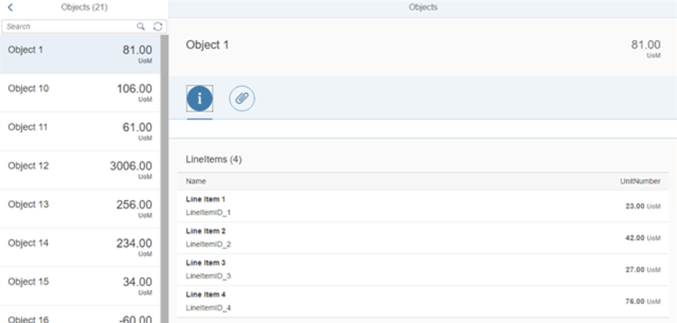
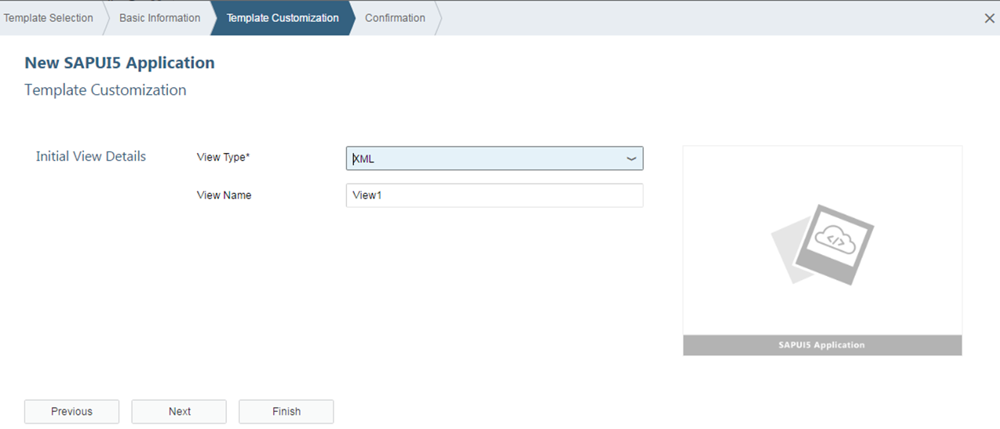

# UI5B-FIORI: Introduction to Fiori

## UI5B-FIORI-01 : Overview of Fiori

### What is SAP Fiori ?

- SAP Fiori is a new user experience (UX) for SAP software and applications. It provides a set of applications that are used in regular business functions like work approvals, financial apps, calculation apps and various self-service apps.

- SAP Fiori provides 800+ role-based applications like HR, Manufacturing, finance, etc. When you open the SAP Fiori home page application, you will see a picture of the flowers. It is because Fiori means ‘flowers’ in Italian

- SAP Fiori provides all business roles in real time on compatible hand devices. It offers business roles on easy to use functions, simple with unmatched responsiveness on desktop, smart phones and Tablets.

- Role-Based − SAP has decomposed various SAP transactions and changed them into beautiful user interactive applications that show only most relevant information to the users.

- ADAPTIVE − When SAP Fiori is combined with the power of SAP HANA, it provides an unmatched application response and query executions time and adapts to multiple use cases and devices.

- Simple − To make SAP Fiori simple to match the user demand, SAP has designed it as a 1-1-3 scenario. This means 1 user, 1 use case and 3 screens.

- Coherent − SAP has provided all the Fiori apps based on the same language and it does not matter on the deployment and platform.

- Delightful − SAP Fiori was designed to work with ECC 6.0 to make it easy for the users and to deploy on the existing SAP system.

### Multi-Device Support

- How can we make sure that we deliver a great user experience with our Fiori apps?

- Responsive Design - One of the most compelling factors of SAP Fiori is that our applications need to be developed, configured and maintained only once for all changes to become effective across all devices.

- Adaptive Design - It may only be required to view a small subset of data on your tablet or Smartphone as compared to the desktop

### Responsive Design Concepts

- Content density: Compact content density mode is activated on desktop mode. On touch devices, the finger-friendly cozy mode is activated.

- Filters: On a desktop, the filter fields are fully displayed. On a tablet, the filter bar should be collapsed as default, so that users can work either with the filter dialog or with variants. 

- Table settings: While the grid-based analytical table runs perfectly on desktop and tablet, this would not be an option on a Smartphone. Instead, it would need to be replaced by a responsive table.

## UI5B-FIORI-02 : Overview of Fiori Launchpad

### SAP Fiori Launchpad

KEY FACTS :
- Web-based entry point to use SAP Business applications across platforms and devices.

- Delivered as an out-of-the-box thinking to the I HTML client.

- High productivity for end users using features like theming, search integration, customization, etc.

- Offers single entry points for end users using multiple device types.

### Fiori Templates

- Worklist Template - A worklist displays a collection of items to be processed by the user and usually involves reviewing details of a list item and taking action.

- Master - Detail Template The split-screen layout is optimized for displaying and processing a list of items. On the left side of the screen, users can quickly scan and navigate through the list. On the right side, they then see the details of the selected item, and can trigger related actions or edit the data

## UI5B-UI5: Introduction to UI5

### UI5B-UI5-01 : Overview of UI5 Architecture and Libraries

- SAPUI5 is a client-side HTML5 and JavaScript-based rendering library that is optimized for consumption of SAP data 

- Well-designed API, easy to consume and use 

- High performance as its based on client side rendering 

- Control extensibility

- SAP product standard compliant 

- Powerful theming support based on CSS
- Based on open standards like OpenAjax, JavaScript, CSS, HTML5, jQuery and so on 

### SAP UI5 : Architectural overview

### Advantages: SAPUI5

- SAPUI5 is device and Browser independent 
- Support all open source technology, Can be integrated with external libraries like D3.js and so on
- Support Java, ABAP, HANA,NON SAP servers like Tomcat, Eclipse with UI5,
- Ability to customize and extend the controls
- Client side events
- Mobile support
- Support OData and json Models
- Details on http://scn.sap.com/docs/DOC-51934

### Model View Controller (MVC)

- In the Model View Controller concept, the representation of information is separated from the user's interaction:
    - The view is responsible for defining and rendering the UI. (By placing all UI controls in view)
    - The model manages the application data. 
    - The controller reacts to view events and user interaction by modifying the view and model. (Events, Navigation & UI Operations)

### UI5 Libraries

- sap.ui.core : This library contains the jQuery plugins (jQuery.sap.*), the core and all its components, base classes for controls, components and the Model-View-Controller (MVC) classes.
- sap.m : controls designed for mobile devices and tablets ,can also be used for desktop.
- sap.ui.layout : contains all layout controls can be combined with other libraries
- sap.ui.model : It is SAP UI5 Data binding API.
- sap.ui.table : It contains all the table controls
- sap.ui.view : Creates a view of the given type, name and with the given id.

### Lifecycle Hooks of the View

- onInit(): Called when a view is instantiated and its controls (if available) have already been created; used to modify the view before it is displayed to bind event handlers and do other one-time initialization

- onExit(): Called when the view is destroyed; used to free resources and finalize activities

- onAfterRendering(): Called when the view has been rendered and, therefore, its HTML is part of the document; used to do post-rendering manipulations of the HTML. SAPUI5 controls get this hook after being rendered.

- onBeforeRendering(): Invoked before the controller view is re-rendered and not before the first rendering; use onInit() for invoking the hook before the first rendering

### Chrome developer Tools and debugging UI5 applications

- Elements section- Gives you the detail of the HTML DOM structure and CSS properties
- Networks- All the get and Post call the browser is making
- Sources- To see all the scripts
- Resources- Cookies and Local storage
- Console
- Break points
- Use shortcut keys for debugging

## UI5B-UI5-02 : Creating a Simple UI5 App - exercise

### Creating SAP UI5 application

Create a new project

Select Application project from wizard

Enter the Project name, Select Library to be used

Give the name of Initial View and select the development paradigm

Project got created with Following structure

### SAP UI5 Application Project Structure

- <webapp_root_folder>
    - Application.js
    - css … all CSS files go here (and potentially related images)
        - style.css … and potentially more stylesheets
    - ext … all reused third party java script goes here
    - i18n … all property files for localization go here
        - i18n.properties
        - i18n_de.properties
        - i18n_en.properties
        - …
    - model
    - util .. all helper classes go here
    - view .. all view  files go here; all file names shall start with an upper case letter
    - Controller all the controller files go here.
    - img … all image files go here (png, jpg, gif, …)
    - <someNamespace> all on-the-fly controls defined within the application go here
        - <controlName>.js
    - index.html

