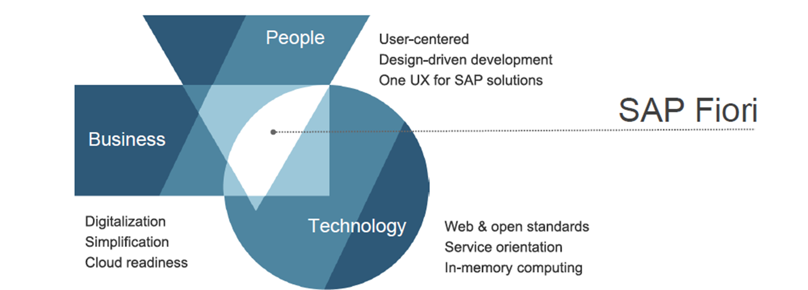

https://www.odata.org/documentation/odata-version-2-0/uri-conventions/

ES5 Registerations
https://register.sapdevcenter.com/SUPSignForms/

ES5 login
https://sapes5.sapdevcenter.com/sap/bc/gui/sap/its/webgui

create destination in BTP

Destination Configuration
Name:
ES5
Type:
HTTP
Description:
SAP Gateway ES5
URL:
https://sapes5.sapdevcenter.com
Proxy Type:
Internet
Authentication:
BasicAuthentication

Additional Properties

HTML5.DynamicDestination
true

sap-client
002

sap-platform
ABAP

WebIDEEnabled
true

WebIDESystem
Gateway

WebIDEUsage
odata_abap, dev_abap

STEP 1 

