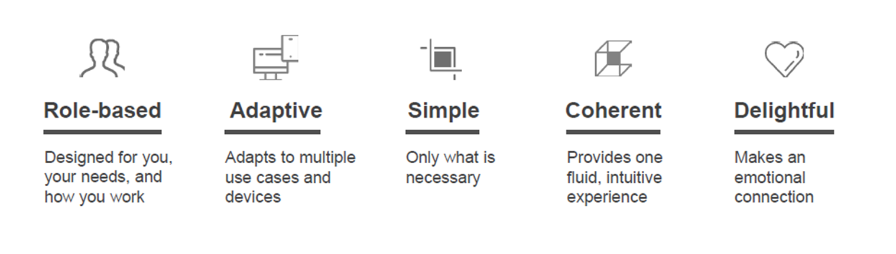
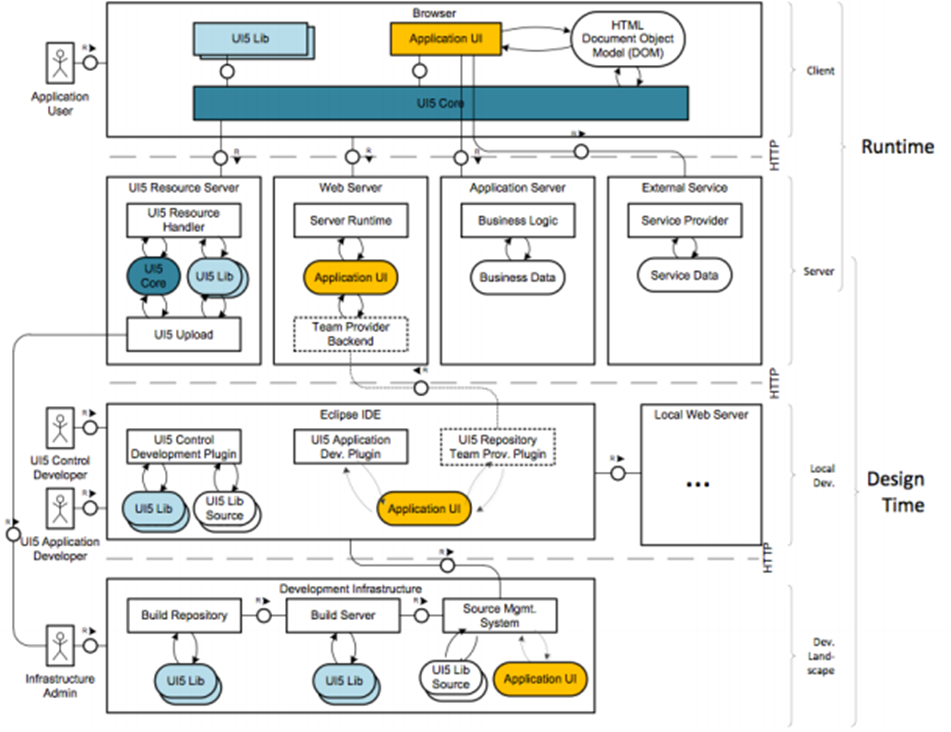
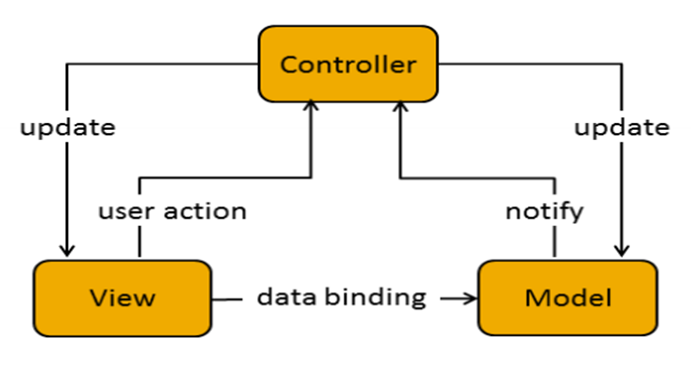
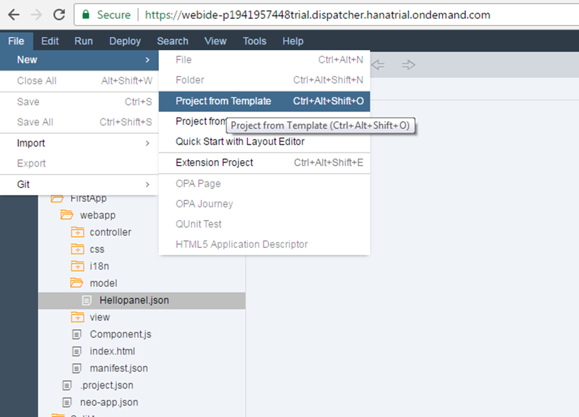
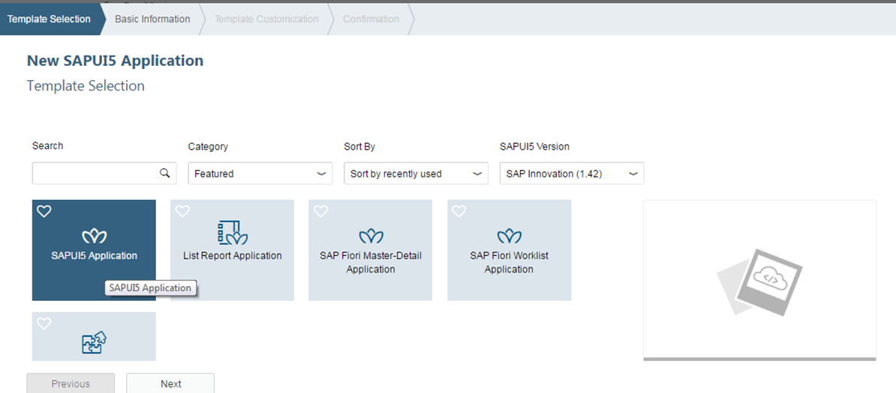
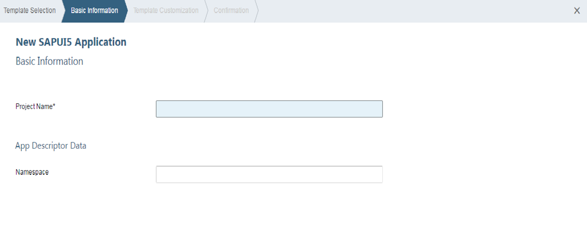
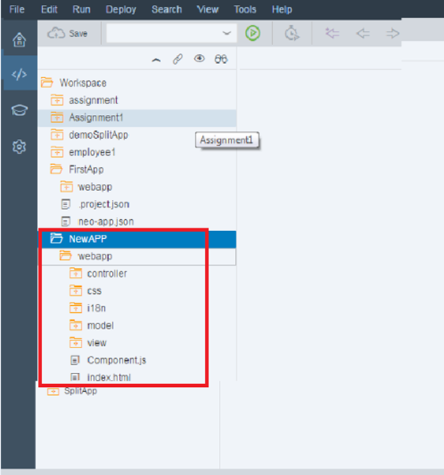

[OData fundamentals](https://developers.sap.com/tutorials/odata-01-intro-origins.html)

[Odata V2 vs V4](https://help.sap.com/docs/SAP_SUCCESSFACTORS_PLATFORM/9f5f060351034d98990213d077dab38a/eb5d246dc27046eba4d14b7b73e74a88.html)

[OData V4](https://help.sap.com/docs/SAP_SUCCESSFACTORS_PLATFORM/9f5f060351034d98990213d077dab38a/ae14ca05a11e4b708b6145447c1e9827.html)

[URI Conventions (OData Version 2.0)](https://www.odata.org/documentation/odata-version-2-0/uri-conventions/)

[ES5 Registerations link](https://register.sapdevcenter.com/SUPSignForms/) 
-->[Demo](https://developers.sap.com/tutorials/gateway-demo-signup.html)

[ES5 login](https://sapes5.sapdevcenter.com/sap/bc/gui/sap/its/webgui)

# Destination Configuration

[create destination in BTP](https://developers.sap.com/tutorials/cp-portal-cloud-foundry-gateway-connection..html)


|:-:|:-:|
|:-:|:-:|
|Name| ES5|
|Type| HTTP |
|Description| SAP Gateway ES5
|URL| https://sapes5.sapdevcenter.com
|Proxy Type|Internet
Authentication|BasicAuthentication

## Additional Properties

|:-:|:-:|
|:-:|:-:|
|HTML5.DynamicDestination|true
|sap-client|002|
|sap-platform|ABAP
|WebIDEEnabled|true
|WebIDESystem|Gateway
|WebIDEUsage|odata_abap, dev_abap


# Project setup 


- This will take care of routing part


- Managed Approuter - the SAP will take care of routing
- after this sapui5demo folder has been generated, move to that folder


- take url from this












To manage the git in parent folder git.openRepositoryInParentFolders 


https://port8080-workspaces-ws-j9crb.us10.trial.applicationstudio.cloud.sap/test/flpSandbox.html?sap-client=002&sap-ui-xx-viewCache=false#nsproducts-display

create a list and bind the /ProductSet


bind name to the list title


build the mta

build will be created in mta_archives


api endpoint link from cloudfoundry env


to deploy the mta archive
in console write 
```
cf login

enter the email and password

cf api <api link from clound foundry>
```

then right click on the tar file and click on deploy button


or in vs code to deply the last part 


to get the business partner link, through this we can access the app live


extend the work zone

open the work zone


update the content channel


go to content manager -> content explorer


add the apps to the sub account


now adding the app to the group 


then add the app for everyoe role


in site directory, create a site


then go the launchpad via the link on site tile


Connecting on premise system to the BAS via cloud connector


Binding Types


Northwind Service

https://services.odata.org/


Fragments - do not contain there controller of its own.


```
<core:FragmentDefinition xmlns="sap.m" xmlns:core="sap.ui.core">
    <Dialog id="helloDialog" title="Hello">
        <content>
            <core:Icon id="_IDGenIcon1" src="sap-icon://hello-world" size="8rem" class="sapUiMediumMargin" />
        </content>

        <beginButton>
            <Button id="_IDGenButton1" text="ok" press=".onCloseDialog" />
        </beginButton>
    </Dialog>
</core:FragmentDefinition>
```

