[Youtube Link](https://www.youtube.com/watch?v=2sA-IwZpdCg&ab_channel=SharePlatform)

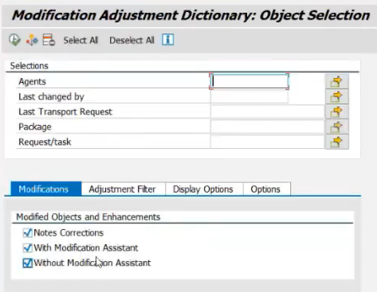
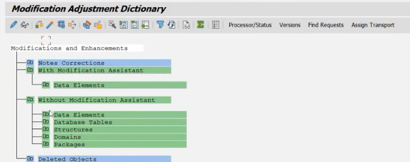
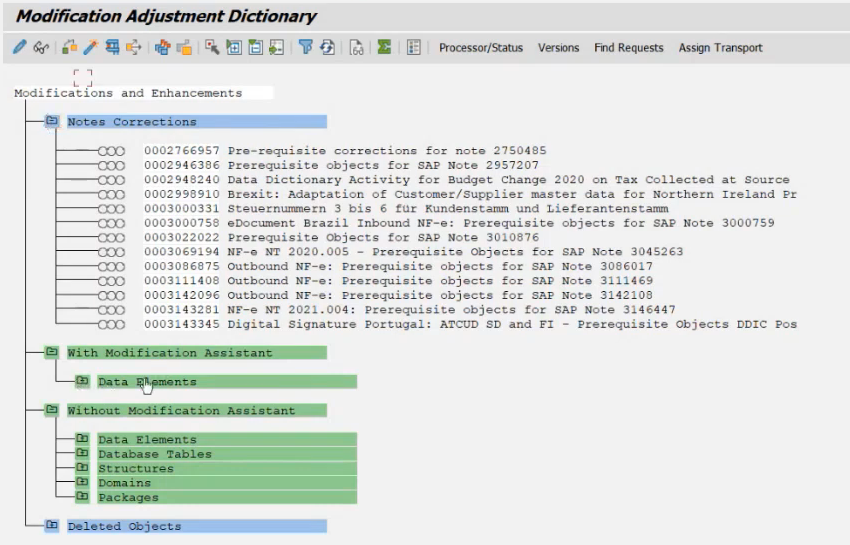
green - completed

blue - incomplete
No need to check deleted objects
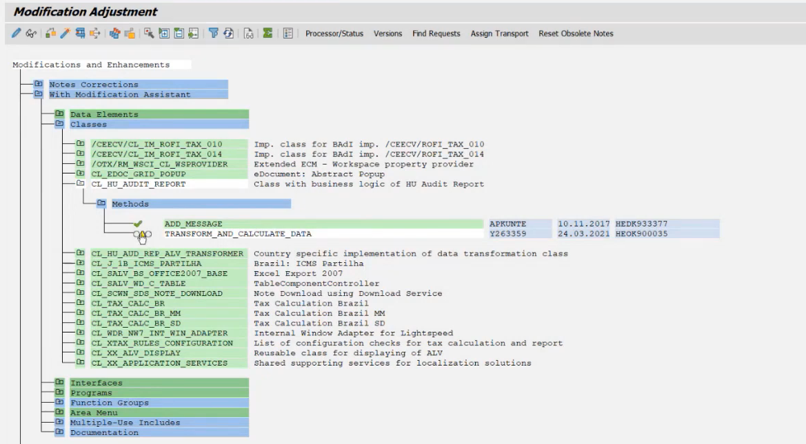
colour like yello we need to take care of

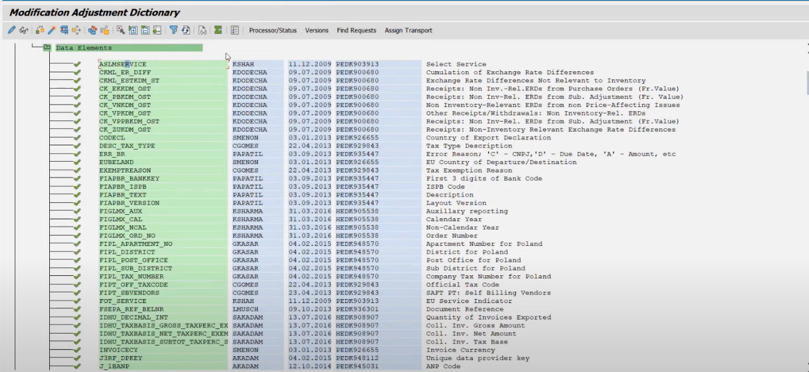
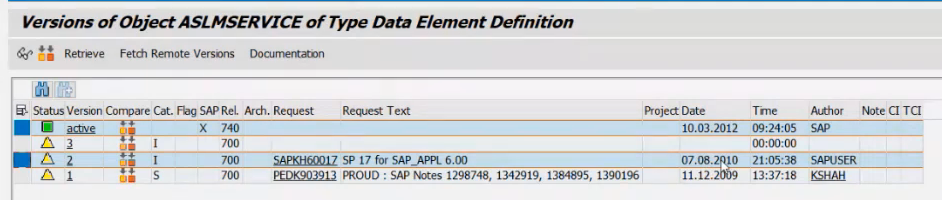
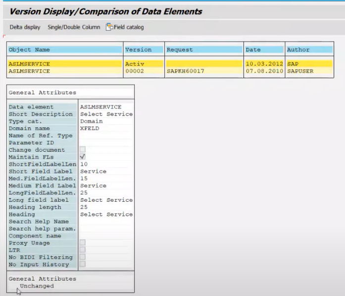
click in delta change
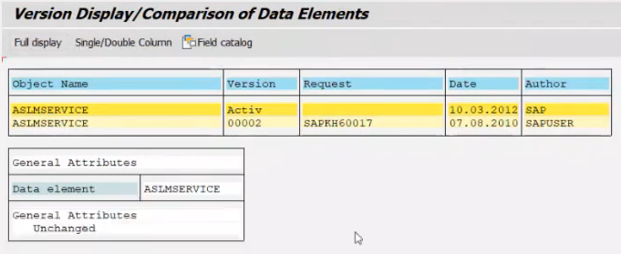

here this is unchanged in the new version also, so we have to "set it to original" 

this means we are accepting the new object from sap(it is same as old object, for sake of version we might accept it)

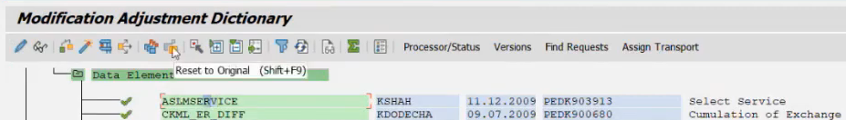

SPDD "apply modification" is not recommended because it is given by SAP, in cases where your custom changes are required then we have to apply modification. If some new code is given by sap it will be lost

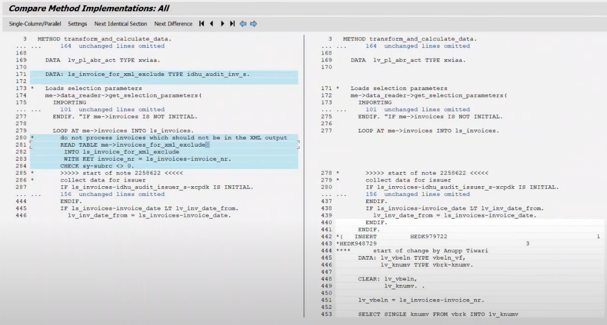
the 3rd scenario is we have to take new code from sap and merge with the our old code

SPDD happens before the completion of SPS upgrade/SPS import (done by basis team)

then comes SPAU and SPAU_ENH, we get the collective 14 days(for both SPAU and SPAU_ENH) time to make changes to the standard objects we will not need access keys to make changes to them
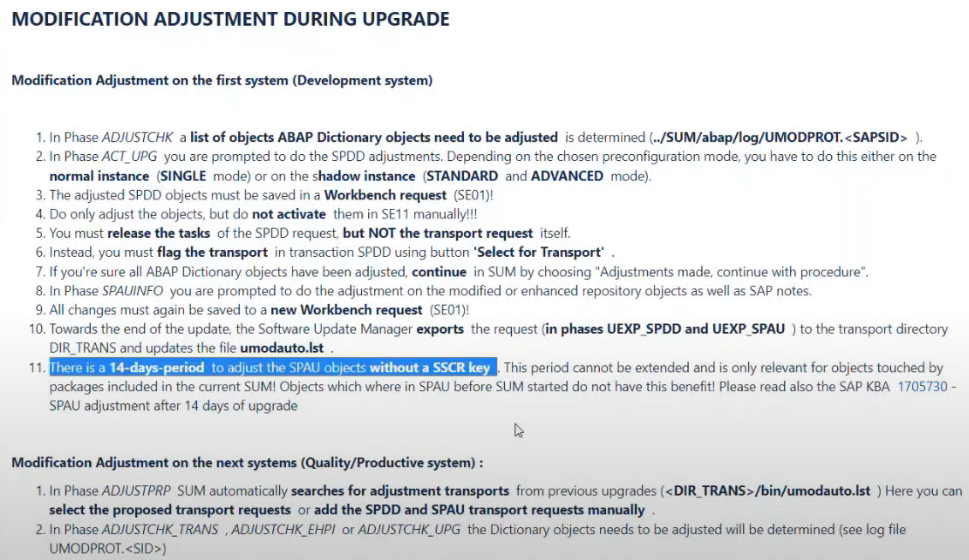

Version comparision should also be done for all objects in SPAU also similar to SPDD

SPDD should be stored in different TR then SPAU and SPAU_ENH

SPAU
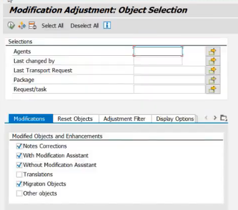

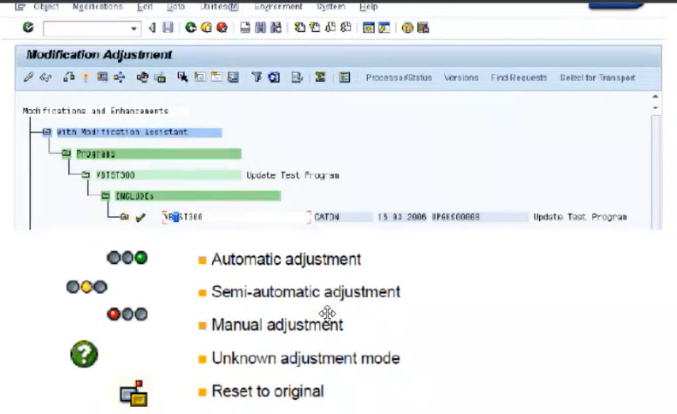
for unknown we have a job to determine the status

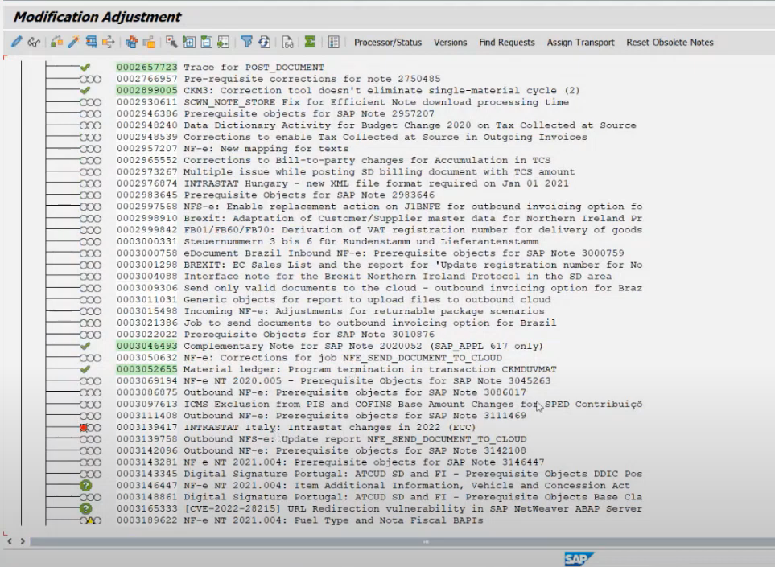
these notes some of them shall be implemented and some should not, some are obsolete we have find it.

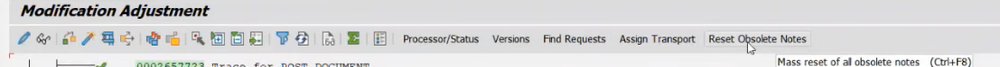
when obsolete notes are implemented in the system, we need to remove it.

We can do it from here

Example
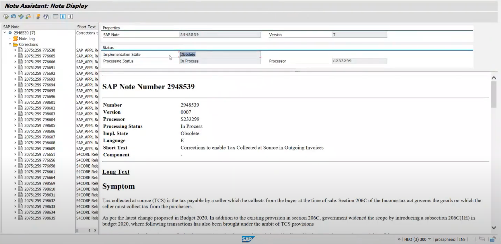
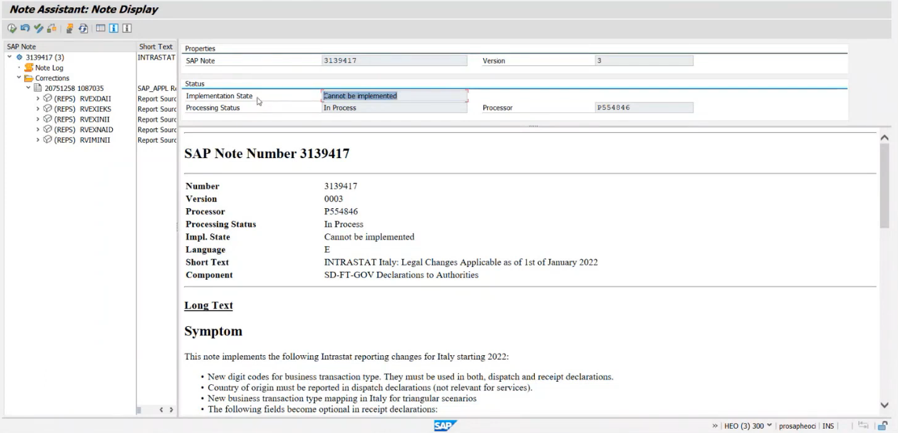

if manual activity is need to implement the note, check once if the objects are already present or not

SPAU_ENH - in this we check for all the enhancements done by us

all green is fine, focus on white, yellow and red

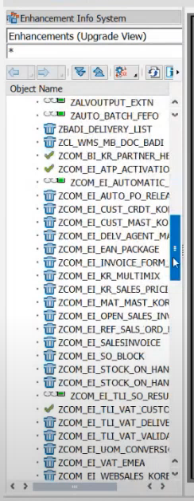
deleted ones - ignore them

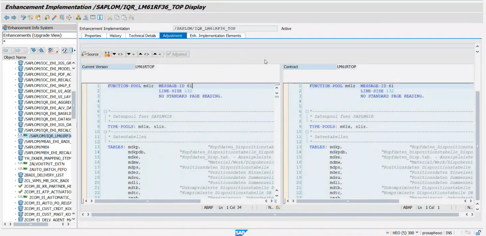

Here in enh we can make changes here only in enhancements(not other part of code, those will be handled in SPAU)

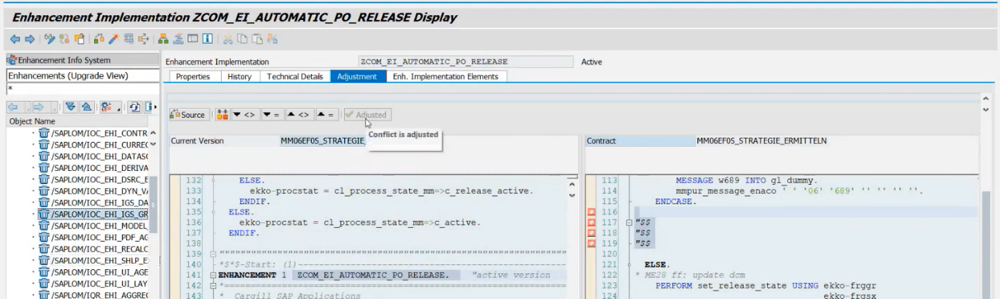
If everything is fine or the changed are made then just click on adjusted

if not done this will not allow us to edit it in future