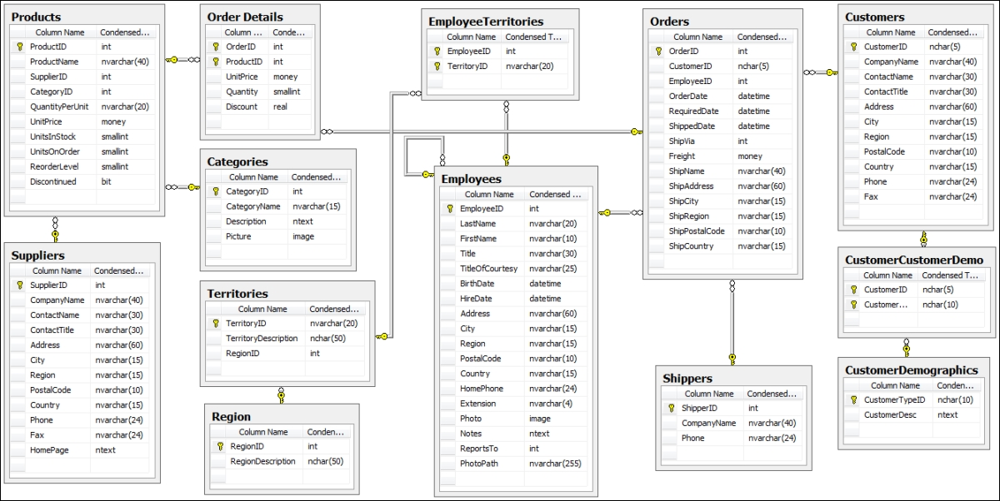

https://services.odata.org/v2/northwind/northwind.svc/

https://www.amarmn.com/sapui5-odata-model-how-to-consume-northwind-odata-service-in-sapui5-application/

Tried the steps provided in the link but did not find the northwind service in ES5 system

@To do

[Possible solution for NORTHWIND](https://community.sap.com/t5/technology-q-a/northwind-service-destination-configuration-of-sapui5-module-is-not-working/qaq-p/12229647)

[Possible solution 2 for NORTHWIND](https://community.sap.com/t5/technology-blogs-by-members/consume-external-service-using-application-router/ba-p/13441996)