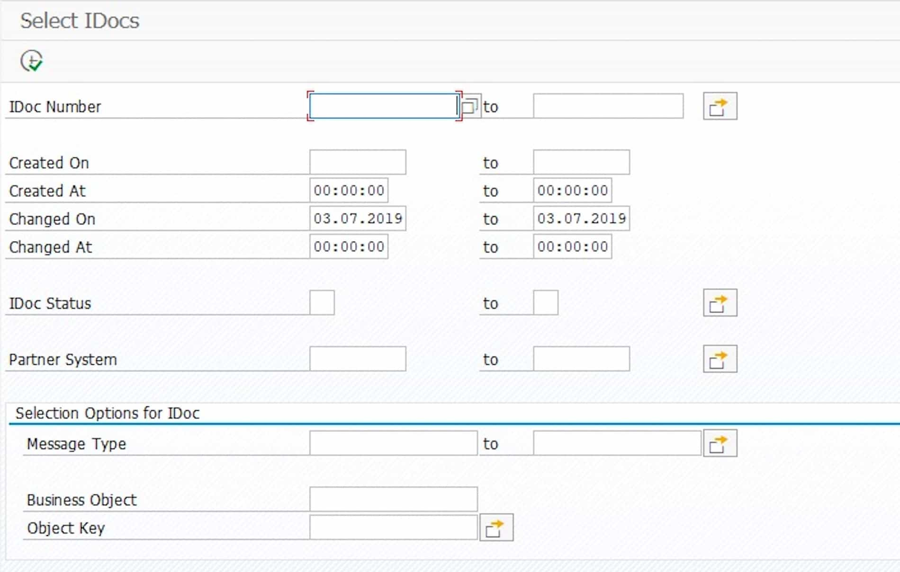
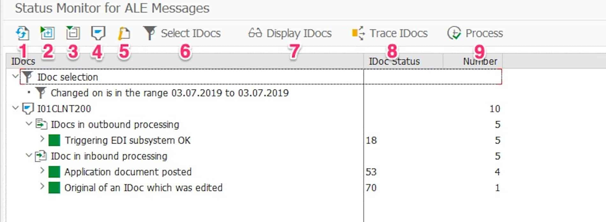
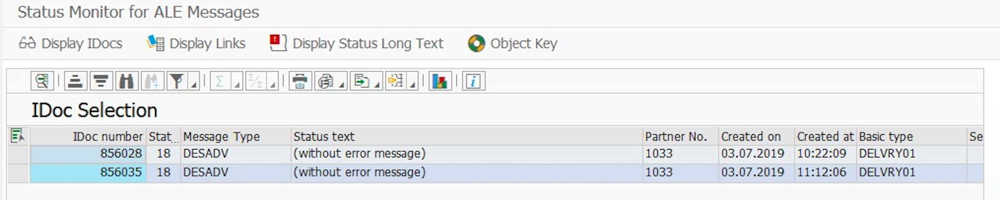
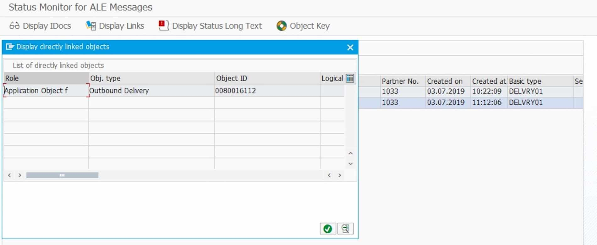
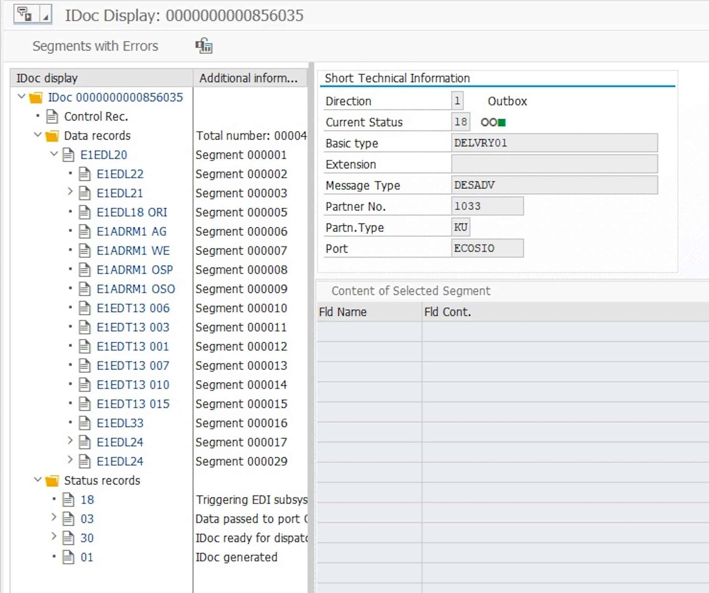
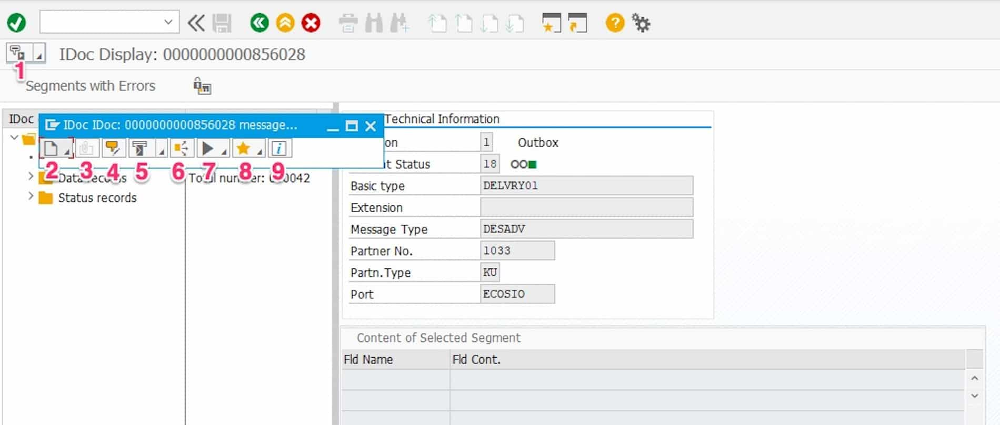

# IDoc Processing in an SAP ERP System with Transaction BD87

[IDocs are the central format](https://ecosio.com/en/blog/what-is-the-sap-idoc-format/) for getting EDI data from or into an SAP system. 

Transaction BD87 is used to check incoming and outgoing IDocs in an SAP system.

By being able to reprocess any IDocs, the transaction is quite useless for the classic SAP business user. For an SAP/EDI support team however,  transaction BD87 is a fundamental tool for checking and, if necessary, correcting IDoc processing in an SAP system. In the following, we introduce the most important functions and views of transaction BD87 and show which helpful functions are available for IDoc processing.

When starting the transaction, a filter window is presented, which can be used to narrow down the IDocs in an SAP system. In a typical SAP system, that is used together with many EDI-based purchase and sales processes, thousands of IDocs can occur daily. Narrowing down the search is therefore vital – e.g. to a certain period of time, a specific document type, etc.

If you have filtered the search parameters accordingly, you get an overview of the IDocs found. In the upper part of the detailed view, you can again see the parameters to narrow down the search. In the case below, the restriction is the modification date in the interval from 03/07/2019 to 03/07/2019.

The IDocs found are then listed, and usually grouped into outbound and inbound IDocs. Outbound is understood to mean all IDocs sent from SAP and inbound all IDocs sent to SAP.

Once in their respective group, the IDocs are then aggregated according to the various statuses. The view shown above is from a test system – in a productive system, 216 outbound IDocs in the status 02 Error during data transfer to port would be cause for concern.

The IDoc overview provides several useful functions in the toolbar.

## 1. Refresh IDoc Display

With this function you can refresh the detailed view. This is particularly helpful if you have changed the status of an IDoc in parallel with another transaction and want to check whether the status has been correctly implemented.

## 2. Expand Subtree
Expands the subtree of the currently selected node in the view.

## 3. Collapse Subtree
Compresses the subtree of the currently selected node in the view.

## 4. Display Partner Systems
Groups the IDoc tree view based on the partner systems, the IDoc status, and the message type.

## 5. Highlight Message Type
Groups the IDoc tree view based on message type and IDoc status.

## 6. Select IDocs
Opens a pop-up window to restrict the currently displayed IDocs. The parameters selected in the previous selection mask are pre-filled.

## 7. Display IDocs
Opens an ALV list with all IDocs of the selected node. Alternatively, you can double click on the node, this will achieve the same result.

## 8. Trace IDocs
Displays the status of an IDoc. Alternatively, you can double click on the IDoc, this will achieve the same result.

## 9. Process
This function triggers the processing program for all IDocs of the selected node. This feature should be used wisely, as with a false click, potentially thousands of IDocs are sent for re-processing – which might lead to unwanted side effects.

## Display IDocs
If you click on ## 7. Display IDocs in the previous screen, an ALV list with the IDoc details opens. By default, the IDoc number, message type, status, etc. are displayed. The following figure shows three outbound DELINS messages.

Two functions are particularly useful in this mask. With a click on the object key, the business document belonging to the IDoc is displayed by displaying the object type and the object key. In our case, the object type belonging to the IDoc of type DELINS is PurchSchedAgreement, that is, a purchasing scheduling agreement.

Another useful feature is the shortcuts display. It displays the objects linked to the selected IDoc, as shown in the following figure.

If you double-click on object 5500000139 for example ## = the purchasing delivery schedule belonging to the IDoc., the corresponding transaction automatically opens – in this case, the purchasing delivery scheduling agreement is opened in transaction ME33L.

## Display IDoc Details
If you double-click on an IDoc in the ALV view, the IDoc detailed view opens.

The IDoc detailed view is also displayed as a tree view and is divided into three parts.

The control record contains the header information of the IDoc. In the [XML view of an IDoc](https://ecosio.com/en/blog/what-is-the-sap-idoc-format/), this corresponds to the element EDI_DC40.

The individual elements of the IDoc, which contain the actual information, are under data records.

Status records list all the previous states of the relevant IDocs, with the last state listed at the top.

## 1. Services for Object
Clicking on (1) Services for Object opens a toolbar with several useful features.

## 2. Add
This function can be used to add an attachment to the IDoc ## for example, a file from the desktop., create a note for the IDoc, reference an external document via URL, or capture a barcode if this function is active.

## 3. Attachment List
With the help of this function, you can view the created attachments in point 2.

## 4. Private Note
This function allows you to add a personal note to the IDoc.

## 5. Send Object with Note
This is the function you can use to send an IDoc per email e.g.

## 6. Display Relationships
Like in the previous views, this function can be used to display the objects linked to the IDoc.

## 7. Workflow
This function can be used to display workflows that are linked to this IDoc or to start related workflows.

## 8. My Objects
This function adds the IDoc to the personal object list. Using the menu item System · My objects · Object history, you can quickly navigate back to the relevant IDoc.

## 9. Help for the Object Services
This function helps you to bring up the help for the object services.

## Transaction BD87 – Summary
With transaction BD87, you can get a quick overview of the current processing status of the IDocs in an SAP ERP system. If the IDoc is in the correct status, processing of the IDoc can be initiated again. In a separate article we examine [the processing of an IDoc](https://ecosio.com/en/blog/reprocessing-idocs-in-sap-erp/).