[Create a Simple IDoc Interface](https://developers.sap.com/tutorials/aif-idoc-monitoring-interface-create..html)

[how to create idoc..](https://community.sap.com/t5/application-development-discussions/how-to-create-idoc/td-p/3153587)

[Steps to create custom IDOC](https://help.sap.com/docs/SUPPORT_CONTENT/abap/3353524027.html)

Steps we will perform in creating custom IDOC:

1. WE31: Creation of segments (ZFBS1_HDR, ZFBS1_DET).
2. WE30: Creation of Idoc type (ZFBS1_IDOC_TY).
3. WE81: Create message type (ZMGFGS1).
4. WE80: Assign message type (ZMGFGS1) to Idoc type (ZFBS1_IDOC_TY).
5. SE80: Creation of function group (ZFG_IDOC).
6. SE37: Creation of 'Z' function module (ZFM_ACCRUAL_POST).
7. WE57: Assign Idoc (ZFBS1_IDOC_TY) to function module (ZFM_ACCRUAL_POST).
8. BD51: Create an entry for function module (ZFM_ACCRUAL_POST).
9. WE42: Create inbound process code (ZFBS1POST).
10. BD54: Create logical system (CIDCLNT200).
11. SM59: Create RFC destination.
12. WE20: Create partner profile.
13. WE19: Test tool for Idoc.

Step 1: WE31: Creation of segments (ZFBS1_HDR, ZFBS1_DET).

Create header segment

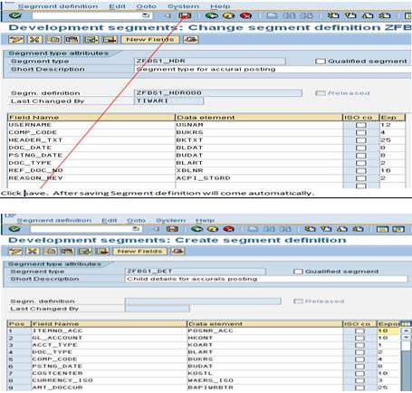

Step 2 : WE30: Creation of Idoc type (ZFBS1_IDOC_TY).

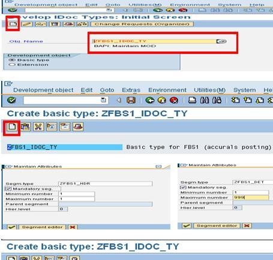

Step 3: WE81: Createmessage type (ZMGFGS1).

Step 4: WE82: Assignmessage type (ZMGFGS1) to Idoc type (ZFBS1_IDOC_TY). 
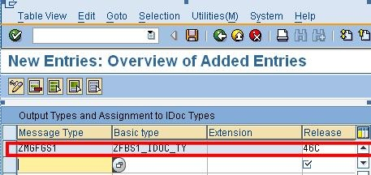

Step 5: SE80: Creation of function group(ZFG_IDOC).
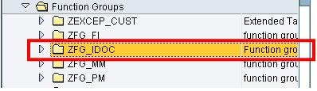

Step 6: SE37: Creationof 'Z' function module (ZFM_ACCRUAL_POST).*
Copy any standard function module which is running behind any IDOC, here I am copying 'IDOC_INPUT_FIDCC2' to 'ZFM_ACCRUAL_POST'. Comment the standard code and activate the function module.

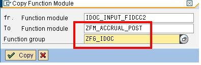

Step7: WE57: AssignIdoc (ZFBS1_IDOC_TY) to function module(ZFM_ACCRUAL_POST).

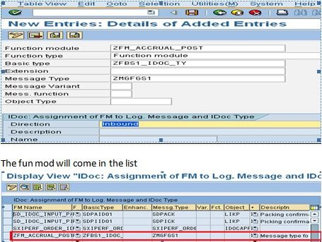

Step 8: BD51:Create an entry for function module (ZFM_ACCRUAL_POST). 

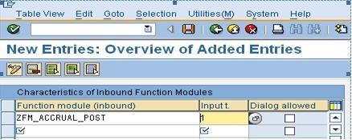

Step 9: WE42: Create inbound process code (ZFBS1POST).

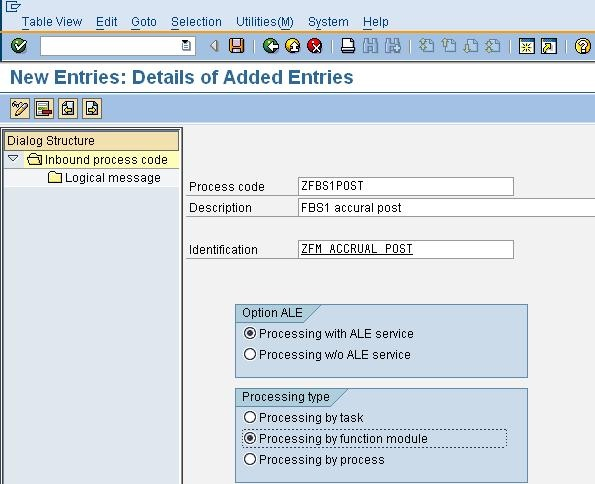

Step 10: BD54:Create logical system (CIDCLNT200). 

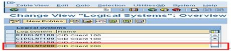

Step 11:  SM59: Create RFC destination.

Step 12: WE20:Create partner profile.  

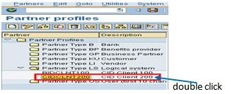

Step 13: WE19:Test tool for Idoc.

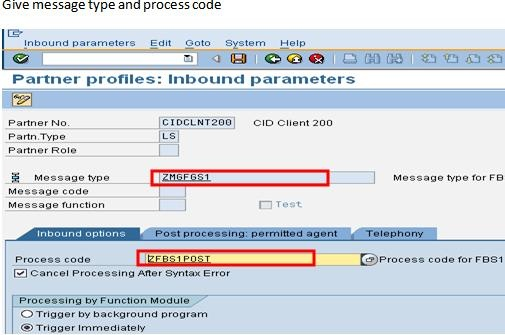

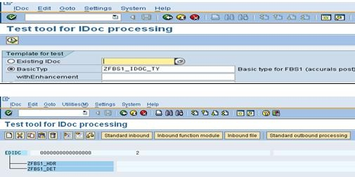