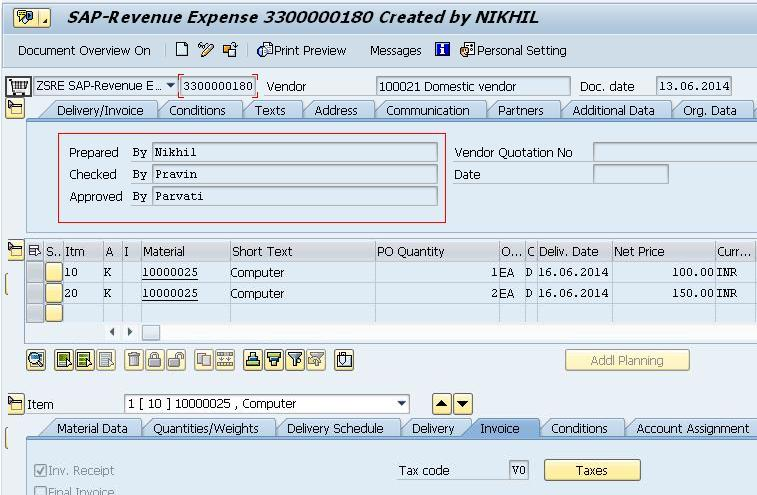
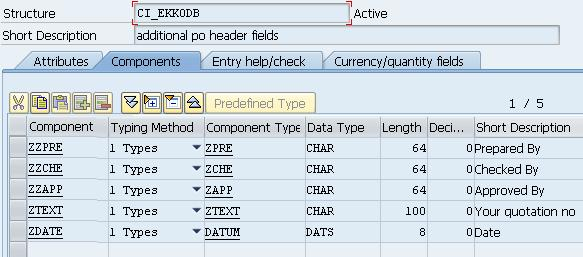
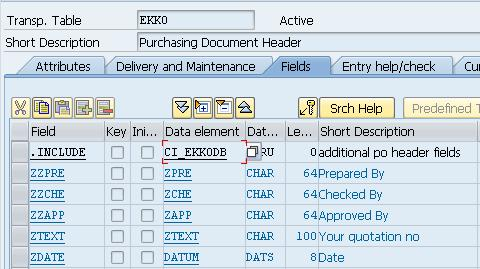
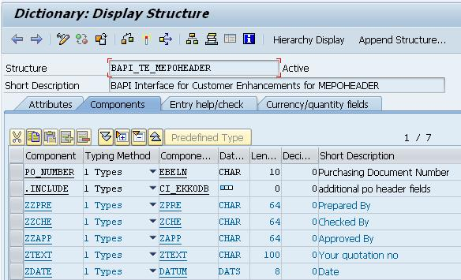
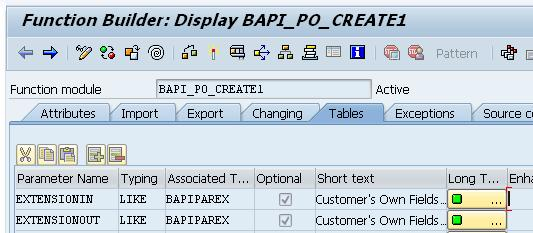
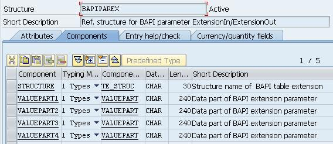
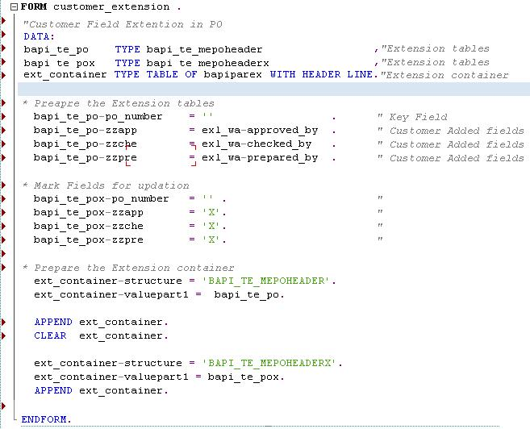
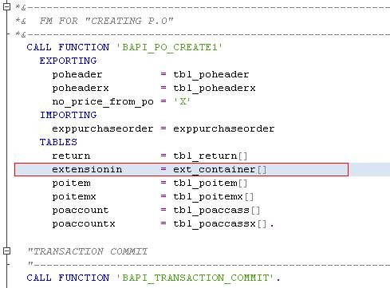

# [BAPI Extension for Customer added Fields](https://community.sap.com/t5/application-development-blog-posts/bapi-extension-for-customer-added-fields/ba-p/13239753)

Scope of this document is only to cover the BAPI extension fields after the customer fields has been added.

So logic need to be incorporated only when we are calling respective BAPI (FM). So mostly in customized reports in which that BAPI needs to be called.

## Introduction

Customers often have to change the standard SAP objects in order to meet their own specific requirements. This might involve passing some additional information by adding few extra fields to the standard SAP table. These fields might get updated in underlying Standard SAP tables or customer database table and ultimately serve the business purpose.

## Business Scenario
For example, assume that there is extra information that we want to save to the database while creating a new purchase order. I.e. Prepared By, Checked By, Approved By.

## BAPI Extension Table
But this change might affect the further BAPI implementations. This is because BAPIs are designed to implement SAP standard business processes through a predefined standard interface. I.e. its import and export parameters for any BAPI are fixed. So addition of new customer fields has absolutely nothing to do with this predefined BAPI interface. This is because these fields are added to SAP database. So executing BAPI with the same import and export parameter is not sufficient. We have to pass extra information about newly added fields. This information is passed to the BAPI using BAPI table extension. The naming convention for BAPI table extensions is BAPI_TE_<table_name>.

Here the customer first creates a data structure that contains the customer-specific fields. In our example, it is CI_EKKODB. This structure is included in both the database table and the BAPI table extension. This ensures that the enhancements to the database table and in the table extension are always identical.

## Extension container
Also, an extension parameter (ExtensionIn) in the BAPI interface is used to pass on the enhancements to the BAPI in container format. This extension parameter is always based on data structure BAPIPAREX. Using this parameter BAPI understands the format of the data to be passed.

Here, the STRUCTURE refers to the name of the BAPI table extension though which extra information is to be sent whereas VALUEPART1 to VALUEPART4 are the values that will be inserted in the additional table fields along with the table key field.  Key field, here, purchase_order_no is the extra information that needs to be passed to know the line in the database table where the data record needs to be written.

So extension container could look like

    STRUCTURE           |   VALUEPART1  |   VALUEPART2              |   …..
    BAPI_TE_MEPOHEADER  |   3300000180  |   Nikhil Pravin  Parvati  |

Here, ‘3300000180’ is the key field for EKKO table specifying which row to be updated. And “Nikhil Pravin Parvati” is the extra fields of EKKO specified in BAPI_TE_MEPOHEADER.

Source Code

Once the BAPI Extension Table and Extension Container are filled, Execute the BAPI by passing Extension Container as an table type argument.

