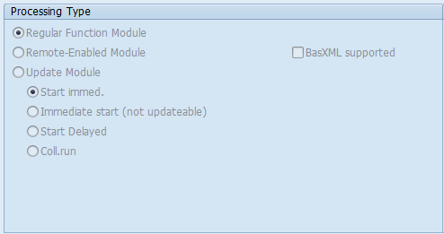

# What is a Function Module (FM)?

Function Modules are encapsulated ABAP procedures that are grouped in Function Groups. Modules within the same Function Group belong logically together.

They are globally available and can be called from any other ABAP program by name which must be unique.

## Function Module types in SAP ABAP

Function Modules are created with the Function Builder (transaction SE37). The type of function module depends on the Processing Type.

### Regular Function Module

A Regular Function Module is the default option. This kind of Function Module is executed immediately and synchronously on your current SAP system.

    CALL FUNCTION func { parameter_list | parameter_tables }. 

### Remote-Enabled Function Module

Remote Function Modules can be called by other SAP and non-SAP systems utilizing the RFC protocol.

For example, you can define a Remote Function Module in an EWM system which then gets called by your ERP system to get further information about stock levels or shipment details.

    CALL FUNCTION func DESTINATION dest parameter_list. 

This statement calls the target system specified under dest synchronously. Available RFC destinations are configured using transaction SM59. Use the unique name of a destination for parameter dest.

The calling program continues execution once the RFC has finished. Depending on the connection this can be a performance issue.

- From blog

In RFC calls again there are synchronous RFC call and asynchronous RFC call.

When synchronous RFC is executed, the calling system waits for a response.

In the asynchronous RFC the calling system will not wait.

There is another RFC call called tRFC - transaction Remote function call. With a tRFC the function module is not called immediately but only when the commit work is executed.The system then executes all database operations in one go.

### Update Function Module

Update Function Modules are not executed immediately. They are scheduled for execution in an update work process. This update process is triggered by the statement COMMIT WORK. The statement ROLLBACK WORK deletes all update function module registrations.

    CALL FUNCTION update_function IN UPDATE TASK 
                                [EXPORTING p1 = a1 p2 = a2 ...] 
                                [TABLES t1 = itab1 t2 = itab2 ...].
                                
Using CALL FUNCTION .. IN UPDATE TASK is a way to bundle database changes into a single database LUW. It is also beneficial for performance since the update happens asynchronously.

Start Immediately - V1 ( Used for critical or primary changes)

Start delayed (No restart) - V2 (Preferred for statistical changes)

V1 take priority over V2. Locks are only inherited till V1 updates