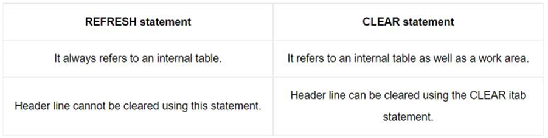

## R3 architecture
1.	What is a presentation server?
    - A presentation server is a software application that allows users to access and run applications remotely on a network. : Collects user input and creates process request. 
2.	What is an applicaion server?
    - Uses the Application logic of Program to collect and process request
3.	What is a DB Server?
    - A database server is a computer system that stores and manages databases, and provides access to them for users and applications
4.	What is a database interface?
    - A database interface is a user interface that allows users to interact with a database management system (DBMS). It provides tools and functions to help users create, manage, and manipulate databases. 
5.	What tasks are done by database interface?
    - The database interface is responsible for data transport between the application server and database server, automatic client handling, and SAP buffering
6.	What is open SQL?
    - Open SQL consists of a set of ABAP statements that perform operations on the central database
7.	What is native SQL?
    - Native SQL is the SQL that the data source uses, such as Oracle SQL. Use Native SQL to pass the SQL statement that you enter to the database.
8.	What is the syntax of Native SQL? Refer to a code in help and execute it.
    ```
    EXEC SQL.
        SELECT COUNT(*)
        INTO :lv_count
        FROM mara
        WHERE mandt = :lv_mandt
    ENDEXEC.
    ```

9.	What role does database interface play for Open SQL?
    - Database interface will convert the Open SQL to the corresponding Native Sql for accessing data from the database

10.	What role does database interface play for Native SQL?
    - Role of the Database Interface for Native SQL
        1. Connection to the Database:
            - The database interface establishes and maintains the connection between the SAP system and the underlying database.
            - When Native SQL statements are executed, they are sent to the database via this interface.
        2. Host Variable Substitution:
            - The database interface processes host variables (ABAP variables prefixed with :) used in Native SQL statements.
            - It replaces these placeholders with actual values before passing the query to the database.
        3. Error Handling:
            - Errors that occur during the execution of Native SQL are caught by the database interface.
            - These errors are reported back to the ABAP program, allowing the developer to handle exceptions.
        4. Integration with the SAP Kernel:
            - The database interface acts as a bridge, integrating Native SQL statements into the SAP kernel's architecture, ensuring compatibility with the SAP system.
    -  Responsibilities the Database Interface Does Not Handle
        1. Client Handling
        2. SAP Buffering
        3. Database Independence
        4. Authorization Checks

11.	How do you start a new transaction?
12.	How do you end the current transaction and start a new transaction?
13.	How do you start a new transaction without ending the current transaction?
14.	If you use OPEN SQL, it is mandatory that the tables must be defined in DDIC?
    - Yes

15.	What are the components of a work process?
    - Screen Processer
    - ABAP Processor
    - Data interface

16.	What does the Roll Area contain?
    - A roll area is memory that is allocated by a work process for an instance of a program. 
    - It holds information needed by R/3 about the program’s execution, such as:
        - The values of the variables
        - The dynamic memory allocations
        - The current program pointer
            - Each time a user starts a program, a roll area is created for that instance of the program.
            - If two users run the same program at the same time, two roll areas will exist-one for each user.
            - The roll area is freed when the program ends.
            - The roll area and the user context play an important part in dialog step processing

17.	What does the user context contain?
    - A user context is memory that is allocated to contain the characteristics of a user that is logged on the R/3 system.
    - It holds information needed by R/3 about the user, such as:
        - The user’s current settings
        - The user’s authorizations
        - The names of the programs the user is currently running 

18.	What are the SAP Funtional Modules?
    - Human Capital Management (SAP HCM)
    - Production Planning (SAP PP)
    - Material Management (SAP MM)
    - Financial Supply Chain Management (SAP FSCM)
    - Sales and Distribution (SAP SD)
    - Project System (SAP PS)
    - Financial Accounting and Controlling (SAP FICO)
    - Plant Maintenance (SAP PM)
    - Quality Management (SAP QM)
    - SAP Logistic Execution (LE)
19.	What are the SAP Technical Modules?
    - SAP Basis
    - SAP ABAP (Advanced Business Application Programming)
    - SAP BI/BW (Business Intelligence/Business Warehouse)
    - SAP Security
    - SAP HANA (High-Performance Analytic Appliance)
    - SAP PI/PO (Process Integration/Process Orchestration)
    - SAP Solution Manager
    - SAP Cloud Platform
    - SAP UI5 (User Interface 5)
20.	Which are the logical layers of SAP R3 architecture?
    - Presentation Layer
    - Application Layer
    - Database Layer
21.	What is a centralistic configuration?
    - All SAP R/3 layers reside on the same physical computer. One important distinguishing characteristic between the various R/3 client/server configurations is “Scalability”. 
    - If a configuration is scalable, adding additional computers to the system will increase the overall performance of the system. 
    - Centralistic client/server configurations are not scalable at all. 
    - Consequently, this configuration is never used in a production environment. 
    - SAP has actually installed an entire SAP R/3 system on a notebook computer for use by SAP’s sales representatives
22.	When would a centralistic configuration be used?
23.	Is Centralistic configuration scalable?
24.	Is Centralistic configuration used in a Production environment?
25.	What is a Distributed presentation configuration?
    - The presentation layer is “rolled out” to desktop PCs. 
    - The application layer and the database layer are installed on the same computer. In terms of increased performance, the Distributed presentation configuration is no more scalable than the centralistic configuration. 
    - This configuration is very “mainframe”-” ish”

26.	____ configuration is “mainframe”-”ish”
27.	In _____ configuration , The communication across the network between the front-end (presentation and application layers) and the backend (database layer) becomes a bottle-neck very quickly .
28.	What is Three-tier client/server configuration?
29.	Is a three-tier client/server configuration scalable?
30.	The computers in the application layer are often capable of satisfying the users process requests without accessing the database, which in turn boosts performance. 

    The above statement is valid for which type of configuraton centralistic, distributed presentation, Three Tier client server
29.	OPEN SQL statements will be portable between databases.
    - True
30.	The database interface buffers information from the database on the application server.  
    - True
31.	With Open SQL, the client field is automatically populated by the database interface.  
    - True
32.	The /n is entered in command field to cancel a transaciton.
33.	The ____ is entered in command field to call a transaction
34.	The /nxxxx is entered in command field to call transaction in a new session
35.	The /o is entered in command field to display an overview of sessions
36. Basis is like an operating system for R/3.
37. A Presentation Server interprets the ABAP/4 programs and manage the input and output for them.
38. A user context is memory that is allocated to contain the characteristics of a user that is logged on the R/3 system.
39. ABAP Workbench is a collection of tools you use to develop, test and run ABAP programs

##  ABAP Programming

1. The SY-REPID system variable displays the current ABAP program.
2. NEW-PAGE triggers a page break during list processing.

## Selection Screen

1. What is the screen number of the default selection screen?
    - The screen number of the default selection screen is 1000. This is the standard selection screen provided by the SAP system when selection-screen elements are declared.

2. Which ABAP statements create selection screens?
    - The following ABAP statements are used to create selection screens:
        - PARAMETERS: Defines input fields on the selection screen.
        - SELECT-OPTIONS: Defines input ranges on the selection screen.
        - SELECTION-SCREEN: Provides customization for the selection screen layout.

3. In which event is validation done on the selection screen?
    - Validation on the selection screen is performed in the AT SELECTION-SCREEN event.

    4. What is the Top of Page event? When is it triggered?
    - The TOP-OF-PAGE event is triggered when the first page of the report is created or when a new page is started in the report output. It is typically used to define headings for the page.

5. What is the End of Page event? When is it triggered?
    - The END-OF-PAGE event is triggered when the system reaches the end of a page during list processing. It is often used to display footers or totals at the bottom of a page.

6. What is the Start of Selection event?
    - The START-OF-SELECTION event is the default event in an ABAP report program. If no other event is explicitly specified, this event is implicitly triggered. It is where the main processing logic of the report is written.

7. What is the event At Selection-Screen used for?
    - The AT SELECTION-SCREEN event is used for validating and processing the user input on the selection screen. It allows you to check the input values and display messages before executing the report logic.

8. Selection screen elements can be combined into cohesive units called blocks.

9. The default selection screen has the number 1000.

## DDIC

1.	What is a value table? 
2.	What is a check table?
3.	Zdeptval- Deptno(10,20,30,40), ZDept- Domain- Value table zdeptval 
4.	What is the relationship between value table and check table?
    - The check table defines the foreign keys and is part of the table definition. 
    - The value table is part of the domain definition.
5.	What is a database view? Identify the mandatory steps required to create a database view?
    - A database view is a subset of a database and is based on a query that runs on one or more database tables
6.	What is a projection view? Identify the mandatory steps required to create a projection view?
    - A projection view is a special view for hiding fields from a single basis table.
7.	What is a maintainance view? Identify the mandatory steps required to create a maintainance view?
    - The maintenance view is created on two or more tables, which is used to maintain the data of several tables altogether. It helps us to maintain the complex application objects easily.
8.	What is a help view? Identify the mandatory steps required to create a help view?
    - A help view is a special view for use in search helps. The selection methods of a search help can be database tables, database views, and the special help views.
9.	Can a search help be attached on field based on pre defined data types?
10.	Can a search help be attached on field based on data element?
11.	Can a search help be based on field based on domain?
12.	Can the selection method for a search help be a database table?
13.	Can the selection method for a search help be  a view? Which type of view?
14.	What factors are considered in Data Dictionary Technical settings?
    - The technical settings allows us to
        - Optimize storage space requirements.
        - Table access behavior.
        - Buffering required.
        - Changes to entries logged.

    - Data class in technical settings
        - APPL0 Master data
        - APPL1 Transaction data
        - APPL2 Organizational and customizing data

    - Size category
    - Buffering status

15.	What are the buffering types?
16.	When do you use Single record buffering?
17.	When do you use full buffering?
18.	What is generic buffering? When is it used?
    - Generic buffering: When a record of the table is accessed, all the records whose left-justified part of the key is the same are loaded into the buffer.
    - With generic buffering, all records whose generic key fields agree with this record are loaded into the buffer when one record of the table is accessed.
    - The generic key is left-justified part of the primary key of the table that must be defined when the buffering type is selected.
19.	Is transparent table present in underlying DB?
20.	Is structure present in underlying DB?
21.	What is a primary index? When does it get created? When is it used? Who decides whether to use primary index or not?
22.	What is a secondary index? When does it get created? When is it used? Who decides whether to use primary index or not?
    - When Does a Secondary Index Get Created?
        - Performance Issues Arise:
        Queries frequently access a table using fields that are not part of the primary key.
        Searching or filtering on non-key fields causes slow response times.
        
        - Requirement is Identified During Design:
        Anticipated queries involve specific fields (other than the primary key) for filtering or sorting.
        
        - After Analysis:
        Performance analysis tools, like the SQL Trace (ST05) or the Runtime Analysis (SAT), identify slow database operations.

        - Explicitly Defined in Table Maintenance:
        Secondary indexes are defined in the Indexes tab of the table in the ABAP Dictionary (SE11).
    
    - When is a Secondary Index Used?
        - Query Conditions Match the Index Fields: 
        The fields used in the WHERE clause or ORDER BY clause of a query match the fields defined in the secondary index.
        
        - Improved Query Optimization:
        The database optimizer determines that using the secondary index will result in faster query execution compared to scanning the table or using another index.
        
        - Frequent Joins:
        If the table is often joined with another table using non-primary key fields, a secondary index can speed up the join operation.

    - Who Decides Whether to Use the Primary Index or Not?
        - Database Optimizer:
            - The database's query optimizer is responsible for deciding whether to use the primary index, a secondary index, or perform a full table scan.
            - It evaluates various factors, such as:

                - Availability of indexes.
                - Cost of accessing data via each index.
                - Query structure and filter conditions.
                - Distribution and volume of data.
        - Developer/Administrator:
            - Developers or database administrators influence the decision by:
                - Defining indexes.
                - Writing optimized queries.
                - Setting database hints (if necessary) to explicitly suggest index usage (though this is rarely done in SAP).

23.	When is append structure used? How do we create it? Can the same append structure be used for multiple tables? 
    - An append structure is a way to enhance or extend the fields of a standard SAP table or structure without modifying the original definition. It allows developers to add custom fields to a table in a way that ensures compatibility during upgrades or updates, as the changes are stored separately from the standard table definition.

    - When is an Append Structure Used?
        - Enhancing Standard Tables:
            - When you need to add custom fields to an SAP-delivered table that cannot be directly modified.
        
        - Adding Business-Specific Data:
            - To include additional fields required by specific business processes without impacting the standard fields.
        
        - Upgrade Compatibility:
            - Append structures are stored separately, ensuring that customizations are not overwritten during SAP upgrades or updates.
        
        - Enhancing Structures:
            - Append structures can also be used to add fields to standard structures (e.g., for ALV grids or reports).
    
    - Can the Same Append Structure Be Used for Multiple Tables?
        - No, a specific append structure can only be assigned to one table or structure. This limitation ensures that the append structure aligns with the design of the table and avoids inconsistencies.
24.	When is include structure used? How do we create it? Can the same include structure be used for multiple tables?
    - An include structure in SAP is a reusable component that allows developers to add a predefined set of fields to multiple database tables or structures. It enables modular design, reducing redundancy and ensuring consistency when the same fields need to be used across different objects.

    -   When is an Include Structure Used?
        - Reusability:
            - When the same group of fields is needed in multiple tables or structures.
        - Consistency:
            - Ensures uniform field definitions, such as data types and lengths, across multiple tables.
        - Modularity:
            - Facilitates easier maintenance, as changes to the include structure are reflected in all the tables or structures where it is used.
        - Logical Grouping: 
            - Groups related fields logically (e.g., address details like street, city, postal code) for better table design and readability.
        - Avoiding Append Structure Restrictions:
            - Unlike append structures, include structures can be used in multiple tables or structures.

Feature ->	Include Structure -> Append Structure
Reusability ->	Can be reused in multiple tables. ->	Limited to one table or structure.
Purpose	-> Adds predefined fields to multiple objects.	-> Extends a standard table or structure.
Maintenance	-> Centralized changes reflect everywhere.	-> Changes are specific to one table.
Flexibility	-> Adds all fields of the structure. -> Can only add fields to one table.

25.	What is data class?
26.	What is size category?
27.	What is delivery class?
28.	Consider two database tables emp and dept having a primary key deptno. What will be join query to retrieve fields from both table? Try with all join types
29.	Consider the following scenario. A domain is created for the field deptno and the values are 10,20,30,40. When  where will these values be used? 
30.	Where are field labels created in Data Dictionary?
31.	Where is documentation created in Date Dictionary way?
32.	Can the same append structure be used for multiple tables?
    No
33.	Can you use append structure for a DB table?
    No
34.	Can you use append structure for a DB View?
    No
35.	Can you use append structure for a structure created in SE11?
    Yes
36.	Can the same include structure be used for multiple tables?
    Yes
37.	What is a CI Include?
    - A CI Include (short for Custom Include) is a type of include structure provided by SAP to allow customers to add custom fields to SAP standard tables or structures. These CI includes are part of the SAP Enhancement Framework and are specifically designed to ensure upgrade safety and easy integration of custom fields.

    - Where is a CI Include Used?
        - Standard Tables:
            - SAP provides CI includes within specific standard tables to allow adding custom fields.
            - Example: CI_COBL in the table COBL (used in accounting for coding blocks).
        - Standard Structures:
            - Many standard structures include placeholders for CI includes to allow customization.
        - BAPIs and User Exits:
            - In Business Application Programming Interfaces (BAPIs), CI includes are used in extension structures to pass custom data.

    - Key Features of CI Includes
        - Upgrade Safety:
            - Custom fields added via a CI include remain intact during SAP upgrades, as the include is a designated placeholder for customer enhancements.
        - Standardized Approach:
            - SAP provides CI include names (e.g., CI_<Structure/Table_Name>) specifically for customer enhancements.
        - Global Availability:
            - Fields added to a CI include are automatically available in all programs and transactions that use the enhanced table or structure.

    - How to Use a CI Include?
        - Step 1: Identify the CI Include
            - Check if the standard table or structure has a predefined CI include.
            - Example:
                - Table: COBL (Coding Block).
                - CI Include: CI_COBL.
        - Step 2: Enhance the CI Include
            - Go to SE11 (ABAP Dictionary).
            - Open the CI Include (e.g., CI_COBL).
            - Add the custom fields you want (e.g., ZFIELD1, ZFIELD2).
            - Save and activate the include.
        - Step 3: Activate the Enhanced Table or Structure
            - After activating the CI include, activate the table or structure that uses it (e.g., COBL).
    - Advantages of CI Includes
        - Simplified Enhancement: Provides a ready-made structure for adding custom fields.
        - Upgrade Compatibility: Safe during SAP updates and patches, as SAP does not modify the CI include.
        - Seamless Integration: Custom fields become part of the table/structure seamlessly without requiring additional modifications.

Difference -> Between CI Include and Append Structure
Feature -> CI Include -> Append Structure
Upgrade Safety -> Specifically designed for custom enhancements; upgrade-safe. -> Upgrade-safe but used for tables/structures lacking CI includes.
Availability -> Only in predefined tables/structures provided by SAP. -> Can be created for any table/structure.
Reusability	-> Limited to specific tables/structures. -> Append structures are unique to a single table/structure.

38.	Can the same CI Include be used for multiple tables?
    - No, the same CI Include cannot be used for multiple tables directly. Each CI Include is specifically tied to a particular standard table or structure that SAP has designated for enhancement. The scope of a CI Include is limited to the table or structure it is designed for.
39.	Can you create a DB View based on just one table?
    Yes
40.	Can you create a DB View based on more than one table?
    Yes
41.	What Kinds of Joins does a DB View implement?
    
    Join Type -> Result ->	Example
    Inner Join	-> Combines rows with matching values from both tables.	SELECT * FROM ZSALES INNER JOIN ZCUSTOMER
    
    Left Outer Join	-> Includes all rows from the left table and matching rows from the right table.	
    SELECT * FROM ZSALES LEFT OUTER JOIN ZCUSTOMER
    
    Right Outer Join -> Includes all rows from the right table and matching rows from the left table.	
    SELECT * FROM ZSALES RIGHT OUTER JOIN ZCUSTOMER
    
    Full Outer Join -> Includes all rows from both tables.	
    SELECT * FROM ZSALES FULL OUTER JOIN ZCUSTOMER
    
    Cross Join -> Combines every row from the first table with every row from the second table.	
    SELECT * FROM ZSALES, ZCUSTOMER

42.	Can you create a Projection View based on just one table?
    Yes

43.	Can you create a Projection View based on more than one table?
    No

44.	What Kinds of Joins does a Projection View implement?
    No

45.	Can you create a Help View based on just one table?
    Yes

46.	Can you create a Help View based on more than one table?
    Yes

47.	What Kinds of Joins does a Help View implement?
    No

48.	Can you create a Maintainance View based on just one table?
    Yes

49.	Can you create a Maintainance View based on more than one table?
    Yes

50. Can Selection condition be given for Database Views?
    - Yes, selection conditions can be given for Database Views. Selection conditions help filter the data at the database level, ensuring that only the relevant data is retrieved when the view is used.

    - Where to apply: In the View Definition in SE11, you can specify selection conditions (e.g., STATUS = 'A') in the Selection Conditions tab of the view.

51. Can Table/Join conditions be given for Database Views?
    - Yes, Table/Join conditions can be given for Database Views. When you define a Database View, you can specify the relationships between multiple tables using joins (e.g., inner join, left join) in the Join Conditions tab.

    - Where to apply: In SE11, when creating a Database View, you define the join conditions between tables by specifying the key fields or foreign key relationships between them.

52. Can Selection condition be given for Projection Views?
    - No, selection conditions cannot be given for Projection Views. A Projection View is a simple view based on a single table and is used to select specific fields. There is no concept of filtering or selecting conditions within a Projection View.

53. Can Table/Join conditions be given for Projection Views?
    - No, Table/Join conditions cannot be given for Projection Views. Since a Projection View works with only a single table, it doesn't support joins or table conditions.

54. Can Selection condition be given for Help Views?
    - Yes, selection conditions can be given for Help Views. You can apply filters to a Help View to limit the values available for search help. This helps in narrowing down the data to be used for F4 search help.

    - Where to apply: In the Selection Conditions tab of the Help View definition.

55. Can Table/Join conditions be given for Help Views?
    - Yes, Table/Join conditions can be given for Help Views. You can define relationships between tables in a Help View, especially if the search help needs to combine data from multiple tables.

    - Where to apply: In the Join Conditions tab of the Help View, where you can specify how the tables are related.

56. Can Primary keys be defined for Views?
    - No, primary keys cannot be defined for Views in SAP. A view is a logical representation of data and does not physically store data, so it does not have primary keys. However, the underlying tables that the view represents may have primary keys.

57. Can Primary keys be defined for structures?
    - No, primary keys cannot be defined for Structures. Structures in SAP are used to group related fields together, but they do not hold data themselves. Primary keys are relevant to tables and not to structures.

58. What is the selection method for a search help?
    - The selection method for a search help defines the way the system fetches data for the search help (F4 Help). There are two main methods:

    - Value Range: The system displays a list of predefined values.
    - Database Table/View: The system retrieves the data from a database table or view, based on a defined Help View or Table/View.
    
59. In technical settings, what is log data changes?
    - Log Data Changes refers to an option in the Technical Settings for a database table. When this option is enabled, SAP keeps a log of any changes made to the data in the table, such as inserts, updates, or deletes. This is useful for auditing or tracking changes in sensitive data.

    - Where to apply: This setting is available when defining a table in SE11 under Technical Settings.

60. What is the pre-requisite for writing SELECT FOR ALL ENTRIES?
    - The pre-requisite for using SELECT FOR ALL ENTRIES in SAP ABAP is that the internal table (used in the FOR ALL ENTRIES clause) should not be empty. If the internal table is empty, the query will return all entries, which can result in unnecessary database load. To avoid this, always check that the internal table contains data before executing the query.

    - Best Practice: Before executing the SELECT FOR ALL ENTRIES, ensure the internal table is not empty (i.e., check IF itab[] IS NOT INITIAL).

    - before using for all entries, the Internal table must be sorted and duplicate records deleted

61. A transparent tables in the dictionary has a one-to-one relationship with a table in the database.
62. The data class determines the table space that the table is assigned to.
63. An index can be used to up the selection of data records from a table.
64. Difference between value table and Check Table
    - Value Table is used to define permissible values for a field, often in the context of domains, without directly enforcing foreign key constraints.
    - Check Table is used to enforce referential integrity by linking a field to an existing table, ensuring that only valid foreign key values (existing records) can be entered.

65. A transparent table in the dictionary has a one-to-one relationship with a table in the database.
66. The data class determines the table space that the table is assigned to.
67. An index can be used to up the selection of data records from a table.
68.	Structure : It is a Data type used to define a structured data object like Work area. 
69.	Table Type: It is a Data type used to define a Internal data object.
70. The primary index contains the key fields of the table and a pointer to the non-key fields of the table. The system creates the primary index automatically when the table is created in the database.
71. A secondary index is a data structure that contains a subset of attributes from a table, along with an alternate key to support Query operations.

72. DIFFERENCE BETWEEN SELECT SINGLE AND SELECT UPTO 1 ROW
    - SELECT SINGLE
        
            SELECT SINGLE * FROM table WHERE field = 'value'.

        -   Purpose: Retrieves exactly one record that matches the given WHERE condition.
        -   Behavior: It uses the primary key or an indexed field efficiently.
        -   Performance: Faster when fetching data using indexed fields.
        -   Database Buffer: Uses SAP table buffering (if enabled), making it more efficient when dealing with frequently accessed data.
        -   Sorting: Does not consider sorting; it picks any matching row.

    - SELECT ... UP TO 1 ROWS

            SELECT * FROM table WHERE field = 'value' UP TO 1 ROWS.

        -   Purpose: Retrieves at most one record but behaves like a normal SELECT statement.
        -   Behavior: It fetches data from the database and applies sorting (if an ORDER BY is specified).
        -   Performance: Slightly slower than SELECT SINGLE, as it doesn't directly use table buffering.
        -   Database Buffer: Does not use SAP table buffering.
        -   Sorting: If ORDER BY is used, it will fetch the first row based on the specified order.
    
    - Key Differences:
        -   Feature	- SELECT SINGLE	
        -   Database - Buffering	Uses buffering (if enabled)	
        -   Index Usage	- Prefers primary key or index	
        -   Sorting	- Not considered
        -   Performance	- Generally faster	
        -   Use Case - Fetching a specific record based on a key field

        -   Feature	- SELECT ... UP TO 1 ROWS
        -   Database - Bypasses buffering
        -   Index Usage	- Works like normal SELECT
        -   Sorting	- Can use ORDER BY
        -   Performance - Slightly slower
        -   Use Case - Fetching any record that meets the condition, optionally with sorting

73. What is the meaning of Buffering allowed but switched off.

## Internal Table

1. What are the types of Internal tables?
    - There are three main types of internal tables in SAP:
        - Standard Table
        - Sorted Table
        - Hashed Table

2. What are the specific features of each of the Internal tables? Which can be accessed only by Key? Which can be accessed only by Index?
    - Standard Table:
        - Access by Index: You can access the records in a standard table by their index.
        - Unsorted: Records are not automatically sorted.
        - Duplicates allowed: Can have duplicate records.
        - Use case: General-purpose internal tables.

    - Sorted Table:
        - Access by Index and Key: Records in a sorted table can be accessed both by index (like standard tables) and by key.
        - Sorted by Key: The table is automatically sorted based on the key field.
        - Duplicates not allowed: Cannot have duplicate entries for the key.
        - Use case: When you need to access the records based on their key in sorted order.

    - Hashed Table:
        - Access only by Key: Can only be accessed by key.
        - No Sorting: Not sorted but uses a hash function to access records quickly by key.
        - Duplicates not allowed: Cannot have duplicate records for the key.
        - Use case: Ideal for fast searching based on key but not in sorted order.

3. Which is the type of Internal table declared, When the Internal table is declared without specifying its type? Standard/Sorted/Hashed
    - When you declare an internal table without explicitly specifying its type, it defaults to a Standard Table.

4. What operations are possible on Standard Internal table? Append, Insert, Delete, Sort..???
    - On a Standard Internal Table, you can perform the following operations:
        - Append: Adds a record to the end of the table.
        - Insert: Inserts a record at a specific index.
        - Delete: Removes a record based on the index or key.
        - Sort: Sorting is possible, but it's not done automatically, and you need to explicitly call the SORT statement.
        - Read: You can read records based on index or key.

5. What operations are possible on Sorted Internal table? Append, Insert, Delete, Sort..???
    - On a Sorted Internal Table, you can perform the following operations:
        - Insert: Inserts a record at a specific position, ensuring that the sort order is maintained.
        - Delete: Removes a record based on the key or index.
        - Sort: Sort operation is not allowed because the table is automatically sorted by key. Attempting to sort a sorted table will cause a runtime error.
        - Read: You can read records by key, and the table is always kept sorted.

6. What happens when you sort a sorted table? Syntax error? Run time error?
    - Runtime error: Sorting a sorted table will result in a runtime error because sorted tables are automatically kept sorted.

7. What happens when you insert such a record in a sorted table which violates the sort sequence? Syntax error? Runtime error?
    - Runtime error: When you insert a record into a sorted table that violates the sort order, a runtime error will occur because the table is expected to maintain a specific order based on the key.

8. What happens when you append such a record in a sorted table which violates the sort sequence? Syntax error? Runtime error?
    - We can't use append on sorted table

9. Can records be appended in standard table?
    - Yes, records can be appended in a Standard Table using the APPEND statement. This adds a new record to the end of the table.

10. Can records be inserted in standard table?
    - Yes, records can be inserted in a Standard Table using the INSERT statement. This inserts a record at a specific position or index.

11. Can records be appended in sorted table?
    - No

12. Can records be inserted in sorted table?
    - Yes, records can be inserted in a Sorted Table, and the system will ensure that the inserted record maintains the sort order.

13. What happens if you read from an internal table which has just been refreshed?
    - If you try to read from an internal table that has just been refreshed (i.e., emptied or cleared), the SY-SUBRC system field will be set to 4 (no data found) because the internal table is empty, and no records exist to be read.

14. What does the collect statement do?
    - The COLLECT statement is used to aggregate data into an internal table. It combines records that have the same key, summing their values based on key fields.
    - Use case: Often used for data summarization.
    - Example: If you have a table with sales orders and amounts, using COLLECT will sum the amounts for the same sales order.

15. What does a describe table do? What do system fields SY-TFILL, SY-TOCCU, SY-TLENGTH contain?
    - The DESCRIBE TABLE statement provides information about the internal table, such as the number of entries or the size of the table.
        - SY-TFILL: Contains the number of lines (entries) currently in the internal table.
        - SY-TOCCU: Contains the number of occurrences of the most frequent key field in the internal table.
        - SY-TLENGTH: Contains the total length (in bytes) of the internal table.

16. What will be the value of SY-SUBRC if you read a record which is not present in the internal table?
    - If you read a record from an internal table that is not present, SY-SUBRC will be set to 4, which indicates that no matching record was found.

17. Work Area is a field string with the same structure as a row of the body, but it can hold a single row.

18. append adds a single row to an internal  

19. sy-tfill variable is used to determine the number of rows in an internal
table.

20. collect statement allows to create totals with an internal table as you fill it.

## Reports

1. What are the fixed length data types?
    - In ABAP, fixed-length data types are those that have a predefined, constant length. They include:
        - CHAR (Character)
        - NUM (Numeric)
        - DATE (Date)
        - TIME (Time)
    - These types have a fixed size and the data within them is stored in that fixed length, regardless of the actual length of the content.

2. The _____ system field contains the return code for ABAP statements
    - The system field SY-SUBRC contains the return code for ABAP statements. It is used to check the success or failure of an operation (e.g., SELECT, OPEN SQL).

3. The _____ system field contains the logon name of the user
    - The system field SY-UNAME contains the logon name of the user who is currently logged into the SAP system.

4. The _____ system field contains the name of Current ABAP program
    - The system field SY-REPID contains the name of the current ABAP program being executed.

5. The _____ system field contains the name of Current tcode
    - The system field SY-TCODE contains the transaction code (tcode) of the current transaction that the user is executing.

6. The _____ system field contains the number of current loop pass
    - The system field SY-LOOPC contains the number of the current loop pass in a loop.

7. The _____ system field contains the current system date
    - The system field SY-DATUM contains the current system date (in the format YYYYMMDD).

8. The _____ system field contains the current system time
    - The system field SY-UZEIT contains the current system time (in the format HHMMSS).

9. In the report statement, what does the addition NO STANDARD PAGE HEADING do?
    - The addition NO STANDARD PAGE HEADING in the REPORT statement suppresses the default page heading that is typically printed at the top of each page in the report output.

10. In the write statement, what does the addition NO-GAP do?
    - The addition NO-GAP in the WRITE statement prevents any gap between the values being written to the output. It ensures that the values are printed without extra spaces between them.

11. In the write statement, what does the addition NO-SIGN do?
    - The addition NO-SIGN in the WRITE statement prevents the display of the sign (+ or -) when writing a numeric value.

12. In the write statement, what does the addition NO-ZERO do?
    - The addition NO-ZERO in the WRITE statement suppresses leading zeros when displaying numeric values.

13. To determine the width of the output list, the _____ option of the Report statement is used.
    - The WIDTH option of the REPORT statement is used to determine the width of the output list. It specifies how wide the output list should be.

14. To determine the page length of the output list, the _____ option of the Report statement is used.
    - The LINES option of the REPORT statement is used to define the page length (number of lines per page) in the output list.

15. The ___ is used to trigger a page break during list processing
    - The NEW-PAGE statement is used to trigger a page break during list processing in ABAP reports.

16. How do we give comments in an ABAP program?
    - In ABAP, comments are added using the following:
        - Single-line comment: Begin the line with *.
        - Multi-line comment: Use /* at the beginning and */ at the end.

17. Where can * be given? In the beginning of Line or Anywhere in the Line
    The * (asterisk) can be placed at the beginning of the line to denote a comment. Comments using * cannot appear in the middle of a line; they must be the first character.

18. Where can " be given? In the beginning of Line or Anywhere in the Line
    - Double quotes (") can be placed anywhere in the line to denote a comment. ABAP treats everything after the " as a comment until the end of the line.

19. Is it mandatory to give a Report statement when a report program is created?
    - Yes, the REPORT statement is mandatory when creating a report program in ABAP. It defines the type of program as a report and can include additional parameters like title, layout, etc.

20. When you create selection text, what happens when you select the check box "Dict ref"? Where is the text displayed from?
    - When you create selection texts in SELECTION-SCREEN and select the checkbox Dict ref, it links the selection text to a dictionary reference (data element). The text is displayed from the dictionary description of the data element, rather than being explicitly written in the program.

## Reporting Events

1. What is the sequence of Event Execution?
    - INITIALIZATION
    - AT SELECTION-SCREEN OUTPUT
    - AT SELECTION-SCREEN
    - START-OF-SELECTION
    - TOP-OF-PAGE
    - END-OF-PAGE
    - INTERACTIVE EVENTS (like AT LINE-SELECTION, AT USER-COMMAND)
    - END-OF-SELECTION

2. The _____ event creates secondary lists.
    - The AT LINE-SELECTION event creates secondary lists in interactive reports.

3. What does the event START-OF-SELECTION do?
    - The START-OF-SELECTION event is where the main processing logic of the report is executed. It is the default event for ABAP reports.

4. When is the event START-OF-SELECTION executed?
    - The START-OF-SELECTION event is executed after the selection screen processing is complete.

5. ____ Event displays the header of the basic list
    - The TOP-OF-PAGE event displays the header of the basic list in classical reports.

6. ____ event is used to modify the selection screen
    - The AT SELECTION-SCREEN OUTPUT event is used to modify the selection screen before it is displayed.

7. ____ Event displays the header of the secondary list
    - The TOP-OF-PAGE DURING LINE-SELECTION event displays the header of the secondary list in interactive reports.

8. _____ is the FCTCode for double click on a primary list.
    - The function code (FCTCode) for a double click on a primary list is PICK.

9. What is GET CURSOR used for?
    - The GET CURSOR statement is used to retrieve the field name and value of the position where the cursor is placed on the screen.

10. What are the events of classical reports?
    - Events of classical reports include:
        - INITIALIZATION
        - AT SELECTION-SCREEN OUTPUT
        - AT SELECTION-SCREEN
        - START-OF-SELECTION
        - TOP-OF-PAGE
        - END-OF-PAGE
    
11. What are the events of interactive reports?
    - Events of interactive reports include:
        - AT LINE-SELECTION (triggered by a double click or Enter)
        - TOP-OF-PAGE DURING LINE-SELECTION
        - AT USER-COMMAND (custom user commands)
        - AT PFnn (function keys)

12. What event is used for validation?
    - The AT SELECTION-SCREEN event is used for validation of user inputs on the selection screen.

13. Which event is used to change screen attributes before the selection screen is displayed?
    - The AT SELECTION-SCREEN OUTPUT event is used to change screen attributes (like enabling/disabling fields) before the selection screen is displayed.

14. INITIALIZATION event occurs before the standard selection screen is called.
15. The HIDE keyword is used to store data objects.
16. MENU PAINTER is a tool used to design the user interfaces for ABAP Programs.

## Control Statements

1. In a case statement a complex expression can be compared
    - False
2. The ____ statement leaves the current loop.
    - EXIT

## Modularization Techniques

1. Can subroutines defined in one program be called from the same program?
    - Yes, subroutines defined in one program can be called from the same program.

2. Can subroutines defined in one program be called from a different program?
    - Yes, subroutines can be called from a different program using the PERFORM ... IN PROGRAM statement.

3. Can a FORM statement be nested?
    - No, FORM statements cannot be nested. A FORM block must be completely closed with an ENDFORM statement before defining another FORM.

4. Is it necessary that a Function Module must be defined only in a Function Group?
    - Yes, a Function Module must be defined in a Function Group as it serves as a container for the Function Modules.

5. Is it necessary to define a subroutine in a Function Group?
    - No, subroutines are not required to be defined in a Function Group. They can be defined directly in a program.

6. Subroutines are called from the same program in which they are coded. True/False
    - True, subroutines are typically called from the same program in which they are coded.

7. Subroutines can be called from a different program, other than the program in which they are coded. True/False
    - True, subroutines can be called from a different program using the PERFORM ... IN PROGRAM statement.

8. Function Modules are called from a different program. True/False
    - True, Function Modules are designed to be called from different programs or even from the same program.

9. What is the RAISE statement used for in a Function Module?
    - The RAISE statement is used to trigger an exception within a Function Module.

10. What is the MESSAGE ... RAISING statement used for in a Function Module?
    - The MESSAGE ... RAISING statement is used to trigger an exception and simultaneously display a message.

11. What is meant by Pass By Value in a Function Module?
    - Pass By Value means that a copy of the actual parameter is passed to the Function Module. Changes made to the parameter within the module do not affect the original parameter in the calling program.

12. What is meant by Optional in a Function Module?
    - Optional parameters in a Function Module mean that the calling program does not need to pass a value for these parameters. If no value is passed, the parameter remains uninitialized.

13. What are Default Values in a Function Module?
    - Default Values are initial values assigned to a parameter in a Function Module. If no value is passed by the calling program, the parameter takes the default value.

14. Is it possible to execute a Function Module without invoking it from another program?
    - No, a Function Module cannot be executed directly. It must be invoked from a calling program or another Function Module.

15. What is the difference between Function Modules (FM) and Subroutines?
    - Aspect -> Function Modules -> Subroutines
    - Location -> Defined in Function Groups -> Defined within the program
    - Scope -> Can be called globally across programs -> Primarily local to the program
    - Parameter Handling -> Supports pass by value, reference, and exceptions	-> Supports pass by reference and pass by value
    - Error Handling	-> Supports exception handling -> No built-in exception handling
    - Reusability	-> Highly reusable across different programs -> Limited to specific programs

## String Operations

1. strlen is used to find the length of the string.
2. Condense and Concatenate command perform the same function. False

## FM

1. The STOP statement terminates the subroutine and goes directly to the end-of-selection event.
2. Parameter names that appear on the form statement are called formal parameters.

## Module Pool Programming

1. What does screen-active = 0 imply?
    - The screen field is inactive, meaning it will not be displayed.

2. What does screen-active = 1 imply?
    - The screen field is active and will be displayed.

3. What does screen-input = 0 imply?
    - The screen field is read-only (input is disabled).

4. What does screen-input = 1 imply?
    - The screen field is editable (input is enabled).

5. What does screen-visible = 0 imply?
    - The screen field is hidden (not visible to the user).

6. What does screen-visible = 1 imply?
    - The screen field is visible to the user.

7. What does screen-invisible = 0 imply?
    - The screen field is visible.

8. What does screen-invisible = 1 imply?
    - The screen field is hidden (acts like screen-visible = 0).

9. Where are the above screen commands given?
    - These commands are used in the PAI (Process After Input) or PBO (Process Before Output) modules in dialog programming.

10. Is it necessary to give the MODIFY SCREEN command after giving any of the above correct screen commands?
    - Yes, after changing screen attributes, you must use the MODIFY SCREEN command to apply the changes.

11. What does the system field sy-okcode contain?
    - It contains the function code of the last user action (e.g., button click).

12. What does the system field sy-ucomm contain?
    - It contains the function code of the last user command, similar to sy-okcode.

13. What is a CHAIN...ENDCHAIN block used for?
    - It is used to group multiple screen fields for validation or error handling.

14. What is SET CURSOR used for?
    - It is used to set the cursor position on a specific screen field.

15. Display elements, which cannot be changed either by the user or by the ABAP program.
    - Static Texts or Output-only Fields.

16. Used to display data from the ABAP program or for entering data on the screen and linked to screen fields.
    - Input/Output Fields.

17. Special input/output fields that allow users to choose one entry from a fixed list of possible entries.
    - Dropdown Lists or Input Help (F4).

18. Special input/output fields which the user can select (value ‘X’) or deselect (value SPACE).
    - Checkboxes.

19. At the end of ___ processing, the screen is displayed.
    - PBO (Process Before Output).

20. _____ is triggered when the user chooses a function on the screen.
    - PAI (Process After Input).

21. Which two statements must the screen flow logic contain in the correct order?
    - MODULE <module_name> INPUT. (PAI)
    - MODULE <module_name> OUTPUT. (PBO)

22. The data from the screen is transported to the ABAP program in the ___ event.
    - PAI.

23. What is AT EXIT-COMMAND used for?
    - It is used to handle exit functions (e.g., cancel or back button).

24. What is the Function Type of a button associated with the Module for TA Exit Command?
    - E (Exit Command).

25. The _____________ statements group the “FIELD” statements and the “MODULE” statements together.
    - CHAIN...ENDCHAIN.

26. What are the 2 ways of changing the cursor position on a screen?
    - Using the SET CURSOR statement.
    - Using the LOOP AT SCREEN with MODIFY SCREEN.

27. The purpose of the _______ statement is to keep a single screen field open for input after an error or warning message is issued.
    - FIELD <field_name> MODULE <module_name>.

28. In which event is the FIELD command used?
    - PAI.

29. What type of command is a FIELD command?
    - Flowlogic Command.

30. What is the syntax of FIELD Command?
    - FIELD <field_name> MODULE <module_name>.

31. What is the syntax of CHAIN...ENDCHAIN?
    ```
        CHAIN.
        FIELD <field_name1>.
        FIELD <field_name2>.
        ENDCHAIN.
    ```

32. The ______ statement ends the current screen and calls the subsequent screen.
    - LEAVE TO SCREEN <screen_number>.

33. The __________ ABAP statement temporarily overrides the “Next Screen” attribute with this <screen #> and the PAI processing continues.
    - SET SCREEN <screen_number>.

35. The ________ ABAP statement terminates the screen’s PAI event and immediately goes to the PBO of <screen #>.
    - CALL SCREEN <screen_number>.

36. The ______ statement performs the functionality of two statements: “SET SCREEN <screen #>“ and “LEAVE SCREEN”.
    - LEAVE TO SCREEN <screen_number>.

37. _____ ABAP statement temporarily suspends the current screen’s PAI processing and immediately goes to the PBO event of <screen #>.
    - CALL SCREEN <screen_number>.

38. What is the syntax to declare a Table Control?
    - CONTROLS <control_name> TYPE TABLEVIEW USING SCREEN <screen_number>.

39. What is the syntax to call a subscreen in PBO?
    - CALL SUBSCREEN <subscreen_area> INCLUDING <program> <screen>.

40. What is the syntax to call a subscreen in PAI?
    - CALL SUBSCREEN <subscreen_area>.

42. What is the syntax to declare a Tabstrip?
    - CONTROLS <tabstrip_name> TYPE TABSTRIP.

43. In the PAI event, for a tabstrip control, the function code of the last active tab title on the screen is contained in _________.
    - sy-ucomm

44. Which command is used to call a transaction code?
    - CALL TRANSACTION '<tcode>'.

45. Success, Warning, Error Message Is displayed at the bottom of the screen.

46. Parameter names that appear on the form statement are called formal parameters.

## OOABAP


1. What type of inheritance does ABAP support?
    - Single Inheritance.

2. How does ABAP implement polymorphism?
    - Through method redefinition in subclass and interfaces.

3. How can the static attribute srollno of a class student be assigned to a variable rollno?
    - rollno = student=>srollno.

4. What is the correct way to call a static method getdetails of class student?
    - student=>getdetails( ).

5. ______ means that the implementation of an object is hidden from other components in the system.
    - Encapsulation.

6. ______ (ability to have multiple forms) in the context of object technology signifies that objects in different classes react differently to the same messages.
    - Polymorphism.

7. _____ defines the implementation relationship between classes, in which one class (the subclass) shares the structure and the behavior defined in one or more other classes (super classes).
    - Inheritance.

8. ABAP Objects only allow _________ inheritance.
    - Single Inheritance.

9. A _____ is a set of objects that have the same structure and the same behavior.
    - Class.

10. The components of the class are defined in the ___________ part.
    - Declaration (Definition).

11. The methods of the class are implemented in the ________ part.
    - Implementation.

12. The CLASS statement cannot be nested, that is, you cannot define a class within a class. True/False
    - True.

13. What are the two types of classes?
    - Global Classes.
    - Local Classes.

14. Where is the global class defined?
    - In the Class Builder (SE24).

15. _____ attributes can be viewed and changed by all users and in all methods.
    - Static Attributes.

16. ___________ attributes can only be viewed and changed from within the class.
    - Private Attributes.

17. ____________ methods can be called from anywhere.
    - Public Methods.

18. ______________ methods can only be called within the class.
    - Private Methods.

19. What is the keyword to define an instance attribute?
    - DATA.

20. What is the keyword to define a static attribute?
    - CLASS-DATA.

21. ____ attribute is one per instance.
    - Instance Attribute.

22. ____ attribute is one per class.
    - Static Attribute.

23. ___ attributes are also known as class attributes.
    - Static Attributes.

24. _____ methods can use both static and instance components in their implementation part.
    - Instance Methods.

25. _____ methods can only use static components in their implementation part.
    - Static Methods.

26. ________ method can be called using an instance.
    - Instance Method.

27. ________ method can be called using the class.
    Static Method.

28. Methods that have a _______ parameter are described as functional methods.
    - RETURNING.

29. Can a functional method have an EXPORTING or CHANGING parameter?
    - No.

30. Can a functional method have an IMPORTING parameter?
    - Yes.

31. How many RETURNING parameters can a functional method have?
    - One.

32. The RETURNING parameter in a functional method must be passed by reference. True/False
    - False (It must be passed by value).

33. How many constructors can be defined for a class?
    - One instance constructor and one static constructor.

34. Is it possible to call a constructor explicitly?
    - No.

35. Constructor can have exporting parameters. True/False
    - False.

36. Constructor is defined in ________ section.
    - Public Section.

37. The static constructor is a special static method in a class with the name __________.
    - CLASS_CONSTRUCTOR.

38. _____ is a relationship, in which one class (the subclass) inherits all the main characteristics of another class (the superclass).
    - Inheritance.

39. A class may only have one direct superclass, but it can have more than one direct subclass. What is the above called?
    - Single Inheritance.

40. All components from the superclass are automatically present in the subclass. True/False
    - True.

41. Changing the interface (overloading) of a redefined method is possible. True/False
    - False.

42. The components of the direct superclass can be accessed in the redefined method using the _____ reference.
    - SUPER.

43. If you redefine a method, you do not need to enter its interface again in the subclass. True/False
    - True.

44. Interface do not contain implementation.
45. Encapsulation means that the implementation of an object is hidden from other components in the system.

## ALV

1. strlen is used to find the length of the string.
2. Condense and Concatenate command perform the same function. False

## HANA

1. Differences in Syntax of Enhanced Open SQL and Classical Open SQL
    - Enhanced Open SQL: Supports advanced database capabilities like CDS views, aggregations, and AMDP. Syntax includes features like GROUP BY, ORDER BY, CASE, and JOINs.
    - Classical Open SQL: Limited to simpler queries without modern database optimizations. Syntax is less robust for handling complex scenarios.

2. Features of Open SQL
    - Database abstraction and portability.
    - Support for SELECT, INSERT, UPDATE, DELETE.
    - Advanced queries with JOINs, subqueries, and aggregations in enhanced Open SQL.
    - Seamless integration with CDS views and AMDP.

3. Things to Keep in Mind While Using ADBC
    - Ensure proper error handling and connection management.
    - Use parameterized queries to avoid SQL injection.
    - Be cautious of database-specific syntax and its portability.
    - Optimize performance by avoiding unnecessary data transfer.

4. Pre-requisites for Class Definition in AMDP
    - Class must implement the IF_AMDP_MARKER_HDB interface.
    - Methods should be static and public.
    - Methods should not have importing parameters of type STRING or TABLE.

5. SAP HANA In-built Tools for Data Provisioning
    - SAP HANA Smart Data Integration (SDI).
    - SAP HANA Smart Data Access (SDA).
    - SAP Landscape Transformation (SLT) Replication Server.
    - SAP Data Services.

6. External Tools for Data Provisioning
    - Informatica.
    - Talend.
    - Apache Kafka.
    - Microsoft SQL Server Integration Services (SSIS).

7. What Does the Name Server Do?
    - Maintains topology and landscape information.
    - Manages tenant database routing and failover.

8. What Does the Index Server Do?
    - Handles query execution, transaction processing, and database management.
    - Manages persistent storage and in-memory data.

9. What Does the Statistic Server Do?
    - Collects performance and usage statistics.
    - Facilitates monitoring and troubleshooting.

10. Features of Code-to-Data Approach to Programming
    - Minimizes data transfer by processing data at the database level.   
    - Utilizes HANA-specific features like CDS views and AMDP.   
    - Enhances performance and scalability.

11. Features of SLT (SAP Landscape Transformation Replication Server)

    - Real-time data replication.
    - Support for SAP and non-SAP systems.
    - Data transformation during replication.

12. Features of SRS (SAP Replication Server)
    - High-performance data replication.
    - Support for disaster recovery and high availability.
    - Asynchronous and synchronous replication options.

13. Features of Direct Extractor Connection (DXC)
    - Simplified integration between SAP systems and HANA.
    - Leverages existing BW extractors.
    - Real-time data transfer.

14. Features of SAP Data Services
    - Advanced ETL capabilities.
    - Data cleansing and transformation.
    - Integration with multiple data sources.

15. Features of SE30 (Runtime Analysis Tool)
    - Analyzes ABAP program performance.
    - Identifies bottlenecks in code execution.
    - Provides call hierarchy and runtime metrics.

16. Features of ATC (ABAP Test Cockpit)
    - Automated static code analysis.
    - Ensures compliance with coding standards.
    - Identifies performance and security issues.

17. Traces Available in ST05
    - SQL Trace.
    - RFC Trace.
    - HTTP Trace.
    - Enqueue Trace.

18. Performance Checks
    - SQL performance analysis.
    - Table buffering and index usage.
    - Code optimization and runtime analysis.

19. Functional Checks
    - Ensure adherence to business requirements.
    - Validate integration points and workflows.
    - Verify data accuracy and completeness.

20. LY_FILTER( ) function can be used on internal table or DB tables to get all the items that match the filter condition.

21. AMDPs allow you as an ABAP developer to write database procedures directly in ABAP.

22. ADBC can always be used when access to a database using the Native SQL interface instead of the ABAP SQL interface is necessary.

23. ALV with IDA (SAP List Viewer with Integrated Data Access) helps tables that contain very large quantities of data to be displayed on the UI. 

24. An SAP HANA system is composed of three main components: the host, the system, and the instance.
    - A host is the operating environment in which the SAP HANA database runs. The host provides all the resources and services (CPU, memory, network, and operating system) that the SAP HANA database requires.
    - Unlike any other databases which use to store data on the hard drive, SAP HANA stores it in-memory. That means when you need the data; the system can access it directly from the in-memory storage rather than calling it up from the hard drive.

## File Handling

1. If the dataset is opened in write mode and the If the file already exists, its existing content is deleted. True
2. A File can be opened for Output and Read at the same time. False

## BDC

1. The ABAP program RSBDCSUB can be scheduled as a periodic job in the R/3 background processing system.
2. CALL TRANSACTION USING is the faster than Call session and Direct Input method of data Transfer. false
    - Call transaction is faster, but no error logs. Direct Input method does not check the integration of data, but faster than all methods.

## LSMW

1. In the specify file step of LSMW, files can only be selected from the Application Server. False
2. In Standard/Direct Input method of LSMW all fields of a transaction are always available for reprocessing.

## Smartforms

1. Interfaces is used to transfer application data to the form definition.
2. Text modules are included in forms using text nodes.
3. You use Smart Forms to create and maintain forms for mass printing in SAP systems. Besides using the printer for standard output, you can also select the Internet (by using a generated HTML output), a fax, or e-mail as the output medium.
4. SAP Smart Forms tool can be used to print and send documents. This tool is useful in developing forms, PDF files, e-mails and documents for the Internet. The tool provides an interface to build and maintain the layout and logic of a form.
    - Forms are for data entry - one record at a time. Reports are for output - all relevant records.
    - A report is a presentation of data in an organized structure.
    - A calculation view is a flexible information view that you can use to define more advanced slices on the data available in the SAP HANA database. Calculation views are simple and yet powerful because they mirror the functionality found in both attribute views and analytic views, and also other analytic capabilities.

## AdobeForms

1. The master page is created automatically.
    - True (In Adobe Forms, a master page is automatically created by default to define the common layout, such as headers and footers.)

2. ______ help to rearrange several objects at a different place in the form.
    - The correct answer is Subforms (Subforms in SAP Adobe Forms are used to group and rearrange objects and provide better control over layout and alignment.)

3. Adobe Forms reads the associated master and transaction data from the SAP system. The application then displays the data in the desired and predefined form, for example, as a print form. It is also possible to enter data in forms. SAP Interactive Forms by Adobe is the successor to SAPscript and SmartForms.

4. Why PDF Forms?
    1. It's an open standard
    2. An Ideal document format
    3. It provides security options like
        - Digital signature validation
        - Disable save option
        - Disable select option
        - Disable print option.

5. Benefits Adobe Provides for SAP -
    1. Use of PDF format ensures that the appearance of the form remains same, irrespective of the environment it is being used in.
    2. It helps in optimization of business process by automating the creation of data for SAP systems. Thus, saving time and costs (in case of interactive forms).
    3. Integrate business processes with more users.
    4. Overcome limitations of paper-based forms like -manual data entry, error prone and easily outdated, traceability, high costs in production and storage.

    - A form interface that sends the application data to the form. 
    - Context - mapping parameters from interface. A form context that contains the form logic. This logic controls the dynamic formatting of the form. In the context (also known as the form context), you specify which data is copied from the interface to the form.

## CDS

1. CDS views exist in 2 flavours, namely, ABAP CDS views and HANA CDS views.

2. A CDS view serves to define the structure of an SQL view and represents a projection onto one or several Dictionary tables or Dictionary views

3. The data of an application is distributed across several database tables. Using ABAP CDS views, you can rearrange the table fields according to application-specific needs from the ABAP source code of your implementation.

4. CDS views can be created to read and process data at DB layer. Whereas AMDP can be created to process and modify data at DB layer.

## Matchcode

1.	A match code is a means of finding data records stored in the system.

## Syntax

1. Move corresponding
    - If there are components with the same name, the target table itab2 is deleted without the addition KEEPING TARGET LINES and the same number of initial rows are inserted as exist in the source table itab1. The rows of the source table are then extracted sequentially (in the same order as in the statement LOOP) and the content of each row is assigned to the corresponding row in the target table in accordance with the rules for MOVE-CORRESPONDING [EXACT] for structures. Finally, the table keys and associated table indexes are updated (if necessary) in the target table in accordance with the rules insertions in internal tables. The relevant exceptions are raised if uniqueness is violated.
    - If there are no components with the same name, no assignment is made and the target table is left unchanged.

2. KEEPING TARGET LINES
    - This addition stops the target table itab2 from being deleted. Instead, it appends the same number of initial rows as exist in the source table itab1. 

3. SY-SUBRC
    - it is a return code, set by the following ABAP statements. As a rule, if SY-SUBRC = 0, the statement was executed successfully. ASSIGN sets SY-SUBRC to 0 if the field symbol assignment was possible, otherwise to 4.
    
4. AT NEW    
    - Within the Loop command, AT NEW statement detects when the VBAP structure has a different VBELN (document number) then the previous one.
    - When a new VBELN Sales Order number is detected in the loop, the order number is printed. And a bracket is opened for the item positions of that sales order.
    - LOOP AT END statement also detects the different vbeln number and enables ABAP developers to do work with the previous structure in the loop.

5. Refresh vs clear
    - 
    - CLEAR : It will clear only Header of the internal Table.
    - Refresh : It will clear the Data in that internal table, but allocated memory will remain.
    - Free : It will clear the data as well as allocated memory for that internal table.

6. FM
    - Receiving - typed value returned by the method - maximum one of these
    - Importing - value returned by the method - many possible, all optional
    - Exporting - value sent to the method - many possible, some optional
    - Changing - value sent to the method , changed within the method, sent back from method - many possible some optional
    
    For DEFINING a method
    - Returning - typed value returned to the caller- maximum one of these
    - Exporting - value sent to the caller - many possible, all optional
    - Importing - value sent by the caller - many possible, some optional
    - Changing - value sent by the caller, changed within the method, sent back to caller - many possible some optional
    
    Note - only for returning/receiving must the parameter have a specific type.
