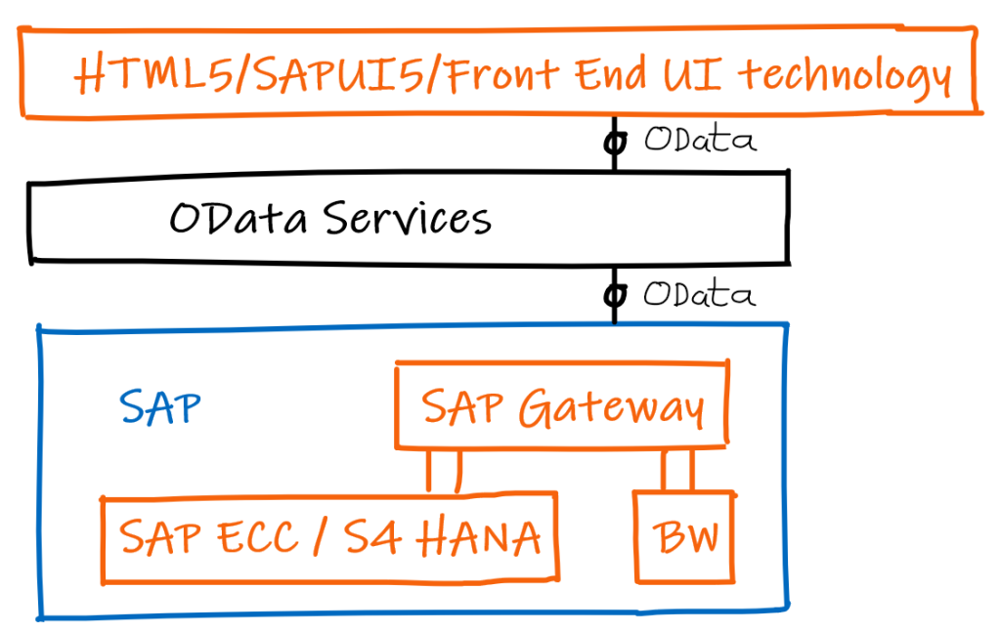
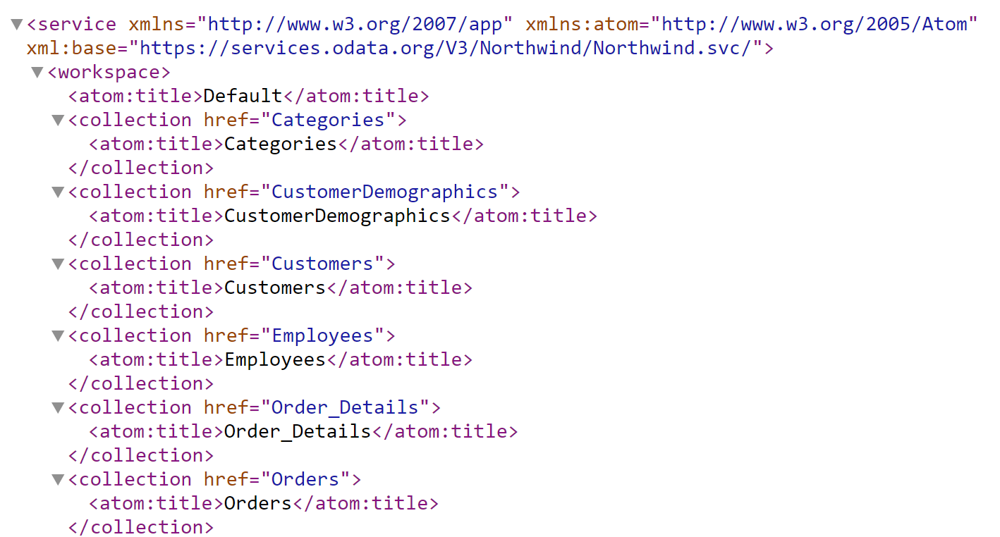
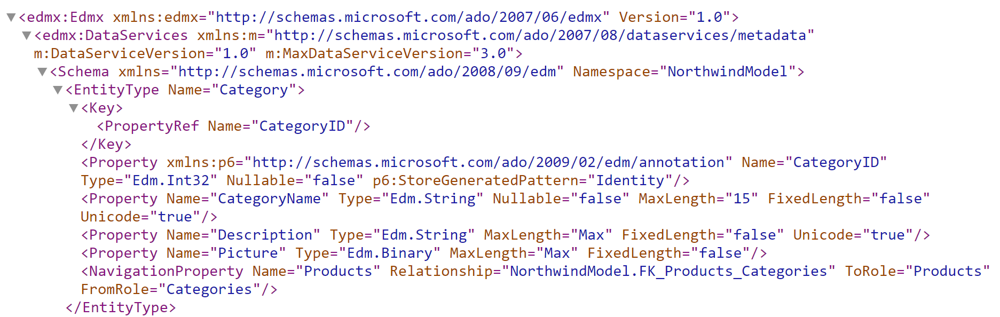
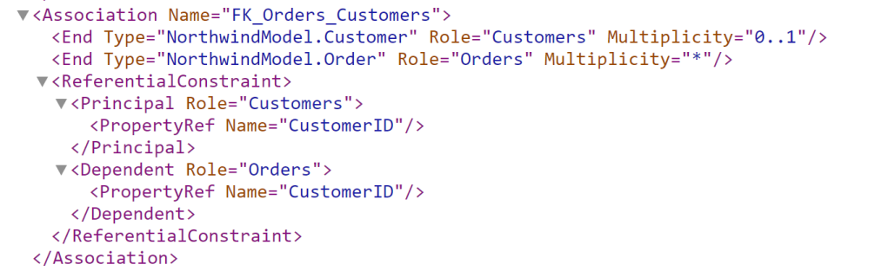
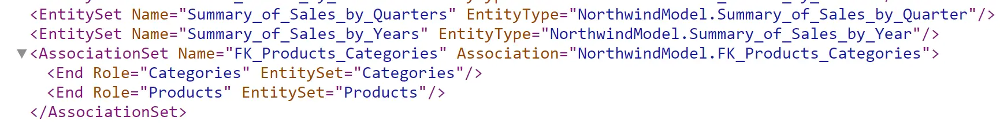
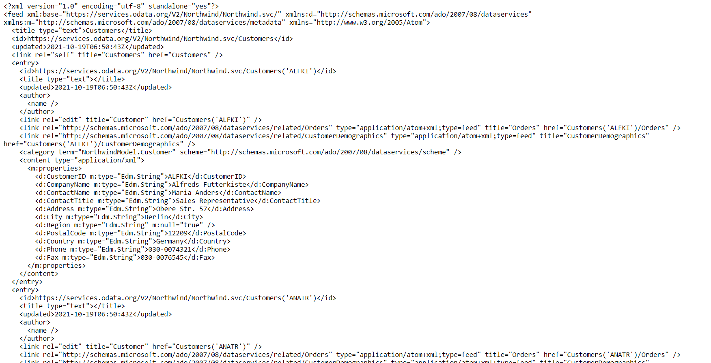
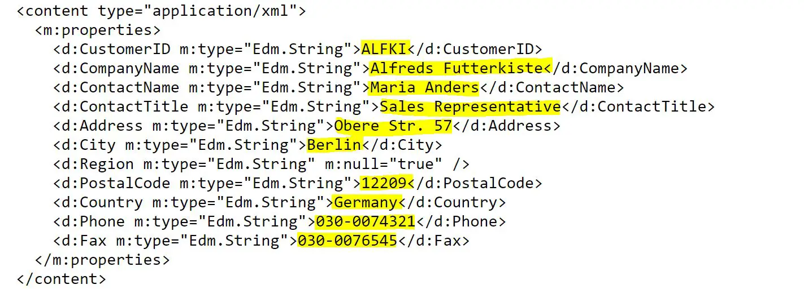

# Building OData Services [1] : OData Overview

OData is an open standard that is both a data format and a protocol for consuming and manipulating data in a uniform way. It is ISO approved and managed by the OASIS organization. You read more about OData at OData – the Best Way to REST.

What you are going to learn in this post is <b>What is OData from ABAP Developer’s point of view.</b>

OData is the way of communication between frontend which is SAP UI5 / FIORI and SAP backend.

SAP Gateway component handles the OData Services. The Gateway component can be either embedded in ECC/S4 HANA or it can be on a separate gateway system.

As it can be seen in the figure above, the SAP Gateway component is the interface between world outside SAP and SAP back end systems.

As OData is not a SAP protocol, any front end technology, or any system that handles OData can interface with SAP using OData Services.

- Each OData service is represented by a URI (Uniform Resource Identifier) or URL (Uniform Resource Locator). We will use URI term going forward.
- OData Service has two types of documents – <b>Service</b> and <b>Metadata</b>
- Atom format (xml) and JSON formats are supported
- Any web browser can be used to explore OData Service

A [sample OData model](https://services.odata.org/V3/Northwind/Northwind.svc/) looks like below.

Part of OData model. Use https://services.odata.org/V3/Northwind/Northwind.svc/ to see complete model

OData represents Data as collection of entities. This is a sample OData service that everyone can access freely. It has entities like Customers, Employees, Orders, Order_Details etc.

## Metadata
Metadata contains information about all the components of the data model for OData Service such as

- Entity type name, properties, keys, and navigation properties
- Association name, principal and dependent entities
- Entity Sets
- Association Sets

Link: https://services.odata.org/V3/Northwind/Northwind.svc/$metadata

Entity Type

Association

Entity Set and Association Set

## OData Entities

Entities are collection of records. To access any data, we need to access entities.

For example, Customer Information

https://services.odata.org/V2/Northwind/Northwind.svc/Customers

