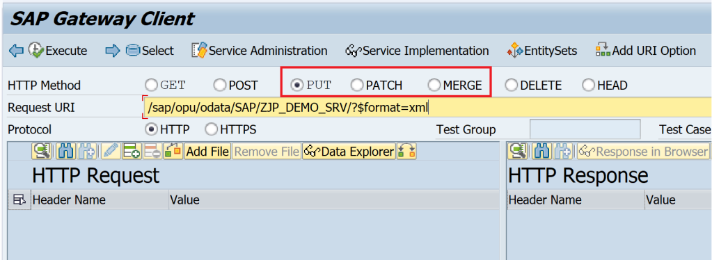
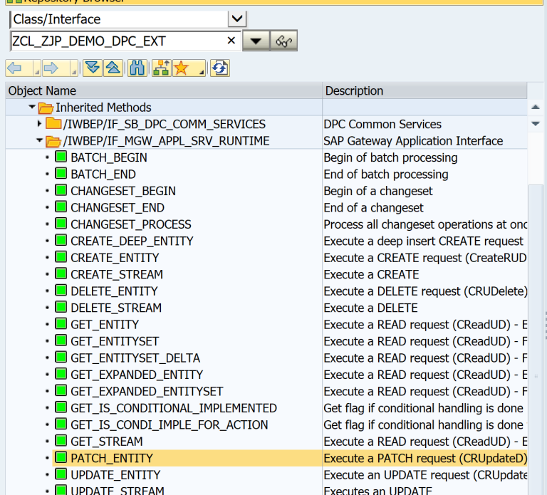
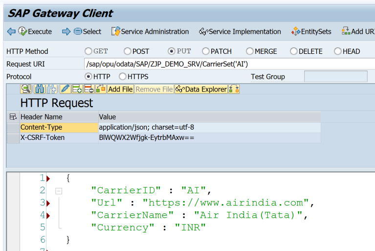
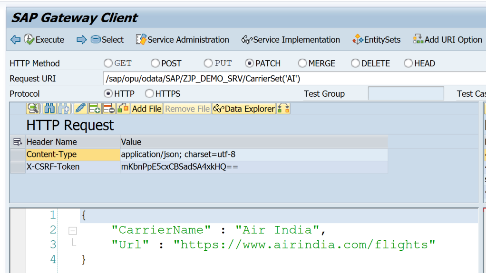

# Building OData Services [10] : Difference between Put, Merge and Patch

In this post, you will learn the difference between 3 HTTP methods that can be used for updating an entity.

There are 3 HTTP methods provided for updating an entity.

- PUT
- PATCH
- MERGE

From SAP OData Development point of view – these are not 3 methods as Patch and Merge are same.

- PATCH and MERGE are technically doing the same thing, but MERGE has been introduced by Microsoft earlier than PATCH. Later, the verb PATCH became part of the HTTP standard.
- You should use PATCH instead of MERGE, though MERGE would also work.
- [HTTP PATCH & MERGE](https://docs.microsoft.com/en-us/openspecs/windows_protocols/ms-odata/59d5abd3-7b12-490a-a0e2-9d9324b91893?redirectedfrom=MSDN) documentation can be referred to understand more.

So, what you really need to understand is the difference in PUT and PATCH/MERGE. I will use only PATCH word after this, but do read it is PATCH/MERGE

The basic difference is that

- with PUT, you are overwriting the entity and send all the fields in the request payload.
- with PATCH, you are updating only certain fields and send only the key fields along with the fields to be changed.

Technically, when PUT is used, UPDATE_ENTITY method is triggered in the data provider class and for PATCH, PATCH_ENTITY method is called.

If READ_ENTITY and UPDATE_ENTITY is implemented, the PATCH operation will work, however as it calls READ and then UPDATE it is not as effective as updating only certain fields. If this is intended then the method /IWBEP/IF_MGW_APPL_SRV_RUNTIME~PATCH_ENTITY can be redifined.

## Testing PUT and PATCH

Let us consider below entry to be updated.

PUT Request

Response

Table Entry

PATCH Request
Let us only update the Carrier Name (CARRNAME) and URL.

Response

Table Entry

