# Building OData Services [11] : Trouble-shooting OData services and Debugging

In this post you will learn about the errors in OData Services, trouble-shooting tools available and how to debug the service. Before starting with the trouble-shooting it is important to understand what HTTP response codes mean.

## Common HTTP Response Codes
Success Codes indicate that the request is succesfully processed / received. (2XX)

| Response Code |	Information |
| :-: | :- |
| 200 (OK)	|Indicates that a request has been received and processed successfully by a data service and that the response includes a non-empty response body.
| 201 (Created) |	Create Entity is executed successfully
| 202 (Accepted) |	Indicates that a batch request has been accepted for processing, but that the processing has not been completed.
| 204 (No Content) |	Indicates that a request has been received and processed successfully by a data service and that the response does not include a response body.|

Error Codes indicate that there is an error within the request or in the response. (4XX/5XX)

| Response Code	| Information |
| :-: | :- |
| 400 (Bad Request) |	Indicates that the payload, request headers, or request URI provided in a request are not correctly formatted according to the syntax rules defined in this document.
| 403(Not Found / Forbidden) |	Service not found
| 404 (Not Found) |	Resource not found
| 405 (Method not allowed) |	Incorrect URI & HTTP method combination
| 501 (Not Implemented) |	Method is not implemented
| 500 (Internal Server Error) |Indicates that a request being processed by a data service encountered an unexpected error during processing.

Note that these are not exhaustive lists of status codes and those can be found in Microsoft documentation of [HTTP status codes](https://learn.microsoft.com/en-us/troubleshoot/developer/webapps/iis/www-administration-management/http-status-code).

In the earlier post Testing CRUD-Q operations from Gateway Client, all the success scenarios are covered. Some of the error codes can be simulated as below.

400 (Bad Request) – Extra ' character after key-value AI in the request causes the error. When you get a such an error, check the URI.

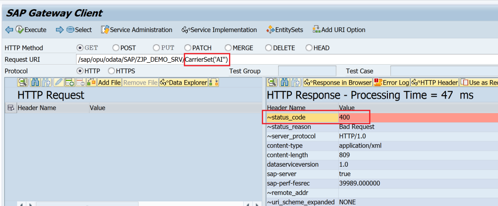

403 (Forbidden) – incorrect service name in the URI can lead to this error.


405 ( Method not allowed ) is triggered when the HTTP method and URI combination are not correct. The below example shows that a POST method is used with URI that has key information which makes it invalid.


501 (Not Implemented) occurs when the operation is called but relevant method is not implemented in DPC_EXT class.

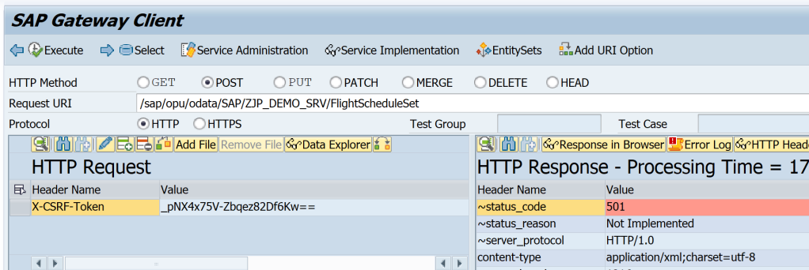

## Error Log Transactions
One of the most important tools to troubleshoot is Error Log. As Gateway can be either embedded or deployed as a central hub, there are front-end and back-end components to SAP Gateway. Similarly, there are front-end and back-end error log transactions.

| TCode | Description |
| :-: | :-: |
| /IWFND/ERROR_LOG | Front-end Error Log |
| /IWBEP/ERROR_LOG | Back-end Error Log |
| ST22 |	ABAp Short Dump |

/IWFND/ERROR_LOG is executed in Central Hub when it is applicable. For embedded deployment everything is executed in same system.

From this transaction, you can go to ST22, or backend error log. You can see the request and response data and replay the request as well.

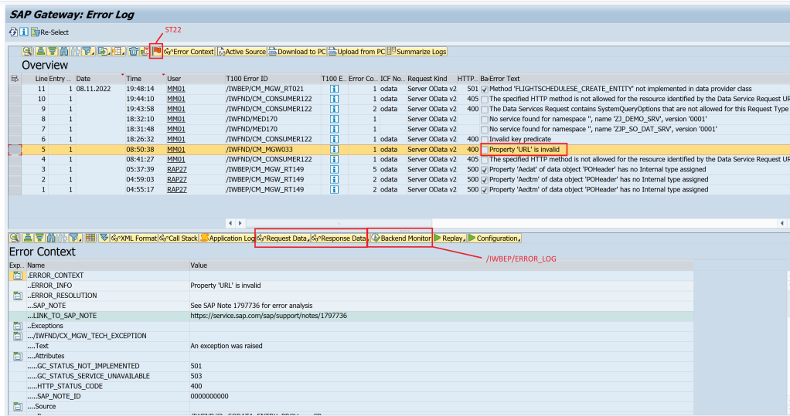

### /IWBEP/ERROR_LOG

This transaction shows the error and you can go to the Service Implementation from this transaction.

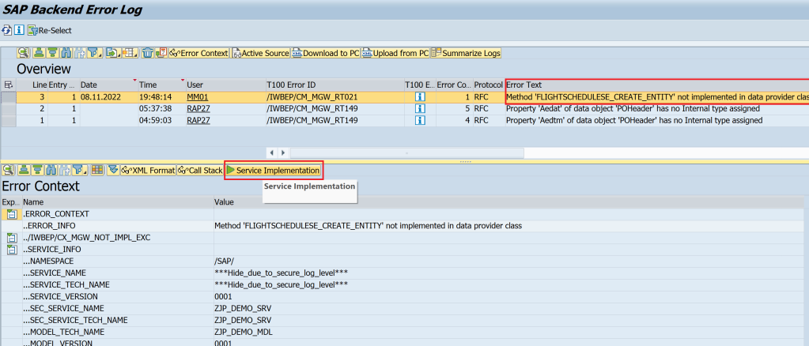

The error logs can be called from the Gateway Client right after getting the results as well using the error log button.


## Trace
Trace can be enabled and viewed using /IWFND/TRACES. As the transaction code suggests, it is a frontend component transaction.

- The trace level can be set using the drop-down for field Error Log Level.
- Trace is enabled or disabled with the checkboxes

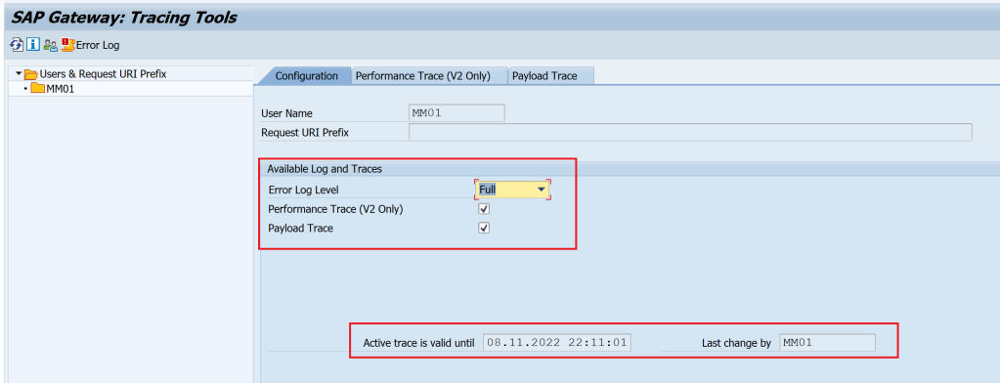

If the trace is required for some other user, the user can be changed using the user icon.

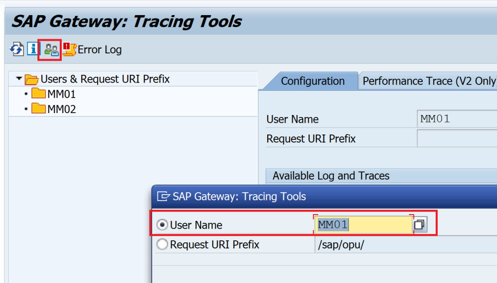

Once the trace is set, execute a request and check the results.


### Performance Trace


### Payload Trace


## Exception Handling
One important aspect of developing the OData service is to use the exceptions correctly to convey errors to front-end consumers.

A typical way to do this is to use the exceptions /iwbep/cx_mgw_busi_exception and /iwbep/cx_mgw_tech_exception from the methods.

We can use the standard interface /IWBEP/IF_MESSAGE_CONTAINER to add the messages to the OData response. It has below methods to help add the error details.

- ADD_MESSAGE
- ADD_ERROR_DETAIL
- ADD_MESSAGE_TEXT_ONLY
- ADD_MESSAGE_FROM_BAPI ADD_MESSAGES_FROM_BAPI

Note:

- Exceptions /IWBEP/CX_MGW_BUSI_EXCEPTION and /IWBEP/CX_MGW_TECH_EXCEPTION are inherited from the same class
- RAISE EXCEPTION TYPE Or RAISE EXCEPTION NEW (7.52+) statement can be used
Code Sample

```
DATA(lo_msg) = me->/iwbep/if_mgw_conv_srv_runtime~get_message_container( ).
lo_msg->add_message( iv_msg_type   = /iwbep/cl_cos_logger=>error
                     iv_msg_id     = 'ZJP_SO'
                     iv_msg_number = '001'
                     iv_msg_v1     = CONV #( lv_po_number ) ).
"Using earlier syntax
RAISE EXCEPTION TYPE /iwbep/cx_mgw_busi_exception
  EXPORTING
    message_container = lo_msg.

"Using new syntax
RAISE EXCEPTION NEW /iwbep/cx_mgw_busi_exception(
    message_container = lo_msg ).
```

## Cache Clean up
Cache clean-up would be required in case changes made to the service are not appearing in the front end or the service response. There are various cache cleanup transactions available, which are explained in note [2319491](https://launchpad.support.sap.com/#/notes/2319491). Be careful while using this transaction as they may impact performance of the syetem.

Cache Clean Up Transactions

- /ui2/cust – SAP Fiori–>Data Administration–>Invalidate Caches
- /iwfnd/cache_cleanup
- /iwbep/cache_cleanup

Cache Clean Up Programs

- /ui2/invalidate_client_caches
- /ui2/invalidate_global_caches
- /ui5/del_odata_metadata_cache

Apart from this, /IWFND/GW_CLIENT also has menu Metadata to clear / rebuild cache.


## Debugging

Simply, identify the method which is expected to be triggered and add an external break-point.

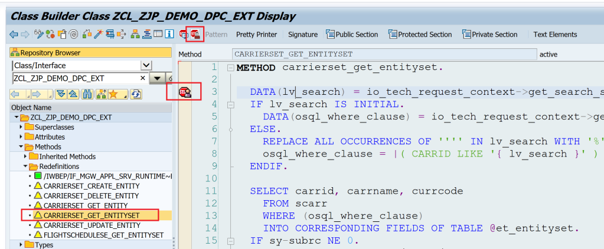

Then execute the service request.


Debugger it started with the break-point set.

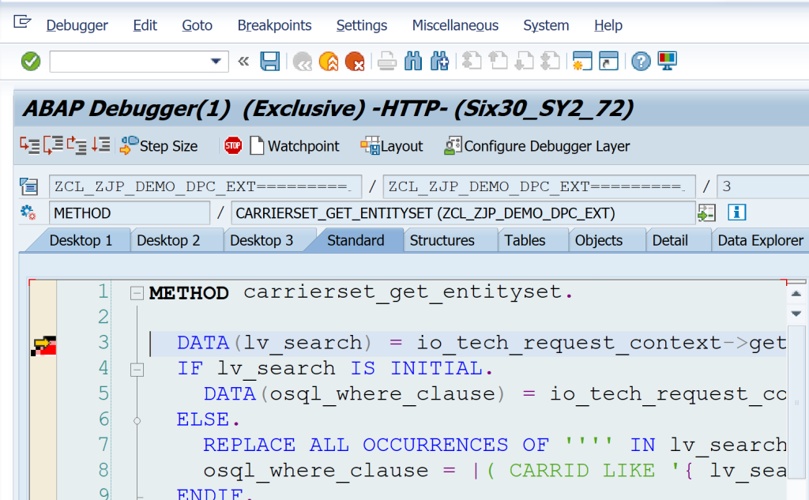

This way works from Gateway Client, external tool like Postman or from UI5/Fiori Application as well.

## What if debugging is not triggered?

- Make sure that the code is activated and correct method is selected to place a break-point
- External Break-point is selected and not session break-point
- Debugging settings for the user are accuarate.

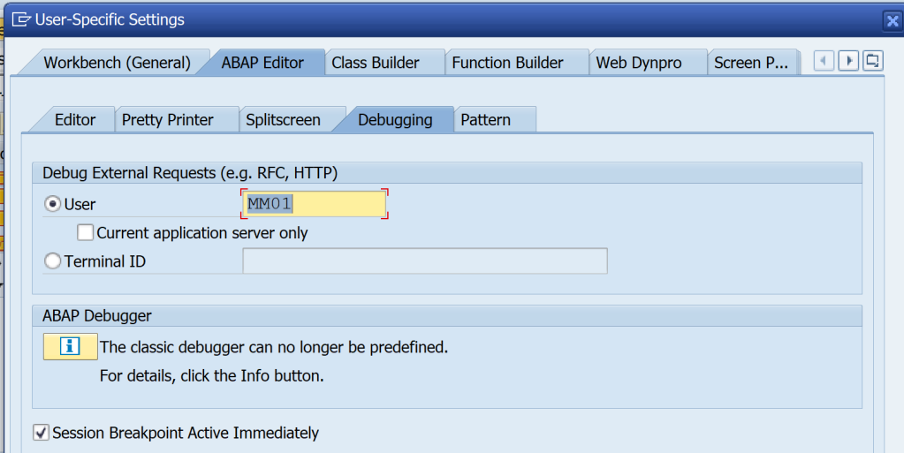

If all these are followed and if the debugger is still not started, then use SICF to activate the debugging. Enter the Service Name and Execute.

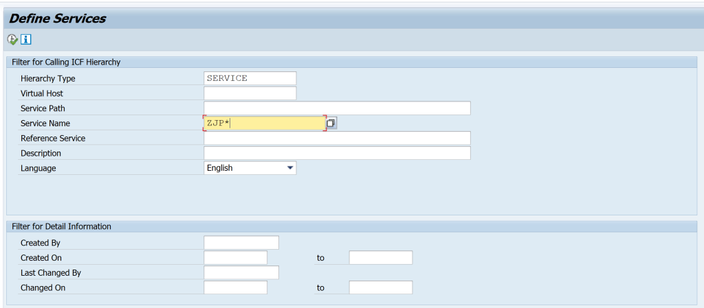

On the next screen, follow the menu path Edit > Debugging > Activate Debugging.

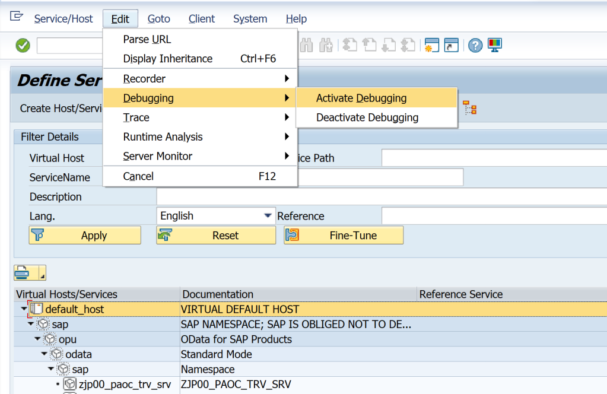

Then re-execute the request and debugger would be triggered.

Using all these trouble-shooting tools and instructions – you should be able to figure out and fix something that is not working in your OData Service.