# Building OData Services [12] : Handle Deep Structures using $expand

In this post, you will learn about handling Deep Structures in OData. We need to handle data with a hierarchy with deep structures while reading the data for the front-end applications and also while creating the data in SAP. This post deals with reading the data.

Consider the below scenario with Sales Order data where SO Header, Item, Product, and Customer are associated as shown below.

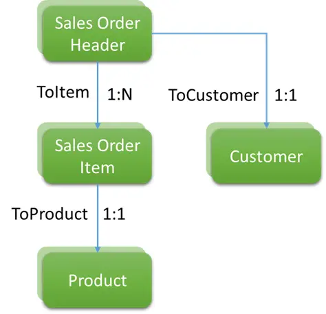

## Project Creation
The SEGW project ZG00_JP_SO should be created as below. The creation steps are explained in earlier posts in this series and not repeated in this post.

Entity Types (SOStatus can be ignored for this post)

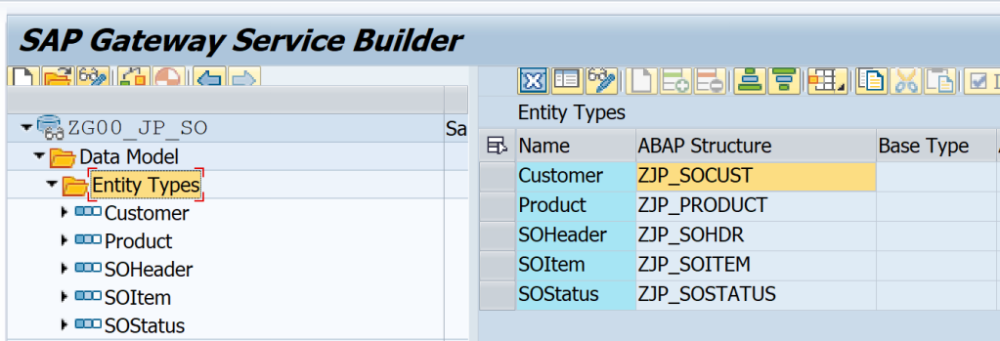

Reference structures for all entities are as below. Create Entity Sets are the same time.

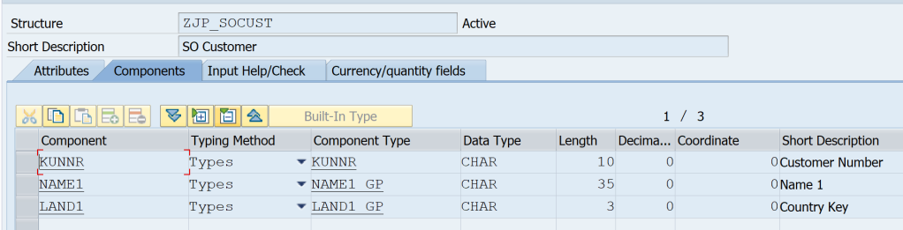

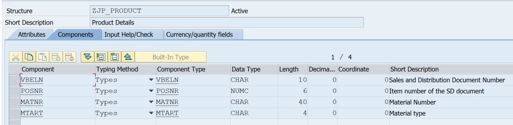

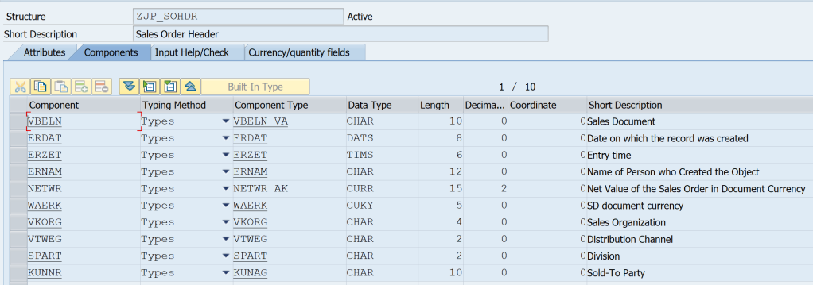

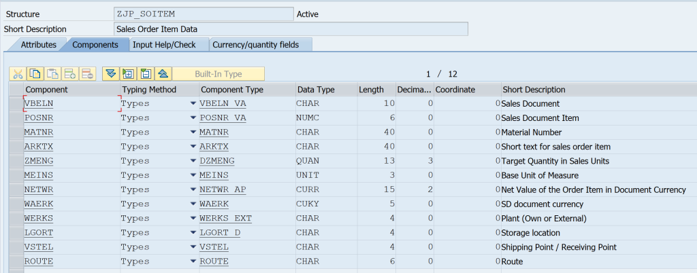

Then create Associations to represent the data model. Create Association Sets at the same time.

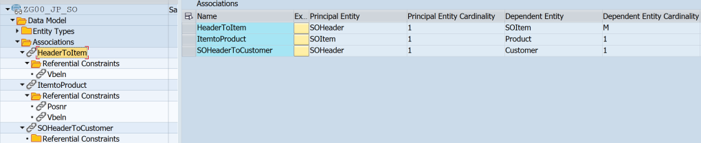

Below Navigation Properties are created along with Associations. The property names are very important in this scenario.

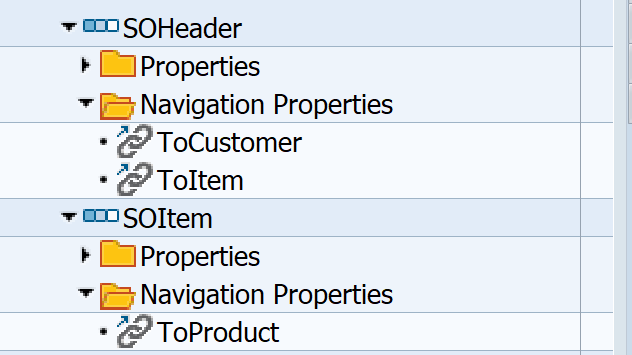

Now, generate the project and register the service. Important classes generated are as below.

- Data Provider Class: ZCL_G00_JP_SO_DPC_EXT
- Model Provider Class: ZCL_G00_JP_SO_MPC_EXT

## Define Deep Structure

The deep structure to represent the complete sales order would look like the below. Structure <b>ZJP_SO_DS</b> represents the Header data and also has a component structure TOCUSTOMER which refers to the Customer Type and a component table TOITEM which refers to Item Table. In turn, the item table has a component structure TOPRODUCT that refers to the product structure. Customer and Product structures are same earlier ones used for Entities.

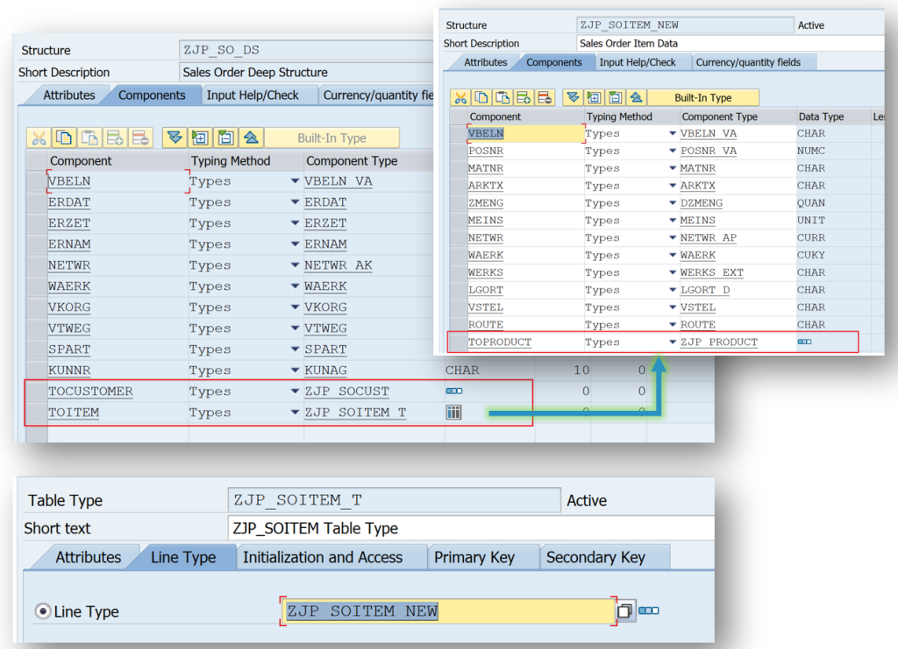

<h3> <b>
<span style="color:red" > 
Important: The component names which link to other entities should be named according to the Navigation Properties.
</span>
</h3></b> 

Another option to create the structure is to create one in MPC_EXT class i.e. in ZCL_G00_JP_SO_MPC_EXT.

Go to the tab – Type in the class and add type TY_SO_ALL with visibility Public. Then click on the green arrow highlighted below to navigate to the editor.

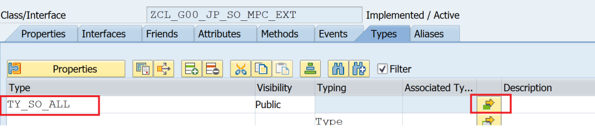

Complete the type definition as below.

```
class ZCL_G00_JP_SO_MPC_EXT definition
  public
  inheriting from ZCL_G00_JP_SO_MPC
  create public .

public section.

  types:
    BEGIN OF ty_item_product,
        vbeln     TYPE vbeln_va,
        posnr     TYPE posnr_va,
        matnr     TYPE matnr,
        arktx     TYPE arktx,
        zmeng     TYPE dzmeng,
        meins     TYPE meins,
        netwr     TYPE netwr_ap,
        waerk     TYPE waerk,
        werks     TYPE werks_ext,
        lgort     TYPE lgort_d,
        vstel     TYPE vstel,
        route     TYPE route,
        ToProduct TYPE zjp_product,
      END OF ty_item_product .
  types:
    tt_items_products TYPE STANDARD TABLE OF ty_item_product WITH EMPTY KEY .
  types:
    BEGIN OF ty_so_all,
        vbeln      TYPE vbeln_va,
        erdat      TYPE erdat,
        erzet      TYPE erzet,
        ernam      TYPE ernam,
        netwr      TYPE netwr_ak,
        waerk      TYPE waerk,
        vkorg      TYPE vkorg,
        vtweg      TYPE vtweg,
        spart      TYPE spart,
        kunnr      TYPE kunag,
        ToCustomer TYPE zjp_socust,
        ToItem     TYPE tt_items_products,
      END OF ty_so_all .

  "types: ty_so_all TYPE ZJP_SO_DS. "If you want to declare based on ddic

  methods DEFINE
    redefinition .
```

Now redefine the method, DEFINE and add the below code to set the deep structure as the type for the SOHeader Entity. It is important to call the super->define() method to ensure all other Entity Types are defined correctly at runtime.

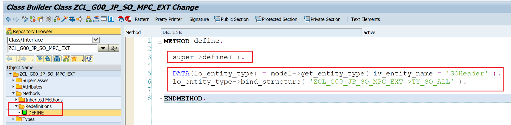

```
METHOD define.

  super->define( ).

  DATA(lo_entity_type) = model->get_entity_type( iv_entity_name = 'SOHeader' ).
  lo_entity_type->bind_structure( 'ZCL_G00_JP_SO_MPC_EXT=>TY_SO_ALL' ).

ENDMETHOD.
```

## Get Expanded Entity – $expand

Get Expanded Entity i.e. $expand is used to get the Entity Type along with its association. In this example, SOHeader Entity can be fetched along with its associations i.e. Customer Entity and Items Entity Set.

The expansion can work on multiple associations i.e. Customer Entity and Items Entity Set can be fetched in one request along with SOHeader OR it can work as multi-level associations i.e. SOHeader, SOItems, Products can be fetched in one request.

The expansion can also use multiple and multi-level concepts in single request.

The method to be redefined are

- /IWBEP/IF_MGW_APPL_SRV_RUNTIME~GET_EXPANDED_ENTITYSET
- /IWBEP/IF_MGW_APPL_SRV_RUNTIME~GET_EXPANDED_ENTITY

Code Reference

```
METHOD /iwbep/if_mgw_appl_srv_runtime~get_expanded_entity.

  DATA : ls_so_all TYPE zcl_g00_jp_so_mpc_ext=>ty_so_all,
         ls_keys   TYPE zcl_g00_jp_so_mpc=>ts_soheader.

  CASE iv_entity_set_name.

    WHEN 'SOHeaderSet'.

      io_tech_request_context->get_converted_keys(
        IMPORTING es_key_values = ls_keys ).

      SELECT SINGLE FROM vbak
        FIELDS vbeln, erdat, erzet, ernam, netwr,
               waerk, vkorg, vtweg, spart, kunnr
        WHERE vbeln = @ls_keys-vbeln
        INTO @DATA(ls_header).
      IF sy-subrc EQ 0.

        SELECT SINGLE FROM kna1
          FIELDS kunnr, name1, land1
          WHERE kunnr = @ls_header-kunnr
          INTO @DATA(ls_customer).

        SELECT FROM vbap
          FIELDS vbeln, posnr, matnr, arktx, zmeng, meins,
                 netwr, waerk, werks, lgort, vstel, route
          WHERE vbeln = @ls_header-vbeln
          INTO TABLE @DATA(lt_item).
        IF sy-subrc EQ 0.
          SELECT FROM mara
            FIELDS matnr, mtart
            FOR ALL ENTRIES IN @lt_item
            WHERE matnr = @lt_item-matnr
            INTO TABLE @DATA(lt_material).
        ENDIF.
      ENDIF.

      ls_so_all = VALUE #(
            vbeln = ls_header-vbeln
            erdat = ls_header-erdat
            erzet = ls_header-erzet
            ernam = ls_header-ernam
            netwr = ls_header-netwr
            waerk = ls_header-waerk
            vkorg = ls_header-vkorg
            vtweg = ls_header-vtweg
            spart = ls_header-spart
            kunnr = ls_header-kunnr
            ToCustomer = ls_customer
            toitem = VALUE #( FOR ls_item IN lt_item WHERE ( vbeln = ls_header-vbeln )
              (
                vbeln = ls_item-vbeln
                posnr = ls_item-posnr
                matnr = ls_item-matnr
                arktx = ls_item-arktx
                zmeng = ls_item-zmeng
                meins = ls_item-meins
                netwr = ls_item-netwr
                waerk = ls_item-waerk
                werks = ls_item-werks
                lgort = ls_item-lgort
                vstel = ls_item-vstel
                route = ls_item-route
                ToProduct =
                  VALUE #( vbeln = ls_item-vbeln
                           posnr = ls_item-posnr
                           matnr = ls_item-matnr
                           mtart = VALUE #( lt_material[ matnr = ls_item-matnr ]-mtart OPTIONAL ) ) ) ) ).

      copy_data_to_ref(
         EXPORTING
           is_data = ls_so_all
         CHANGING
           cr_data = er_entity ).
  ENDCASE.
ENDMETHOD.
```

```
METHOD /iwbep/if_mgw_appl_srv_runtime~get_expanded_entityset.

  DATA : lt_so_all TYPE STANDARD TABLE OF zcl_g00_jp_so_mpc_ext=>ty_so_all.

  CASE iv_entity_set_name.
    WHEN 'SOHeaderSet'.

      SELECT FROM vbak
         FIELDS vbeln, erdat, erzet, ernam, netwr,
                waerk, vkorg, vtweg, spart, kunnr
         INTO TABLE @DATA(lt_header)
         UP TO 10 ROWS.
      IF sy-subrc EQ 0.

        SELECT FROM kna1
          FIELDS kunnr, name1, land1
          FOR ALL ENTRIES IN @lt_header
          WHERE kunnr = @lt_header-kunnr
          INTO TABLE @DATA(lt_customer).

        SELECT FROM vbap
          FIELDS vbeln, posnr, matnr, arktx, zmeng, meins,
                 netwr, waerk, werks, lgort, vstel, route
          FOR ALL ENTRIES IN @lt_header
          WHERE vbeln = @lt_header-vbeln
          INTO TABLE @DATA(lt_item).
        IF sy-subrc EQ 0.
          SELECT FROM mara
            FIELDS matnr, mtart
            FOR ALL ENTRIES IN @lt_item
            WHERE matnr = @lt_item-matnr
            INTO TABLE @DATA(lt_material).
        ENDIF.
      ENDIF.

      lt_so_all = VALUE #(
        FOR ls_header IN lt_header
          ( vbeln = ls_header-vbeln
            erdat = ls_header-erdat
            erzet = ls_header-erzet
            ernam = ls_header-ernam
            netwr = ls_header-netwr
            waerk = ls_header-waerk
            vkorg = ls_header-vkorg
            vtweg = ls_header-vtweg
            spart = ls_header-spart
            kunnr = ls_header-kunnr
            ToCustomer = VALUE #( lt_customer[ kunnr = ls_header-kunnr ] OPTIONAL )
            toitem = VALUE #( FOR ls_item IN lt_item WHERE ( vbeln = ls_header-vbeln )
              (
                vbeln = ls_item-vbeln
                posnr = ls_item-posnr
                matnr = ls_item-matnr
                arktx = ls_item-arktx
                zmeng = ls_item-zmeng
                meins = ls_item-meins
                netwr = ls_item-netwr
                waerk = ls_item-waerk
                werks = ls_item-werks
                lgort = ls_item-lgort
                vstel = ls_item-vstel
                route = ls_item-route
                ToProduct =
                  VALUE #( vbeln = ls_item-vbeln
                           posnr = ls_item-posnr
                           matnr = ls_item-matnr
                           mtart = VALUE #( lt_material[ matnr = ls_item-matnr ]-mtart OPTIONAL ) ) ) ) ) ).

      copy_data_to_ref(
       EXPORTING
         is_data = lt_so_all
       CHANGING
         cr_data = er_entityset ).

  ENDCASE.
ENDMETHOD.
```
This error occured while adding the service saying he TY_SO_ALL does not exist

This was happening becuase I made mistake while the class name in redifine menthod

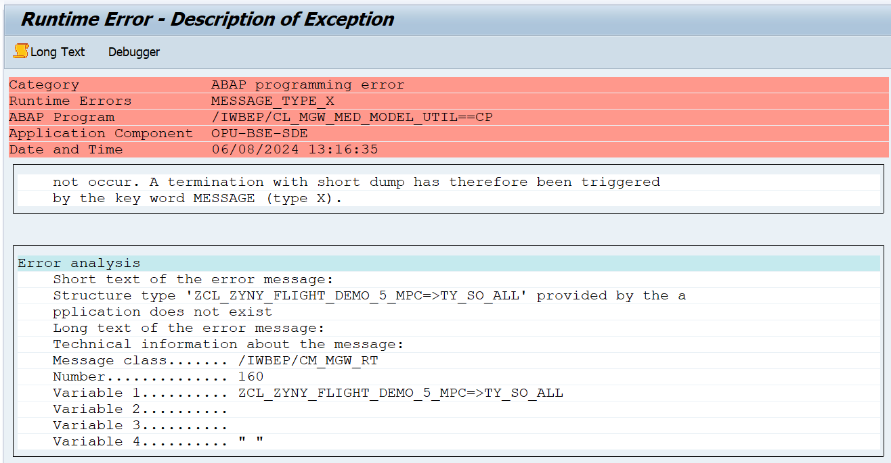
## Test using Gateway Client

|Operation |	HTTP Method |	URI |
| :-: | :-: | :-: |
|GetEntitySet – Single Association | GET |	/sap/opu/odata/SAP/ZG00_JP_SO_SRV/SOHeaderSet?$expand=ToCustomer?$format=json |

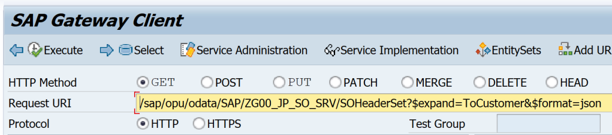

The response shows multiple records, Association ToCustomer is expanded with data but Association ToItem is deferred.

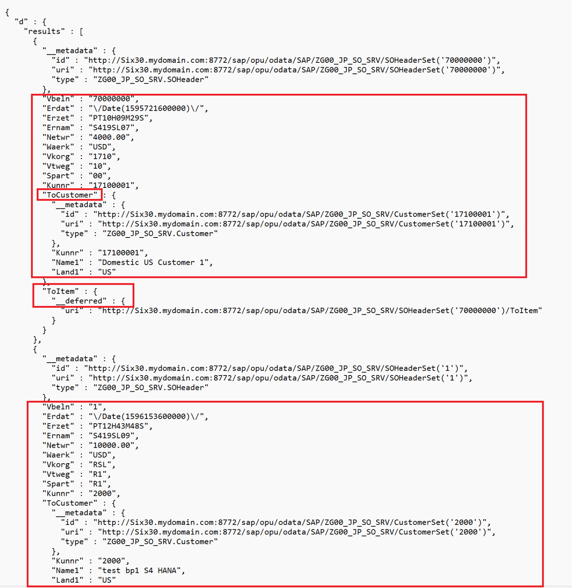

|Operation |	HTTP Method |	URI |
| :-: | :-: | :-: |
|GetEntitySet – Mutliple Associations	| GET |	/sap/opu/odata/SAP/ZG00_JP_SO_SRV/SOHeaderSet?$expand=ToCustomer,ToItem&$format=json |

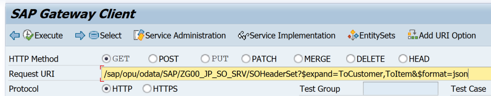

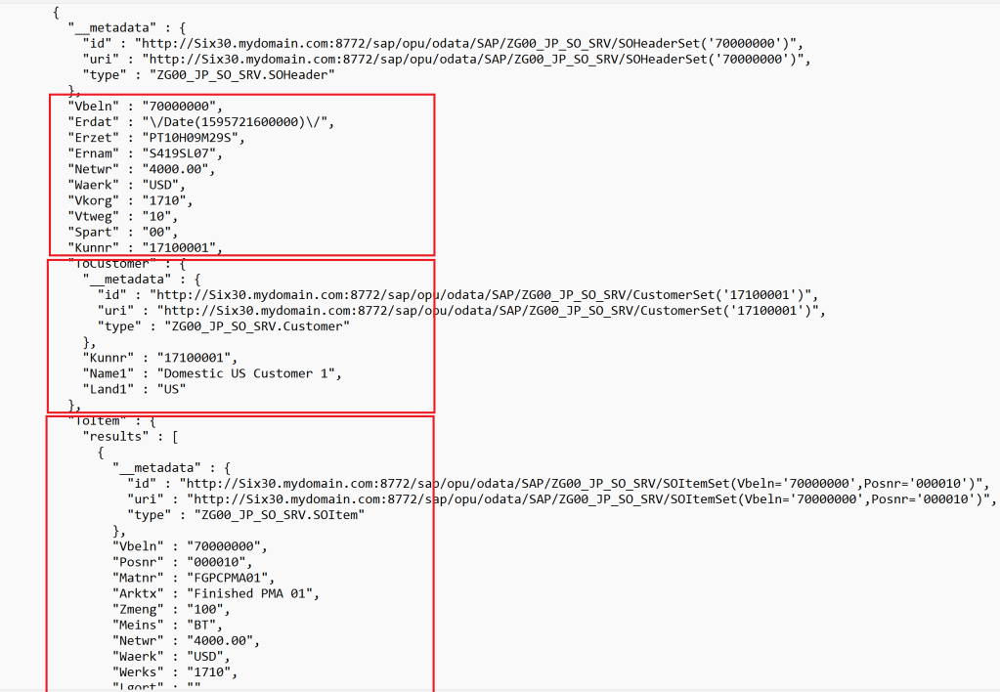

|Operation |	HTTP Method |	URI |
| :-: | :-: | :-: |
| GetEntitySet – Multi-level Associations | GET |	/sap/opu/odata/SAP/ZG00_JP_SO_SRV/SOHeaderSet?$expand=ToItem/ToProduct&$format=json |

In this case, if the navigation property is NPL1 for level 1 and NPL2 for level 2 then it needs to be specified as NPL1/NPL2.

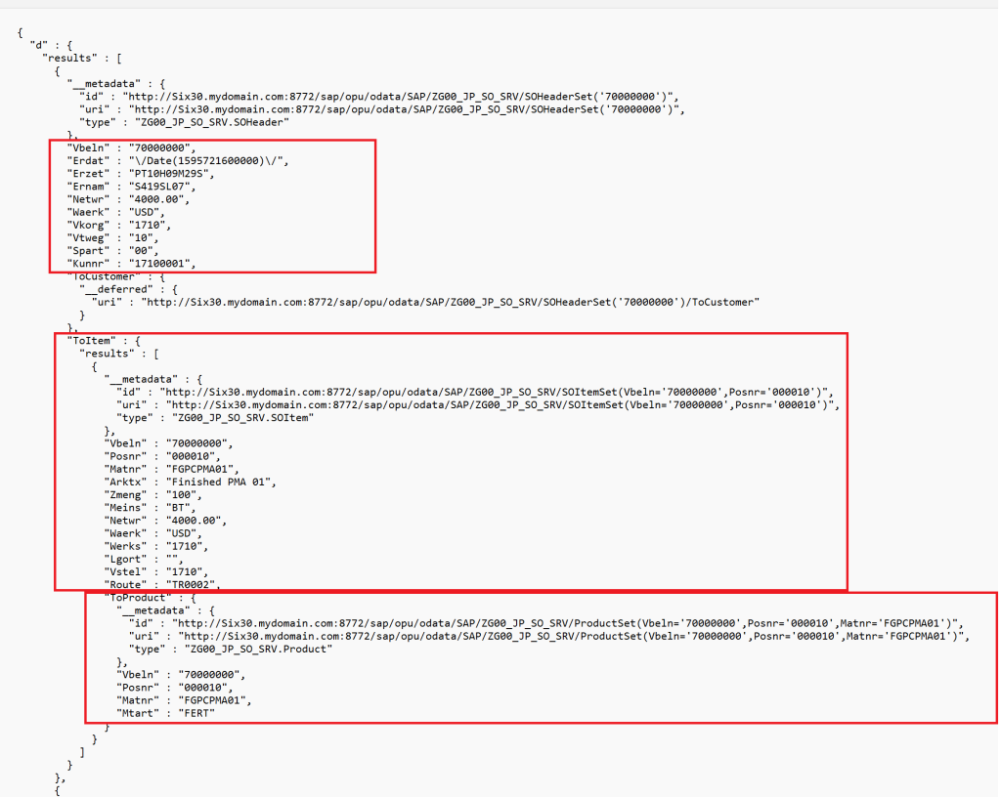

|Operation |	HTTP Method |	URI |
| :-: | :-: | :-: |
|GetEntitySet – Multi-level and Mutliple Associations	| GET	| /sap/opu/odata/SAP/ZG00_JP_SO_SRV/SOHeaderSet?$expand=ToCustomer,ToItem/ToProduct&$format=json |

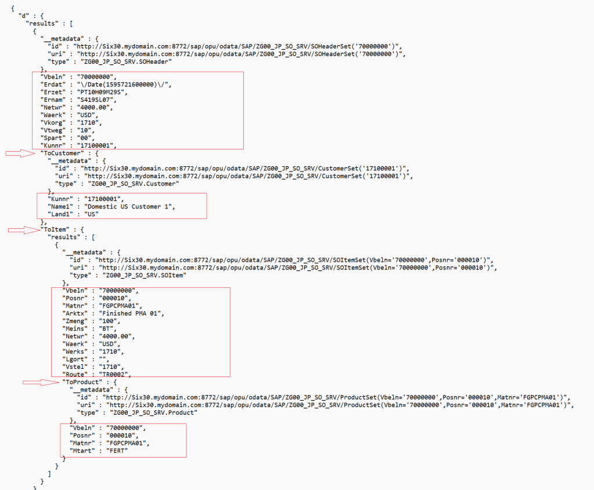

Similarly, the Entity Type i.e. READ operations can be tested with the below URIs. The only difference is that the SOHeaderSet key needs to be used in the URIs. HTTP method for all below URIs is GET.

|Operation|	URI |
| :-: | :-: |
| GetEntity	| /sap/opu/odata/SAP/ZG00_JP_SO_SRV/SOHeaderSet(‘1’)?$format=json
| GetEntity – Single Association | /sap/opu/odata/SAP/ZG00_JP_SO_SRV/SOHeaderSet(‘1’)?$expand=ToItem&$format=json
| GetEntity – Multiple Association | /sap/opu/odata/SAP/ZG00_JP_SO_SRV/SOHeaderSet(‘1’)?$expand=ToItem,ToCustomer&$format=json
| GetEntity – Multi-Level Association |	/sap/opu/odata/SAP/ZG00_JP_SO_SRV/SOHeaderSet(‘1’)?$expand=ToItem/ToProduct&$format=json
| GetEntity – Multi-Level & Multiple Association |	/sap/opu/odata/SAP/ZG00_JP_SO_SRV/SOHeaderSet(‘1’)?$expand=ToItem/ToProduct,ToCustomer&$format=json

Note that the URI has Navigation Property names and we have ensured that the property names and the Deep Structure component names are the same.

Here is the result from the last operation that expands everything. Only look at the data, some of the other information is truncated.

```
{
  "d" : {
    "__metadata" : {
      "id" : "/sap/opu/odata/SAP/ZG00_JP_SO_SRV/SOHeaderSet('1')",
      "uri" : "/sap/opu/odata/SAP/ZG00_JP_SO_SRV/SOHeaderSet('1')",
      "type" : "ZG00_JP_SO_SRV.SOHeader"
    },
    "Vbeln" : "1",
    "Erdat" : "\/Date(1596153600000)\/",
    "Erzet" : "PT12H43M48S",
    "Ernam" : "S419SL09",
    "Netwr" : "10000.00",
    "Waerk" : "USD",
    "Vkorg" : "RSL",
    "Vtweg" : "R1",
    "Spart" : "R1",
    "Kunnr" : "2000",
    "ToCustomer" : {
      "__metadata" : {
        "id" : "/sap/opu/odata/SAP/ZG00_JP_SO_SRV/CustomerSet('2000')",
        "uri" : "/sap/opu/odata/SAP/ZG00_JP_SO_SRV/CustomerSet('2000')",
        "type" : "ZG00_JP_SO_SRV.Customer"
      },
      "Kunnr" : "2000",
      "Name1" : "test bp1 S4 HANA",
      "Land1" : "US"
    },
    "ToItem" : {
      "results" : [
        {
          "__metadata" : {
            "id" : "/sap/opu/odata/SAP/ZG00_JP_SO_SRV/SOItemSet(Vbeln='1',Posnr='000010')",
            "uri" : /sap/opu/odata/SAP/ZG00_JP_SO_SRV/SOItemSet(Vbeln='1',Posnr='000010')",
            "type" : "ZG00_JP_SO_SRV.SOItem"
          },
          "Vbeln" : "1",
          "Posnr" : "000010",
          "Matnr" : "MR.CHEF",
          "Arktx" : "0r.chef 250mg",
          "Zmeng" : "0",
          "Meins" : "PAC",
          "Netwr" : "10000.00",
          "Waerk" : "USD",
          "Werks" : "RSL",
          "Lgort" : "",
          "Vstel" : "RSL",
          "Route" : "",
          "ToProduct" : {
            "__metadata" : {
              "id" : "/ZG00_JP_SO_SRV/ProductSet(Vbeln='1',Posnr='000010',Matnr='MR.CHEF')",
              "uri" : "/ZG00_JP_SO_SRV/ProductSet(Vbeln='1',Posnr='000010',Matnr='MR.CHEF')",
              "type" : "ZG00_JP_SO_SRV.Product"
            },
            "Vbeln" : "1",
            "Posnr" : "000010",
            "Matnr" : "MR.CHEF",
            "Mtart" : "FERT"
          }
        }
      ]
    }
  }
}
```