# Building OData Services [14] : Service Generators – Search Help

In this post, you will learn about the Service Generators i.e. Creating a Service using existing objects like Search Help, BAPI, or BOR Objects. To manage the length of the post, this is split into 2 parts.

- How to create OData Service using Search Help i.e. Import Search Help in SEGW
- How to create OData Service using BAPI / BOR object i.e. Import BAPIs in SEGW

## Create Project

In SEGW Transaction, use Create Project button to create a project.

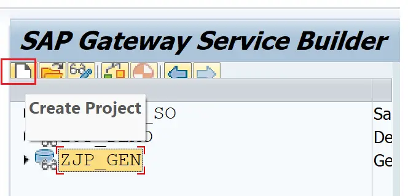

Provide Project Name, Description, and Package.

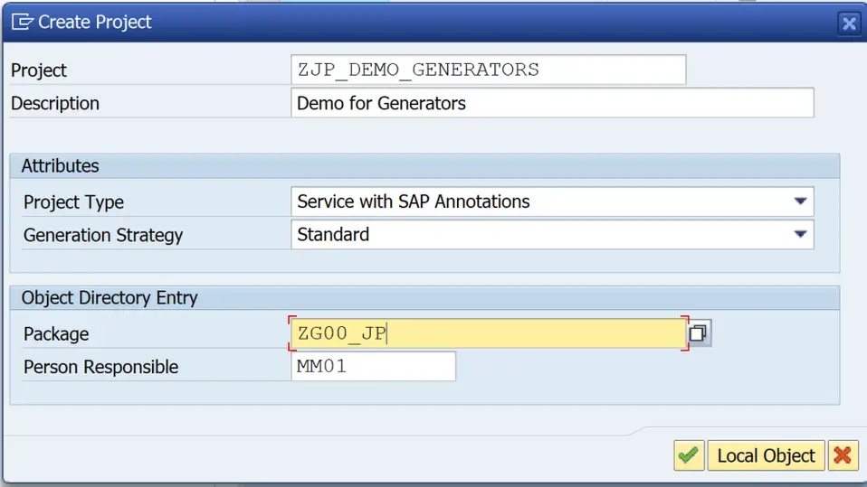

Right-click on Data Model and choose Import to see the import options. Here, RFC/BOR Interface and Search Help options are available.

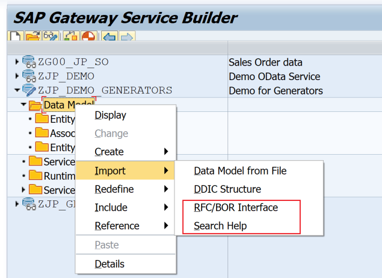

## Search Help

Search-help is imported to provide data for front-end F4 helps. This is pretty much stating the obvious. However, it is worth mentioning that we can only implement Read and Query operations using the Search Help Import.

Chose the Search Help option.

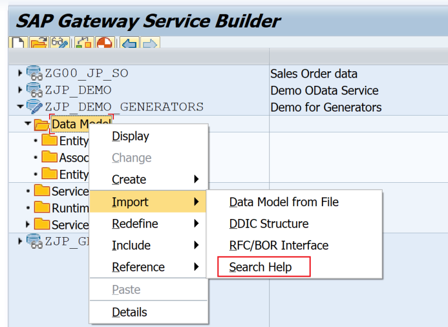

For demo, search help H_T002 is used which provides Language codes and descriptions. Provide Entity Type Name and Search Help to be imported. Keep the default options checked. Click Next.

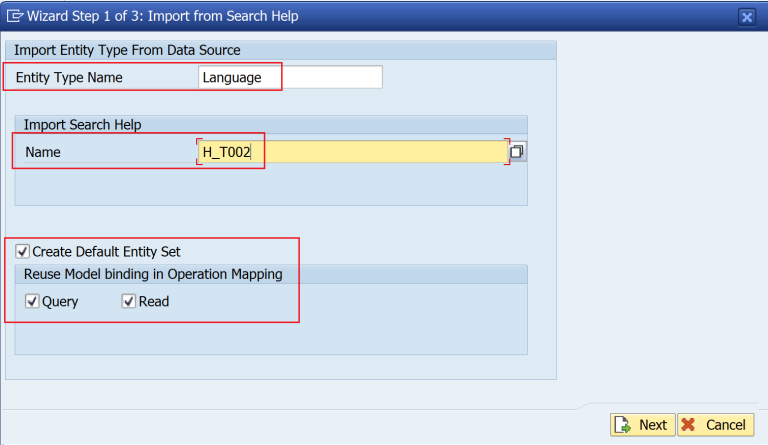

Select the required fields i.e. SPRAS and SPTXT. Click Next.

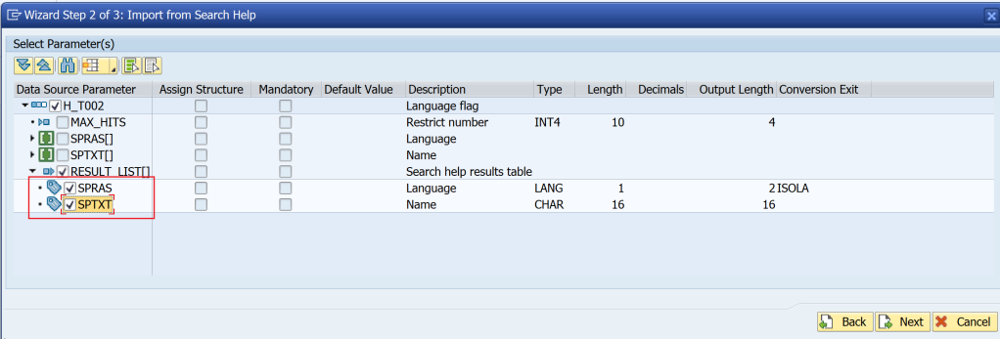

Select SPRAS as the key field. click Finish.

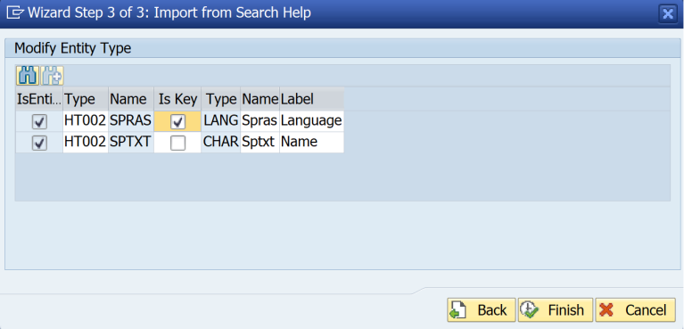

Expand the Service Implementation Node. Here, the Read and Qeury Operations for the Set. Note that even though a different name is specified for the Entity Type, it gets created with the Search-Help name after removing all _ characters from the Search-Help name.

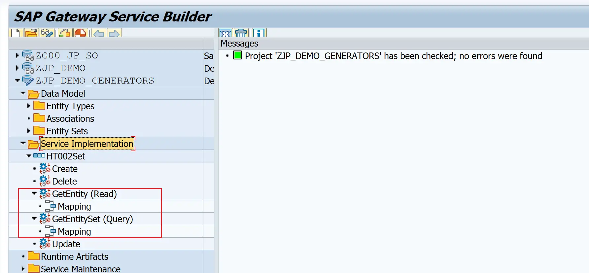

Double-click on the Mapping and observe the same.

Read

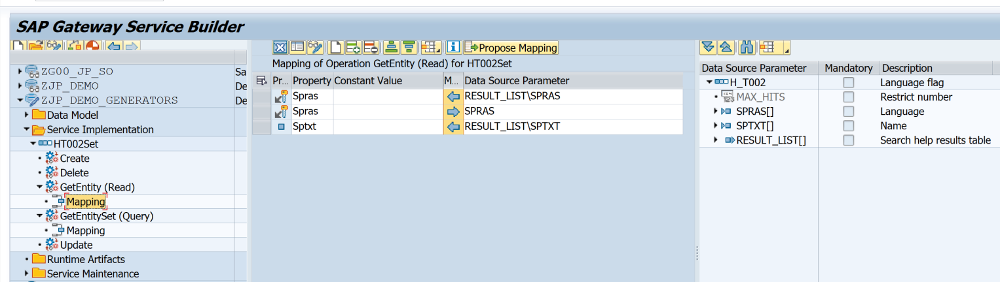

Qeury

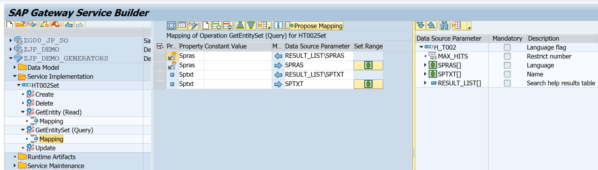

Generate the Project and Register the Service.

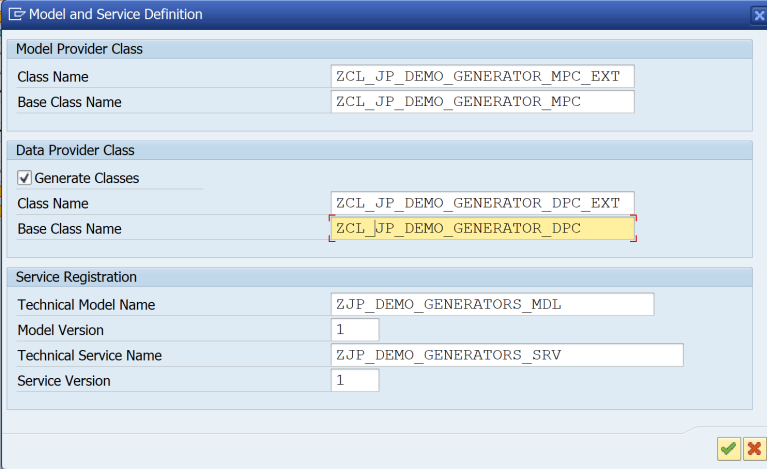

Generation result.

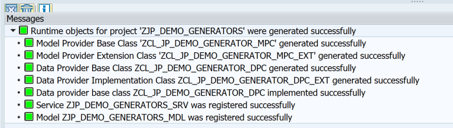

Expand Node Service Maintenance, Double-click on GW_HUB/First node, and Click on Register. For Central Hub deployment use transaction /n/iwfnd/maint_service.

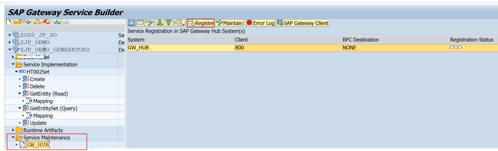

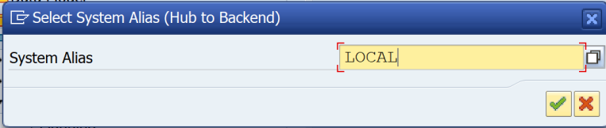

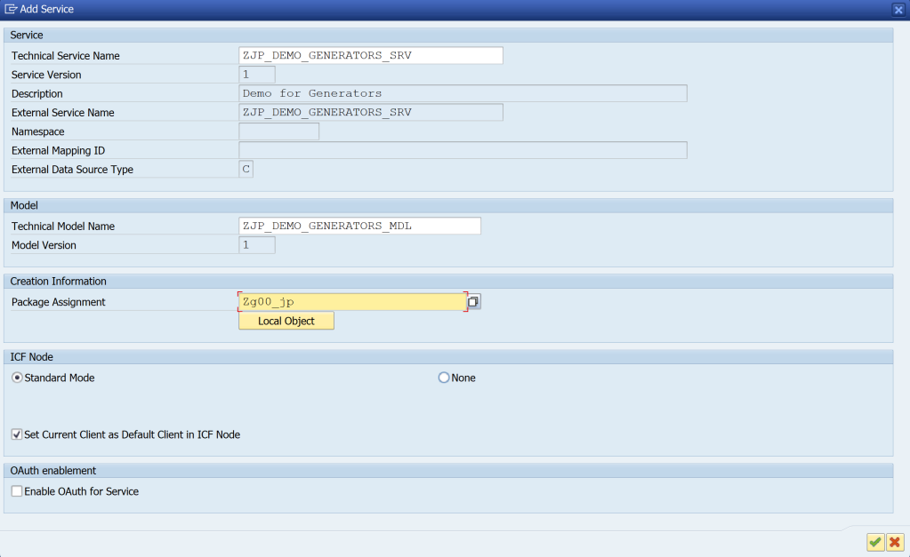

Click on SAP Gateway Client.

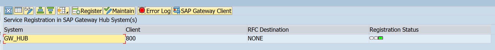

Test the service.

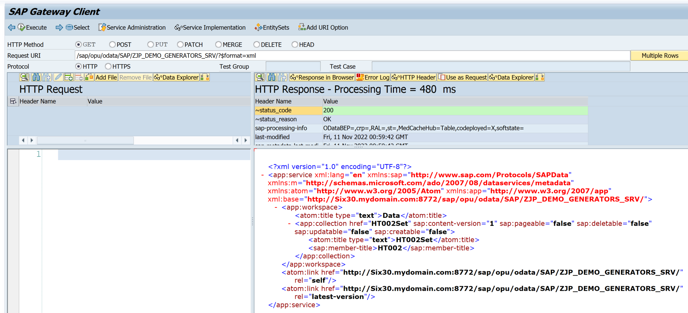

Now, test the operations.

Query
```
URI: /sap/opu/odata/SAP/ZJP_DEMO_GENERATORS_SRV/HT002Set?$format=json
```

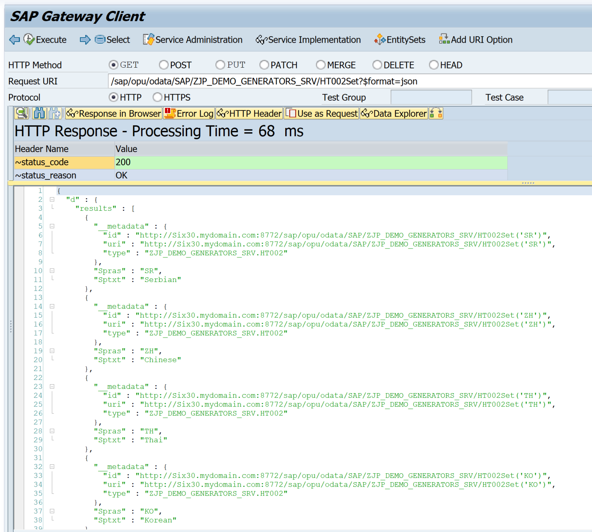

Query options like filters are automatically handled. However, sort is not handled.
```
/sap/opu/odata/SAP/ZJP_DEMO_GENERATORS_SRV/HT002Set?$filter=Spras eq 'SR'&$format=json
```
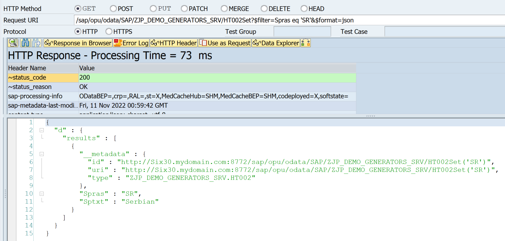

Read
```
/sap/opu/odata/SAP/ZJP_DEMO_GENERATORS_SRV/HT002Set('EN')?$format=json
```

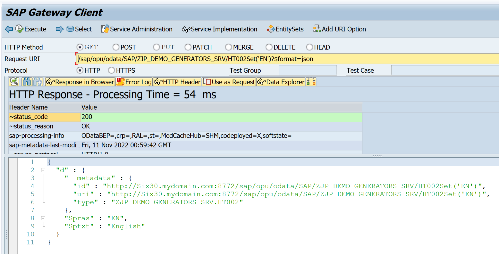

This way, without a code line, search-help import can be used to provide data for entities required only as reference data, options for drop-down-list, or F4/Search help pop-ups in frontend.