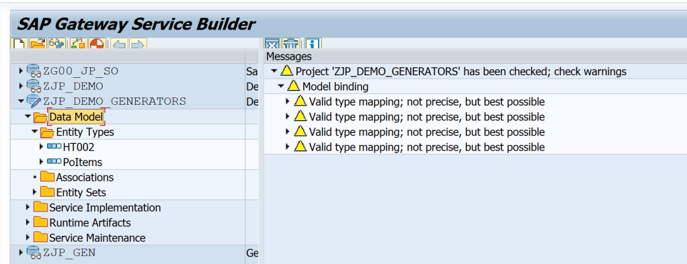
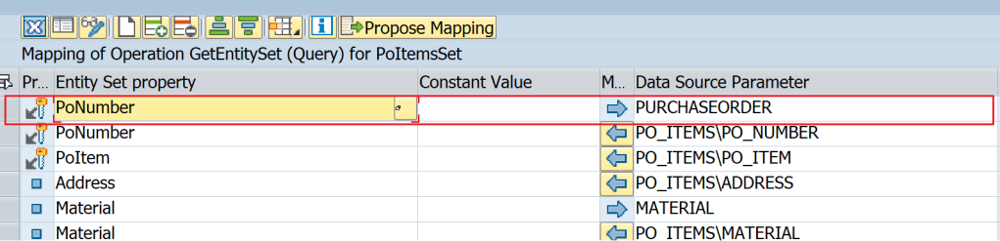

# Building OData Services [15] : Service Generators – RFC/ BOR Interface / BAPI

I did not understand what is the flow here

In this post, you will learn about the Service Generators i.e. Creating a Service using existing objects like Search Help, BAPI, or BOR Objects. To manage the length of the post, this is split into 2 parts. This is the second part.

- How to create OData Service using Search Help i.e. Import Search Help in SEGW
- How to create OData Service using BAPI / BOR object i.e. Import BAPIs in SEGW

## Create Entity from BAPI

Right-click on Data Model and choose Import > RFC/BOR Interface. In this example, BAPI BAPI_PO_GETITEMS is used.


In the Data Source Attributes, Type is selected Remote Function Call as BAPIs are RFCs. Provide the BAPI name as well and click Next.


Select PO Items and Click Next.


Select keys and click Finish.


The entity is imported.



## Map Query Operation to BAPI

Right-click on GetEntity(Query) under Service Implementation > POItemsSet and choose Map to Data Source.


Chose Target System as Local. Type as Remote Function Call and BAPI_PO_GETITEMS as the Name.


This is the same as before where the Entity Type is created. The below mapping screen is loaded. Click on Propose Mapping to automatically generate the mapping.


The mapping would be generated automatically.


After this, the primary key of the BAPI i.e. PO Number must be mapped manually. Click the icon to insert a row.


Use F4 to complete the mapping as below.



Generate the project.


Test with the below URL. As PoNumber is mapped to BAPI, we need to provide the number.

```
/sap/opu/odata/SAP/ZJP_DEMO_GENERATORS_SRV/PoItemsSet?$filter=PoNumber eq '4500000011'&$format=json
```


Similar steps can be used to map other operations as well.

## Mapping using BOR Object

This is very similar to BAPI. The only difference is that the field names would differ and instead of BAPI name, a method from BOR needs to be selected.


Expand PurchaseOrder Object, and then choose method GetItems.


The method name would appear as below.


The next step where blank mapping appears, clicking on Propose Mapping etc remain the same.


In both methods, the right BAPI OR right method needs to be selected as per the operation.

## Conclusion
It is possible to use BAPI/BOR to create entities and implement operations.

I personally like to use the BAPI only to create the Entity and then implement the operation in DPC_EXT as it gives more flexibility and it's easy to maintain as well.