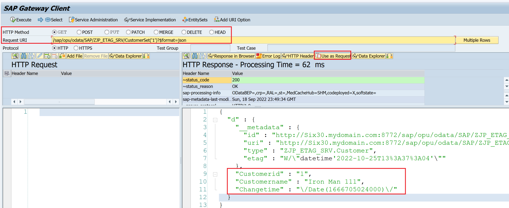

# Building OData Services [16] : Concurrency handling using ETag with timestamp field

In this post, you will learn about Concurrency handling in OData Services using etags and different ways to implement etags in SAP.

## Concurrency
- Concurrency means handling simultaneous update requests for the same resource
- If simultaneous update requests are received, the service should allow only one update at a time and reject other updates

## Ways to manage locks
- Pessimistic – assume that concurrent writes will occur and hence protects it by aggressively locking out resources.
- Optimistic – assumes that the likelihood of a concurrent write is rare and so allows the operation to continue and only check at the final moment while updating the data
 
For Data Concurrency OData recommends implementing Entity tags or Etags. Since OData uses HTTP protocols and is stateless, it can use only optimistic concurrency control of data.

## Various ETAG Mechanisms
| A field-based Etag (typically a timestamp)	 | A full entity-based Etag	| Partial-entity-based Etag |
| :- | :- | :- |
|The entity is a subset of a database table and has a timestamp field that signifies when the record was changed | Etag field with data element HASH160 in the entity and selected as Etag property	| Etag field with data element HASH160 in the entity and selected as Etag property
| In SEGW at the Entity Types, the field has to be selected as Etag Property |	CALCULATE_HASH_FOR_RAW FM can be used to calculate the hash value for the entity	| CALCULATE_HASH_FOR_RAW FM can be used to calculate the hash value for the entity where only specific fields are considered
| This is the simplest method to implement	| This is the most comprehensive method as it considers all fields, so any changes in the backend are also automatically handled. |This method is very useful when GetEntitySet and GetEntity provide different data

Table 1: Various ETAG Mechanisms

Implementing ETAG with a timestamp field
1. Create a custom table using transaction SE11 with a timestamp field.


2. Add data using transaction SE16 or a temporary program.


3. Create a new Project in SEGW and add Entity with the table ZJP_CUSTOMER as a reference.


4. Double-click on the Entity Customer and add the field name ‘Changetime‘ in the ETag field.


5. Generate the project.


6. Implement Create, Update, Read, and Query Operations. We need to test only the Update but we will implement other operations to help with adding the entries and preparing payloads.


Code Reference
```
METHOD customerset_create_entity.

  io_data_provider->read_entry_data(
    IMPORTING es_data = er_entity ).
  MODIFY zjp_customer FROM er_entity.
  IF sy-subrc NE 0.
    CLEAR er_entity.
  ENDIF.

ENDMETHOD.
```

```
METHOD customerset_get_entity.
  DATA : customer TYPE zcl_jp_etag_mpc=>ts_customer.
  io_tech_request_context->get_converted_keys(
    IMPORTING es_key_values = customer ).
  SELECT SINGLE FROM zjp_customer
    FIELDS *
    WHERE customerid = @customer-customerid
    INTO @er_entity.
  IF sy-subrc NE 0.
    RAISE EXCEPTION TYPE /iwbep/cx_mgw_busi_exception.
  ENDIF.
ENDMETHOD.
```

```
METHOD customerset_get_entityset.
  SELECT * FROM zyny_customer
      INTO TABLE @et_entityset.
    IF sy-subrc NE 0.
      RAISE EXCEPTION TYPE /iwbep/cx_mgw_busi_exception.
    ENDIF.
ENDMETHOD.
```

```
METHOD customerset_update_entity.

  DATA lv_short_time_stamp TYPE timestamp.

  io_data_provider->read_entry_data(
    IMPORTING es_data = er_entity ).

  GET TIME STAMP FIELD lv_short_time_stamp.
  er_entity-changetime = lv_short_time_stamp.

  MODIFY zjp_customer FROM er_entity.
  IF sy-subrc NE 0.
    CLEAR er_entity.
  ENDIF.

ENDMETHOD.
```

7. Register the Service


8. Use Gateway Client (/IWFND/GW_CLIENT) to test the service

```
Service URI : /sap/opu/odata/SAP/ZJP_ETAG_SRV/?$format=xml
```


9. Test Update without providing ETag field

Execute a GET request. Use the response as a request and format the payload.

```
/sap/opu/odata/SAP/ZJP_ETAG_SRV/CustomerSet('1')?$format=json
```



Execute a PUT request without Etag

```
URI: 
/sap/opu/odata/SAP/ZJP_ETAG_SRV/CustomerSet('1')

Payload:
{
    "Customerid" : "1",
    "Customername" : "Iron Man 111",
    "Changetime" : "\/Date(1666705024000)\/"
}
```


This results in an error as ETag is active for the entity but it is not provided in the request. We need to provide ETag using a head If-Match as specified in the error text.


Click on Add Header button, and then add Header Name ‘If-Match’ with Value like W/”datetime’2022-10-25T13%3A37%3A04′”.

The template for the value is W/”datetime’YYYY–MM–DDTHH%3AMM%3ASS‘”. You get this as a response header in GET request, so it can be copied from there.


Now, execute the PUT request with ETag.

```
URI: 
/sap/opu/odata/SAP/ZJP_ETAG_SRV/CustomerSet('1')

Payload:
{
    "Customerid" : "1",
    "Customername" : "Iron Man 111",
    "Changetime" : "\/Date(1666705024000)\/"
}
```


This time the change is successful as the ETag has matched.

What if ETag does not match? Use the same request to execute a PUT again and you get the error – Precondition Failed.


The entity is not protected against concurrent updates.

Implementing ETAG with a hash field is covered in the next post of this series.