# Building OData Services [18] : Using POSTMAN for testing OData Services

Postman is an API platform for building and using APIs. Postman simplifies each step of the API lifecycle and streamlines collaboration so you can create better APIs—faster. This is as per the postman itself. This is a familiar tool for middleware developers. For ABAP developers who want to test their OData Services, this is an effective tool that can be used instead of SAP Gateway Testing tool.

In this post, you will learn –

- How to install postman
- How to use postman for testing

# Download POSTMAN app
Download the postman app using the official [download site](https://www.postman.com/downloads/).

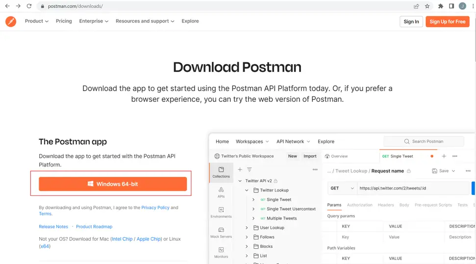

Postman also has a web version, so in case you do not wish to download it, you can try the web version as well after Creating a free account on the site. Look for below link on the download page.

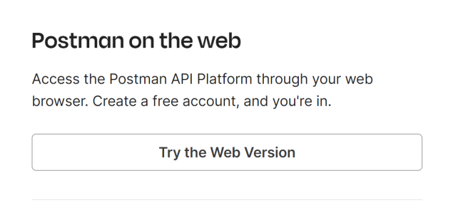

We will look at the installed app. Locate the downloaded setup file, execute and install the app. This is pretty standard and does not need any specific instructions.

Post-installation find the below icon on the desktop and start the app.

## Create a Workspace
At the top left corner you will find below menu options.

Use the option Workspaces and Create Workspace.
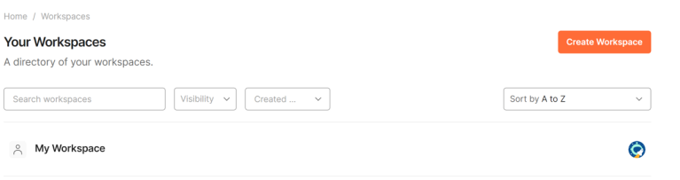

Provide a name for the workspace, some description, and create the workspace.

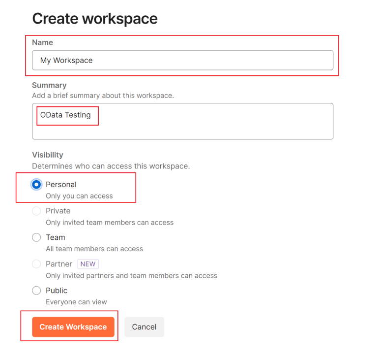

## Maintain hosts file
Open the folder C:\Windows\System32\drivers\etc. You can use the Run command option to open the folder.

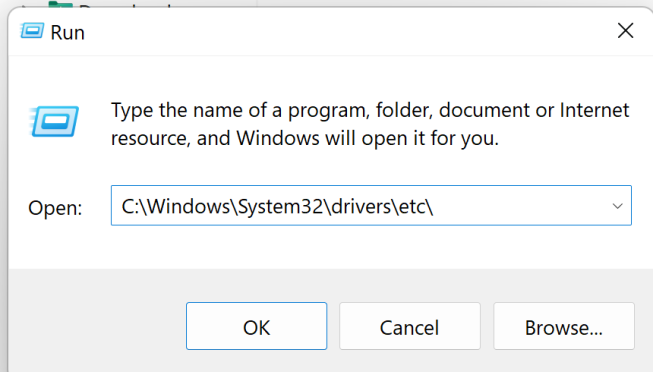

Open the host file in notepad and add an entry with the IP address of the SAP system and the domain name. You will get the IP address from the system entry maintained in SAPGUI and the domain from the response for any request executed in SAP Gateway Client.

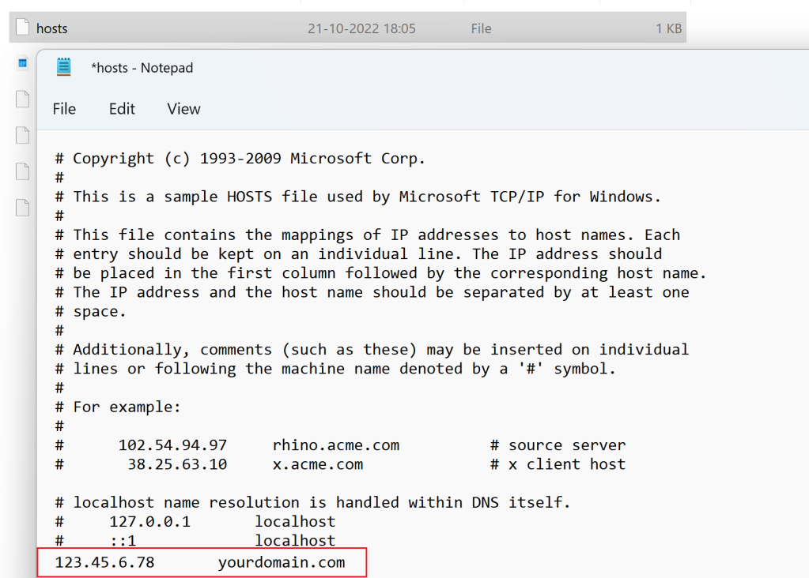

If you do not wish to add the entry, replace the domain name with the IP address in the URI that you use in postman and this should still work.

## Create Request
Click on the + sign beside the Requests option to create a new request.

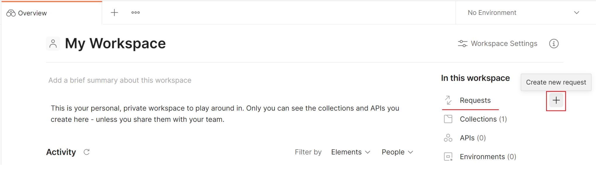

A new empty request will be created.

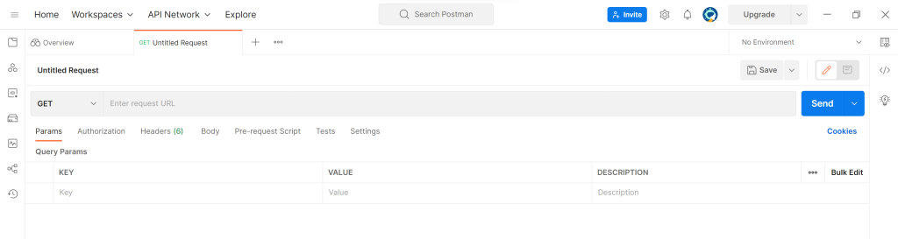

Go to the Authorization tab and select the option – 'Basic Auth'.

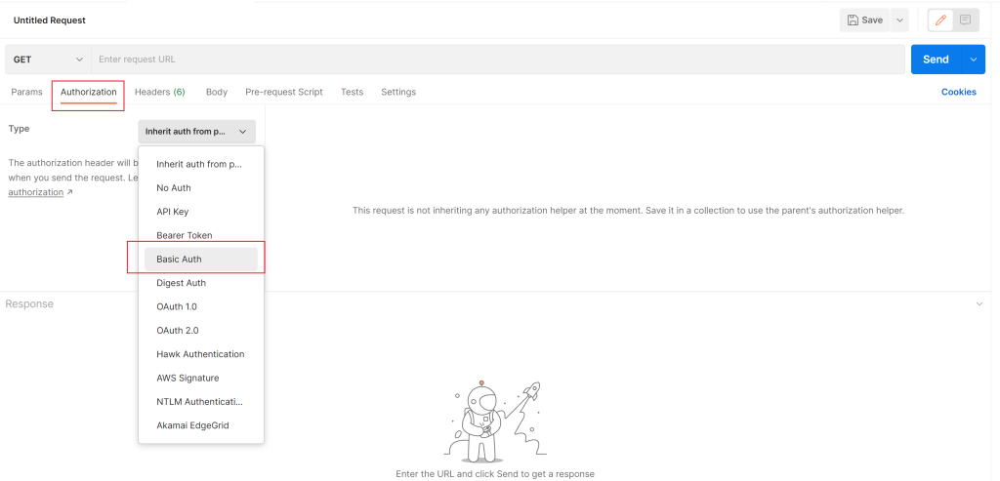

Maintain the username and password.

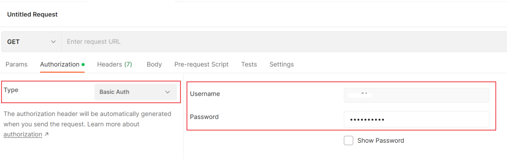

Enter the URI to be tested and ensure the right HTTP method is selected. Click on Send to execute the request.

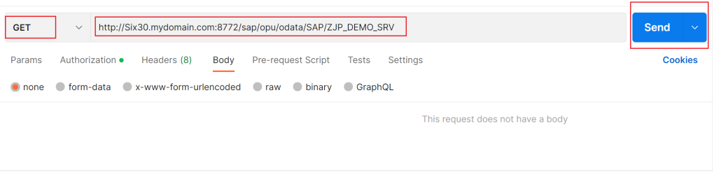

The response can be seen. The status is shown in the top right part of the response section.

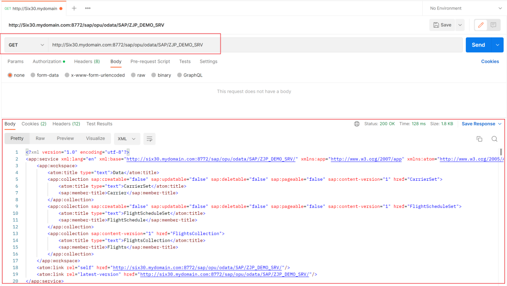

Once this is successful any of the requests can be tested in a similar way.

## QUERY
Multiple records can be seen in the response.

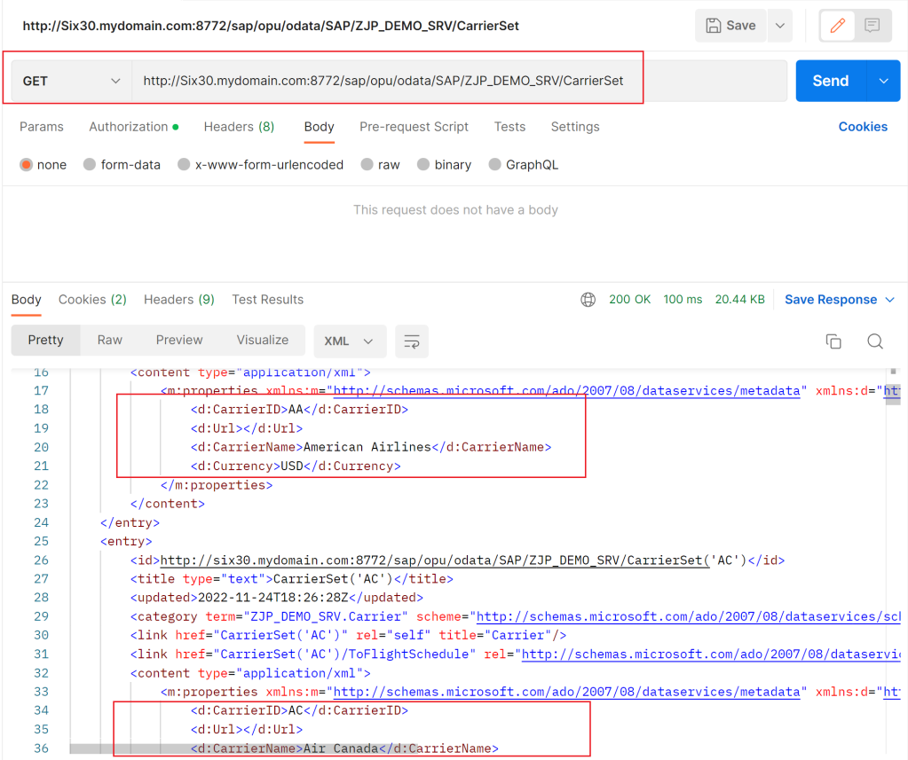

## READ
A single record can be seen in the response.

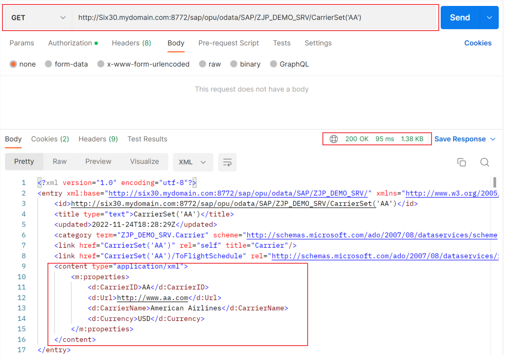

## READ in json format

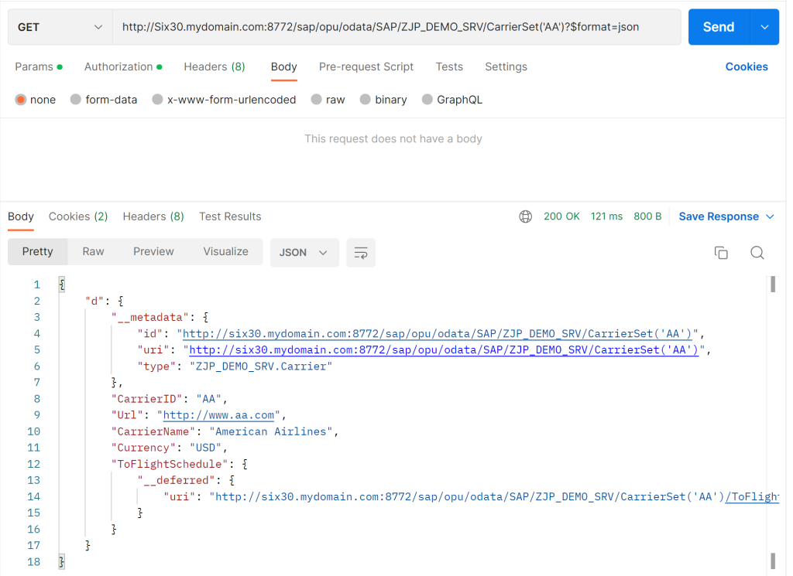

## CREATE / UPDATE / DELETE
When we test any of these operations which update the data in the backend system, there is an additional check that is done by the system to ensure only authorized changes are made to the data. This is done using XCSRF tokens.

The request sent without these tokens will result in failure.

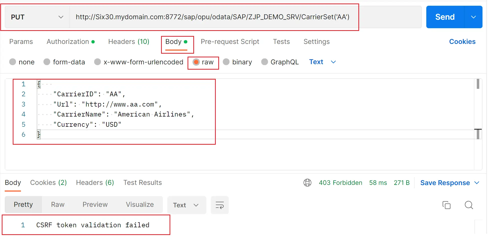

Additionally, for the update operation, we also need to consider ETags if those are implemented in the service. The XCSRF and Etags through postman will be covered in the next post of this series.

## Why use POSTMAN?
1. You do not need to log into the SAP system to test OData Services
2. This tool simulates requests coming from the external system
3. Requests can be saved and used again quite easily

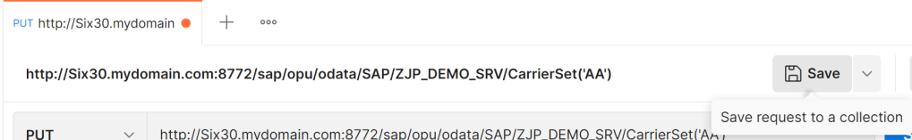

4. Code/scripts can be used. This section also gets updated with every request, so the data can be quickly copied and reused.

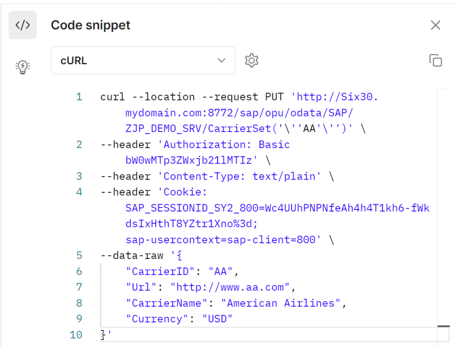

5. The workspace can be shared between team members for better colloboration
6. Request history is stored, which is easier for testing URIs used earlier

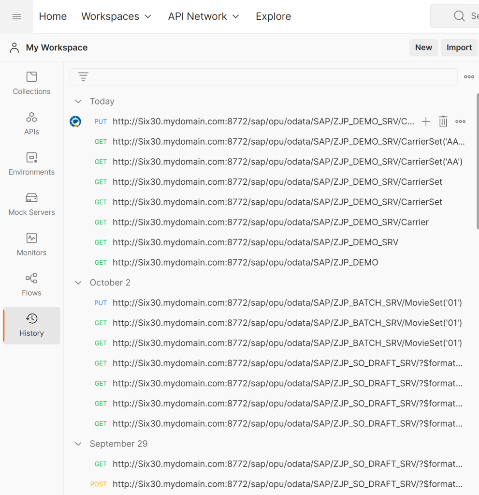