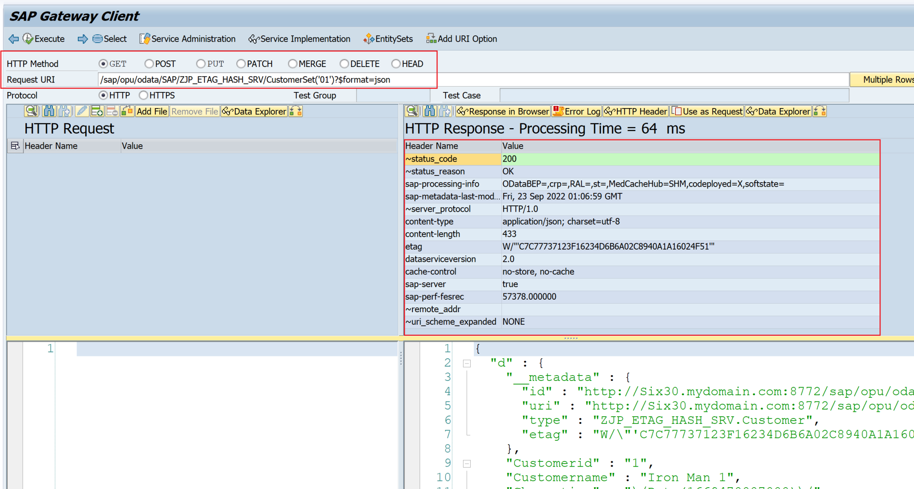
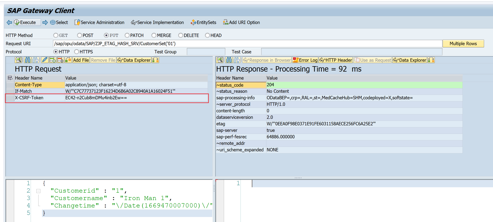
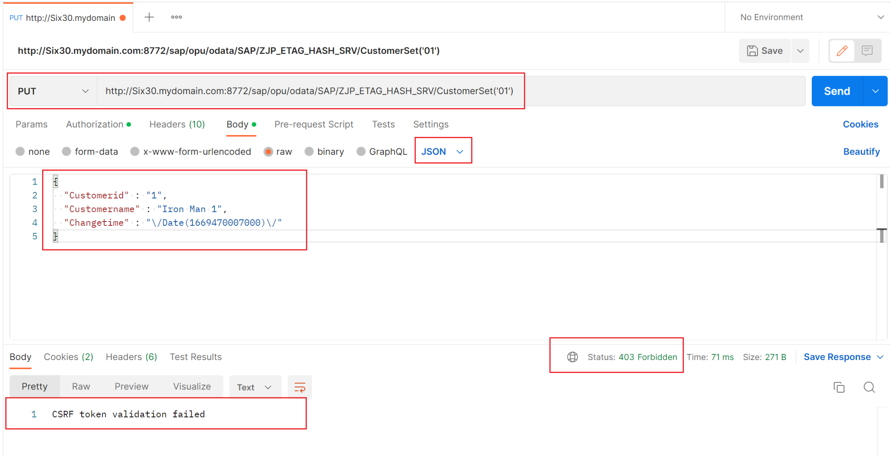
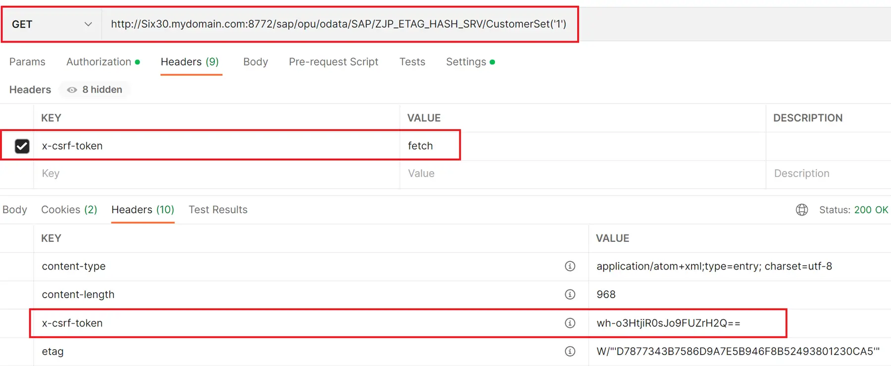
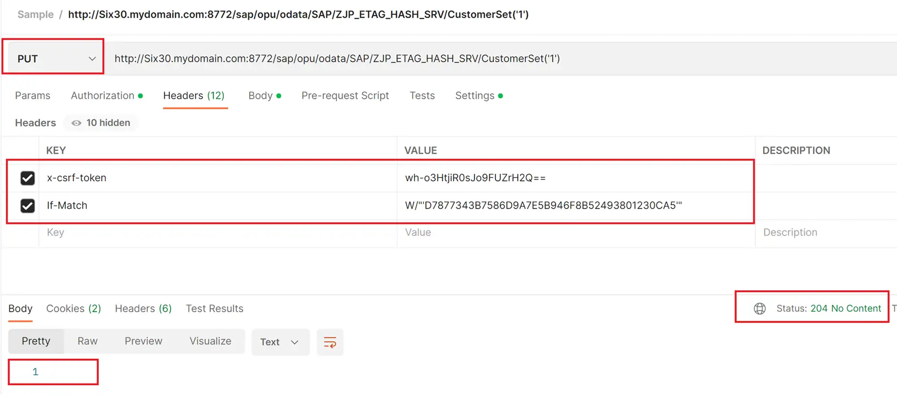

# Building OData Services [19] : X-CSRF Tokens

X-CSRF i.e. Cross-Site Request Forgery tokens help with the security aspect of the OData Services. The SAP OData Framework automatically takes care of this aspect of OData Services i.e. we do not need to code explicitly for this.

In this post, you will learn about

1. How the X-CSRF token works in the SAP Gateway client
2. How the X-CSRF token can be handled from any external tools like POSTMAN

# X-CSRF token in the SAP Gateway client

X-CSRF token is generated when a GET request is processed and the token is sent along with the response in the response header section.

In the case of the SAP Gateway client, the X-CSRF token only appears when any of the POST/PUT/DELETE operations are used. For example, the GET request does not show X-CSRF token in the request or the response headers.

```
HTTP Method : GET
URI : /sap/opu/odata/SAP/ZJP_ETAG_HASH_SRV/CustomerSet('01')?$format=json
```



When a PUT is executed the X-CSRF token gets automatically added to the Request Header itself.

```
HTTP Method : PUT
URI : /sap/opu/odata/SAP/ZJP_ETAG_HASH_SRV/CustomerSet('01')
Payload: 
{
  "Customerid" : "1",
  "Customername" : "Iron Man 1",
  "Changetime" : "\/Date(1669470007000)\/"
}
```

Before the response is executed.


After the request is executed the X-CSRF token appears in the request header. Note that it appears in the request header, which means the SAP Gateway Client adds it before the request is sent for execution.



This means that when we are testing in the Gateway client, we do not need to handle the token explicitly.

## X-CSRF token from Postman

```
HTTP Method : PUT
URI : /sap/opu/odata/SAP/ZJP_ETAG_HASH_SRV/CustomerSet('01')
Payload: 
{
  "Customerid" : "1",
  "Customername" : "Iron Man 1",
  "Changetime" : "\/Date(1669470007000)\/"
}
```



The request ends in error with the error code 403 and with the message 'CSRF token validation failed'.

To tackle this issue, we need to request the X-CSRF token in a GET request.

# GET Request

Note that a new header is added as below.

| Key |	Value |
| :-: | :-: |
|x-csrf-token | fetch |

Request Header



# PUT Request with X-CSRF token

| Key |	Value |
| :-: | :-: |
| x-csrf-token |	value of the token from the earlier GET request |
| If-Match | etag from the GET request |

# Request Header



This time the request gets executed successfully. The If-Match is only required if ETag is implemented in the request.