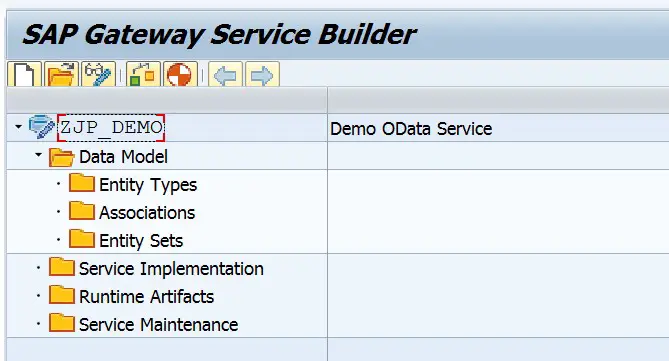
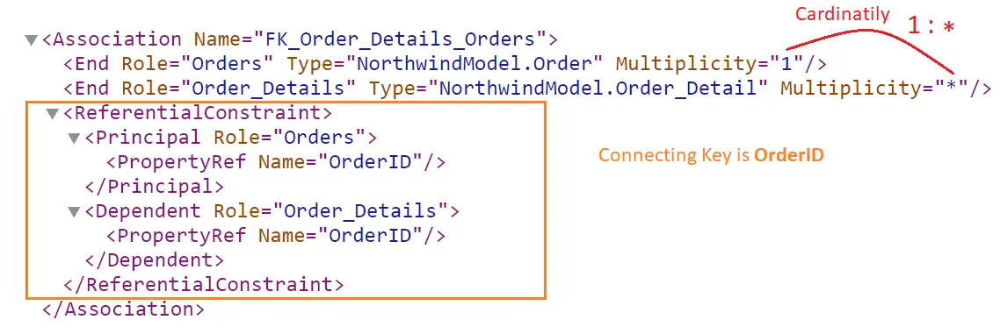
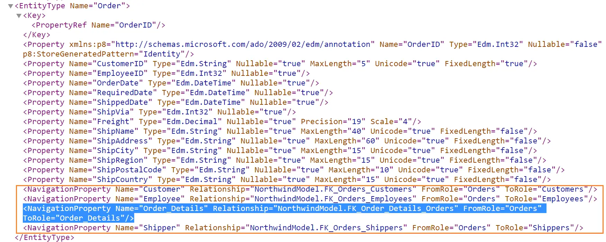
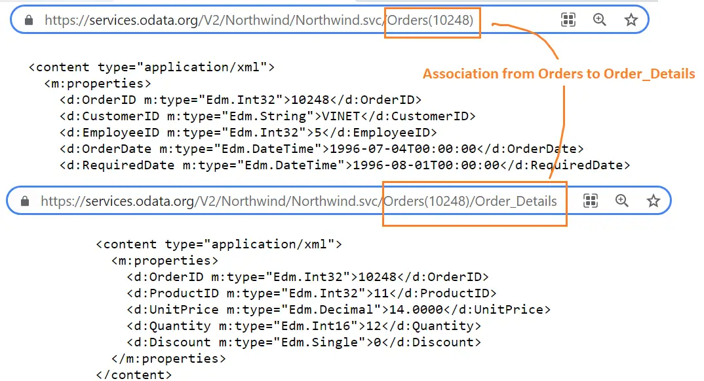

# Building OData Services [2] : Understanding OData Service

In SAP we use transaction SEGW to create OData Project. Let us look at a typical OData project in SAP. This is empty project but we can see the nodes like Data Model, Service Implementation etc. Let us try to understand the node – Data Model in this post.

Data Model is design of Data. How related data is put together in data collection called Entities and how entities relate to each other.

## Entity Types

Entity Type or Entity is like a structure which can hold one data record. In ABAP programming terms, we can compare it to a work area.

Entity type has properties with some of the properties marked as Keys. More details on the properties like Type, Length are also defined.

Example,

## Entity Sets
Entity Sets are collection of same entity types. Order_Detail is an entity – Order_details i.e.collection of multiple order_detail entities is an Entity Set. This is like a table.

Entity Set simply refers to Entity Type.

## Association

Associations are relationships between two entity types. It defines the cardinality/multiplicity between the related entities.

In this example, Orders and Order_Details Entity Sets are Associated where one Order has multiple Order_Details items. The key that connects these two sets is OrderID as specified in Referential Constraint.

When an association is created between Principal Entity to Dependent Entity, a Navigation Property is also created from Principal Entity to Dependent Entity.

In this example, a navigation property is created for Entity Type Orders. This allows us to navigate from Orders to Order_Details Entity Set.

Association / Navigation Properties will help us in getting related data. For example getting Order_Details for a specific Order. You can easily imagine application which shows Orders first and when users selects a order, display the item details.

## Association Sets

Entity Types are collected into Entity Sets. Similarly Association Collection is called Association Sets.

## Navigation Property

It describe the path between the relationship of an entity. It gets created when Association is created. In the URI paths while addressing the association, Navigation Property names are used.

## Complex Types

Complex types comprises of a unique name, and properties but it does not have a unique key, they can only exist as properties of a containing entity or as a temporary values. It is not mandatory to have complex types in all the services.

## CRUD-Q Operation
CRUD-Q is short form for Create, Read, Update, Delete, and Query operations.

The operations are pretty much self explanatory. The only probable question is what is a difference in Read and Query Operation. Read is when you read one Entity and Query is when you get the Entity Set. That is the difference.

| Operation | HTTP Method |	Description | Example |
| :-------: | :---------: | :---------: | :-----: |
| Create | POST | Create an Entity | Create an Order |
| Read | GET | Read an Entity |	Read an Order|
| Update | PUT |	Update an Entity |	Update an Order |
| Delete | DELETE |	Delete an Entity |	Delete an Order |
| Query | GET | 	Query on Entity Set |	Query on order set and get single/multiple orders |

## Function Import

Function Imports are created to perform some function in SAP like releasing a purchase order. Function Imports are only used when CRUD-Q operations can not be used.

For example, through CRUD-Q operation, a customer can be created, read, updated, deleted or queried. But to triggers a credit check for a customer, we can't use any of the CRUD-Q operations – so function import will be created.