# Building OData Services [20] : Media Handling
In this post, you will learn to handle the media file in SAP OData Services created through SEGW.

Media handling refers to managing media files such as

1. Image
2. Audio
3. Video
4. PDF

The same concept can be used to handle Excel, and DAT files as well, however, the term media refers to the ones mentioned above primarily.

In this post, we will consider Image files for demonstration.

# Create and Generate a Project in SEGW

1. Create a table to store image data.

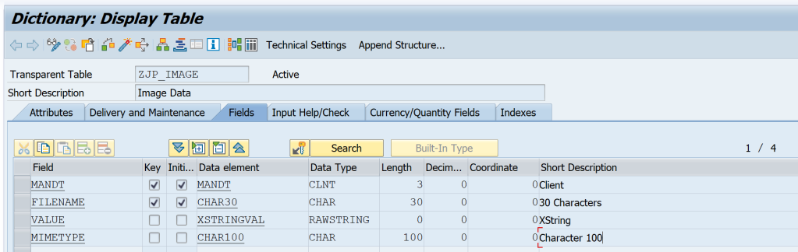

2. Create a project ZJP_MH_IMAGE

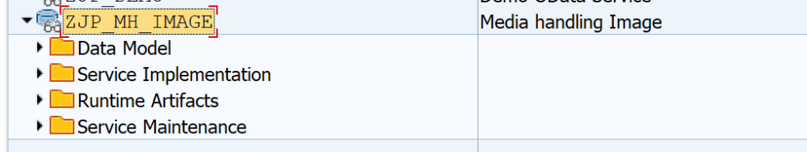

3. Import the DDIC table ZJP_IMAGE to create an entity

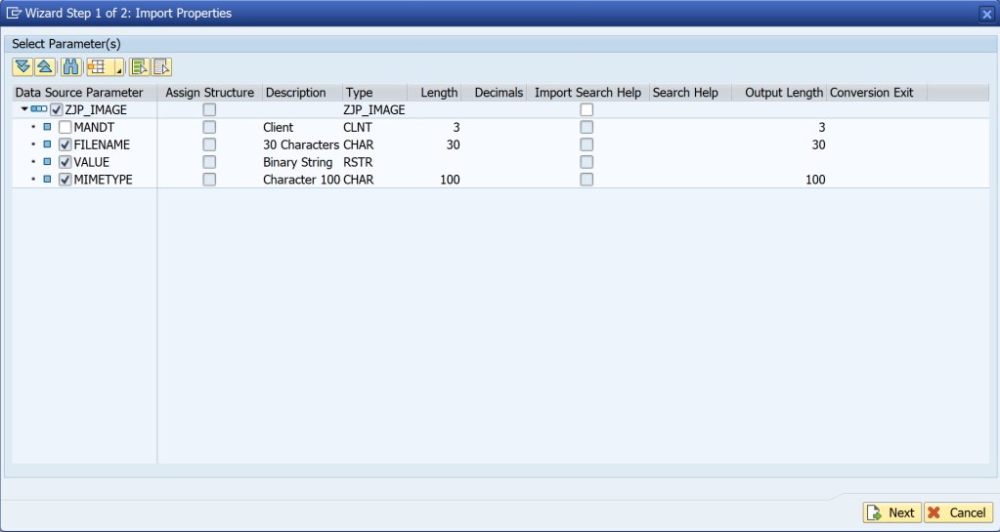

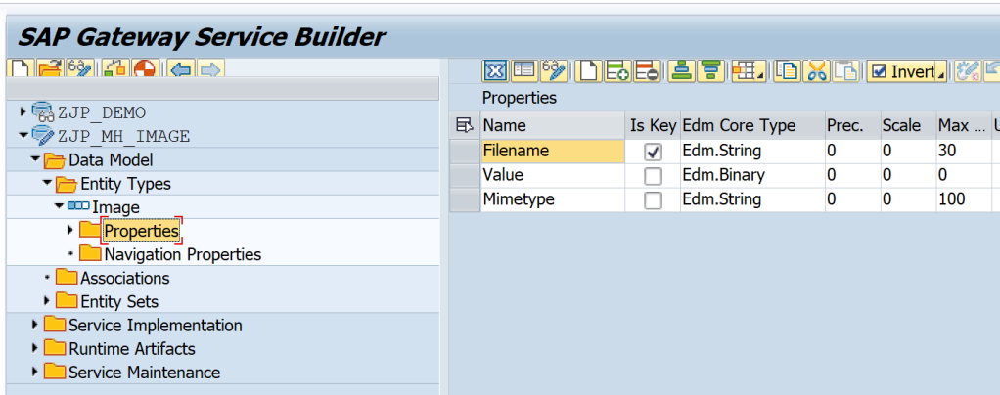

4. Check the Media checkbox in the Entity Type settings.

This is an important step as this checkbox tells the OData framework that this Entity Type contains media and it enables special methods from the runtime classes that are used for handling the medial.

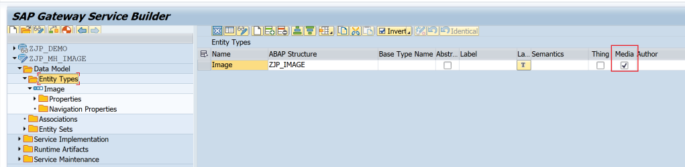

5. Generate the project and Register the service.

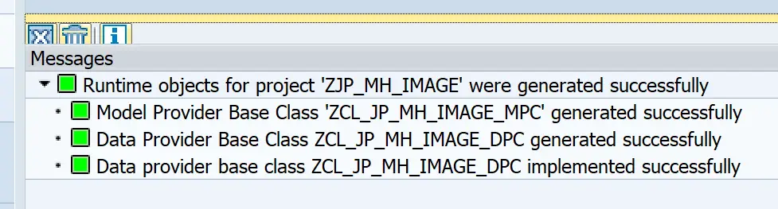
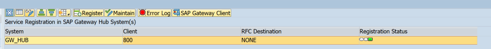

# Implement Media Handling Methods
Once the entity is marked as media, the below methods can be implemented to handle the media part of the entity.

- /IWBEP/IF_MGW_APPL_SRV_RUNTIME~GET_STREAM
- /IWBEP/IF_MGW_APPL_SRV_RUNTIME~UPDATE_STREAM
- /IWBEP/IF_MGW_APPL_SRV_RUNTIME~CREATE_STREAM
- /IWBEP/IF_MGW_APPL_SRV_RUNTIME~DELETE_STREAM

It is possible to also implement the usual CRUD-Q methods such as those below, but these are not mandatory unless required by the application.

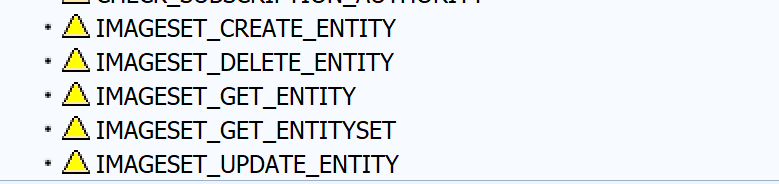

Let us observe the method signature and how the parameters as used in the code for the method CREATE_STREAM.

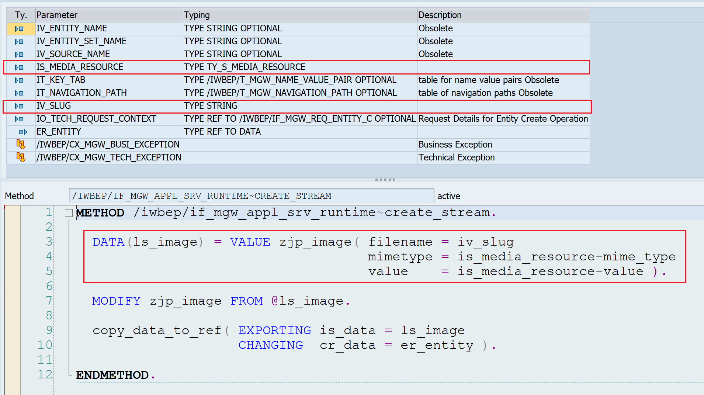

| Parameter |	Information in the parameter |
| :-: | :-: |
|IS_MEDIA_RESOURCE | MIME_TYPE – Type of the file ,VALUE – Content of the file |
| IV_SLUG |	File name| 

Table 20.1 Method parameters

As it can be observed, we get the file name, file type, and file content from these parameters and we do not need to access the IO_TECH_REQUEST_CONTEXT for this information.

## Code Reference for all methods

```
METHOD /iwbep/if_mgw_appl_srv_runtime~create_stream.

  DATA(ls_image) = VALUE zjp_image( filename = iv_slug
                                    mimetype = is_media_resource-mime_type
                                    value    = is_media_resource-value ).

  MODIFY zjp_image FROM @ls_image.

  copy_data_to_ref( EXPORTING is_data = ls_image
                    CHANGING  cr_data = er_entity ).

ENDMETHOD.
```

The Update method gets the key information from the io_tech_request_context and file type/content from is_media

```
METHOD /iwbep/if_mgw_appl_srv_runtime~update_stream.

  DATA(lt_keys) = io_tech_request_context->get_keys( ).
  DATA(lv_filename) = VALUE #( lt_keys[ name = 'FILENAME' ]-value OPTIONAL ).

  DATA(ls_image) = VALUE zjp_image( filename = lv_filename
                                    mimetype = is_media_resource-mime_type
                                    value    = is_media_resource-value ).

  MODIFY zjp_image FROM ls_image.

ENDMETHOD.
```

The Delete method does not have a slug or content as only the entity key fields are required to delete the data. The keys are available in io_tech_request_context.

```
METHOD /iwbep/if_mgw_appl_srv_runtime~delete_stream.

  DATA lv_filename TYPE zjp_image-filename.
  DATA(lt_keys) = io_tech_request_context->get_keys( ).
  lv_filename = lt_keys[ name = 'FILENAME' ]-value.

  DELETE FROM zjp_image WHERE filename = lv_filename.

ENDMETHOD.
```
The Get method needs the key information to fetch the data which is available in io_tech_request_context. Once the data is fetched, it needs to be transferred to ER_STREAM. Here, ER_STREAM is bind with data which is of same type as is_media from Create/Update methods.

```
METHOD /iwbep/if_mgw_appl_srv_runtime~get_stream.

  DATA : ls_media TYPE ty_s_media_resource.
  DATA(lt_keys) = io_tech_request_context->get_keys( ).
  DATA(lv_filename) = VALUE #( lt_keys[ name = 'FILENAME' ]-value OPTIONAL ).

  SELECT SINGLE FROM zjp_image
    FIELDS value, mimetype
    WHERE filename = @lv_filename
    INTO ( @ls_media-value, @ls_media-mime_type ).
  IF sy-subrc EQ 0.
    copy_data_to_ref( EXPORTING is_data = ls_media
                      CHANGING  cr_data = er_stream ).
  ENDIF.

ENDMETHOD.
```

## URIs for media handling requests

Start Gateway Client transaction.

### Create
```
HTTP Method : POST
URI : /sap/opu/odata/SAP/ZJP_MH_IMAGE_SRV/ImageSet
```

Click on Add File and select any image file you want to test with.

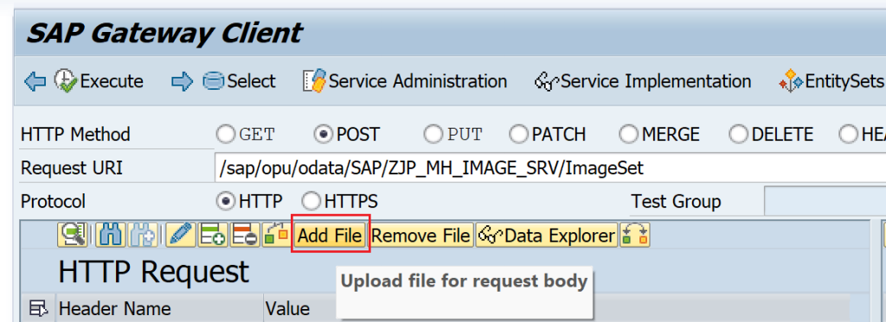

The File is uploaded and a header with Content-Type is added.

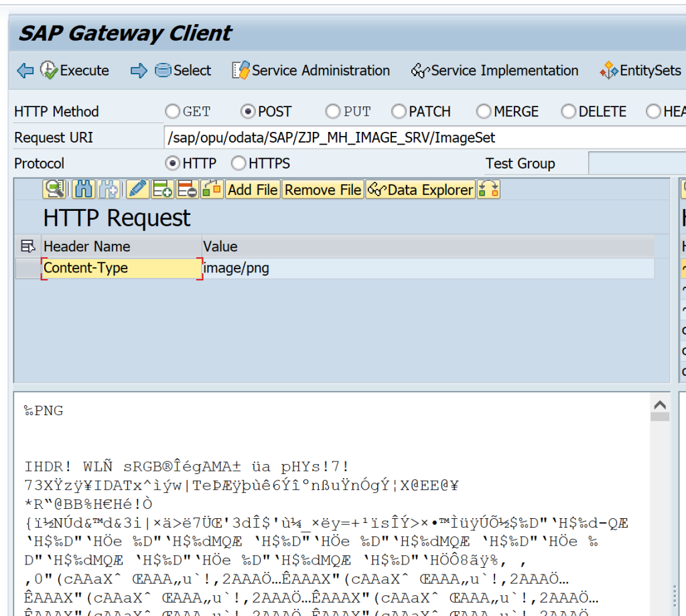

Click on Add Header button to add one more header.

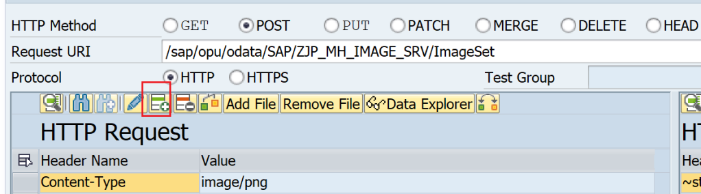

Add a header with Name SLUG and Value as the file name.

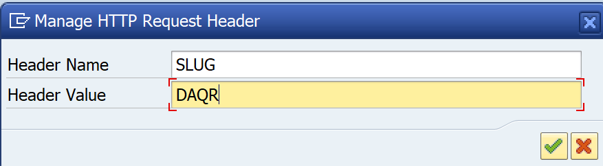

The quest should look like the below image. Execute.

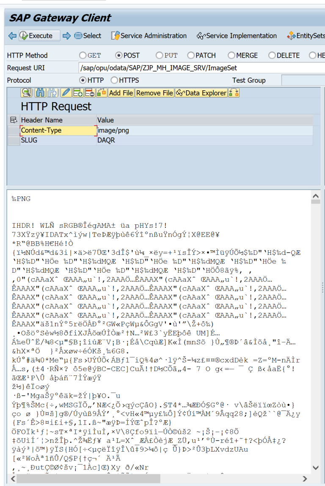

Response

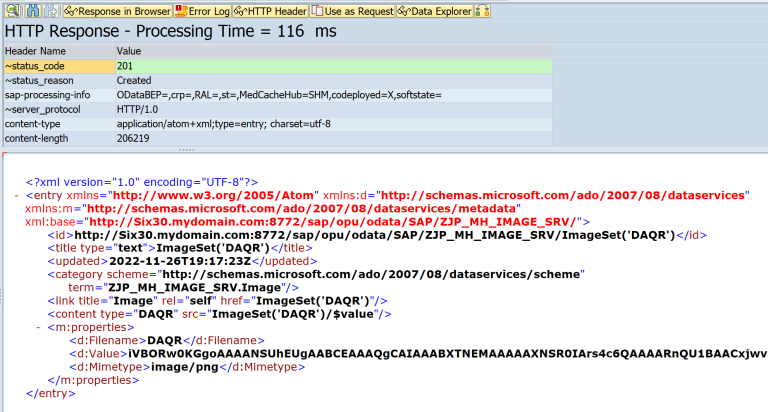

Table Entry

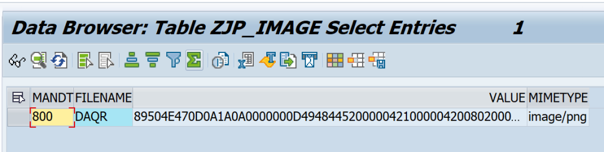

### READ
The uploaded Image can now be read using the below request. Note the new keyword in URI i.e. $value.

```
HTTP Method : GET
URI: /sap/opu/odata/SAP/ZJP_MH_IMAGE_SRV/ImageSet('DAQR')/$value
```

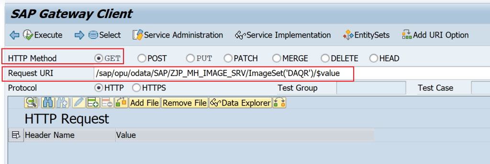

Response

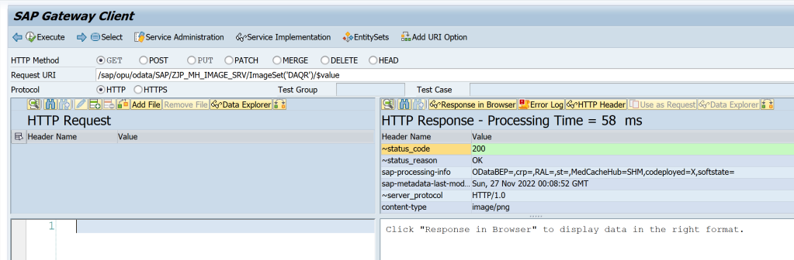

Same request from Postman

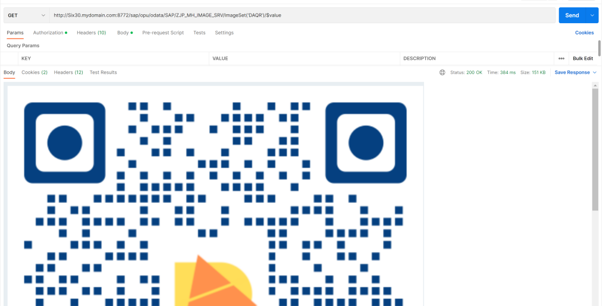

### UPDATE
```
HTTP Method : PUT
URI: /sap/opu/odata/SAP/ZJP_MH_IMAGE_SRV/ImageSet('DAQR')/$value
```

In the payload upload a new file, similar to create mode.

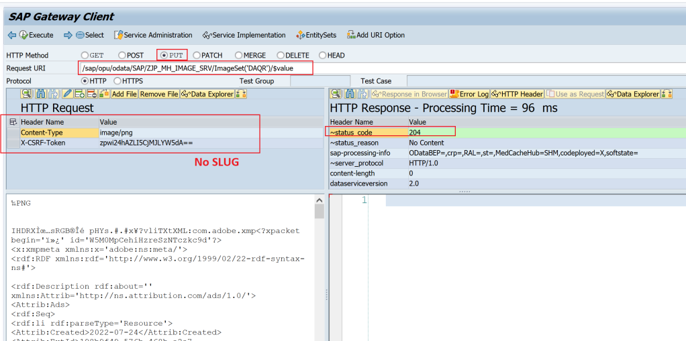

### DELETE

```
HTTP Method : DELETE
URI: /sap/opu/odata/SAP/ZJP_MH_IMAGE_SRV/ImageSet('DAQR')/$value
```

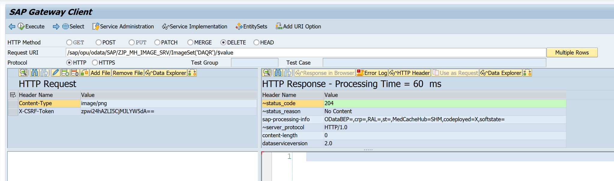

Entry is deleted from the table.

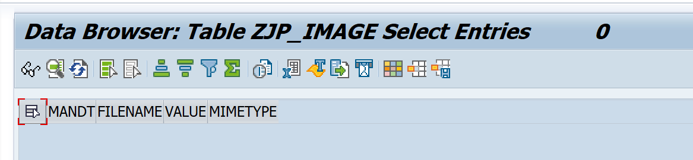

This method can also be used for files like Excel, DATA, CSV, and scenarios like sending a smartform as PDF through OData service. All you need to do is convert the data in XSTRING format and set a valid document type.

Some comment types are

| MIME Type |	File Type |
| :-: | :-: |
|image/jpeg; image/png | Image |
|application/vnd.openxmlformats-officedocument.spreadsheetml.sheet |	Excel Sheet |
|application/pdf | PDF File |
|audio/mpeg | Audio File |
|application/zip | Zip File |
|text/plain, text/csv, and text/html | Text files |
|video/mp4 | Video File |

Table 20.2 Mime and file types