# Building OData Services [21] : Batch Management ($batch)

In this post you will learn about sending a batch request to the OData service, constructing payloads for batch management, and handling batch data in the implementation class.

# What is Batch Management
- Handling multiple operations in one request
- Multiple operations of the same type or multiple operations of different types can be grouped in a batch
- Operations within the batch can be executed one by one or the execution can be deferred and handled at end of the batch together 

## Batch Request
- A batch request combines multiple operations of the same or different types
- The type of request is an HTTP POST request
- The URI has an indicator in form of $batch addition
- The payload contains the URIs for actual request and body content as well


## Batch Response
- The response of all operations in the same sequence as that of the request
- The response comprises of Content-Type header specifying a content type of multipart/mixed and a batch boundary specification
- If the set of HTTP request header information of a batch request is valid, the HTTP response status code is 202 (Accepted).

## SWGW Project Details

As our focus is on testing the batch, to keep the payload content minimum, create a table with very few fields.

1. Create a table ZJP_BATCH

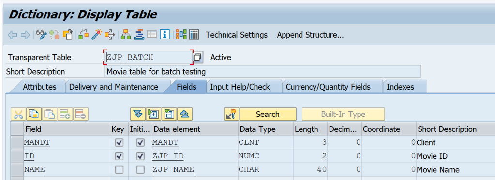

2. Create a project ZJP_BATCH and add an entity with the table reference


3. Generate the project and register the service.


4. The code used to implement the methods for CRUD-Q operations is as below. The code can be optimized but this would still work for the batch functionality demonstration.

```
METHOD movieset_create_entity.

  io_data_provider->read_entry_data( IMPORTING es_data = er_entity ).
  INSERT zjp_batch FROM er_entity.
  IF sy-subrc NE 0.
    RAISE EXCEPTION TYPE /iwbep/cx_mgw_busi_exception.
  ENDIF.

ENDMETHOD.
```
```
METHOD movieset_delete_entity.

  DELETE FROM zjp_batch WHERE id = @( it_key_tab[ name = 'Id' ]-value ).

ENDMETHOD.
```
```
METHOD movieset_get_entity.

  DATA : ls_keys TYPE zcl_batch_mpc=>ts_movie.

  io_tech_request_context->get_converted_keys(
    IMPORTING
      es_key_values = ls_keys ).

  SELECT SINGLE * FROM zjp_batch
    WHERE id = @ls_keys-id
    INTO @er_entity.
  IF sy-subrc NE 0.
    RAISE EXCEPTION TYPE /iwbep/cx_mgw_busi_exception.
  ENDIF.

ENDMETHOD.
```
```
METHOD movieset_get_entityset.

  SELECT * FROM zjp_batch
    INTO TABLE @et_entityset.
  IF sy-subrc NE 0.
    RAISE EXCEPTION TYPE /iwbep/cx_mgw_busi_exception.
  ENDIF.

ENDMETHOD.
```
```
METHOD movieset_update_entity.

  io_data_provider->read_entry_data( IMPORTING es_data = er_entity ).
  UPDATE zjp_batch FROM er_entity.
  IF sy-subrc NE 0.
    RAISE EXCEPTION TYPE /iwbep/cx_mgw_busi_exception.
  ENDIF.

ENDMETHOD.
```

## Testing batch operations

Add $batch using the button Add URI Option


This way a sample payload is also loaded in HTTP request section.

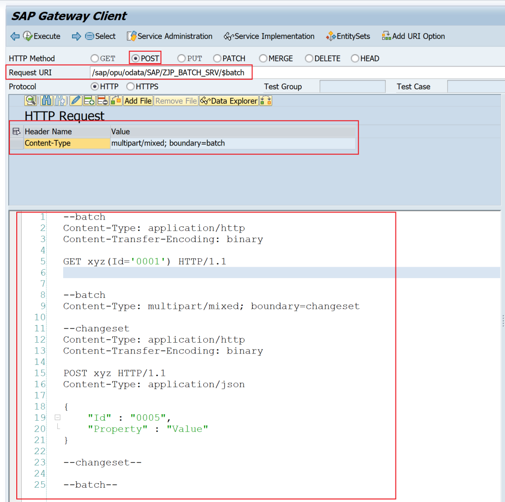

## Important Points to note

1. The HTTP Method is always POST
2. URI has an addition $batch.
3. There is no entity name in URI
4. Content-Type is 'multipart/mixed; boundary=batch'
5. The name of the boundary should be the same in the header and the payload

Let us test simple batches first. The data uploaded to table is as below.

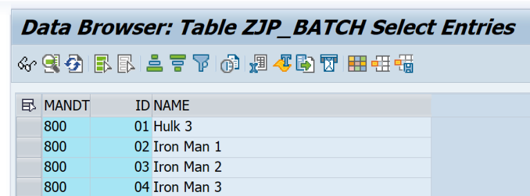

## Testing batch with single GET operation
Why would you create a batch for single operation? Just to understand the payload syntax.

```
--batch
Content-Type: application/http
Content-Transfer-Encoding: binary

GET MovieSet(Id='01') HTTP/1.1


--batch--
```

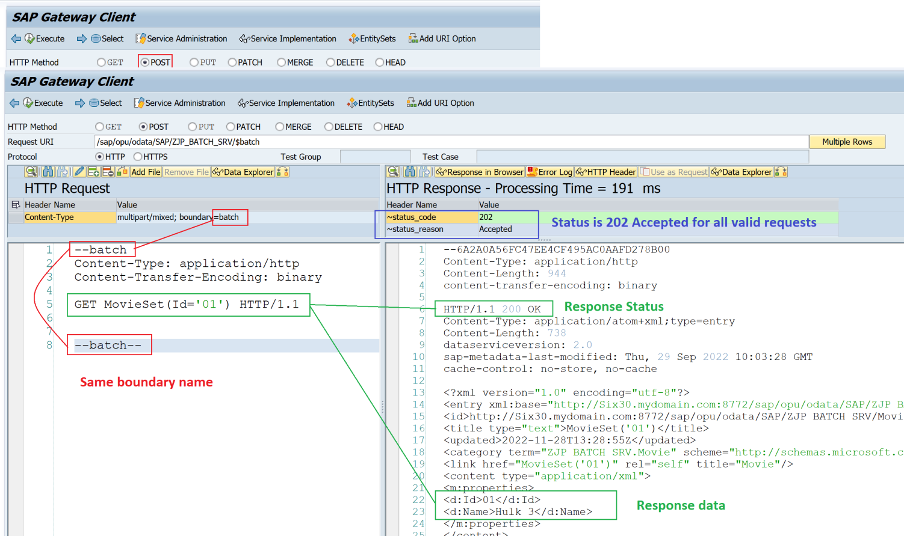

## Important notes:

| Payload Elements | Description |
| :-: | :- |
| -–batch	| This is same as the boundary name mentioned in the overall batch request header, If the boundary name was xyz, the payload would have started with –xyz |
| -–batch–- |	This is end of the batch request payload |
| Line spaces |	It is mandatory to have, 1. One blank line after the request header and the request URI within the payload. 2. Two blank lines between the request and the boundary end|

The boundary also gets converted to a hex string in the response.


## Testing batch with multiple GET operations
This time, let us test with 2 GET operations in the batch.

```
--batch
Content-Type: application/http
Content-Transfer-Encoding: binary

GET Movie(Id='01') HTTP/1.1


--batch
Content-Type: application/http
Content-Transfer-Encoding: binary

GET Movie(Id='02') HTTP/1.1


--batch--
```

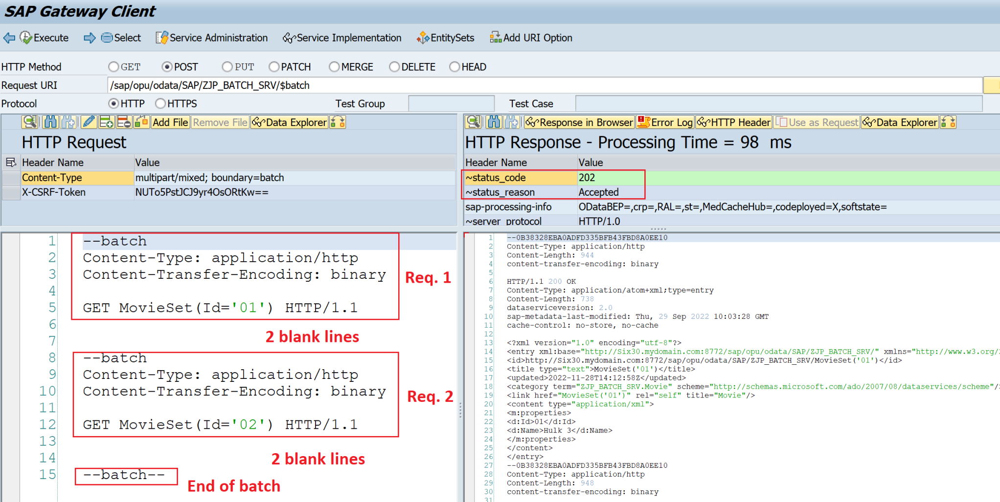

The response looks like below.

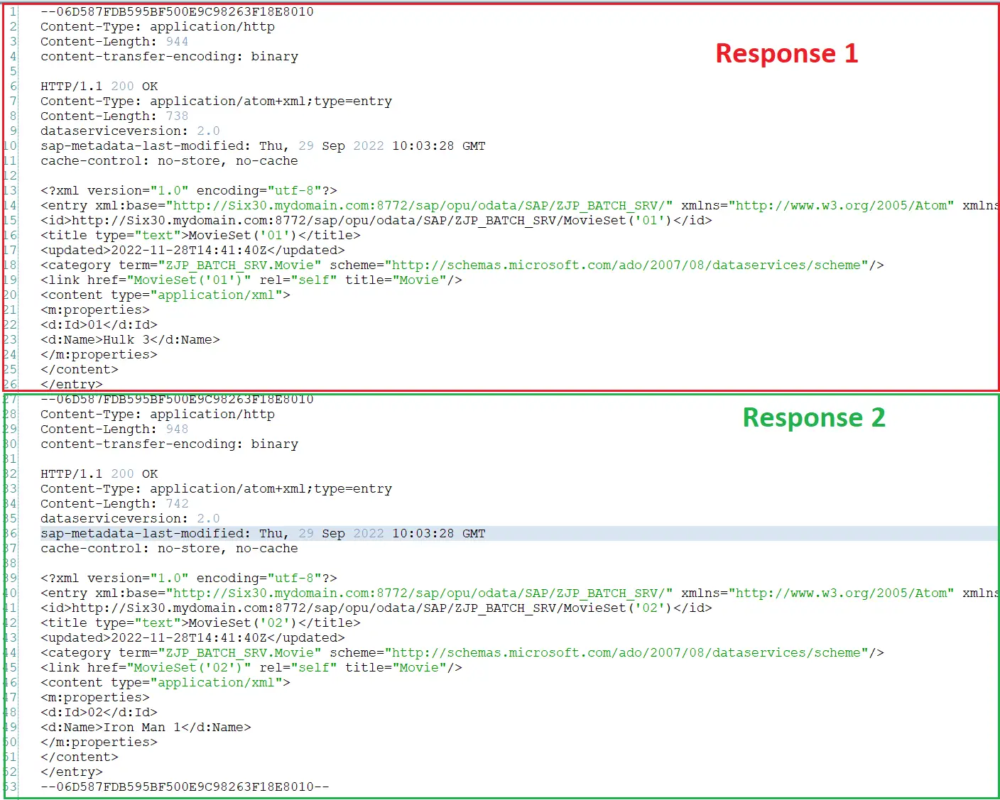

## Testing batch with a change operations
The change operation in itself is a multi-part i.e. it has a URI and a Payload.

## An example with a single changeset looks like below
```
--batch
Content-Type: multipart/mixed; boundary=changeset

--changeset
Content-Type: application/http
Content-Transfer-Encoding: binary

POST MovieSet HTTP/1.1
Content-Type: application/json

{
    "Id" : "05",
    "Name" : "Dr. Strange"
}

--changeset--

--batch--
```
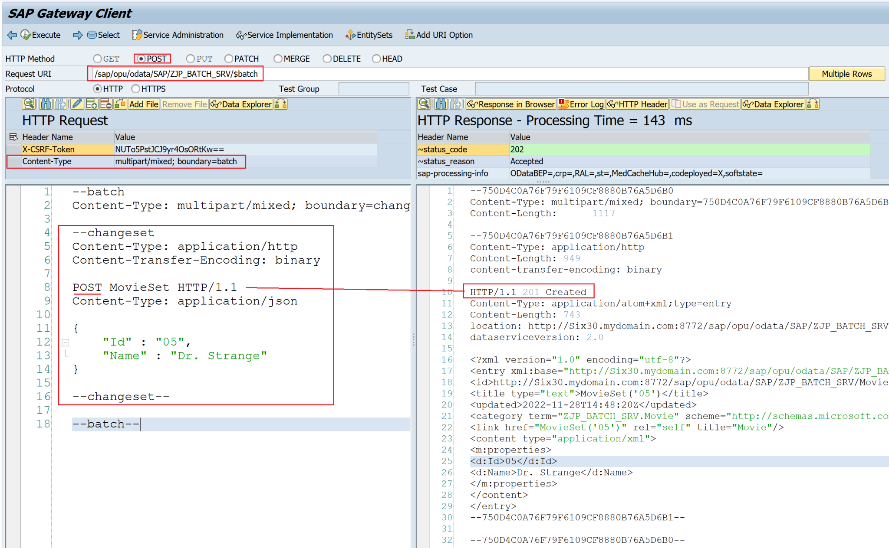

## An example with multiple changesets
In this example, a create and update operation is added in one batch.

```
--batch
Content-Type: multipart/mixed; boundary=changeset

--changeset
Content-Type: application/http
Content-Transfer-Encoding: binary

POST MovieSet HTTP/1.1
Content-Type: application/json

{
    "Id" : "18",
    "Name" : "Dr Strange"
}

--changeset--

--batch
Content-Type: multipart/mixed; boundary=changeset

--changeset
Content-Type: application/http
Content-Transfer-Encoding: binary

PUT MovieSet('18') HTTP/1.1
Content-Type: application/json

{
    "Id" : "18",
    "Name" : "Doctor Strange"
}

--changeset--

--batch--
```

The table entry is created and updated.


This way multiple requests can be grouped into a batch. However, the operations are getting executed one by one by their own methods. What if we want to pass multiple create operations in a batch and create them together? In that case we need to defer the operations and execute them together.

## Batch Management with Deferred Changes
Redefine methods in DPC_EXT class.

| Method Name | Purpose |
| :-: | :-: |
| /IWBEP/IF_MGW_APPL_SRV_RUNTIME~CHANGESET_BEGIN | Set deferred mode as true. This indicates that operations are to be executed together |
| /IWBEP/IF_MGW_APPL_SRV_RUNTIME~CHANGESET_PROCESS | Actual processing logic |
| /IWBEP/IF_MGW_APPL_SRV_RUNTIME~CHANGE SET_END	 | Commit Work to save the changes |

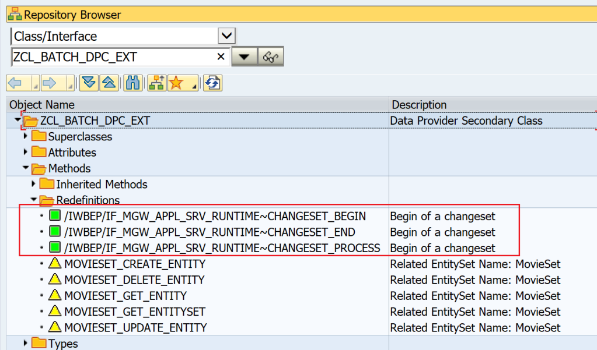

### Code Reference

```
METHOD /iwbep/if_mgw_appl_srv_runtime~changeset_begin.

  cv_defer_mode = abap_true.

ENDMETHOD.
```
```
METHOD /iwbep/if_mgw_appl_srv_runtime~changeset_end.

  COMMIT WORK.

ENDMETHOD.
```
```
METHOD /iwbep/if_mgw_appl_srv_runtime~changeset_process.

  DATA : ls_data TYPE zcl_batch_mpc=>ts_movie,
         ls_resp LIKE LINE OF ct_changeset_response.

  LOOP AT it_changeset_request INTO DATA(ls_req).

    ls_req-entry_provider->read_entry_data( IMPORTING es_data = ls_data ).
    CASE ls_req-operation_type.
      WHEN 'CE'.
        INSERT zjp_batch FROM ls_data.
        IF sy-subrc EQ 0.
          copy_data_to_ref( EXPORTING is_data = ls_data
                            CHANGING  cr_data = ls_resp-entity_data ).
        ENDIF.
      WHEN 'UE'.
        UPDATE zjp_batch FROM ls_data.
        IF sy-subrc EQ 0.
          copy_data_to_ref( EXPORTING is_data = ls_data
                            CHANGING  cr_data = ls_resp-entity_data ).
        ENDIF.
      WHEN OTHERS.
    ENDCASE.

    ls_resp-operation_no = ls_req-operation_no.
    APPEND ls_resp TO ct_changeset_response.
    CLEAR ls_resp.

  ENDLOOP.

ENDMETHOD.
```

## CHANGESET_PROCESS method
### Signature
The operation data is sent in importing parameter IT_CHANGESET_REQUEST and the response needs to be populated in changing parameter CT_CHANGESET_RESPONSE.


```
"Important Code Blocks

LOOP AT it_changeset_request INTO DATA(ls_req). "--> Check each request

ls_req-entry_provider->read_entry_data( IMPORTING es_data = ls_data ). "--> Read request data

CASE ls_req-operation_type. "--> Check the operation type and make decision on what to do

copy_data_to_ref( EXPORTING is_data = ls_data
                  CHANGING  cr_data = ls_resp-entity_data ). "--> Set the response 

ls_resp-operation_no = ls_req-operation_no. "--> Move the operation number from request to response 
```

### Operation Types

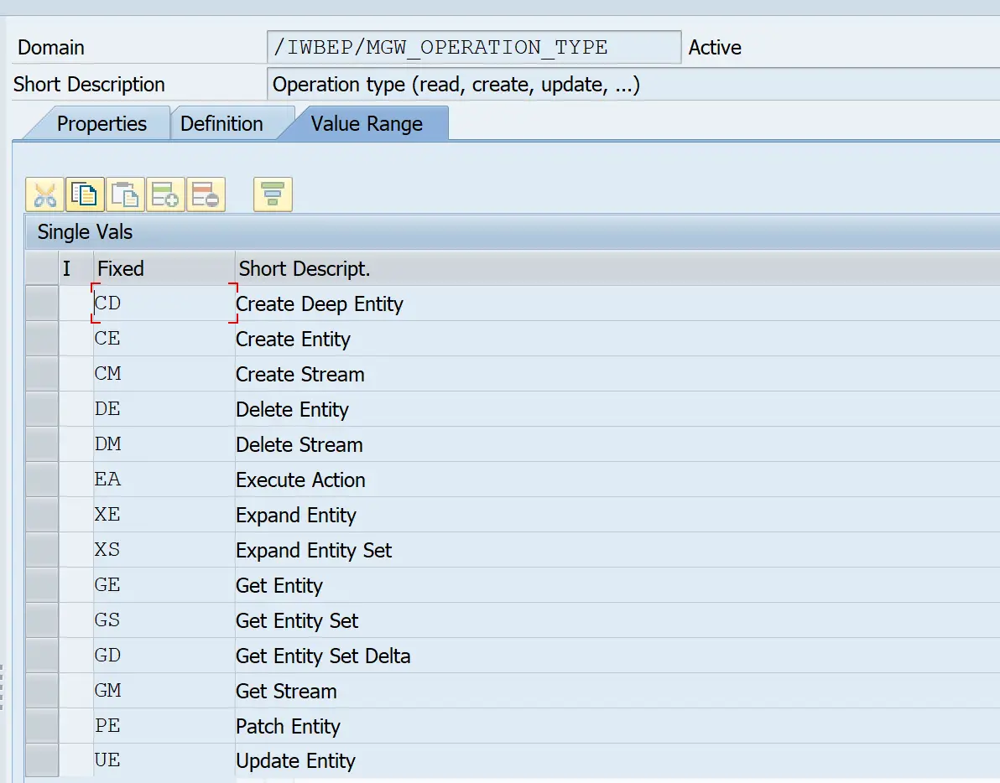

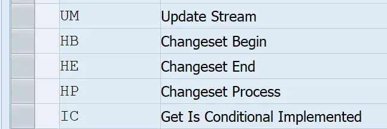

## IT_CHANGESET_REQUEST for multiple requests.

For sending multiple requests into a single call that can be processed together, the operations need to be included in single batch. Observe below that between the batch start i.e. –batch and batch end i.e. –batch–, there are two operations included in –changeset.

```
--batch
Content-Type: multipart/mixed; boundary=changeset

--changeset
Content-Type: application/http
Content-Transfer-Encoding: binary

POST MovieSet HTTP/1.1
Content-Type: application/json

{
    "Id" : "21",
    "Name" : "Movie 21"
}


--changeset
Content-Type: application/http
Content-Transfer-Encoding: binary

POST MovieSet HTTP/1.1
Content-Type: application/json

{
    "Id" : "22",
    "Name" : "Movie 22"
}

--changeset--

--batch--
```


The response shows the response for both the requests.

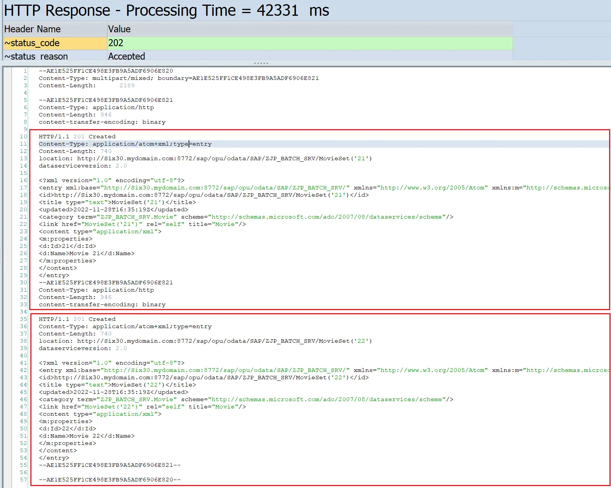

This is a flexible way to implement the operations in batch mode and can be implemented as per the application requirements.