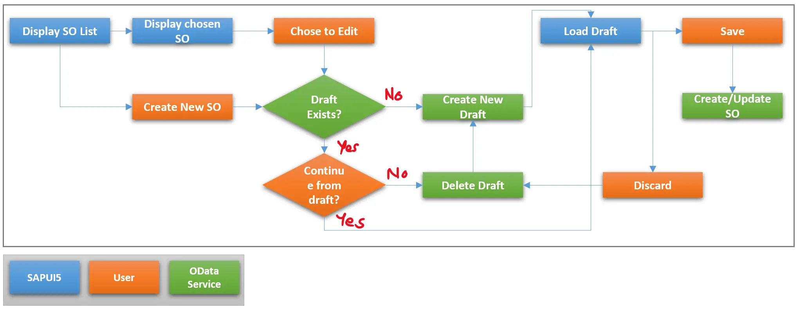

# Building OData Services [22] : Draft Management

Draft Management is not implicit in OData Services built using SEGW. In RESTful Application Programming or RAP Model, the framework manages the draft with only a few lines of additional code in behavior definition.

In this post, you will learn about handling the draft functionalities using SEGW.

## What is a Draft?
A draft is the state of the business object when its data is not persisted in the actual tables but is stored in some temporary tables which can be quickly retrieved to continue working (from the place left) in case the work is left in the middle due to some reason.

# Draft Management Process-Flow


Consider an application with Sales Order (SO) Header and Item data. The data can be displayed and updated or new SOs can be created.

Drafts play no role in Display functionality. It is when any user either enters into an update mode or a create mode drafts are involved.

## A draft can be

- Created when the user enters into update mode – all actual table data is copied for temporary tables/draft tables and then data is presented on the screen for the user to update
- Created when the user enters into create mode – table entries with draft keys are created in draft tables
- Updated when the user enters data in any field, changes a tab on the screen, on any clicks, the press of a button, or at a set time depending on the requirement of the application. Any one of the trigger points or a combination of these trigger points can be used to implement this part.
- Deleted when a draft is discarded by the user, or when the data is saved to actual tables

# Implement Draft Management
Create Draft tables to store the data temporarily. In this case, draft tables will be required for Header and Item data.

# Tables for draft data


## Entity types


In addition to this one more entity with just a text field is defined to be used as the return type.


## Association


## Function Imports

3 function imports, CreateDraft, DeleteDraft, and SaveOrder are created to achieve the functionality. All use the Return Type as the entity type Return.


## Code Reference from ZCL_JP_SO_DRAFT_DPC_EXT
The code is implemented considering the below process flow.



### READ and QUERY operations
These operations usually will refer to the actual tables / standard BAPI etc., to get the data.

```
METHOD soheaderset_get_entity.

  DATA : lv_vbeln TYPE vbak-vbeln.

  DATA(lt_keys) = io_tech_request_context->get_keys( ).
  lv_vbeln = lt_keys[ name = 'VBELN' ]-value.
  lv_vbeln = |{ lv_vbeln ALPHA = IN }|.
  SELECT SINGLE FROM vbak
    FIELDS vbeln, erdat, erzet, ernam, netwr,
           waerk, vkorg, vtweg, spart, kunnr
    WHERE vbeln = @lv_vbeln
    INTO @er_entity.

ENDMETHOD.
```
```
METHOD soheaderset_get_entityset.

  SELECT FROM vbak
    FIELDS vbeln, erdat, erzet, ernam, netwr,
           waerk, vkorg, vtweg, spart, kunnr
    INTO TABLE @et_entityset
    UP TO 20 ROWS.

ENDMETHOD.
```
```
METHOD soitemset_get_entity.

  DATA : ls_keys TYPE zcl_jp_so_draft_mpc=>ts_soitem.

  io_tech_request_context->get_converted_keys( IMPORTING es_key_values = ls_keys ).

  SELECT SINGLE FROM vbap
    FIELDS vbeln, posnr, matnr, arktx, zmeng, meins,
       netwr, waerk, werks, lgort, vstel, route
    WHERE vbeln = @ls_keys-vbeln
    AND   posnr = @ls_keys-posnr
    INTO @er_entity.

ENDMETHOD.
```
```
METHOD soitemset_get_entityset.

  DATA : lv_vbeln TYPE vbak-vbeln.

  IF io_tech_request_context->get_source_entity_type_name( ) = 'SOHeader'.

    DATA(lt_keys) = io_tech_request_context->get_source_keys( ).
    lv_vbeln = lt_keys[ name = 'VBELN' ]-value.
    lv_vbeln = |{ lv_vbeln ALPHA = IN }|.
    SELECT FROM vbap
      FIELDS vbeln, posnr, matnr, arktx, zmeng, meins,
         netwr, waerk, werks, lgort, vstel, route
      WHERE vbeln = @lv_vbeln
      INTO TABLE @et_entityset.
  ELSE.

    SELECT FROM vbap
      FIELDS vbeln, posnr, matnr, arktx, zmeng, meins,
             netwr, waerk, werks, lgort, vstel, route
      INTO TABLE @et_entityset.

  ENDIF.

ENDMETHOD.
```

### CREATE_DRAFT Method
An additional method is created in the DPC_EXT class with Importing parameter VBELN i.e. Order Number and Exporting parameter Return which is the same type as the extra entity.

This method will check whether the draft exists for the order. If it does and it is by another user, it will return an error text. Otherwise, the method will copy the data from the standard table to the custom draft tables ZJP_SOHDR_DRAFT and ZJP_SOITEM_DRAFT.

To keep the logic simple, the method uses incremental logic to generate a key. In an actual scenario, we will either use a hash generator or number range to create the draft key.


```
METHOD create_draft.

  "Check if draft exists
  SELECT SINGLE FROM zjp_sohdr_draft
    FIELDS *
    WHERE vbeln = @vbeln
    INTO @DATA(ls_draft).
  IF sy-subrc EQ 0.   "Draft Exists

    IF sy-uname = ls_draft-ernam. "Draft by same user
      return = VALUE zjp_return( text = 'S Draft Success' ).
    ELSE.
      return-text = |E Draft user : { ls_draft-ernam }|.
    ENDIF.

  ELSE. "No draft

    SELECT SINGLE FROM vbak
      FIELDS vbeln, erdat, erzet, ernam, netwr,
             waerk, vkorg, vtweg, spart, kunnr
      WHERE vbeln = @vbeln
      INTO @DATA(ls_vbak).
    IF sy-subrc EQ 0.
      ls_draft = CORRESPONDING #( ls_vbak ).
      ls_draft-ernam = sy-uname.
      INSERT zjp_sohdr_draft FROM ls_draft.
      IF sy-subrc EQ 0.
        return-text = 'S Draft Success'.
      ELSE.
        return-text = 'E Draft Failed'.
      ENDIF.
    ELSE. "Create Scenario

      SELECT FROM zjp_sohdr_draft
        FIELDS MAX( vbeln )
        INTO @DATA(lv_max).

      ls_draft-vbeln = lv_max + 1.
      ls_draft-ernam = sy-uname.
      INSERT zjp_sohdr_draft FROM ls_draft.
      IF sy-subrc EQ 0.
        return-text = 'S Draft Success'.
      ELSE.
        return-text = 'E Draft Failed'.
      ENDIF.
    ENDIF.

    "Add items to the draft
    SELECT FROM vbap
      FIELDS mandt, vbeln, posnr, matnr, arktx, zmeng, meins,
             netwr, waerk, werks, lgort, vstel, route
      WHERE vbeln = @vbeln
      INTO TABLE @DATA(lt_items).
    IF sy-subrc EQ 0.
      INSERT zjp_soitem_draft FROM TABLE @lt_items.
    ENDIF.

  ENDIF.

ENDMETHOD.
```

### CREATE Operation
Create Operation should be called only for Item data. For header data instead of create, create draft should be called. Item create operation, actually only creates an entry in the draft table.

```
METHOD soitemset_create_entity.

  DATA : ls_item TYPE zjp_soitem,
         ls_tab  TYPE zjp_soitem_draft.

  io_data_provider->read_entry_data( IMPORTING es_data = ls_item ).

  ls_tab = CORRESPONDING #( ls_item ).
  MODIFY zjp_soitem_draft FROM ls_tab.
  IF sy-subrc EQ 0.
    er_entity = ls_item.
  ENDIF.

ENDMETHOD.
```

### UPDATE Operation

Update operation for heard and item entities will update the draft tables.

```
METHOD soheaderset_update_entity.

  DATA : ls_header TYPE zjp_sohdr,
         ls_tab    TYPE zjp_sohdr_draft.

  io_data_provider->read_entry_data( IMPORTING es_data = ls_header ).

  ls_tab = CORRESPONDING #( ls_header ).
  MODIFY zjp_sohdr_draft FROM ls_tab.
  IF sy-subrc EQ 0.
    er_entity = ls_header.
  ENDIF.

ENDMETHOD.
```
```
METHOD soitemset_update_entity.

  DATA : ls_item TYPE zjp_soitem,
         ls_tab  TYPE zjp_soitem_draft.

  io_data_provider->read_entry_data( IMPORTING es_data = ls_item ).

  ls_tab = CORRESPONDING #( ls_item ).
  MODIFY zjp_soitem_draft FROM ls_tab.
  IF sy-subrc EQ 0.
    er_entity = ls_item.
  ENDIF.

ENDMETHOD.
```

### DELETE Operation
In this case, a delete operation is not implemented as a Sales Order can not be deleted from the system. Usually, it will be set as all items rejected etc, which can be done in an update operation.

### Function Import Implementation
Method /IWBEP/IF_MGW_APPL_SRV_RUNTIME~EXECUTE_ACTION is redefined to implement the function imports.

The code is easy to understand.

#### CreateDraft
- Call the method create_draft with the sales order number.

#### DeleteDraft
- Delete the draft data from the header and item draft tables.

### SaveOrder
1.  Check if the order number exists. If it does, it is a change mode, else it is a create mode.
2. Get data from draft tables
3. Prepare data for BAPI calls depending on the mode
4. Call create/change BAPI
5. Return the Message with order number

```
METHOD /iwbep/if_mgw_appl_srv_runtime~execute_action.

  DATA : lv_vbeln_out TYPE vbeln.
  DATA : ls_header_in TYPE bapisdhd1,
         lt_items_in  TYPE STANDARD TABLE OF bapisditm,
         lt_partners  TYPE STANDARD TABLE OF bapiparnr,
         lt_return    TYPE STANDARD TABLE OF bapiret2.

  CASE io_tech_request_context->get_function_import_name( ).
    WHEN 'CreateDraft'.

      TRY.
          DATA(lt_pars) = io_tech_request_context->get_parameters( ).
          DATA(lv_vbeln) = VALUE vbeln_va( lt_pars[ name = 'SALESORDER' ]-value ).
          lv_vbeln = |{ lv_vbeln ALPHA = IN }|.
          DATA(ls_return) = create_draft( lv_vbeln ).
        CATCH cx_sy_itab_line_not_found.
          "Error
          ls_return-text = 'E Invalid Call'.
      ENDTRY.

      copy_data_to_ref( EXPORTING is_data = ls_return
                        CHANGING  cr_data = er_data ).

    WHEN 'DeleteDraft'.

      TRY.
          lt_pars = io_tech_request_context->get_parameters( ).
          lv_vbeln = VALUE vbeln_va( lt_pars[ name = 'SALESORDER' ]-value ).
          lv_vbeln = |{ lv_vbeln ALPHA = IN }|.
          DELETE FROM zjp_sohdr_draft WHERE vbeln = @lv_vbeln.
          IF sy-subrc EQ 0.
            DELETE FROM zjp_soitem_draft WHERE vbeln = @lv_vbeln.
            ls_return-text = 'S Draft Deleted'.
          ENDIF.
        CATCH cx_sy_itab_line_not_found.
          "Error
          ls_return-text = 'E Invalid Call'.
      ENDTRY.

      copy_data_to_ref( EXPORTING is_data = ls_return
                        CHANGING  cr_data = er_data ).

    WHEN 'SaveOrder'.

      TRY.
          lt_pars = io_tech_request_context->get_parameters( ).
          lv_vbeln = VALUE vbeln_va( lt_pars[ name = 'SALESORDER' ]-value ).
          lv_vbeln = |{ lv_vbeln ALPHA = IN }|.

          SELECT SINGLE vbeln FROM vbak INTO @DATA(lv_vbeln_test)
              WHERE vbeln = @lv_vbeln.
          IF sy-subrc NE 0.
            CLEAR lv_vbeln_test.
          ENDIF.

          SELECT SINGLE FROM zjp_sohdr_draft
            FIELDS *
            WHERE vbeln = @lv_vbeln
            INTO @DATA(ls_header).
          IF sy-subrc NE 0.
            ls_return-text = 'E Sales Order not found'.
          ELSE.

            "Fetch draft items
            SELECT * FROM zjp_soitem_draft
              WHERE vbeln = @lv_vbeln
              INTO TABLE @DATA(lt_items).

            IF lv_vbeln_test IS NOT INITIAL.  "Change mode

              DATA : ls_headerx_in TYPE bapisdh1x,
                     ls_uheader_in TYPE bapisdhd1,
                     lt_itemsx_in  TYPE STANDARD TABLE OF bapisditmx.

              lt_items_in = VALUE #( FOR ls_item IN lt_items
                                  ( itm_number = ls_item-posnr
                                    short_text = ls_item-arktx
                                  )
                                ).

              lt_itemsx_in = VALUE #( FOR ls_item IN lt_items
                                  ( itm_number = ls_item-posnr
                                    updateflag = 'U'
                                    short_text = 'X'
                                  )
                                ).

              ls_headerx_in-updateflag = 'U'.

              lv_vbeln_out = lv_vbeln_test.

              CALL FUNCTION 'BAPI_SALESORDER_CHANGE'
                EXPORTING
                  salesdocument    = lv_vbeln_test
                  order_header_inx = ls_headerx_in
                TABLES
                  return           = lt_return
                  order_item_in    = lt_items_in
                  order_item_inx   = lt_itemsx_in.

            ELSE.

              ls_header_in-doc_type = 'ZOR1'.
              ls_header_in-doc_date = ls_header-erdat.
              ls_header_in-created_by = ls_header-ernam.
              ls_header_in-currency = ls_header-waerk.
              ls_header_in-sales_org = ls_header-vkorg.
              ls_header_in-distr_chan = ls_header-vtweg.
              ls_header_in-division = ls_header-spart.

              lt_partners = VALUE #( ( partn_role = 'AG'
                                       partn_numb = ls_header-kunnr ) ).

              lt_items_in = VALUE #( FOR ls_item IN lt_items
                                  ( itm_number = ls_item-posnr
                                    material   = ls_item-matnr
                                    short_text = ls_item-arktx
                                    target_qty = ls_item-zmeng
                                    target_qu  = ls_item-meins
                                    plant      = ls_item-werks
                                    store_loc  = ls_item-lgort
                                    ship_point = ls_item-vstel
                                    route      = ls_item-route
                                  )
                                ).

              CALL FUNCTION 'BAPI_SALESORDER_CREATEFROMDAT2'
                EXPORTING
                  order_header_in = ls_header_in
                IMPORTING
                  salesdocument   = lv_vbeln_out
                TABLES
                  return          = lt_return
                  order_items_in  = lt_items_in
                  order_partners  = lt_partners.
            ENDIF.

            IF NOT line_exists( lt_return[ type = 'E' ] ).

              "Update FM to delete the draft

              CALL FUNCTION 'BAPI_TRANSACTION_COMMIT'.

              "Delete Draft
              DELETE FROM zjp_sohdr_draft WHERE vbeln = lv_vbeln.
              DELETE FROM zjp_soitem_draft WHERE vbeln = lv_vbeln.
              ls_return-text = lv_vbeln_out.
            ELSE.
              ls_return-text = 'E Error in BAPI call'.
            ENDIF.

          ENDIF.

        CATCH cx_sy_itab_line_not_found.
          "Error
          ls_return-text = 'E Invalid Call'.
      ENDTRY.

      me->copy_data_to_ref( EXPORTING is_data = ls_return
                            CHANGING  cr_data = er_data ).

  ENDCASE.

ENDMETHOD.
````
<b>
Draft management is a very important aspect of the Fiori/UI5 applications and is easy to implement in RAP. However, in SEGW i.e. the Gateway Builder, we need to implement all draft operations.
<br>
<br>
However, this is an important method to understand as it can be used instead of Deep Entities to connect the data and create data with header-item / hierarchical structure.
</b>