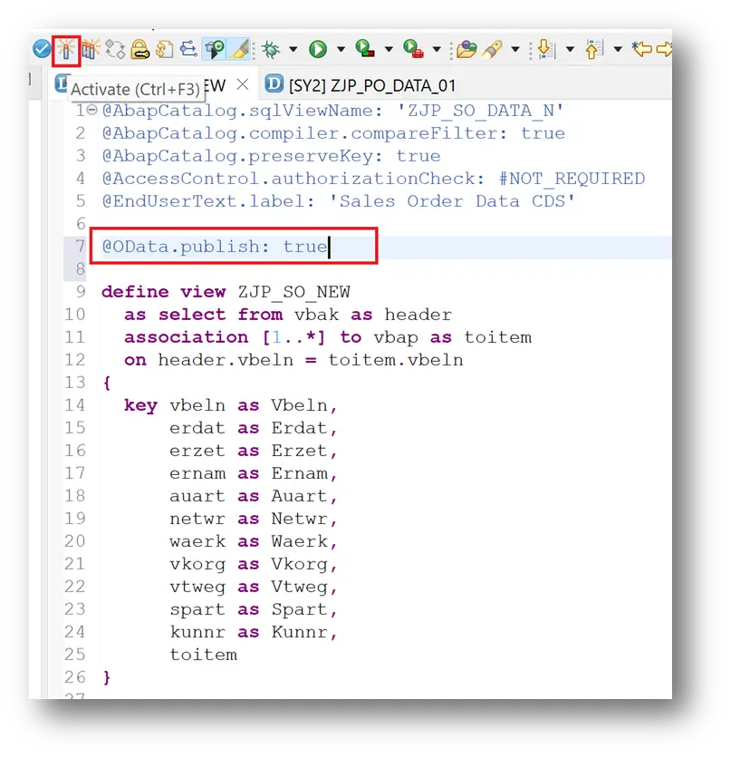
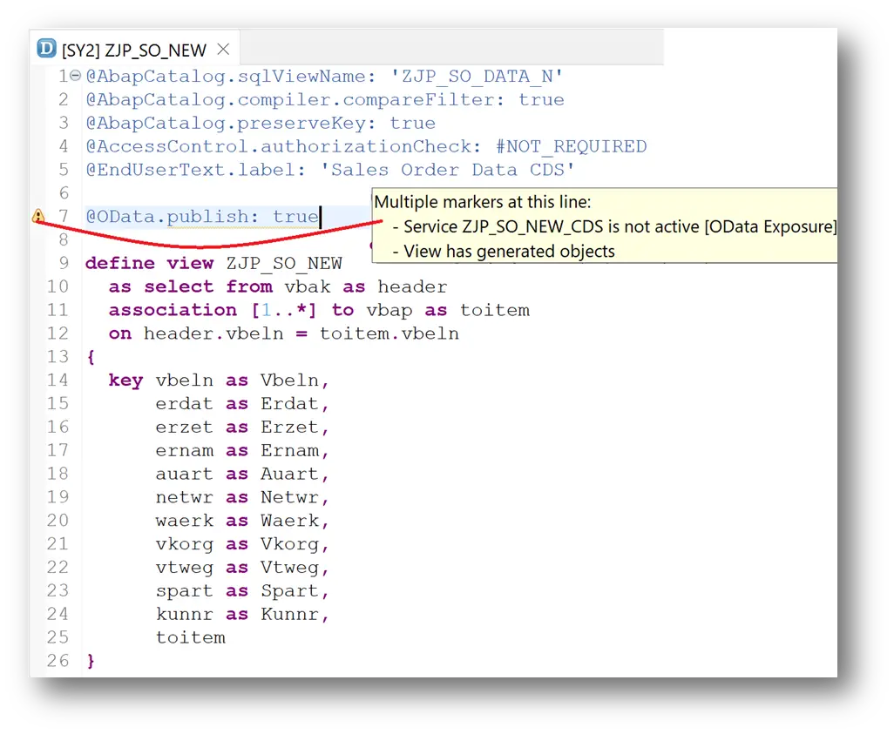
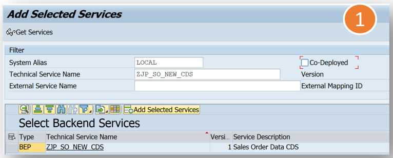
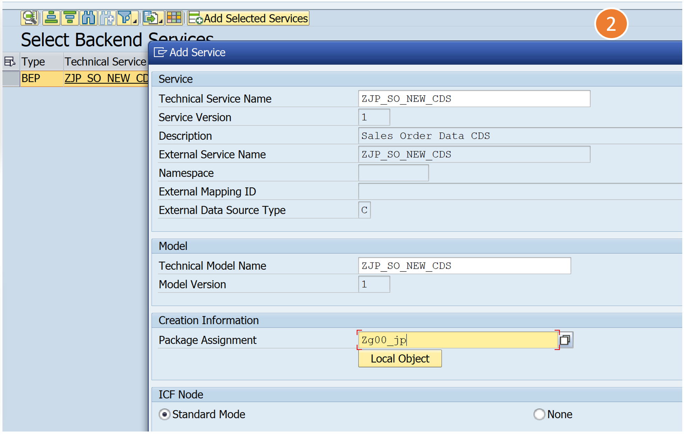
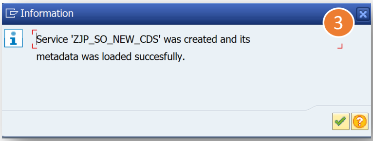
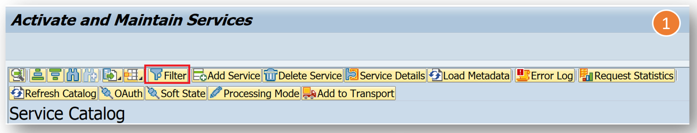
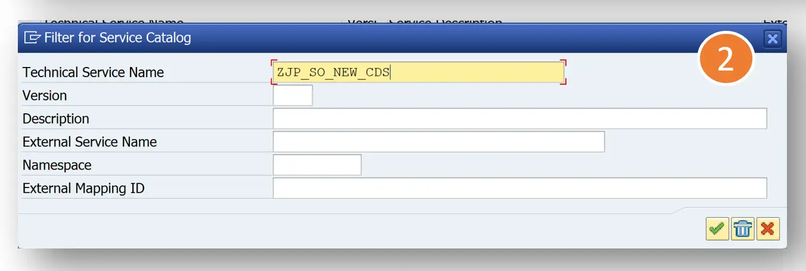
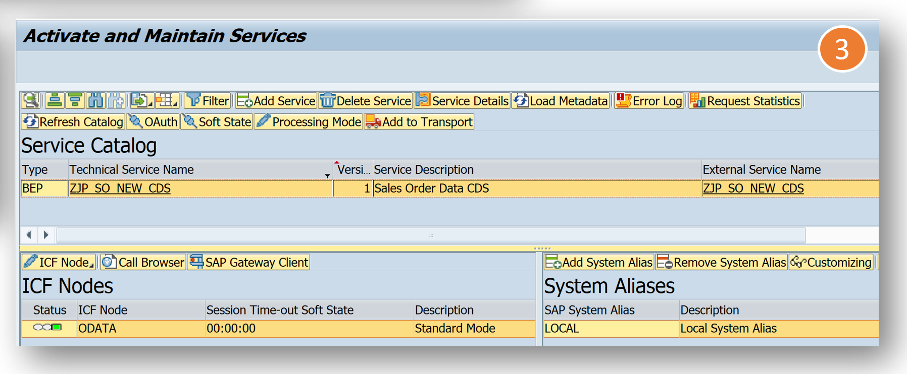
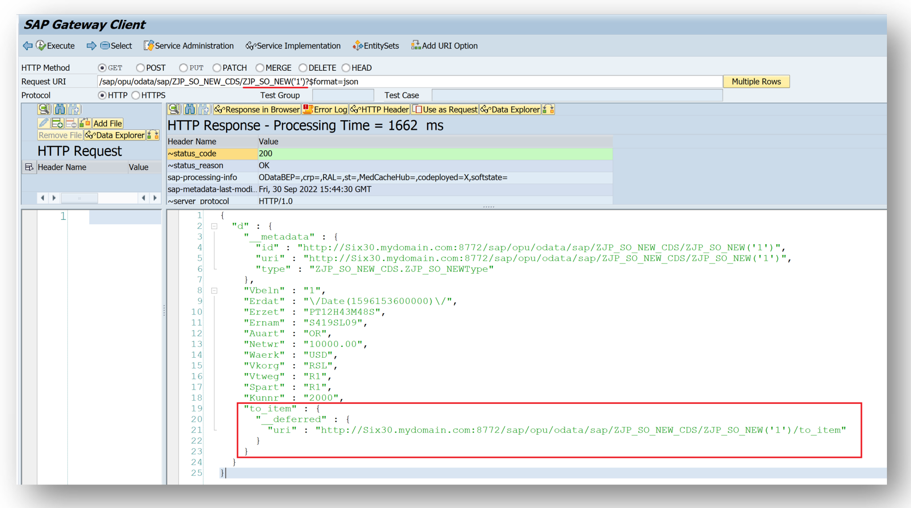

# Building OData Services [24] : CDS View with OData.Publish

CDS Views or CDS Entities can be exposed as OData Services in the following ways

1. The Reference Data Source option in SEGW
2. Annotation OData.Publish
3. RAP Model

In this post, you will learn to expose a CDS view using 'OData.Publish' annotation.

## Create a CDS View

Create a CDS View with the below code. The annotation <b>@OData.publish: true</b> is used to publish the CDS as OData Service.

```
@AbapCatalog.sqlViewName: 'ZJP_SO_DATA_N'
@AbapCatalog.compiler.compareFilter: true
@AbapCatalog.preserveKey: true
@AccessControl.authorizationCheck: #NOT_REQUIRED
@EndUserText.label: 'Sales Order Data CDS'

@OData.publish: true

define view ZJP_SO_NEW
  as select from vbak as header
  association [1..*] to vbap as _item
  on header.vbeln = _item.vbeln
{
  key vbeln as Vbeln,
      erdat as Erdat,
      erzet as Erzet,
      ernam as Ernam,
      auart as Auart,
      netwr as Netwr,
      waerk as Waerk,
      vkorg as Vkorg,
      vtweg as Vtweg,
      spart as Spart,
      kunnr as Kunnr,
      _item
} 
```

Activate the CDS View created.



### Find the Service Name
Post Activation, a yellow warning symbol appears in the line @OData.publish: true. Hover the cursor over the line to get a pop up like below.

The Service Name appears in the pop-up and the warning says that the Service is not active. The service name will be the CDS View name followed by _CDS.



### Register the Service

Register the service ZJP_SO_NEW_CDS using transaction /IWFND/MAINT_SERVICE. Use the add service button.





And the service is registered.

### Test the Service
Use Filter to get the registered service. Start from the transaction /IWFND/MAINT_SERVICE. Click on the Filter button.



Use the exact service name or something like ZJP* to filter the services.



Click on the right service and use SAP Gateway Client to test the service.



This service has 2 sets, ZJP_SO_NEW and VBAP. VBAP can be called directly or with Association.

#### URIs to test
```
/sap/opu/odata/sap/ZJP_SO_NEW_CDS/ZJP_SO_NEW?$format=json
/sap/opu/odata/sap/ZJP_SO_NEW_CDS/ZJP_SO_NEW('1')?$format=json
/sap/opu/odata/sap/ZJP_SO_NEW_CDS/ZJP_SO_NEW('1')/to_item?$format=json
/sap/opu/odata/sap/ZJP_SO_NEW_CDS/VBAP?$format=json
/sap/opu/odata/sap/ZJP_SO_NEW_CDS/ZJP_SO_NEW('1')?$expand=to_item&$format=json
```

An example response with Read operation testing is shown as below.



This way, the CDS view can be exposed to OData with one simple annotation.