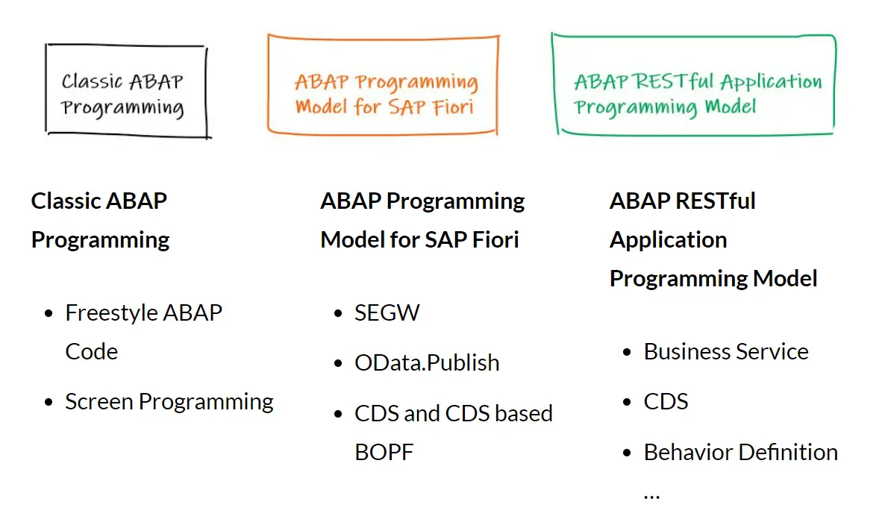
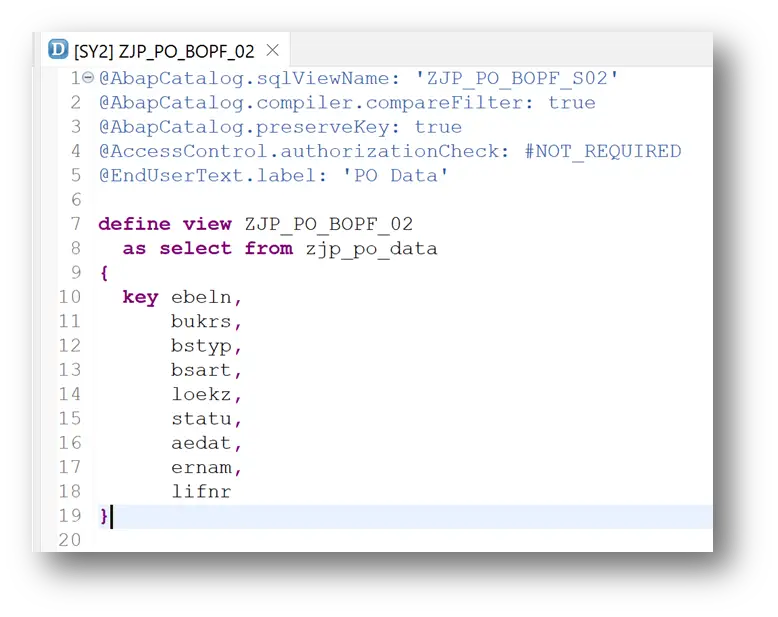
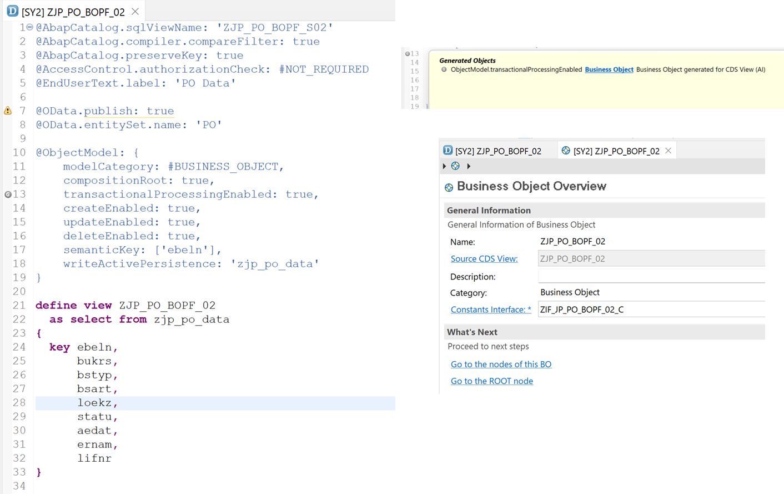
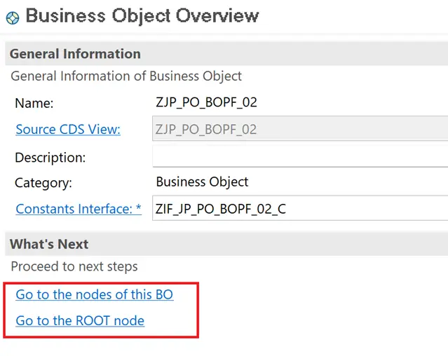
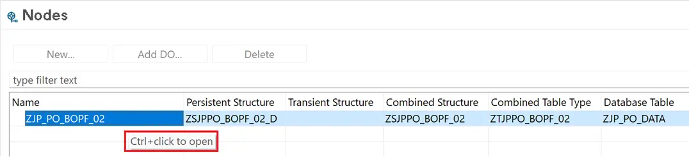
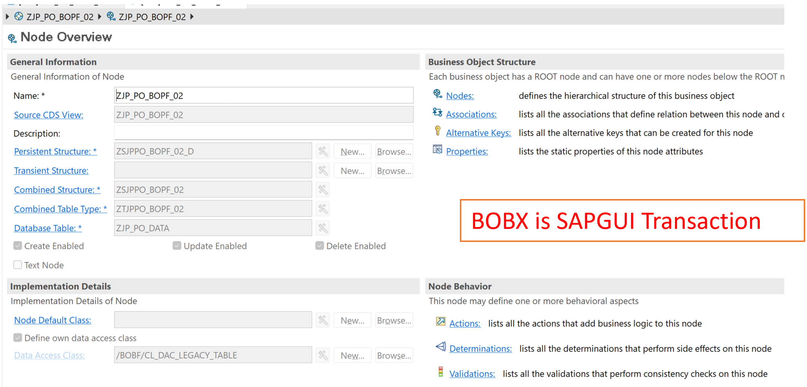
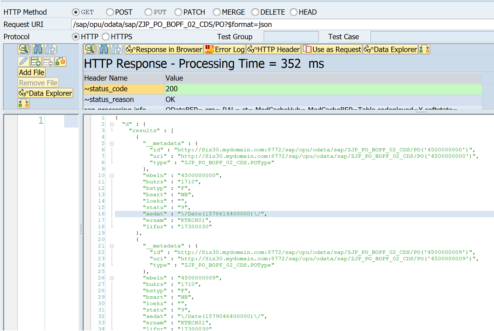
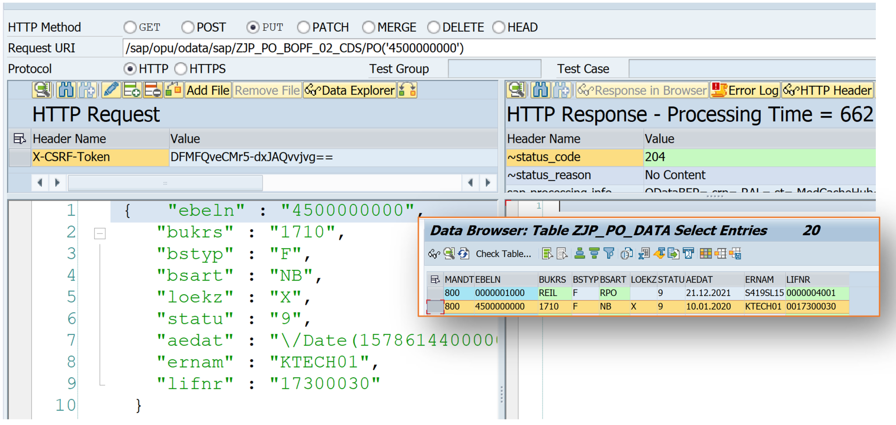
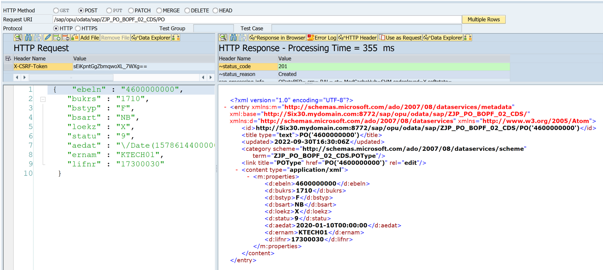

# Building OData Services [25] : CDS View BOPF

CDS Views or CDS Entities can be exposed as OData Services using annotation OData.Publish: true. However, this scenario works with GET operations i.e. Read and Query.

In case the service requires create/update/delete capabilities, the BOPF (Business Object Processing Framework).



Using BOPF now is not a great idea as BOFP is kind of obsolete already with the rise of RAP Model for ABAP. SAP guarantees that any investment in BOPF is not wanted as it will still be maintained. However, going forward no new developments will use BOPF.

So, if you are on a version where you have to use Fiori Programming model and RAP is not part of the system yet, you might still have to use BOPF even though you know for a fact that BOPF is obsolete.

This is also a reason that you don’t see a much posts (this is the only one so far) on Discovering ABAP about BOPF.

## Create new CDS View
Create a basic CDS view where the data is selected from a Custom table. Custom table is used as a Base here to demonstrate how the BOFP object integration with CDS works.



Create and activate the CDS View.

Code Reference
```
@AbapCatalog.sqlViewName: 'ZJP_PO_BOPF_S02'
@AbapCatalog.compiler.compareFilter: true
@AbapCatalog.preserveKey: true
@AccessControl.authorizationCheck: #NOT_REQUIRED
@EndUserText.label: 'PO Data'

define view ZJP_PO_BOPF_02
  as select from zjp_po_data
{
  key ebeln,
      bukrs,
      bstyp,
      bsart,
      loekz,
      statu,
      aedat,
      ernam,
      lifnr
}
```

## Add Annotations
Add below Annotations and Activate the view again.

```
@OData.publish: true
@OData.entitySet.name: 'PO'
```

Now, add the BOPF related annotations, and Activate the view again.

```
@ObjectModel: {
    modelCategory: #BUSINESS_OBJECT,
    compositionRoot: true,
    transactionalProcessingEnabled: true,
    createEnabled: true,
    updateEnabled: true,
    deleteEnabled: true,
    semanticKey: ['ebeln'],
    writeActivePersistence: 'zjp_po_data'
}
```

The reason we do not add everything at once, is that the activation is likely to fail in case everything is added at one go.

## Complete CDS Source
```
@AbapCatalog.sqlViewName: 'ZJP_PO_BOPF_S02'
@AbapCatalog.compiler.compareFilter: true
@AbapCatalog.preserveKey: true
@AccessControl.authorizationCheck: #NOT_REQUIRED
@EndUserText.label: 'PO Data'

@OData.publish: true
@OData.entitySet.name: 'PO'

@ObjectModel: {
    modelCategory: #BUSINESS_OBJECT,
    compositionRoot: true,
    transactionalProcessingEnabled: true,
    createEnabled: true,
    updateEnabled: true,
    deleteEnabled: true,
    semanticKey: ['ebeln'],
    writeActivePersistence: 'zjp_po_data'
}

define view ZJP_PO_BOPF_02
  as select from zjp_po_data
{
  key ebeln,
      bukrs,
      bstyp,
      bsart,
      loekz,
      statu,
      aedat,
      ernam,
      lifnr
}
```

## Generated Objects
1. OData Service – A service gets generated with name ‘View name + _CDS’
2. BOPF object gets generated with CDS View Name

The line 13 below has an icon in front of it to indicate that there is a generated object. The generated object navigates to a BOPF object.



## BOPF object details

Click on the ROOT node link.



Use Ctrl + left mouse click to open the object.



If you want to check the object in the backend, use BOBX transaction.



Note:

*** Explore BOPF – Standard object /BOFU/DEMO_SALES_ORDER to understand the objects in bit more detail.

## Register the Service
For registering the service, the same process is followed as in CDS View with OData.Publish

## Testing the Service
Ezoic
Test the service from SAP Gateway Client.

### Query Operation
```
URI: /sap/opu/odata/sap/ZJP_PO_BOPF_02_CDS/PO?$format=json
HTTP Method: GET
```



### Update Operation
```
URI: /sap/opu/odata/sap/ZJP_PO_BOPF_02_CDS/PO('4500000000')
HTTP Method: PUT
Payload: Copy from GET request
```



### Create Operations
```
URI: /sap/opu/odata/sap/ZJP_PO_BOPF_02_CDS/PO
HTTP Method: POST
Payload: Copy from GET request and change the PO Number in field ebeln
```

As mentioned earlier, as BOPF is obsolete, I will not cover it further, but in case you are still on the Fiori Model and not on RAP, below is a good starting point to understanding BOPF.

[Introduction to Business Object Processing Framework](https://community.sap.com/topics/abap/bopf)