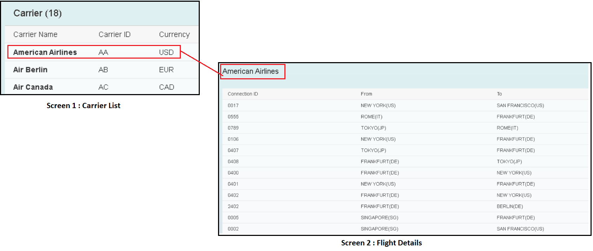
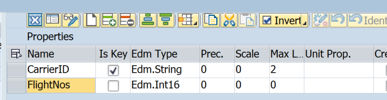
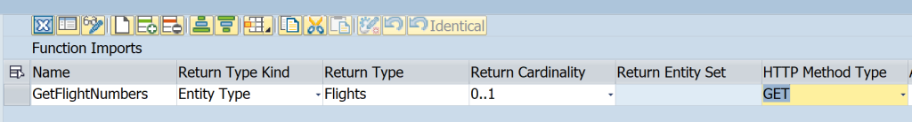

# Building OData Services [3] : Create OData Service

In this post, you will learn to Create OData Service using SEGW.

This includes

- Creating a Project, Entity Type, Entity Set and Association.
- Generating the Project
- Implement Code

To create a OData Service in conventional way, transaction SEGW is used. SAP Gateway can be embedded onto ECC/S4 System, or it can be a separate system.

Before we start creating a project, we need to analyze the application to be built and what should be the data model. Let us consider a simple application that shows Carrier id list on first screen and some Flight detail for selected carrier on next screen.



The data model for this application will have Carrier as one Entity and FlightSchedule / FlightDetails as another entity.

## Create Project

Transaction Code : SEGW

Click on create icon and give details in the pop up. Select Package and TR or Local Package if you do not wish to create a TR.


A project is created as below.


## Create Entity and add Properties
Select entity types node, right click and select Create.


Provide Entity Type Name as Carrier and Entity Set Name as CarrierSet and hit Enter. This will create Entity Type and Entity Set at one go.


### Create Entity Type Properties

Expand the Entity Type Carrier and double click on the node Properties.


Then use the buttons highlighted in a box below to add/append or remove the properties. While adding the property, you can assign a data element or internal type as shown below.

Click on the highlighted button.


Select Explicit Assignment as Mode.


Select Category as Data Element and add data element name in the Associated Type.


You can add few more properties like Carrier Name and Currency. Then choose CarrierID as Key.


### Create Entity with reference

Another way to create entity more easily is by referring to a dictionary structure or table. Right click on Data Model and choose Import > DDIC Structure.


Select the required properties, click Next.


Select Keys, Click Finish.


The properties will be imported as below.


| * | * |
| - | - |
| Creatable |	Allow a value assignment to this property in Create (POST) requests. If checked, you must include a Create operation in the data model | 
| Updatable	| Allow a value assignment to this property in Update (PUT) requests. If checked, you must include a Update operation in the data model |
| Sortable	| Allow this property to be used in $orderby statements for sorting data |
| Nullable	 | Allow a null value to be entered for this property at runtime |
| Filterable | Allow this property to be used in $filter statements for filtering data | 

### Entity Property Options

To import any other properties later we can check the strcuture in entity. If it exists, we can import more properties from the same structure.


Then use option Right Click > Import > Properties


## Create Entity Set
As shown earlier, we can get the Entity Set created along with Entity Type itself.


But, if you only created Entity Type first and need to create Entity Set, then choose Entity Set Node > Right Click > Create.


Important Options in Entity Set

| Column |	Description |
| - | - |
| Creatable	| Select this checkbox to indicate that creation is supported by your service implementation.
| Updatable	| Select this checkbox to indicate that updating is supported by your service implementation.
| Deletable	| Select this checkbox to indicate that deletion is supported by your service implementation.
| Pageable |	Select this checkbox to indicate that paging is supported by your service implementation.
| Addressable |	Select this checkbox to indicate that the addressable function is supported by your service implementation.
| Searchable | Select this checkbox to indicate that searches are supported by your service implementation.
| Subscribable | Select this checkbox to indicate that subscriptions are supported by your service implementation.
| Requires Filter | Select this checkbox to indicate that a filter is required by your service implementation. If you select this checkbox, the entity set cannot be accessed directly and cannot be queried without a $filter expression.

## Create Association
You created Carrier and FlightSchedule Entity Types. To define their relation, association should be created. Associations Node > Right Click > Create.


Next, choose a name for association like CarrierFlights, enter Principal Entity i.e. Carrier and Dependent Entity i.e. FlightSchedule.

Here, it is considered that the application needs to navigate from a Carrier to its related Flight Schedules. In a way we need to navigate from Carrier to Flight Schedules. Hence, a Navigation Property is created as well.

The cardinality between Carrier and FlighSchedule is 1 to many which is explained below.

Click Next.


### Cardinality
Cardinality of Principal Entity will usually be one as for one principal entity we can have a specific or multiple number of Dependent Entities. For Dependent Entities we can have below cardinalities.

- 0..1 – Up to 1
- 1 – Exactly 1
- 0..n – Many
- 1..n – At least 1

On next pop up screen, we map the keys between Principal and Dependent Entities. This can be thought of like a ON condition in a LEFT OUTER JOIN. Click Next.


Provide Association Set Name like CarrierFlightsSet and click Finish.


Association and Association Set are created.


## Create Function Import

First define an entity to be used as return type for function import.




Then, right click on Data Model > Create > Function Import


Enter function import name.


Add Return Type, Cardinality and HTTP Method.



Add function import parameter to pass carried id.


## Generate Service

Now that you have created Entity Type, Entity Set, Association, Navigation Property and Association Set, you can generate the Project.


Class Name and Base Class Name for Model Provider Class and Data Provider Class along with Technical Model Name, Technical Service Name will be auto populated. Usually, you don't have to change anything, but you can change to match your naming conventions.

Hit Enter.


Select a package or click on Local Object.


Project will be generated. In the log, it can be seen that Model Provider Classes and Data Provider Classes are generated. We will need to concentrate on class ZCL_ZJP_DEMO_DPC_EXT i.e. Data Provider Extension.


Runtime objects can be access from node Runtime Artifacts. You can navigate to the runtime artifacts from here.


## Implement Code

The last step before the service can be used is to write code to fetch the data. As OData / Gateway is a framework, one method for each operation is created for each entity. The generated data provider extension class looks like below. There are 5 methods for each EntitySet which correspond to the CRUD-Q operations. 4 of these work with single entity which are CREATE, UPDATE, DELETE and GET. The fifth one i.e. GET_ENTITYSET is the Query operation which returns Entity Set. We need to implement these methods as per the requirement.

This class is inherited from Data Provider Base class, we need to redefine methods which are required as per the application functionality.


## How to Redefine?

Select a method, Right Click > Choose Redefine.


Add the code in the redefined method's implementation section.


Methods are Implemented with below code.

## CARRIERSET_GET_ENTITY

```
METHOD carrierset_get_entity.
  DATA ls_keys TYPE zcl_zjp_demo_mpc=>ts_carrier.

  io_tech_request_context->get_converted_keys(
    IMPORTING
      es_key_values = ls_keys ).
  IF sy-subrc EQ 0.
    SELECT SINGLE carrid, carrname, currcode
      FROM scarr
      INTO @er_entity
      WHERE carrid = @ls_keys-carrierid.
    IF sy-subrc NE 0.
      RAISE EXCEPTION TYPE /iwbep/cx_mgw_busi_exception
        EXPORTING
          message = 'No Data Found'.
    ENDIF.
  ELSE.
    RETURN.
  ENDIF.
ENDMETHOD.
```

## CARRIERSET_GET_ENTITYSET

```
  SELECT carrid, carrname, currcode
    FROM scarr
    INTO TABLE @et_entityset.
  IF sy-subrc NE 0.
    RAISE EXCEPTION TYPE /iwbep/cx_mgw_busi_exception.
  ENDIF.   
```

## FLIGHTSCHEDULESE_GET_ENTITYSET

```
METHOD flightschedulese_get_entityset.

  DATA ls_keys TYPE zcl_zjp_demo_mpc=>ts_carrier.

  CASE io_tech_request_context->get_source_entity_type_name( ).
    WHEN 'Carrier'.  "Called from Association
      io_tech_request_context->get_converted_source_keys(
        IMPORTING es_key_values = ls_keys ).
      SELECT * FROM spfli INTO TABLE @et_entityset
        WHERE carrid = @ls_keys-carrierid.
    WHEN 'FlightSchedule'. "Called directly - check filters
      "This code is not implemented now-it will be demonstrated in next posts
    WHEN OTHERS.
      RETURN.
  ENDCASE.

ENDMETHOD.
```
Add the code, save and activate the methods. That's it. Our project is ready. Next step is to Register and Test the Service in Gateway system.

# Summary of the transaction codes.

| Transaction |	Description |
| :-: | :-: |
| SEGW |	Generate Runtime Artifacts (Data Provider and Model Provider Class)
| SEGW or /IWFND/MAINT_SERVICE | Register the Service
| SEGW or /IWFND/MAINT_SERVICE or /IWFND/GW_CLIENT | Test Service & Metadata
| SEGW or SE24 | Implement Query Operation for SO Header and SO Item Entities
| SEGW | Test Query Operations
| SEGW or SE24 | Implement Read Operation for SO Header and SO Item Entities
| SEGW | Test Read Operations