# Building OData Services [4] : Register and Test OData Service

The project looks like below.

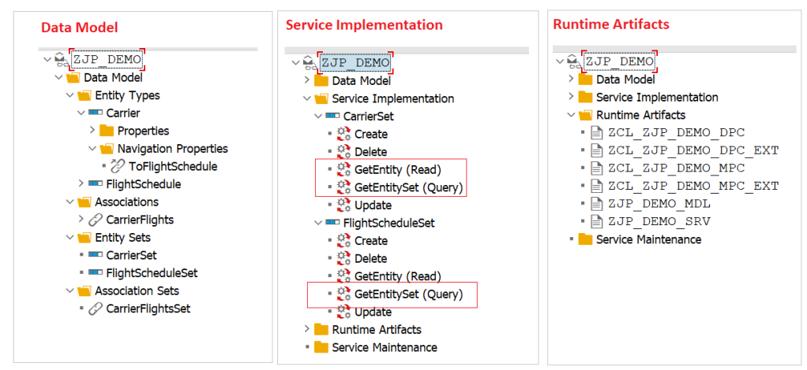

## Maintain/Register the Service – Central Hub Deployement
Use transaction code /IWFND/MAINT_SERVICE in Gateway system.

- For embedded Gateway then its the development system itself where you developed the SEGW project
- For a separate gateway system log into the Gateway system

Click on Add Service.

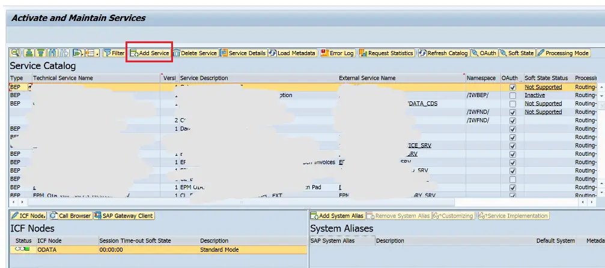

Enter system alias and service search string, then click Get Services. From the displayed list, select your service and click on Add Selected Services.

Service gets added. Use local package to save the service.

With this the service is created and can be seen as below. Use filter in case you see lot of other services. Here, it is important to have the System Alias.

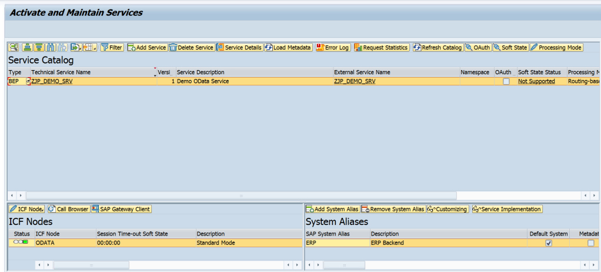

## Maintain/Register the Service – Embeded Deployement

Expand the Service Maintanence node and double click on the node below.

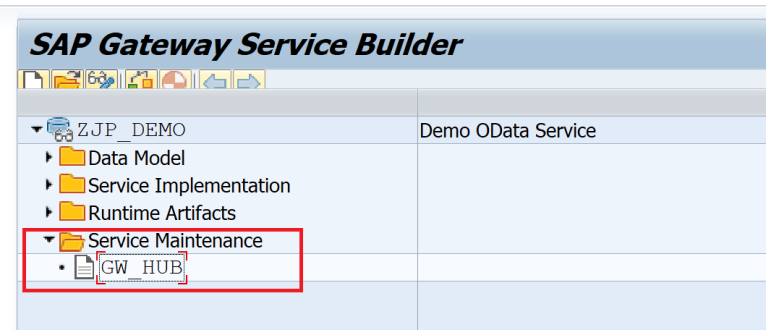

Click on Register.

Select the system Alias.

Provide package, click okay. Select TR is asked and service will be registered.

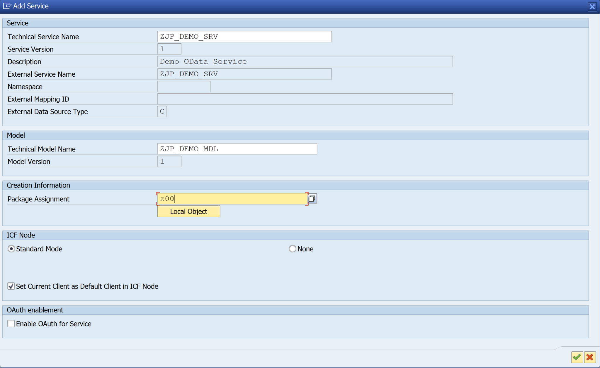

## Testing the Service

To test a service right after its created, you can go to the SAP Gateway Client button. Alternatively you can use t-code /IWFND/GW_CLIENT to test the service.

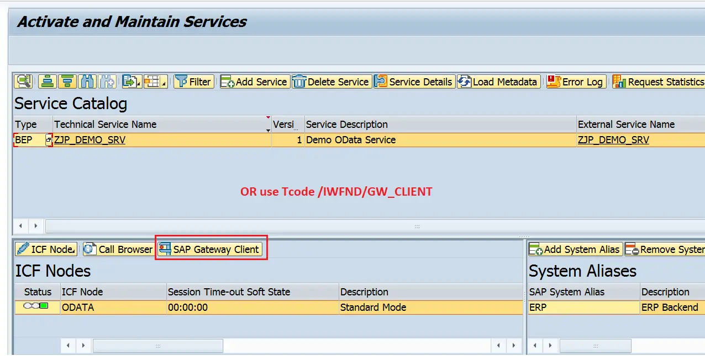

Both the ways will open the SAP Gateway Client tool.

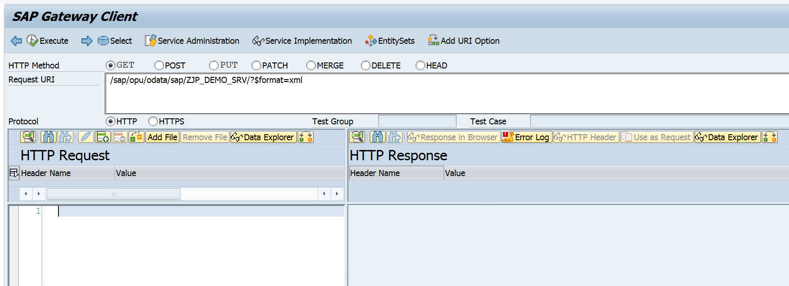

From here, simply execute the default service URL : /sap/opu/odata/sap/ZJP_DEMO_SRV/?$format=xml.

The response ~status_code 200 tells you that the service test is successful.

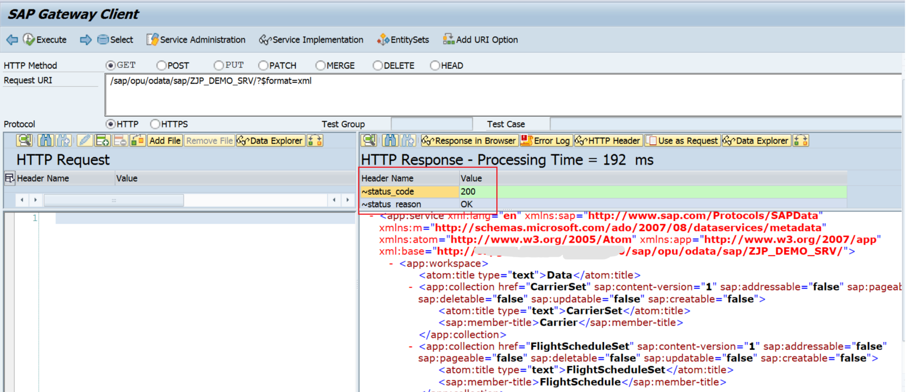

To test the EntitySets EntitySets button can be used. Add URI options can be used to select options like $metadata, $skip, $top etc.

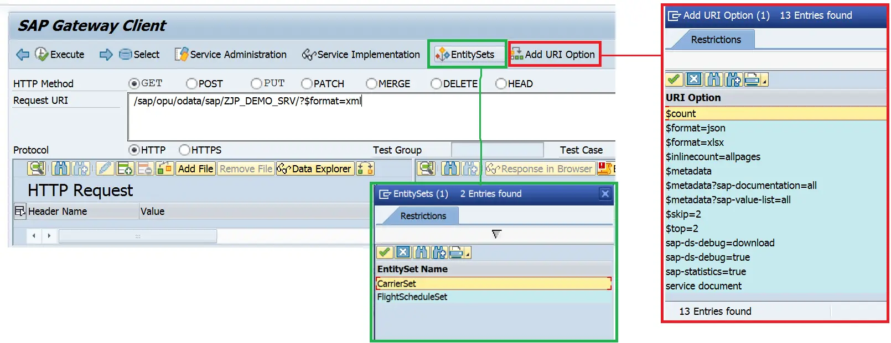

Now, let us test the 3 methods that we implemented.

- Carrier – Get Entity
- FlightSchedule – Get Entity Set

URI details will be a separate article, but for now use /sap/opu/odata/sap/ZJP_DEMO_SRV/CarrierSet('DL') to get Entity for Carrier = 'DL'.

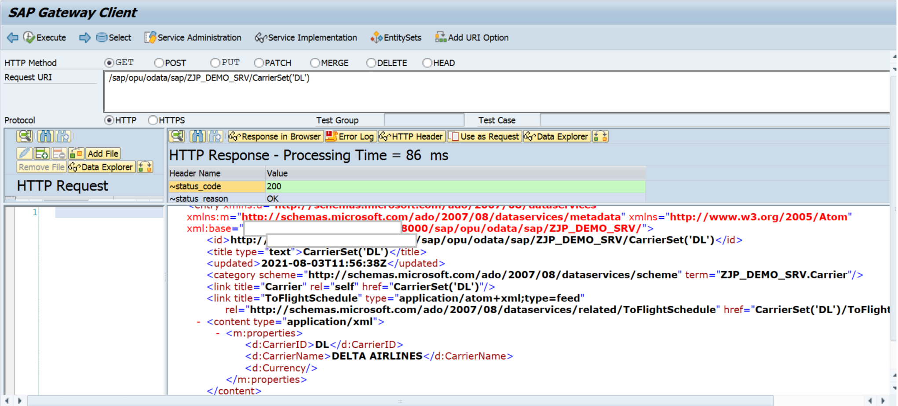

Similarly use below to get Associated Flight Schedules.

ToFlightSchedule is the Navigation Property we created.

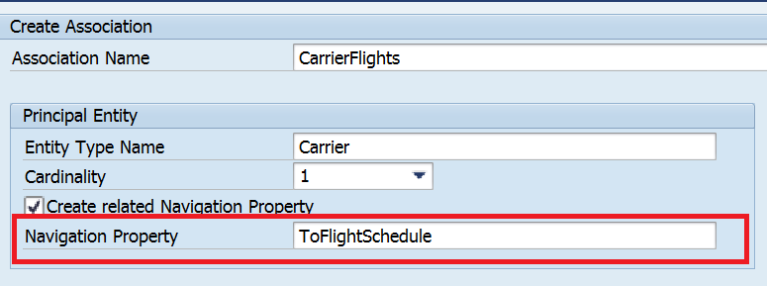

Execute.

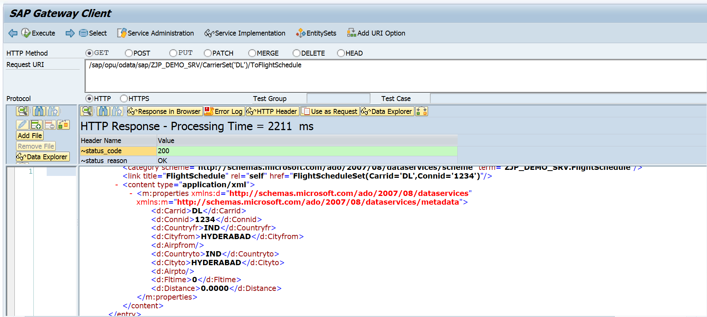

## How to debug OData Service?

For debugging, put an External BreakPoint in the code of the method that you want to debug. Usually, it will be method from class ending with DPC_EXT i.e. Data Provider Extension Class.

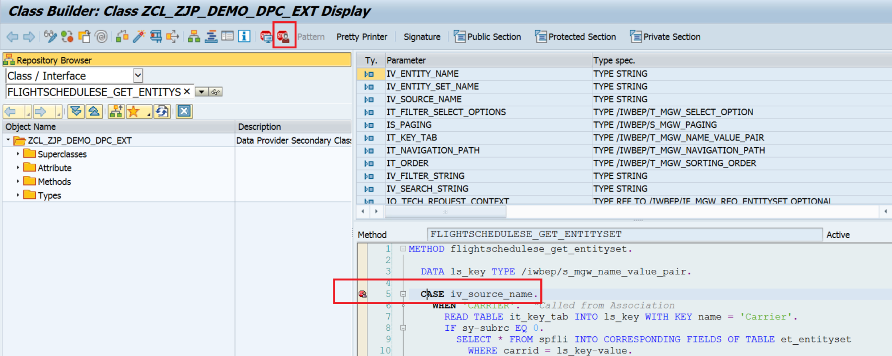

Now, trigger the service from Gateway Client tool, and the debugger will be triggered.

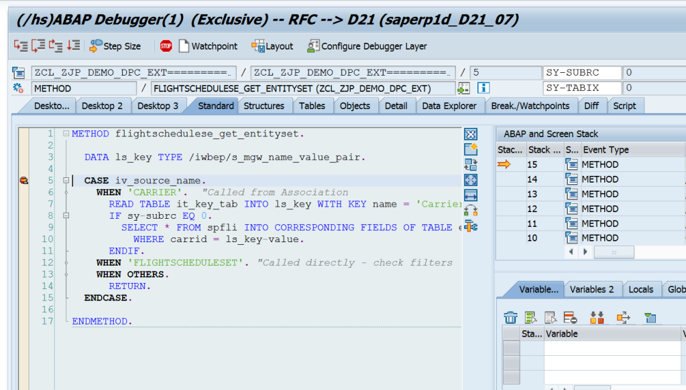

Usually, the debugging will be triggered a service call from SAPUI5 application. The process remains the same.