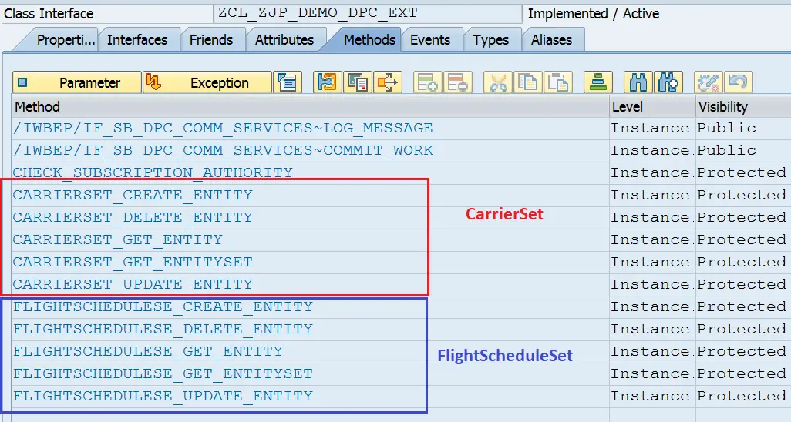

# Building OData Services [6] : Implementing all URIs / CRUD Operations

In the previous post, we understood how URIs work. Now let us implement the URIs / Service operations in SAP ABAP.

When OData Project is generated in the SEGW transaction, a Data Provider Base Class and Data Provider Extension Class are created. We will use the extension class to implement all the operations.

This is the extension class – usually called as DPC_EXT class.



Each of the operations will have a dedicated method in the data provider class. The method names indicate which operation they should be used to implement.

For example, CARRIERSET_CREATE_ENTITY is for Creating a Carrier. Code examples for each of the operations are as below.

## Read – GET ENTITY 

Method io_tech_request_context->get_converted_keys is used to get the key passed in URI.

<h3> <b>
<span style="color:red" > 
/sap/opu/odata/sap/ZJP_DEMO_SRV/CarrierSet(‘AA’)
</span>
</h3></b> 

```
METHOD carrierset_get_entity.
  DATA ls_keys TYPE zcl_zjp_demo_mpc=>ts_carrier.

  io_tech_request_context->get_converted_keys(
    IMPORTING
      es_key_values = ls_keys ).
  SELECT SINGLE carrid, carrname, currcode
    FROM scarr
    INTO CORRESPONDING FIELDS OF @er_entity
    WHERE carrid = @ls_keys-carrid.
  IF sy-subrc NE 0.
    RAISE EXCEPTION TYPE /iwbep/cx_mgw_busi_exception
      EXPORTING
        message = 'No Data Found'.
  ENDIF.
ENDMETHOD.
```
## Query: Selection of data and Sorting – GET ENTITYSET

In query operation, some filters can be applied by default as per business logic. Here is an example without filter operation implemented
<h3> <b>
<span style="color:red" > 
/sap/opu/odata/sap/ZJP_DEMO_SRV/CarrierSet?$format=json
</span>
</h3></b>  

```
METHOD carrierset_get_entityset.

  SELECT carrid, carrname, currcode
    FROM scarr
    INTO TABLE @et_entityset.
  IF sy-subrc NE 0.
    RAISE EXCEPTION TYPE /iwbep/cx_mgw_busi_exception.
  ENDIF.

ENDMETHOD.
```

However, in the Get Entity Set method we need to handle the implementation of Filter, Search String, Sort Order, and paging as well.

## Example with filter & search string

The below code is useful when all the filter values can be used in a single query.

<h3> <b>
<span style="color:red" > 
/sap/opu/odata/sap/ZJP_DEMO_SRV/CarrierSet?$filter=CarrierID eq ‘AA’

/sap/opu/odata/sap/ZJP_DEMO_SRV/CarrierSet?search=’Ame’
</span>
</h3></b> 

```
METHOD carrierset_get_entityset.

  DATA(lv_search) = io_tech_request_context->get_search_string( ).
  IF lv_search IS INITIAL.
    DATA(osql_where_clause) = io_tech_request_context->get_osql_where_clause_convert( ).
  ELSE.
    REPLACE ALL OCCURRENCES OF '''' IN lv_search WITH '%'.
    osql_where_clause = |( CARRID LIKE '{ lv_search }' ) OR ( CARRNAME LIKE '{ lv_search }' )|.
  ENDIF.

  SELECT carrid, carrname, currcode
    FROM scarr
    WHERE (osql_where_clause)
    INTO CORRESPONDING FIELDS OF TABLE @et_entityset.
  IF sy-subrc NE 0.
    RAISE EXCEPTION TYPE /iwbep/cx_mgw_busi_exception.
  ENDIF.

ENDMETHOD.
```

The below code is useful when we need to use each field as a different range.

<h3> <b>
<span style="color:red" > 
/sap/opu/odata/sap/ZJP_DEMO_SRV/CarrierSet?$filter=CarrierID eq ‘AA’
</span>
</h3></b> 

```
METHOD carrierset_get_entityset.

  DATA : lr_carrid TYPE RANGE OF scarr-carrid.

  DATA(lt_filters) = io_tech_request_context->get_filter( )->get_filter_select_options( ).
  lr_carrid = VALUE #( FOR ls_row IN lt_filters[ property = 'CARRID' ]-select_options
                       ( sign   = ls_row-sign
                         option = ls_row-option
                         low    = ls_row-low
                         high   = ls_row-high ) ).

  SELECT carrid, carrname, currcode
    FROM scarr
    WHERE carrid IN @lr_carrid
    INTO CORRESPONDING FIELDS OF TABLE @et_entityset.
  IF sy-subrc NE 0.
    RAISE EXCEPTION TYPE /iwbep/cx_mgw_busi_exception.
  ENDIF.

ENDMETHOD.
```

## Code for Sorting
<h3> <b>
<span style="color:red" > 
/sap/opu/odata/sap/ZJP_DEMO_SRV/CarrierSet?$orderby=Currency,CarrierID
</span>
</h3></b> 

```
*-- This is additional code after the data selection for sorting
  DATA(lt_tech_order) = io_tech_request_context->get_orderby( ).
  IF lt_tech_order IS NOT INITIAL.
    DATA(lt_otab) = VALUE abap_sortorder_tab(
                      FOR ls_otab IN lt_tech_order
                      ( name = to_upper( ls_otab-property )
                        descending = COND #( WHEN ls_otab-order = 'desc' THEN abap_true
                                             ELSE abap_false ) ) ).
    SORT et_entityset BY (lt_otab).
  ENDIF.
```

## Code for Paging

<h3> <b>
<span style="color:red" > 
/sap/opu/odata/sap/ZJP_DEMO_SRV/CarrierSet?$top=2&$skip=4
</span>
</h3></b> 

```
*-- Handle paging – provide number of records
  IF io_tech_request_context->has_inlinecount( ) = abap_true.
    es_response_context-inlinecount = lines( et_entityset ).
  ENDIF.

*-- Handle paging – keep only required records 
  DATA(lv_skip) = io_tech_request_context->get_skip( ).
  DATA(lv_top)  = io_tech_request_context->get_top( ).

  IF lv_skip IS NOT INITIAL OR lv_top IS NOT INITIAL.

    IF lv_top IS INITIAL.
      lv_top = lines( et_entityset ).
    ENDIF.

    IF lv_skip IS INITIAL.
      lv_skip = 1.
    ENDIF.

    DATA(lv_to) = lv_skip.
    DATA(lv_from) = lv_skip + lv_top + 1.

    IF lv_from LT lines( et_entityset ).
      DELETE et_entityset FROM lv_from.
    ENDIF.
    IF lv_to GT 0.
      DELETE et_entityset TO lv_to.
    ENDIF.
  ENDIF.
```
## Query: Association – GET ENTITYSET

Any entity-set query operation can have two sources. It can be called directly or through association. So both the calling source should be handled.

When a query is called by Association, the association referential constraints field information is passed with it. Otherwise, filters can be passed.

The import parameter iv_source_name tells from where it is called.

<h3> <b>
<span style="color:red" > 
/sap/opu/odata/sap/ZJP_DEMO_SRV/CarrierSet(‘DL’)/ToFlightSchedule
</span>
</h3></b> 

```
METHOD flightschedulese_get_entityset.

  DATA ls_keys TYPE zcl_zjp_demo_mpc=>ts_carrier.

  CASE io_tech_request_context->get_source_entity_type_name( ).
    WHEN 'Carrier'.  "Called from Association
      io_tech_request_context->get_converted_source_keys(
        IMPORTING es_key_values = ls_keys ).
      SELECT * FROM spfli INTO TABLE @et_entityset
        WHERE carrid = @ls_keys-carrid.
      IF sy-subrc NE 0.
        RAISE EXCEPTION TYPE /iwbep/cx_mgw_tech_exception.
      ENDIF.
  ENDCASE.

ENDMETHOD.
```

## Function Import – Method to Implement: /IWBEP/IF_MGW_APPL_SRV_RUNTIME~EXECUTE_ACTION 

All function imports trigger the same method in the data provider class. The method has importing parameter iv_action_name which has the function import name as value.

This example depicts the scenario when a function import is created to get a number of flights for a carrier, and how the code can be implemented.

Here, it is important to note that the Function Import always returns a single entity or entity set. As it can pass back both entity and entity sets, a special method copy_data_to_ref is used to copy result data to er_data which is the exported data reference.

‘GetFlightNumbers’ is the name of the function import. The types for function import parameter gets automatically created in MPC class.

```
METHOD /iwbep/if_mgw_appl_srv_runtime~execute_action.

  DATA : ls_out  TYPE zcl_zjp_demo_mpc=>ts_flights,
         ls_pars TYPE zcl_zjp_demo_mpc=>ts_getflightnumbers.

  CASE io_tech_request_context->get_function_import_name( ).
    WHEN 'GetFlightNumbers'.
      io_tech_request_context->get_converted_parameters(
        IMPORTING es_parameter_values = ls_pars ).

      ls_out-carrierid = ls_pars-carrierid.
      SELECT COUNT( * ) FROM sflight
        INTO @ls_out-flightnos
        WHERE carrid = @ls_pars-carrierid.
      IF sy-subrc EQ 0.
        me->copy_data_to_ref( EXPORTING is_data = ls_out
                              CHANGING cr_data = er_data ).
      ELSE.
        RAISE EXCEPTION TYPE /iwbep/cx_mgw_tech_exception.
      ENDIF.
  ENDCASE.

ENDMETHOD.
```

The remaining CRUD operations can be implemented as below.

## Create – CREATE ENTITY

The data to be created is fetched from io_data_provider.
```
METHOD carrierset_create_entity.

  DATA ls_header TYPE zcl_zjp_demo_mpc=>ts_carrier.
  io_data_provider->read_entry_data( IMPORTING es_data = ls_header ).

  INSERT scarr FROM ls_header.  "Business Logic to create record
  IF sy-subrc EQ 0.
    er_entity = ls_header.
  ELSE.
    RAISE EXCEPTION TYPE /iwbep/cx_mgw_busi_exception.
  ENDIF.

ENDMETHOD.
```

## Update – UPDATE ENTITY

The data to be updated is fetched from object io_data_provider.

```
METHOD carrierset_update_entity.

  DATA ls_header TYPE zcl_zjp_demo_mpc=>ts_carrier.
  io_data_provider->read_entry_data( IMPORTING es_data = ls_header ).

  UPDATE scarr FROM ls_header.  "Business Logic to create record
  IF sy-subrc EQ 0.
    er_entity = ls_header.
  ELSE.
    RAISE EXCEPTION TYPE /iwbep/cx_mgw_busi_exception.
  ENDIF.

ENDMETHOD.
```

## Delete – DELETE ENTITY

For deletion, the keys are sent in it_key_tab. A single entry is deleted at a time.

```
METHOD carrierset_delete_entity.

  TRY.
      DATA(lt_keys) = io_tech_request_context->get_keys( ).
      DATA(lv_carrid) = VALUE s_carr_id( lt_keys[ 1 ]-value ).
      DELETE FROM scarr WHERE carrid = @lv_carrid.
    CATCH cx_sy_itab_line_not_found.
      RAISE EXCEPTION TYPE /iwbep/cx_mgw_tech_exception.
  ENDTRY.

ENDMETHOD.
```

These are code examples that work only when the entity names and properties match exactly, so when you create a service, use these code samples as a reference and implement the service.