# Building OData Services [7] : JSON Formatter Extension

In this post you will learn to install JSON Formatter extension and its use in OData Service Testing.

We will use Northwind Service – https://services.odata.org/V2/Northwind/Northwind.svc/?$format=json.

First, let us have a quick look at the XML format and JSON format.

## XML Format ($format=xml)

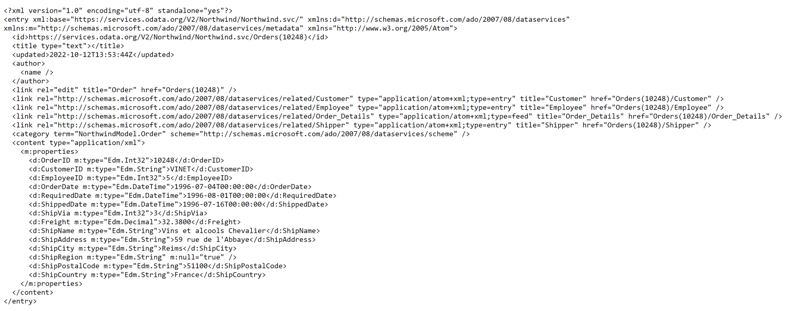

Response in xml format

## JSON Format ($format=json)

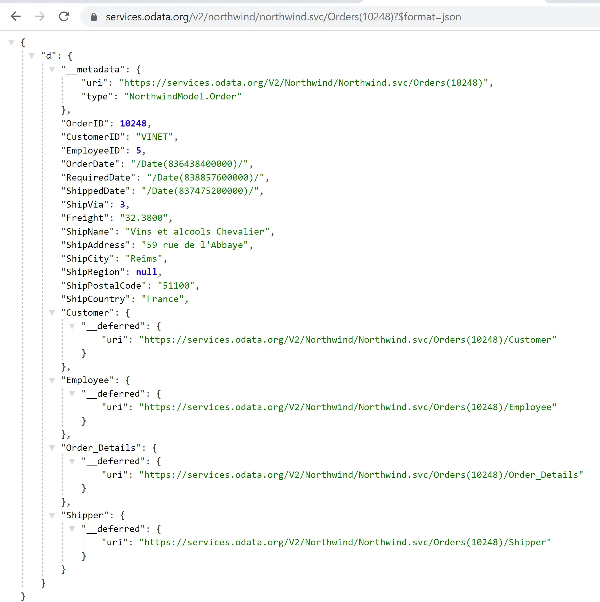

Response in json format – formatted
The JSON format is much more readable and it also takes less space. However, the readibility comes from a JSON extension installed on chrome when you are testing from brower. RAW / unformatted JSON looks like below.

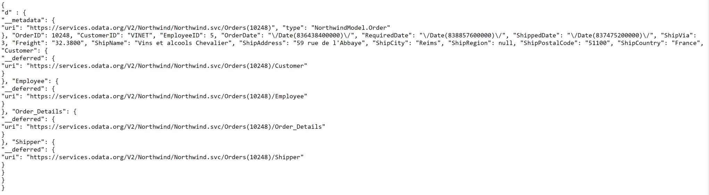

Response in json format – unformatted
Process to install the extension

1. Visit [Chrome Extension Store](https://chrome.google.com/webstore/category/extensions?hl=en) and Search for JSON Formatter

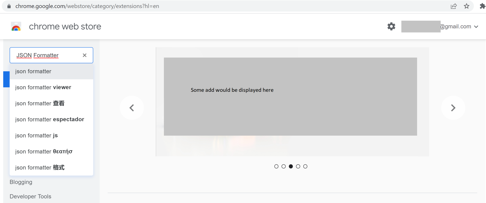

2. Select and add extension to Chrome

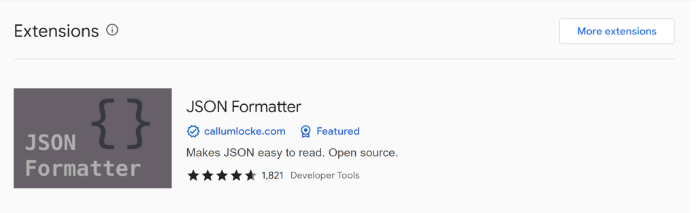

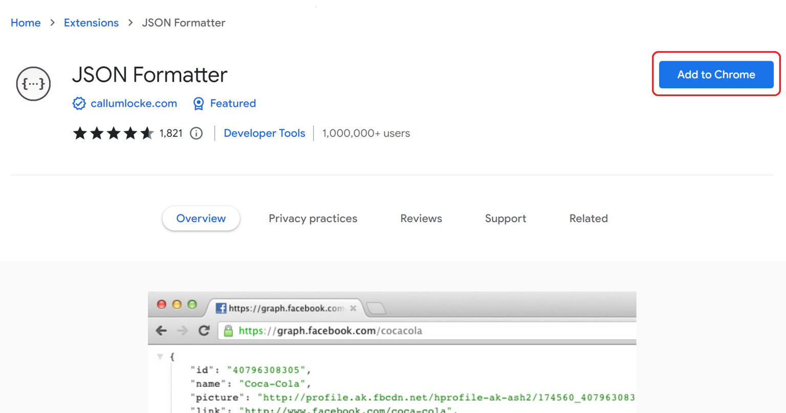

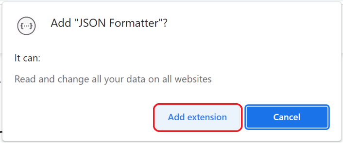

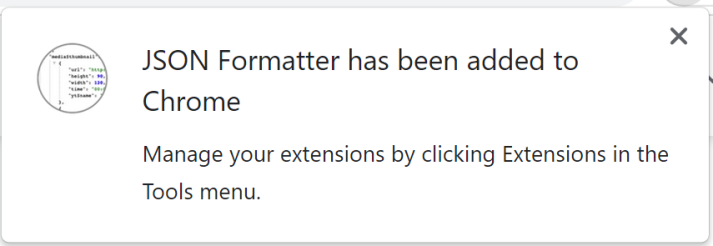

3. Click on the button highlighted in the chrome browser and then select Manage extensions

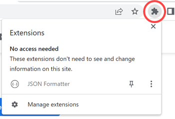

4. Enable the extension

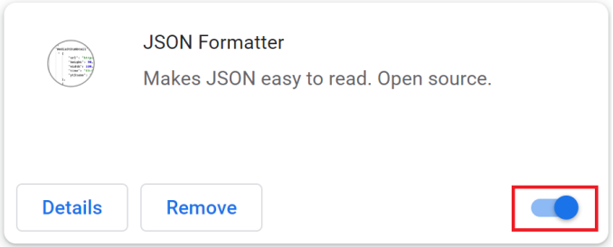

Now you are ready to test the service in chrome with the JSON formatter on with the Parsed option selected by default.

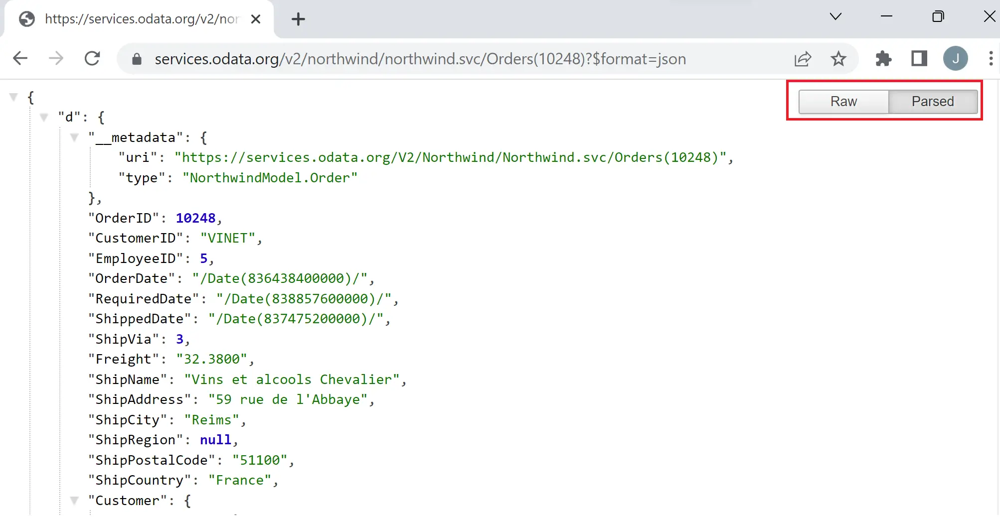