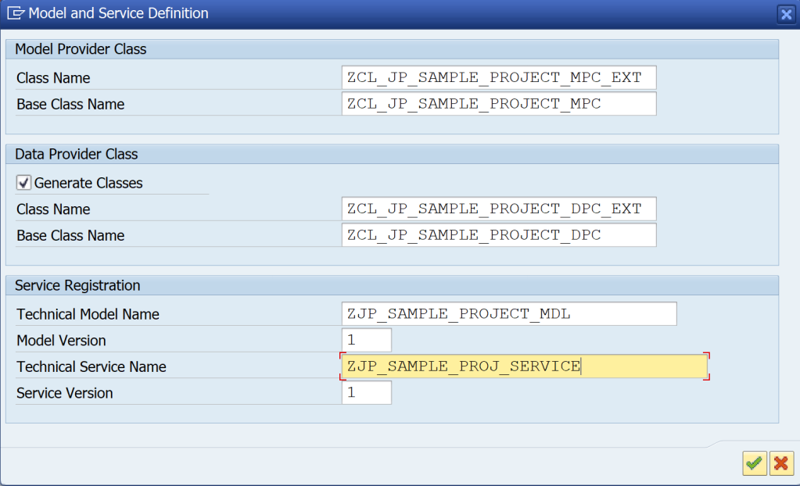
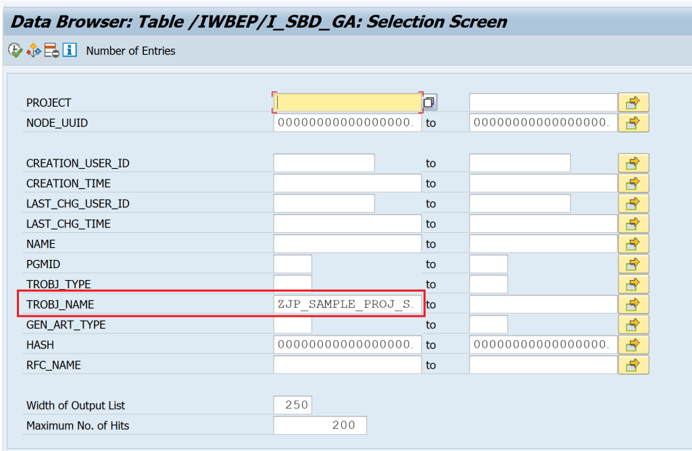
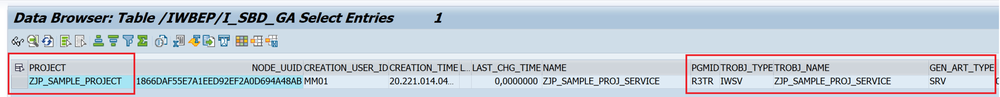
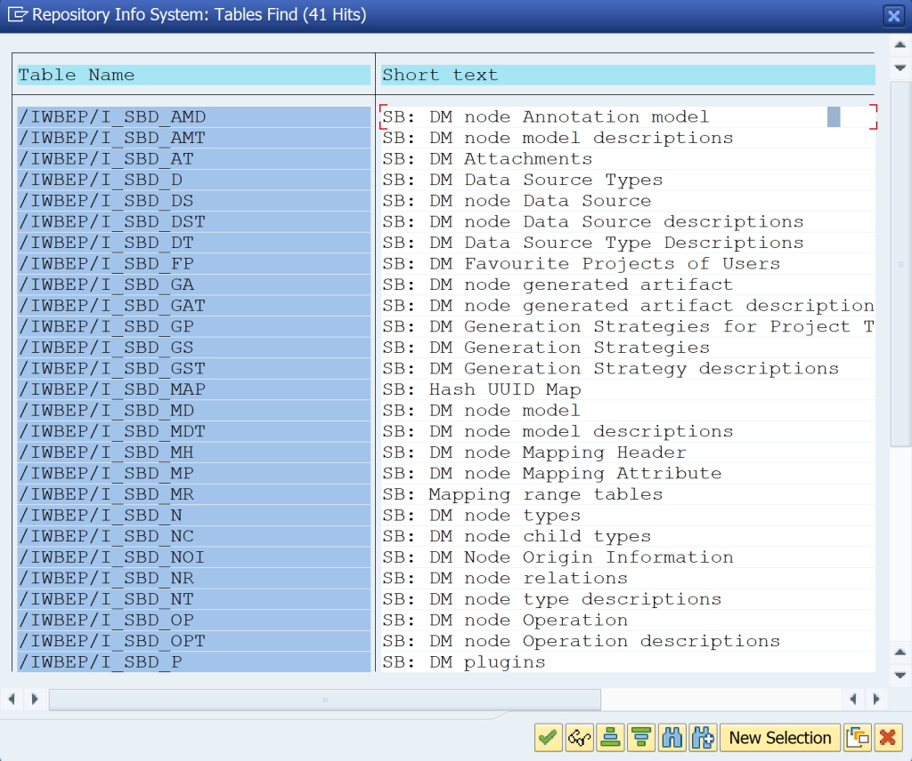

# Building OData Services [8] : How to find SEGW project from Service Name

In this post, you will learn how to find a SEGW project name from the OData Service name.

Usually the OData Services created in SAP will have project name in it and its easy to relate and find. For example,

- Project Name : ZJP_SAMPLE_PROJECT
- Service Name : ZJP_SAMPLE_PROJECT_SRV
-  How Service Name is constructed : < Project Name >_SRV

So, when you know the service name, just remove the _SRV and you get the project name. But when this is not the case – you struggle to find the project name.

To demonstrate, I created a custom service with a different name.

To find the Project Name, use table /IWBEP/I_SBD_GA. Enter the service name in TROBJ_NAME and hit execute.

You will get the project name in the Project Field.

There are many such tables starting with /IWBEP/I_SBD in the system and can be explored to get some information.

