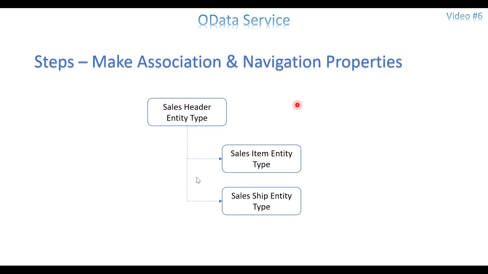
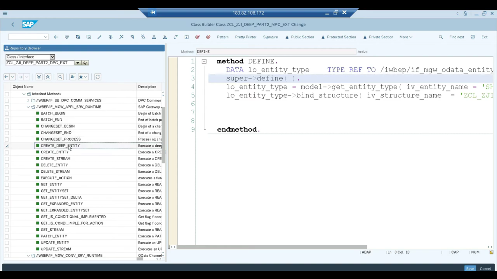
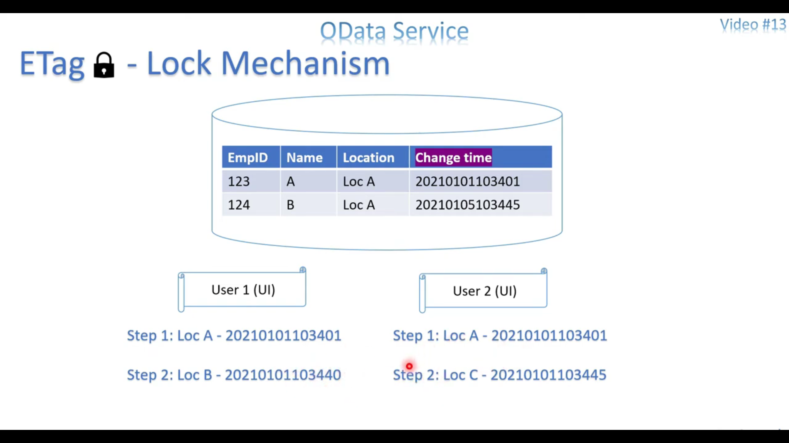
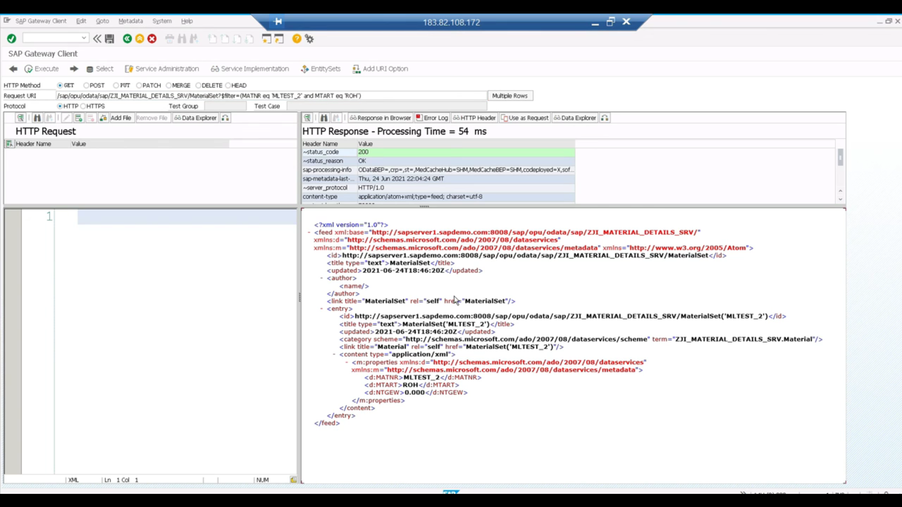

# [Just2Share](https://www.youtube.com/watch?v=KrEVuuuiXfI&list=PLmajIBPiks11NU41T8G149D5hf-o1oBqs&ab_channel=Just2Share)

## Video 1: OData Service - Introduction

Model - structure of the attributes to be sent or received

Runtime Artifacts - place to add custom code

## Video 2: OData Service - Model, Entity and MPC & DPC Class

entity sets methods are need to be redefined

## Video 3: OData Service - Filter and Multiple Entity Sets

## Video 4: OData Service - Association & Navigation

## Video 5: OData Service - CURD Operations & HTTP method

## Video 6: OData Service - Deep Entity Set Part 1

for deep entity set we have to modify dpc_ext

here the name is important so that it could match the paths it should be same as name provided to navigation property set

redefine basic methods in dpc_ext

redefine the get_expanded_entity_set

metadata

expand

get_expand will be called 2 time

here 3 times

## Video 7 - OData Service - Deep Entity Set Part 2

additional step

in url we pass entity name, based on that we have to register it here, then bind the structure

## Video 8: OData Service - Deep Entity Set Part 3

## Video 9 - OData Service - Function Import

For UI action like Search/Value Help we have to create multiple methods to handle these actions.

Better we should use these methods provided

mapping is mandatory

redefine the method

## Video 11 - OData Service - Consumed in Excel - not completed

## Video 12 - OData Service - Gateway Server Config. to get OData Service from different source system.

SPRO Config

also can be done from SM30

Green colour here is gateways Server

creating RFC using SM59

Example

added new alias

to delete the Service
- remove the alias
- deactivate the icf node and delete it
- then delete the srv in maint_service tcode

## Video 13: OData - ETag Functionality Part 1

If-match in header

if etag field is added, pass the value it is mandatory

if etag is found, then make changes

If-None-Match - then it will skip if etag not found and make changes

register from here 

## Video 14: OData - Multilevel Deep Entity Set (GET) Method

changes to

## Video 15: OData - Dynamic Where Condition, Sort and Filter Process

iv_filter_string - dynamic where condition

## Video 16: OData Service - Batch Process (GET) Part 1

