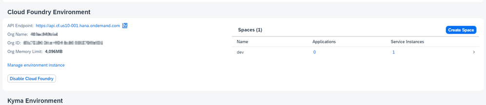
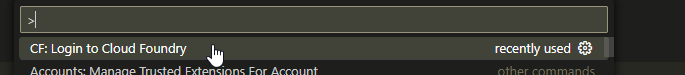
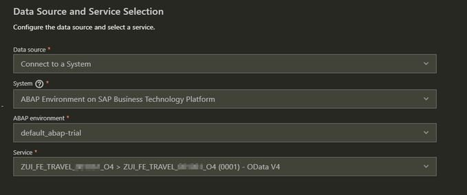

[Set Up SAP Business Application Studio for Development - refer this link if SAP BAS is not available to you ](https://developers.sap.com/tutorials/appstudio-onboarding.html)

[Solution for the above problem](https://community.sap.com/t5/technology-q-a/abap-environments-unavailable-in-sap-bas/qaq-p/12778802)

This did not worked exactly said but few step are correct

1. Login to BTP Cockpit and navigate from Overview to Cloud Foundry Environment
2. Get from there the API Endpoint, Org Name and Name of Space
    

3. Navigate back to BTP and execute >CF: Login to Cloud Foundry
    

4. Sign Out from wrong Cloud Foundry Endpoint
5. Login to correct Cloud Foundry Endpoint as seen in Step 2
6. Open Terminal in BAS and execute cf login
7. Login with your user and password credentials 
8. Execute in Terminal command cf target -o [YOUR_ORGNAME] -s [YOUR_DEVNAME] as seen in Step 2
9. Connect to Data Source / Service is now possible
    

[SAP Business Technology Platform - Setting Up Your Trial Account](https://help.sap.com/docs/btp/sap-business-technology-platform/kyma-env-setting-up-your-trial-account?locale=f16df12fab9f4fe1b8a4122f0fd54b6e.html#loio6313afa84b8940f7963ceec0bb236780)

https://community.sap.com/t5/technology-blogs-by-members/cap-consume-external-service-part-1/ba-p/13434489

https://learning.sap.com/courses/building-apps-with-the-abap-restful-application-programming-model

[Get an Account on SAP BTP Trial](https://developers.sap.com/tutorials/hcp-create-trial-account..html#58cc098c-9cef-4537-bcb5-96969e72c383&idsSpName=sapdxdevs)

[SAP - ABAP RESTful Application Programming Model](https://help.sap.com/docs/ABAP_PLATFORM_NEW/fc4c71aa50014fd1b43721701471913d/289477a81eec4d4e84c0302fb6835035.html)

[UDINA BTP Website](https://btp.udina.de/development/model/rap.html)

[Markdown Diagrams](https://support.typora.io/Draw-Diagrams-With-Markdown/)