# SAP Business Application Studio – Dev Space To Build UI5/Fiori Apps

SAP Business Application Studio is a development environment available on SAP BTP. You can use it to create different type of applications.

In this post, you will learn how to set up a Development Space i.e. Dev Space on Business Application Studio to build UI5/Fiori applications.

Take a quick look at the application studio.

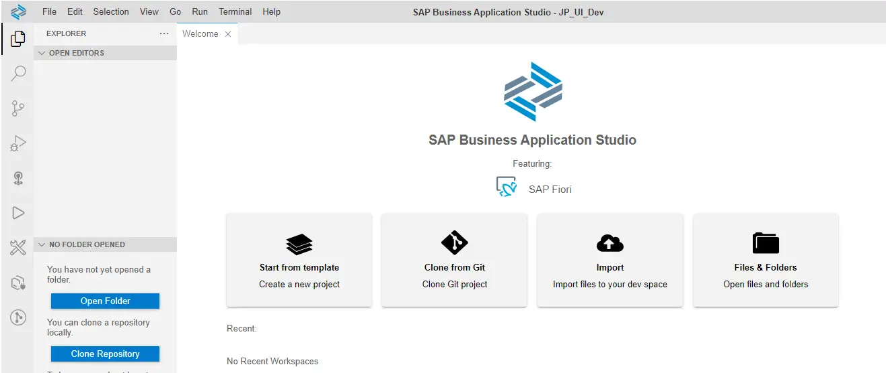

## 1. Log into SAP BTP Trial and and go to your subaccount.
Go to https://account.hanatrial.ondemand.com and log in to your SAP BTP account. Go to your trial account.

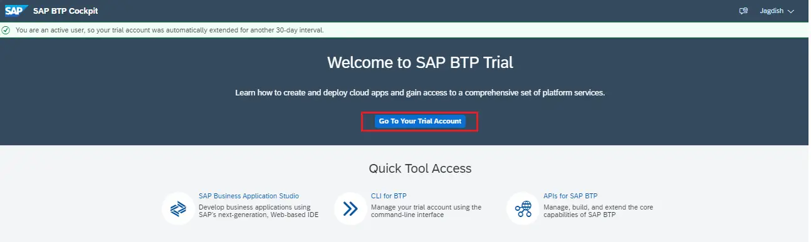

Go to the Subaccount.

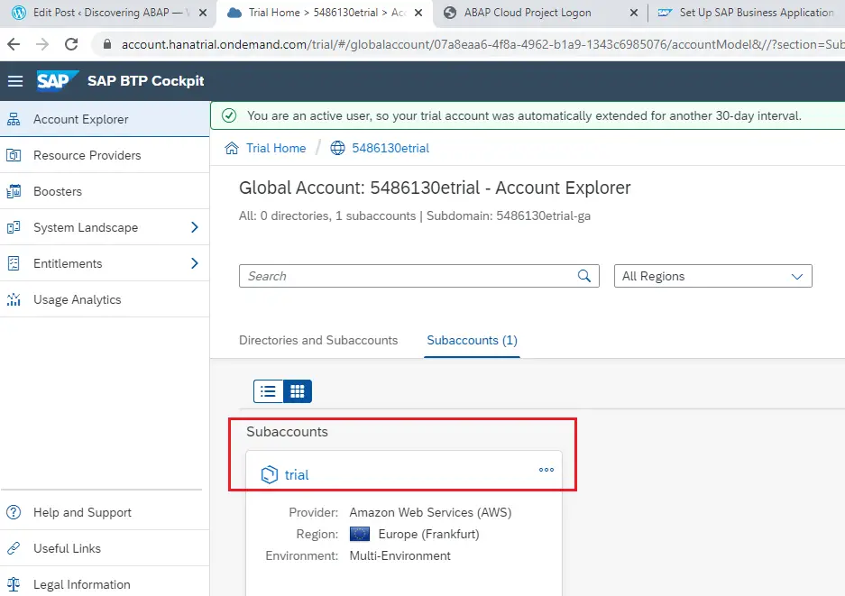

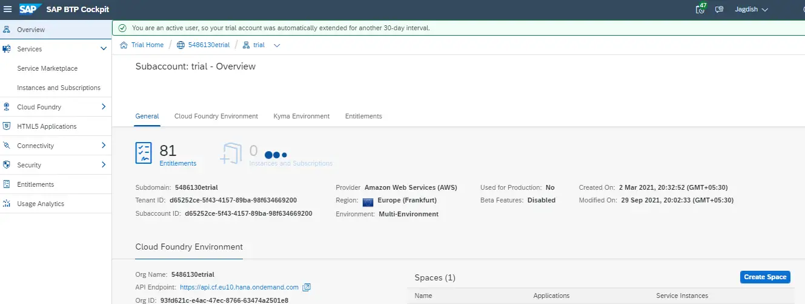

## 2. Check the Business Application Studio Subscription. Create if it is missing.
Go to Instances and Subscriptions. If you find SAP Business Application Studio in the list, you can go to the step 3.

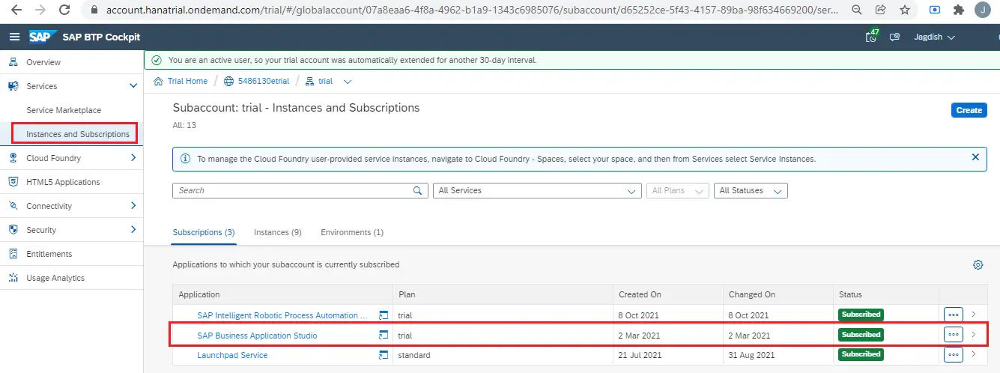

If you do not have a subscription to Business Application Studio, go to service market place and search for it.

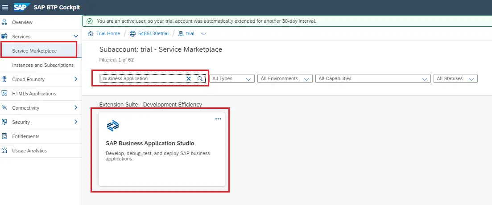

From here you can create the subscription and then go to step 3.

## 3. Go to Business Application Studio

Locate the Business Application Studio in Marketplace. Click on the … on top right corner of the tile and select Go to Application.

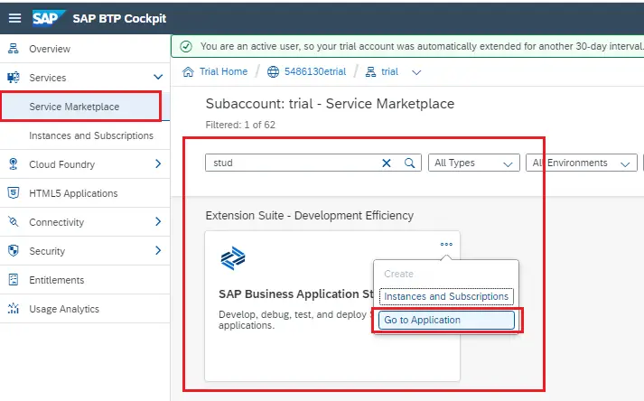

You can also go here from the Trial account home.

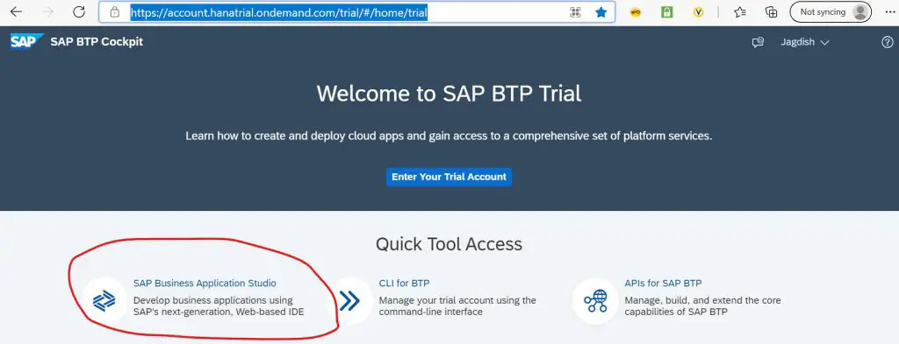

You may get additional screen, click okay to move ahead.

Go to my Dev Space.

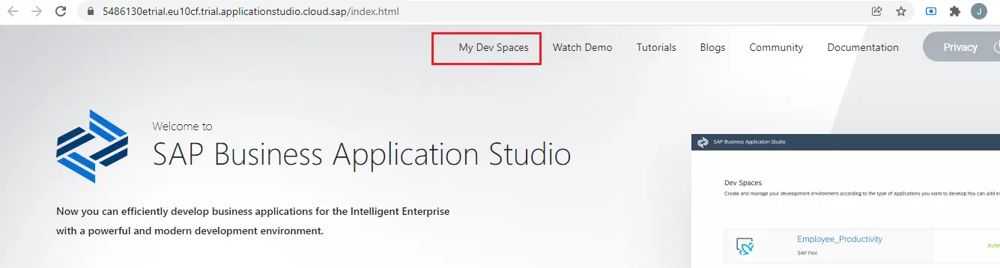

If you have created any Dev Space (and used in last 30 days) it will show up, else you will get a screen like below.

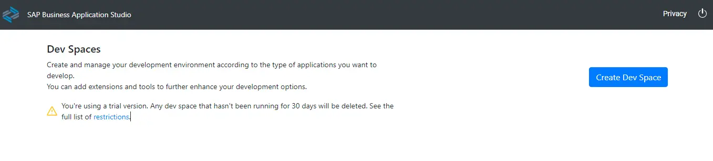

## 4. Create Dev Space
Click on Create Dev Space

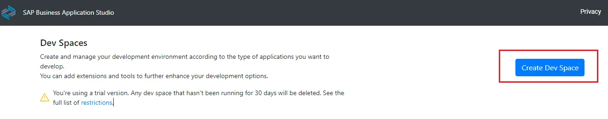

Provide name for the Dev Space, Select SAP Fiori option from the Dev Space types and click Create Dev Space.

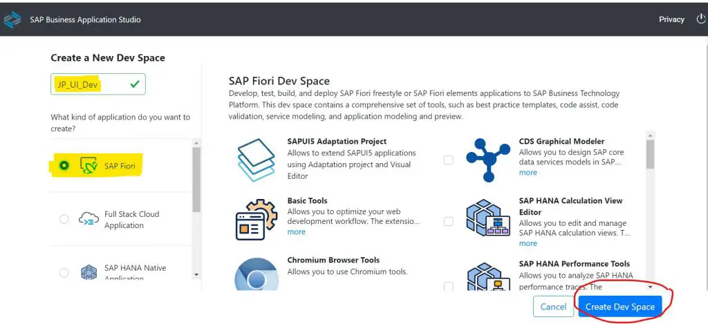

You will see the status as STARTING.

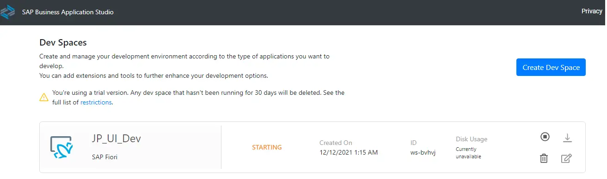

Wait till you see the status changed from STATRING to RUNNING. If it does not, then try refreshing after 2-3 minutes.

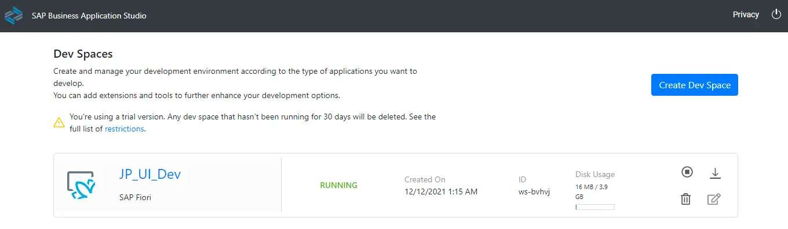

Important: You can create up to 2 Dev spaces for your trial account and only one of them can be running at a time.

## 5. Launch Business Application Studio Dev Space
Click on the Dev Space name to launch it.

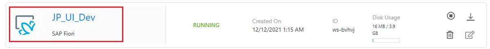

Application Studio is launched.

# 6. Start and Launch Dev Space
When using the Dev Space next time, you may find it in STOPPED status. Click on the button to start it.

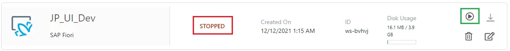

Click on the Dev Space name to launch it.

Application Studio will launch same as shown in step 5.

In following posts, the Dev Space will be used to create UI5 and Fiori applications. So get your space created today.