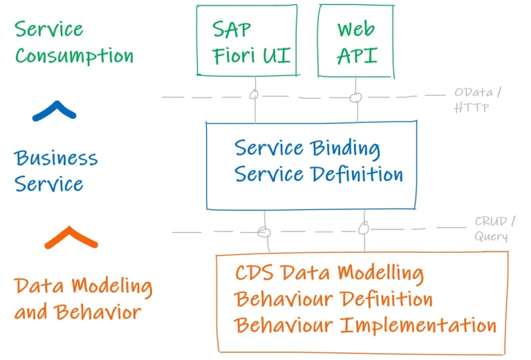
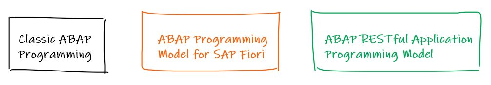

# Introduction to ABAP RESTful Application Programming

In this post, you will learn about ABAP RESTful Application Programming Model (RAP).

- RAP is an architecture for development of SAP HANA-optimized OData Services for SAP Fiori Applications or Web APIs.
- It is available in products like SAP BTP ABAP environment, SAP S/4 HANA Cloud and Application Server ABAP 7.56.
- It is based on CDS and ABAP based custom logic and uses SAPUI5 for user interface

Here is how the architecture looks like –

Before going to the details of each section of RAP, let us also take a look at how the ABAP programming models have evolved. These models may co-exist in some of the systems.

| Classic ABAP Programming | ABAP Programming Model for SAP Fiori | ABAP RESTful Application Programming Model |
| :- | :- | :- |
|Freestyle ABAP Code | SEGW | Business Service |
| Screen Programming | OData.Publish | CDS |
||CDS and CDS based BOPF |Behavior Definition … |

## The RAP Model has 3 layers

1. Data Modelling and Behavior
    - The data model is collection of different entities involved in a business scenario, for example airlines, flight routes and flight schedules, and their relationships, for example the parent-child relationship between airline and the flight schedule.
    - RAP uses CDS to define and organize the data model.
    - The behavior describes what can be done with the data model, for example if the data can be created, updated, or deleted.
    - The behavior can be implemented using ABAP
2. Business Service
    - Service Definition is used to define what part of the CDS / Behavior definition will be exposed to next layer
    - Service Binding defines a specific communication protocol such as OData V2 / OData V4
3. Service Consumption 
    - Service can be exposed as a UI Service – This is consumed by SAP Fiori Elements app.
    - An OData service that is exposed as a Web API comes without any UI specific information in the metadata. It is the public interface for any OData client to access the OData service. For example, you can consume a Web API from another OData service.

The RAP model can be used in variety of scenarios to build applications – it can be used to maintain data similar to TMG or to create a Work-list or Master-Detail kind of application.

For our first RAP application we will simply maintain flight booking entries using below steps spanning across all 3 layers.

## Data Modelling and Behavior

1. Create a table
2. Create root and projection/consumption CDS Entities
3. Create Metadata Extension
4. Create Behavior Definition

## Business Service

1. Create Service Definition
2. Create Service Binding

## Service Consumption

1. Create FIORI Element app