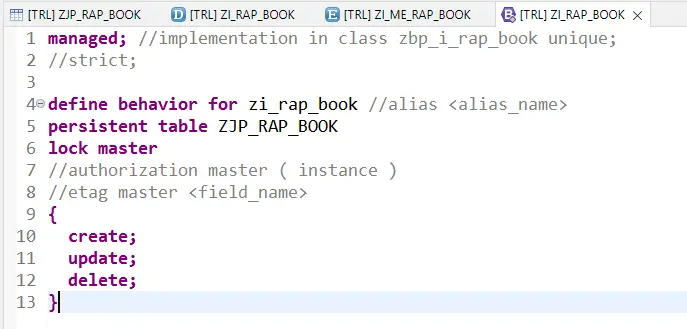
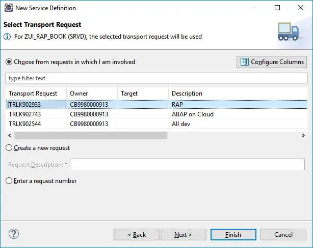

# ABAP RESTful Application Programming Model [2] – Managed Scenario

In this post, you will learn how to create a simple OData service using the RAP model. In this example, a single table is used to create a service.


```
TABLE ZYNY_RAP_BOOK_T (1)

CDS ENTITY ZYNY_RAP_BOOK (2)
|
|--> Metadata Extension(Annotate View) ZYNY_ME_RAP_BOOK (3)
|--> Behaviour Definition ZYNY_RAP_BOOK (4)
|--> Service Definition ZYNY_UI_RAP_BOOK (5)
     |
     |--> Service Binding ZYNY_UI_RAP_BOOK_SB (6)
```
We will create below application without having to write a single line of code on frontend i.e. UI5/Fiori.


##  Create a Table

Right click on the package and chose New > Other ABAP Repository Object


Chose Database Table, click Next


Enter Name and Description. Click Next.


Select a TR and Click Finish. If you do not have existing TR, create a new request.


Add the table fields after client field.


Completed the table as below.

```
@EndUserText.label : 'Travel Booking Table'
@AbapCatalog.enhancement.category : #NOT_EXTENSIBLE
@AbapCatalog.tableCategory : #TRANSPARENT
@AbapCatalog.deliveryClass : #A
@AbapCatalog.dataMaintenance : #RESTRICTED
define table zjp_rap_book {
  key client            : abap.clnt not null;
  key travel_id         : /dmo/travel_id not null;  
  key booking_id        : /dmo/booking_id;
  booking_date          : /dmo/booking_date;
  customer_id           : /dmo/customer_id;
  carrier_id            : /dmo/carrier_id;
  connection_id         : /dmo/connection_id;
  flight_date           : /dmo/flight_date;
  @Semantics.amount.currencyCode : 'zjp_rap_book.currency_code'
  flight_price          : /dmo/flight_price;
  currency_code         : /dmo/currency_code;
}
```

Activate the table.

At this point the table will not contain any data. So let us create a data provider class with below code.

```
CLASS zjp_book_data DEFINITION
  PUBLIC
  FINAL
  CREATE PUBLIC .

  PUBLIC SECTION.
    INTERFACES if_oo_adt_classrun.
ENDCLASS.

CLASS zjp_book_data IMPLEMENTATION.
  METHOD if_oo_adt_classrun~main.
    DELETE FROM zjp_rap_book.
    INSERT zjp_rap_book FROM (
        SELECT FROM /dmo/booking
        FIELDS
            travel_id         AS travel_id,
            booking_id        AS booking_id,
            booking_date      AS booking_date,
            customer_id       AS customer_id,
            carrier_id        AS carrier_id,
            connection_id     AS connection_id,
            flight_date       AS flight_date,
            flight_price      AS flight_price,
            currency_code     AS currency_code
         ORDER BY booking_id
         UP TO 10 ROWS ).

    COMMIT WORK.
    out->write( 'Booking data inserted'  ).
  ENDMETHOD.
ENDCLASS.
```

Execute the class to add the data.


The data is added to the table.


## Create Root CDS Entity

CDS Entity is create to expose the data through OData / Web API.

Right click on the package and chose New > Other ABAP Repository Object


Chose Data Definition. Click Next.


Enter Name and Description. Click Next.


Select TR. Click Next.


Chose template ‘Define Root View Entity‘. Click Finish.


Note that here you are creating a CDS Entity instead of a CDS view. As seen below, the Entity usually has compositions and associations, but for this post, we are not going to use any of those to keep things simple.


Complete the CDS Entity as below. You will see a warning as we have not created Authorizations for this entity, which can be ignored at the moment.


```
@AccessControl.authorizationCheck: #CHECK
@EndUserText.label: 'Root View for ZJP_RAP_BOOK Table'
@Metadata.allowExtensions: true
define root view entity zi_rap_book
  as select from zjp_rap_book
{
  key travel_id     as Travel_Id,
  key booking_id    as Booking_Id,
      booking_date  as Booking_Date,
      customer_id   as Customer_Id,
      carrier_id    as Carrier_Id,
      connection_id as Connection_Id,
      flight_date   as Flight_Date,
      flight_price  as Flight_Price,
      currency_code as Currency_Code
}
```
Activate. Execute as ABAP Application and check the data.


## Create a Metadata Extension

Metadata extension is created to annotate the CDS Entity and fields. We add description, screen position details etc., through these annotations.

Locate your CDS entity in the Package under node Core Data Services > Data Definitions. Right click on the Entity and Chose New Metadata Extension


Enter Name, and Description and chose Next.


Chose a TR and click Finish


You will get below template.


Complete the Metadata Extension as below.


The screenshot does not cover complete code, so use below code.
```
@Metadata.layer: #CORE
@UI: {
  headerInfo: { typeName: 'Booking',
                typeNamePlural: 'Bookings',
                title: { type: #STANDARD, label: 'Travel', value: 'Booking_ID' } }
              }
annotate view zi_rap_book
    with 
{
  @UI.facet: [ { id:              'Travel',
                 purpose:         #STANDARD,
                 type:            #IDENTIFICATION_REFERENCE,
                 label:           'Booking',
                 position:        10 } ]
 @UI: {  lineItem:       [ { position: 10 } ],
         identification: [ { position: 10 } ],
         selectionField: [ { position: 10 } ] }                
 travel_id;
 @UI: {  lineItem:       [ { position: 20 } ],
         identification: [ { position: 20 } ],
         selectionField: [ { position: 20 } ] }    
 booking_id;
 @UI: {  lineItem:       [ { position: 30 } ] ,
         identification: [ { position: 30 } ]}    
 booking_date;
 @UI: {  lineItem:       [ { position: 40 } ] ,
         identification: [ { position: 40 } ]}    
 customer_id;
 @UI: {  lineItem:       [ { position: 50 } ] ,
         identification: [ { position: 50 } ]}    
 carrier_id;
 @UI: {  lineItem:       [ { position: 60 } ] ,
         identification: [ { position: 60 } ]}    
 connection_id;
 @UI: {  lineItem:       [ { position: 70 } ] ,
         identification: [ { position: 70 } ]}    
 flight_date;
 @UI: {  lineItem:       [ { position: 80 } ] ,
         identification: [ { position: 80 } ]}    
 flight_price;
 @UI: {  lineItem:       [ { position: 90 } ] ,
         identification: [ { position: 90 } ]}    
 currency_code;
    
}
```
Activate.

##  Create a Behavior Definition

Behavior Definition is created to specify operation details that are possible for the Entity. This refers to CRUD operations. By default READ / QUERY operations are enabled.

Right click on CDS Entity and chose New Behavior Definition.


All details will be populated. Default implementation type is managed. We do not need to change it for this example. Click Next.


Chose a TR and click Finish.


Definition is created as below.


At this point, we do not need a class, so edit the definition as below. Note that you need to have same field names as table in CDS Entity. If the names are changed using AS, creating a class becomes mandatory.


```
managed; 

define behavior for zi_rap_book 
persistent table ZJP_RAP_BOOK
lock master
{
  create;
  update;
  delete;
}
```

Activate.

## Create a Service Definition

Service definition defines which CDS entities are exposed as part of the service.

Right click on the Root Entity and Chose New Service Definition.


Enter Name and Description. Click Next.


Chose TR and click Finish.


Service Definition is created. Just activate.


```
@EndUserText.label: 'Service Definition for Booking CDS view'
define service ZUI_RAP_BOOK {
  expose zi_rap_book;
}
```

## Create Service Binding

Service binding is created to Publish the service. Here, we chose the protocol like OData V2.

Right click on service definition and select New Service Binding.


Enter Name, Description and chose Binding Type as OData V2 – UI.


Chose TR and click Finish.


Service Binding is created. First activate the service binding.


Once activated, Publish button is enabled. Click to Publish the service.


This will take few minutes. The service will be published.


The service can be tested / previewed. Select the entity zi_rap_book and click on Preview.


Preview page appears similar to a Fiori Element Application.


Click Go to see the data.


This application preview can also be used to perform CRUD i.e. Create, Read, Update and Delete Operations.

## CREATE

Click Create to go to new entry screen.


## READ

Click on any entry to display it.


## UPDATE / DELETE

These options appear on the display screen in the top right corner.

Edit will open the record in edit mode where changes can be made and saved.


Delete will simply delete the record and return to main screen.


```
ZYNY_RAP_BOOK_T2 TABLE
|--> ZR_YNY_RAP_BOOK_T2000 Business Object Data Model CDS
|--> ZBP_R_YNY_RAP_BOOK_T2000 Business Object Behaviour implementation class
|--> ZC_YNY_RAP_BOOK_T2000 Service Proection Entity CDS
|--> ZBP_C_YNY_RAP_BOOK_T2000 Behaviour Implementation class 
|--> ZUI_YNY_RAP_BOOK_T2000_O4 Business Service Definition
|--> ZUI_YNY_RAP_BOOK_T2000_O4 Business Service Binding
```

```
ZYNY_RAP_BOOK_T2 TABLE

ZR_YNY_RAP_BOOK_T2 BO Data Model CDS
ZR_YNY_RAP_BOOK_T2 Behaviour Definition
ZBP_R_YNY_RAP_BOOK_T2 Behaviour Implementation class

ZC_YNY_RAP_BOOK_T2 BO Projection Data Model CDS
ZC_YNY_RAP_BOOK_T2 Behaviour definition for projection
ZBP_C_YNY_RAP_BOOK_T2 Behaviour implementation class

ZUI_YNY_RAP_BOOK_T2_O4 Service definition
ZUI_YNY_RAP_BOOK_T2_O4 Service Binding

```