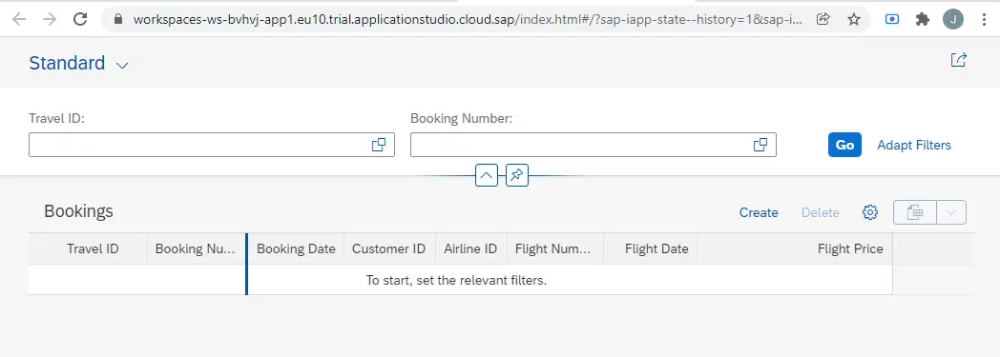

# ABAP RESTful Application Programming Model [3] – Create Fiori Element App from RAP Service – Managed Scenario

[SAP Business Application Studio – Dev Space To Build UI5/Fiori Apps](https://discoveringabap.com/2021/12/12/sap-business-application-studio-dev-space-to-build-ui5-fiori-apps/)

In this post, you will learn how to use the Business Application Studio to create Fiori Element Application with the OData Service created using the RAP model.

## 1. Log into SAP BTP and Launch Business Application Studio.
Refer [SAP Business Application Studio – Dev Space To Build UI5/Fiori Apps](https://discoveringabap.com/2021/12/12/sap-business-application-studio-dev-space-to-build-ui5-fiori-apps/) if you do not know how to do this.

## 2. Create Project from Template
### 2.1 Click on Start from template

### 2.2 Select Template and Target Location

Keep the default path and select SAP Fiori application. Click Start.

### 2.3 Floorplan Selection

In the application type, select SAP Fiori elements.

There are 5 Floorplan options available as of today –

1. List Report Object Page
2. Worklist
3. Analytical List Page
4. Overview Page
5. Form Entry Object Page
Select List Report Object Page. 

As the service we have created is for single table. This is the most appropriate template.

Click Next.

### 2.4 Data Source and Service Selection

Select Connect to a system in Data source dropdown, select connection to your abap instance from System. Usually you will have only one system in the dropdown.

From the service dropdown, search and select your service. Click Next.

Note: ZUI_RAP_BOOK1_O2 is the service we created in earlier post.

### 2.5 Entity Selection

This service has only one entity zi_rap_book1. Click Next.

### 2.6 Project Attribute

Choose meaningful names/text for attributes. Application namespace needs to be unique for each application.

Click Finish.

### 2.7 The project is created.

## 3. Open the Project
Click on Open Folder and open the Location where the project is stored.

Choose the folder – ‘booking’.

The folder will open.

## 4. Run the application.
### 4.1 Right click on the webapp folder and select Preview Application.

### 4.2 Select the highlighted option.

### 4.3 Command line execution will start and you can see the commands and log at the bottom of the screen.

### 4.4 You may have to allow pop-ups and run again.

### 4.5 Application will launch as below.

## 5. Test the application
Click on Go to see the data.

The data is displayed. You can see the Create button to create the data.

Choose any entry to display. This can be used for Edit / Delete the data as well.

This way, you can create a Fiori Element Application without having to code a single line in UI5.

The metadata extension that we create in the backend controls the display part – i.e. positions, labels etc.

Give this a try and let me know in the comments section in case you face any difficulty.