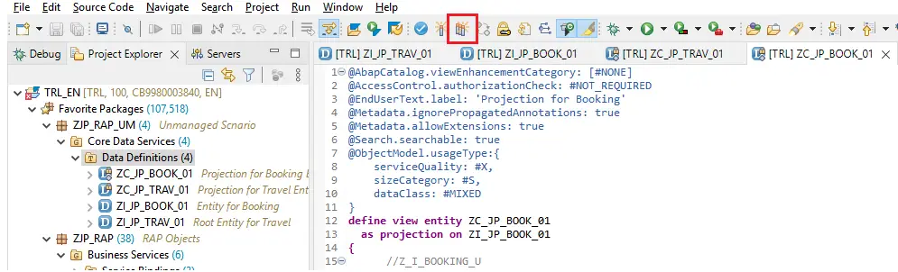
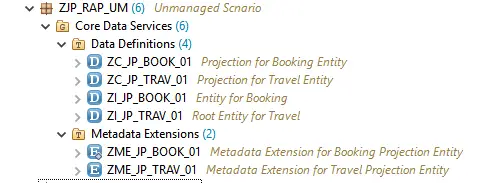

# ABAP RESTful Application Programming Model [4] – Unmanaged Scenario Part 1

The difference between Managed and Unmanaged scenario is that the former lets SAP handle the CRUD operations and in later (Unmanaged) we write our custom code to manage all the operations.

From all practical standpoint, we would be using Unmanaged Scenario, so it is essential to understand it.

- Part 1 – Create the data model i.e. Root and Projection CDS Entities, Metadata Extensions
- Part 2 – Create Behavior Definition, Business Service Definitions and Binding and Test the application display functionality
- Part 3 – Implement Behavior for the Parent & Child Entity

## Visualize how the front-end application looks like –
We will consider below tables in the application

- /dmo/travel – Flight Reference Scenario: Managing Travels
    - Holds Travel data with Travel ID as key
- /dmo/booking – Flight Reference Scenario: Booking
    - Hold Booking data with Travel ID and Booking ID as key
    - This means one Travel consists of multiple Bookings

The application will have create, update, delete functionalities along with additional buttons to mark the booking as confirmed.

The application will look like below once it is ready.


Once you click on a row then detailed page will be displayed.


## Build the data model
### A) Create Root CDS Entities
As we have a Travel which consists of multiple Bookings – this forms a Parent-Child / Header-Item relationship which we will need to create in CDS Entities as well.

Create Root CDS Entity for Travel Data

1. Right click on the package->New->Other Repository Object


2. Select Data Definition, Click Next.


3. Provide Name and Description for the Entity and Click next


4. Select TR and click on Next. (Note: This step is common for all objects and is skipped from the explanation in subsequent entities.)


5. Select Template Define Root View Entity and click Finish.

This shown below template which we need to complete with the code.


Complete the CDS Root View Entity with the below code. Save the Entity. Note that we have a composition that refers to another CDS View Entity ZI_JP_BOOK_01 which is not yet created. So, you will not be able to activate this yet. Both entities will have to be activated together.


1. Composition can be viewed as a special type of association refers to the child entity.
2. The view contains 3 more associations which will help get the names/descriptions of Agency, Customer and Currency respectively.
3. All associations are exposed in the field list

Code in Text Format
```
@AccessControl.authorizationCheck: #NOT_REQUIRED
@EndUserText.label: 'Root Entity for Travel'
define root view entity ZI_JP_TRAV_01
as select from /dmo/travel as Travel
composition [0..*] of ZI_JP_BOOK_01 as _Booking
association [0..1] to /DMO/I_Agency as _Agency on $projection.AgencyId = _Agency.AgencyID
association [0..1] to /DMO/I_Customer as _Customer on $projection.CustomerId = _Customer.CustomerID
association [0..1] to I_Currency as _Currency on $projection.CurrencyCode = _Currency.Currency
{
    key Travel.travel_id as TravelId,
    Travel.agency_id as AgencyId,
    Travel.customer_id as CustomerId,
    Travel.begin_date as BeginDate,
    Travel.end_date as EndDate,
    @Semantics.amount.currencyCode: 'CurrencyCode'
    Travel.booking_fee as BookingFee,
    @Semantics.amount.currencyCode: 'CurrencyCode'
    Travel.total_price as TotalPrice,
    Travel.currency_code as CurrencyCode,
    Travel.description as Description,
    Travel.status as Status,
    Travel.lastchangedat as LastChangedAt,
    _Booking,
    _Agency,
    _Customer,
    _Currency
}
```


Create CDS Entity for Booking Data

1. Right click on node Data Definition and chose New Data Definition.


Provide Name and Description. Name has to match with the root entity. Chose Next.


Select TR, chose Next, then select Template ‘Define View Entity‘ and chose Finish.


Complete the CDS View Entity as below and Save.


Code in Text Format
```
@AbapCatalog.viewEnhancementCategory: [#NONE]
@AccessControl.authorizationCheck: #NOT_REQUIRED
@EndUserText.label: 'Entity for Booking'
@Metadata.ignorePropagatedAnnotations: true
@ObjectModel.usageType:{
serviceQuality: #X,
sizeCategory: #S,
dataClass: #MIXED
}
define view entity ZI_JP_BOOK_01 as select from /dmo/booking as Booking
association to parent ZI_JP_TRAV_01 as _Travel
on $projection.TravelID = _Travel.TravelId
association [1..1] to /DMO/I_Customer as _Customer
on $projection.CustomerID = _Customer.CustomerID
association [1..1] to /DMO/I_Carrier as _Carrier
on $projection.AirlineID = _Carrier.AirlineID
association [1..1] to /DMO/I_Connection as _Connection
on $projection.AirlineID = _Connection.AirlineID
and $projection.ConnectionID = _Connection.ConnectionID
{
    key Booking.travel_id as TravelID,
    key Booking.booking_id as BookingID,
    Booking.booking_date as BookingDate,
    Booking.customer_id as CustomerID,
    Booking.carrier_id as AirlineID,
    Booking.connection_id as ConnectionID,
    Booking.flight_date as FlightDate,
    @Semantics.amount.currencyCode: 'CurrencyCode'
    Booking.flight_price as FlightPrice,
    Booking.currency_code as CurrencyCode,
    _Travel,
    _Customer,
    _Carrier,
    _Connection
}
```

Activate both the CDS entities together using below option. ( Ctrl + Shift + F3 )


Ensure both entities are checked and chose Activate.


Both the entities will be activated.

### B) Create Projection Entities
Projection Entities define interfaces on the basis of existing CDS Entity. It is always based on exactly one existing CDS view entity and it projects a subset of its elements required for the business service.

Create a new data definition (you already know how to do this now).

Create Projection Root Entity for Travel Data

1. Provide Name and Description, chose Next.


2. Select TR, chose Next, select template as Define Root View Entity and chose Finish, then complete the Entity with below code.

```
@AbapCatalog.viewEnhancementCategory: [#NONE]
@AccessControl.authorizationCheck: #NOT_REQUIRED
@EndUserText.label: 'Consumption View for Travel'
@Metadata.ignorePropagatedAnnotations: true
@Metadata.allowExtensions: true
@Search.searchable: true
@ObjectModel.usageType:{
    serviceQuality: #X,
    sizeCategory: #S,
    dataClass: #MIXED
}

@UI:{ headerInfo: {
    typeName: 'Travel',
    typeNamePlural: 'Travels',
    title: {
        type: #STANDARD,
        value: 'TravelID'
    }
} }
define root view entity ZC_JP_TRAV_01
  as projection on ZI_JP_TRAV_01
{

  key TravelId,

      @Consumption.valueHelpDefinition: [{

          entity: {
              name: '/DMO/I_Agency',
              element: 'AgencyID'
          }}]
      @ObjectModel.text.element: ['AgencyName']
      @Search.defaultSearchElement: true
      AgencyId,
      _Agency.Name        as AgencyName,

      @Consumption.valueHelpDefinition: [{

               entity: {
                   name: '/DMO/I_Customer',
                   element: 'CustomerID'
               }}]
      @ObjectModel.text.element: ['CustomerName']
      @Search.defaultSearchElement: true

      CustomerId,
      _Customer.FirstName as CustomerName,

      BeginDate, 
      EndDate,
      @Semantics.amount.currencyCode: 'CurrencyCode'
      BookingFee,
      @Semantics.amount.currencyCode: 'CurrencyCode'
      TotalPrice,

      @Consumption.valueHelpDefinition: [{

             entity: {
                 name: 'I_Currency',
                 element: 'Currency'
             }}]
      @Search.defaultSearchElement: true
      CurrencyCode,
      Description,
      Status,
      LastChangedAt,
      _Agency,
      _Booking : redirected to composition child ZC_JP_BOOK_01,
      _Currency,
      _Customer
}
```

Explanation of important code sections

    define root view entity ZC_JP_TRAV_01
    as projection on ZI_JP_TRAV_01

This defines that the entity ZC_JP_TRAV_01 is a projection on entity ZI_JP_TRAV_01. As the base entity is a root entity, the projection entity also has to be a root entity.

    @Consumption.valueHelpDefinition: [{
        entity: {
            name: '/DMO/I_Agency',
            element: 'AgencyID'
        }}]
    @ObjectModel.text.element: ['AgencyName']
    @Search.defaultSearchElement: true
    AgencyId,
    _Agency.Name        as AgencyName,

This section defines field AgencyId and sets up a value help based on entity /DMP/I_Agency. This is how the value help will appear.


    _Booking : redirected to composition child ZC_JP_BOOK_01,

This is a reference to the projection entity of the child i.e. booking. As this is not yet created, we just save the Travel entity and proceed to create the Booking entity.

Create Projection Entity for Booking Data

1. Follow the same process as Travel projection entity. Only change is that this is not a root entity.


2. Complete the entity with below code.

```
@AbapCatalog.viewEnhancementCategory: [#NONE]
@AccessControl.authorizationCheck: #NOT_REQUIRED
@EndUserText.label: 'Projection for Booking'
@Metadata.ignorePropagatedAnnotations: true
@Metadata.allowExtensions: true
@Search.searchable: true
@ObjectModel.usageType:{
    serviceQuality: #X,
    sizeCategory: #S,
    dataClass: #MIXED
}
define view entity ZC_JP_BOOK_01
  as projection on ZI_JP_BOOK_01
{
      //Z_I_BOOKING_U
      @Search.defaultSearchElement: true
  key TravelID,
      @Search.defaultSearchElement: true
  key BookingID,

      BookingDate,

      @Consumption.valueHelpDefinition: [{

          entity: {
              name: '/DMO/I_Customer',
              element: 'CustomerID'
          }}]
      @Search.defaultSearchElement: true
      @ObjectModel.text.element: ['CustomerName']
      CustomerID,
      _Customer.FirstName as CustomerName,

      @Consumption.valueHelpDefinition: [{

         entity: {
             name: '/DMO/I_Carrier',
             element: 'AirlineID'
         }}]
      @Search.defaultSearchElement: true
      @ObjectModel.text.element: ['AirlineName']

      AirlineID,
      _Carrier.Name       as AirlineName,

      @Consumption.valueHelpDefinition: [{
          entity: {
              name: '/DMO/I_Flight',
              element: 'ConnectionID'
          },
          additionalBinding: [
              {localElement: 'FlightDate', element: 'FlightDate'},
              {localElement: 'AirlineID',element: 'AirlineID' },
              {localElement: 'FlightPrice',element: 'Price'},
              {localElement: 'CurrencyCode',element: 'CurrencyCode'}]
      }]
      ConnectionID,

      @Consumption.valueHelpDefinition: [{
          entity: {
              name: '/DMO/I_Flight',
              element: 'FlightDate'
          },
          additionalBinding: [
              {localElement: 'ConnectionID', element: 'ConnectionID'},
              {localElement: 'AirlineID',element: 'AirlineID' },
              {localElement: 'FlightPrice',element: 'Price'},
              {localElement: 'CurrencyCode',element: 'CurrencyCode'}]
      }]
      FlightDate, 

      @Semantics.amount.currencyCode: 'CurrencyCode'
      FlightPrice,

      @Consumption.valueHelpDefinition: [{
         entity: {
             name: 'I_Currency',
             element: 'Currency'
         }}]

      CurrencyCode,
      _Carrier,
      _Connection,
      _Customer,
      _Travel : redirected to parent ZC_JP_TRAV_01
}
```

This code also contains similar elements as Travel entity.

    @Consumption.valueHelpDefinition: [{
        entity: {
            name: '/DMO/I_Flight',
            element: 'ConnectionID'
        },
        additionalBinding: [
            {localElement: 'FlightDate', element: 'FlightDate'},
            {localElement: 'AirlineID',element: 'AirlineID' },
            {localElement: 'FlightPrice',element: 'Price'},
            {localElement: 'CurrencyCode',element: 'CurrencyCode'}]
    }]
    ConnectionID,

Here, there is additional binding is specified which helps populate related fields from single value help. i.e. when connection id is selected from the value help, corresponding flight date, airline id, price and currency is also populated.

    _Travel : redirected to parent ZC_JP_TRAV_01

Similar to Travel entity, Booking entity also refers to the parent-child association by specifying the parent projection entity name.

Activate ZC_JP_TRAV_01 and ZC_JP_BOOK_01 together.



Select both entities and chose Activate.


The entities will be activated. If you get any warnings – ignore them for now.

### C) Create Metadata Extensions
Metadata Extensions are created to annotate entities at header level and at field level. These annotations drive the descriptions of fields, sequence of fields on application and whether the fields will be available in filter bar or not.

Some of the elements that are highlighted on the screen that are controlled by the metadata extension. The extensions are created at Projection layer.


#### Create Metadata Extension for ZC_JP_TRAV_01

1. Right click on the CDS entity ZC_JP_TRAV_01 and chose New Metadata Extension


2. Provide Name and Description and ensure that the Extended Entity is the projection entity for Travel. Chose Next, select TR, chose Finish.


3. Below template will be created. Complete it with the code below.


```
@Metadata.layer: #CUSTOMER
@UI:{ headerInfo: {
    typeName: 'Travel',
    typeNamePlural: 'Travels',
    title: {
        type: #STANDARD,
        value: 'TravelID'
    }
} }
annotate entity ZC_JP_TRAV_01 with
{
  @UI.facet: [{
        id: 'Travel',
        purpose: #STANDARD,
        position: 10,
        label: 'Travel',
        type: #IDENTIFICATION_REFERENCE
    },{

        id: 'Booking',
        purpose: #STANDARD,
        position: 20,
        label: 'Booking',
        type: #LINEITEM_REFERENCE,
        targetElement: '_Booking'
    }]

  @UI:{ lineItem: [{position: 10,importance: #HIGH }],
           identification: [{position: 10 }],
           selectionField: [{position: 10 }] }
  TravelId;

  @UI:{ lineItem: [{position: 20,importance: #HIGH }],
        identification: [{position: 20 }],selectionField: [{position: 20 }] }
  AgencyId;

  @UI:{ lineItem: [{position: 30,importance: #HIGH }],
         identification: [{position: 30 }],selectionField: [{position: 30 }] }
  CustomerId;

  @UI:{ lineItem: [{position: 40,importance: #MEDIUM }],
       identification: [{position: 40 }] }

  BeginDate;

  @UI:{ lineItem: [{position: 41,importance: #MEDIUM }],
     identification: [{position: 41 }] }
  EndDate;

  @UI.identification: [{position: 42 }]
  BookingFee;

  @UI.identification: [{position: 43 }]
  TotalPrice;
 
  @UI.identification: [{position: 44 }]
  Description;
    
  @UI.lineItem: [{position: 50,importance: #HIGH },
                             { type: #FOR_ACTION,
                               dataAction: 'set_status_booked' ,
                               label: 'Set to Booked'}]
  Status;

}
```

Here, lineItem specifies position in the list, identification specifies position in the detail page and identification specifies position in the filter bar.

We can also create additional buttons on the application using the type #FOR_ACTION.

    @UI.lineItem: [{position: 50,importance: #HIGH },
                                { type: #FOR_ACTION,
                                dataAction: 'set_status_booked' ,
                                label: 'Set to Booked'}]

4. Save and Activate. As Metadata Extension is dependent only on the extended projection entity it can be activated individually unlike the underlying CDS entities.

Create Metadata Extension for ZC_JP_BOOK_01

Follow same process as above and use below code to create Metadata Extension for ZC_JP_BOOK_01 entity.


```
@Metadata.layer: #CUSTOMER
@UI.headerInfo: {
    typeName: 'Booking',
    typeNamePlural: 'Bookings',
    title: {
        type: #STANDARD,
        label: 'Booking',
        value: 'BookingID'
    }
}
annotate entity ZC_JP_BOOK_01
    with 
{
 @UI.facet: [{id: 'Booking',
                purpose: #STANDARD,
                type: #IDENTIFICATION_REFERENCE,
                label: 'Booking',
                position: 10 }]
  @UI:{lineItem: [{  position: 10,importance: #HIGH }],
                identification: [{position: 10 }]
  }
  BookingID;

  @UI:{lineItem: [{position: 20,importance: #HIGH }],
        identification: [{position: 20 }]
  }
  BookingDate;

  @UI:{lineItem: [{position: 30,importance: #HIGH }],
      identification: [{position: 30 }]
  }
  CustomerID;

  @UI:{lineItem: [{position: 40,importance: #HIGH }],
       identification: [{position: 40 }]
  }
  AirlineID;
  @UI:{lineItem: [{position: 50,importance: #HIGH }],
        identification: [{position: 50 }]
  }
  ConnectionID;

  @UI:{lineItem: [{position: 60,importance: #HIGH }],
      identification: [{position: 60 }]
  }

  FlightDate;

  @UI:{lineItem: [{position: 70,importance: #HIGH }],
      identification: [{position: 70 }]
  }
  FlightPrice;
}
```

Now, the Core Data Services node should look like this assuming you don’t have other CDS views or you create a new Package for this development.



Time to test the CDS Projection Entities

ZC_JP_TRAV_01


Data is displayed.


ZC_JP_BOOK_01


Both the projection entities are showing data. The next step is to create a Behavior Definition and Service for these entities. 