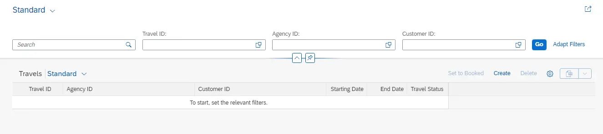

# ABAP RESTful Application Programming Model [5] – Unmanaged Scenario Part 2

This post is Part 2 of the series and covers the next steps in building the OData service i.e. create Behavior Definition, create Service Definition, and Service Binding.

So far we have created below entities and extensions.


Now, we will create a Behavior Definition and Behavior Definition Projection/Consumption.

## A) Behavior Definition

Behavior Definition defines

1. What operations (CRUD) are possible for the entities defined.
2. Whether the operations are managed by SAP or not managed by SAP i.e. unmanaged. Unmanaged operations are then required to be implemented in the associated class.
3. Additional operations/function imports are also implemented in the associated class.
4. Read-only fields / Mandatory fields from the service
5. Field Mapping

The Behavior Definition is created for the root entity and projected to the consumption layer, however, unlike the CDS Entity projections, both Travel and Booking Entities will be included together in one definition.

Here are the steps,

1. Right-click on Travel CDS Root View Entity and choose New Behavior Definition.


2. Name of the Behavior Definition will be the same as CDS View Entity. Choose Unmanaged in the drop-down, and choose Next.


3. Select the TR and choose Finish to get the below screen. Notice that the behavior is defined for both entities i.e. ZI_JP_TRAV_01 and ZI_JP_BOOK_01.


4. Complete the definition with the below code, and Save and Activate the definition.

```
unmanaged implementation in class zbp_i_jp_travel unique;
//strict;

define behavior for ZI_JP_TRAV_01 alias Travel
//late numbering
lock master
//authorization master(global)
etag master LastChangedAt
{
  field ( readonly ) TravelID, TotalPrice;
  field ( mandatory ) AgencyID, CustomerID, BeginDate, EndDate;
  create;
  update;
  delete;
  action ( features : instance ) set_status_booked result [1] $self;
  association _Booking { create ( features : instance ); }
  mapping for /dmo/travel control /dmo/s_travel_intx
  {
    AgencyID = agency_id;
    BeginDate = begin_date;
    BookingFee = booking_fee;
    CurrencyCode = currency_code;
    CustomerID = customer_id;
    EndDate = end_date;
    Status = status;
    TotalPrice = total_price;
    Description = description;
    TravelID = travel_id;
  }
  //mapping for zjp_rap_trav_01 control
}

define behavior for zi_JP_book_01 alias Booking
implementation in class zbp_i_jp_booking unique
//late numbering
lock dependent by _Travel
//authorization dependent by _Travel
etag dependent by _Travel
{
  field ( readonly ) TravelID, BookingID;
  field ( mandatory ) BookingDate, CustomerID, AirlineID, ConnectionID, FlightDate;
  update;
  delete;
  association _Travel;
  mapping for /dmo/booking control /dmo/s_booking_intx
  {
    BookingID = booking_id;
    AirlineID = carrier_id;
    BookingDate = booking_date;
    ConnectionID = connection_id;
    CurrencyCode = currency_code;
    CustomerID = customer_id;
    FlightDate = flight_date;
    FlightPrice = flight_price;
    TravelID = travel_id;
  }
}
```

5. We have not created the associated class so far, so let us do that now.


The highlighted warning has a quick-fix feature that lets us create a class automatically. Click on the yellow warning icon and then create the class. Choose the only option that is presented below.

6. Change the Description if needed and choose Next.


7. Select TR and Choose Finish. The class source code ZBP_I_JP_TRAVEL is created with 2 local classes which are inherited from cl_abap_behavior_handler and cl_abap_behavior_saver.


8. Just Save and Activate. No code for now.

9. Similarly create class zbp_i_jp_booking.


    Important Points

    1. Saver class is only created for Parent i.e. Travel

    2. In the behavior definition association to booking with create action is mentioned. This means that the child i.e. booking can only be created when Travel exists.

Expose the behavior definition to Consumption Layer by creating behavior definition for CDS Root view entity which is also at consumption layer / projection.

10. Right click on ZC_JP_TRAV_01 i.e. projection CDS view entity and choose New Behavior Definition.


11. Ensure the implementation type is Projection and choose Next.


12. Select TR, and choose Finish to get below screen.


13. Save and Activate. It is not required to change anything on this one. The code below is given for reference.

```
projection;
//strict; //Comment this line in to enable strict mode. The strict mode is prerequisite to be future proof regarding syntax and to be able to release your BO.

define behavior for ZC_RAP_TRAV_01 //alias <alias_name>
{
  use create;
  use update;
  use delete;

  use action set_status_booked;

  use association _Booking { create; }
}

define behavior for ZC_RAP_BOOK_01 //alias <alias_name>
{
  use update;
  use delete;

  use association _Travel;
}
```

This finishes the Data Modeling layer artefacts. Now, we move to Service Layer.

## B) Service Definition
1. Right click on ZC_JP_TRAV_01 and choose New Service Definition.


2. Provide Name, Description and validate Type is Definition and reference object is accurate. Choose Next.


3. Select TR and choose Finish to get below screen.


4. Complete the definition with below code, Save and Activate.

```
@EndUserText.label: 'Travel Application'
define service ZSD_JP_TRAV_01 {
  expose ZC_JP_TRAV_01 as Travel;
  expose ZC_JP_BOOK_01 as Booking;
  expose I_Currency as Currency;
  expose I_Country as Country;
}
```

## C) Service Binding

Service Binding is a way to select which version of OData we will use, register the service and then generate the service which can be tested immediately from Eclipse.

1. Right-click on the service definition ZSD_JP_TRAV_01 and choose New Service Binding.


2. Provide Name, Description, and and Binding Type (OData V2 – UI) and validate the Service Definition. Choose Next.


3. Select TR and choose Finish to get below screen.

This process is the same for Managed / Unmanaged scenarios.


4. Activate the Service Binding which then enables Publish button.


5. Click Publish. This generally takes some time, so wait. Once the Service is published, the status changes to Published, and a eview button is enabled that can be used to test.


## Test the Service
Select Travelthe the node and click Preview. (You may have to log in)

The application appears. Do not thinre is some issue ano data iswn.



Do not think thatno data iss there is no data shown. Just hit Go.


You will be able to test the filters and the display part. Here is a filter example.


Now click on any row.


At this point, Create, Update, Delete and Set to Book actions are not going to work. 