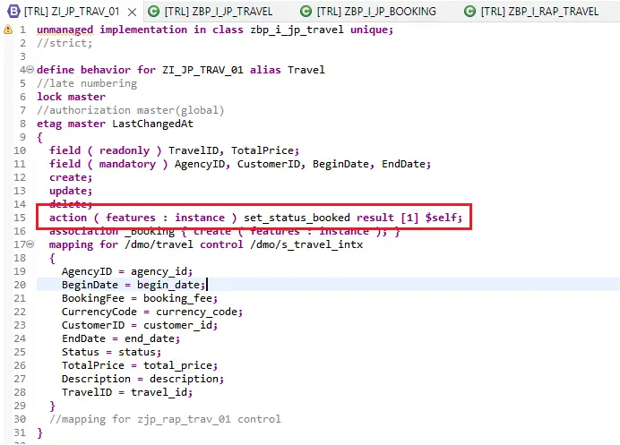

# ABAP RESTful Application Programming Model [6] – Unmanaged Scenario Part 3

Now comes probably the most important part – Implementing the behavior in the class.

Let us look at the behavior definition one more time.

```
unmanaged implementation in class zbp_i_jp_travel unique;
//strict;

define behavior for ZI_JP_TRAV_01 alias Travel
//late numbering
lock master
//authorization master(global)
etag master LastChangedAt
{
  field ( readonly ) TravelID, TotalPrice;
  field ( mandatory ) AgencyID, CustomerID, BeginDate, EndDate;
  create;
  update;
  delete;
  action ( features : instance ) set_status_booked result [1] $self;
  association _Booking { create ( features : instance ); }
  mapping for /dmo/travel control /dmo/s_travel_intx
  {
    AgencyID = agency_id;
    BeginDate = begin_date;
    BookingFee = booking_fee;
    CurrencyCode = currency_code;
    CustomerID = customer_id;
    EndDate = end_date;
    Status = status;
    TotalPrice = total_price;
    Description = description;
    TravelID = travel_id;
  }
  //mapping for zjp_rap_trav_01 control
}

define behavior for zi_JP_book_01 alias Booking
implementation in class zbp_i_jp_booking unique
//late numbering
lock dependent by _Travel
//authorization dependent by _Travel
etag dependent by _Travel
{
  field ( readonly ) TravelID, BookingID;
  field ( mandatory ) BookingDate, CustomerID, AirlineID, ConnectionID, FlightDate;
  update;
  delete;
  association _Travel;
  mapping for /dmo/booking control /dmo/s_booking_intx
  {
    BookingID = booking_id;
    AirlineID = carrier_id;
    BookingDate = booking_date;
    ConnectionID = connection_id;
    CurrencyCode = currency_code;
    CustomerID = customer_id;
    FlightDate = flight_date;
    FlightPrice = flight_price;
    TravelID = travel_id;
  }
}
```

The service has two Entities i.e. Travel and Booking. Each will be implemented in related class. The classes are mentioned in the below statements from the behavior code.

    unmanaged implementation in class zbp_i_jp_travel unique;

    define behavior for zi_JP_book_01 alias Booking
    implementation in class zbp_i_jp_booking unique
    Let us take a look at the classes.

### ZBP_I_JP_TRAVEL

The global class is created as an abstract class and the actual methods are implemented in the Local Types tab highlighted below.


The Local Types has a behavior implementer and behavior saver classes as shown below. Initially all the methods will be empty.


### ZBP_I_JP_BOOKING

The booking class only has behavior handler and not the saver as saver is only in parent entity.


## Travel Entity Behavior Implementation
### Create Travel

Where the operation is defined in behavior definition?


Method to be implemented – Create

Method definition shows that it imports parameter entities.

    METHODS create FOR MODIFY
        IMPORTING entities FOR CREATE Travel.

Now, we come to the code explanation. The code is written using ABAP expressions / new syntax / ABAP 7.4+ syntax. So if you do not understand the syntax head over to page ABAP Expressions (7.4+) for help.

- Create method is going to be called for one travel at a time, however the data is sent in a table entities so we need to loop through.
- We then have to map the data to target structure using key word MAPPING FROM ENTITY USING CONTROL
- After this we can call BAPI / FM or any other custom logic to create the entity. Here FM /DMO/FLIGHT_TRAVEL_CREATE is used.
- Once the data is created, output is updated in table mapped-travel. Here mapped is going to be constant in all such classes you will implement. This is required so that the Travel Id that is created is passed back to front end and the new Travel Id can be shown on the app.
- It is important to pass back field %cid from the input and the key fields of the entity. In this case the key is travelid.

    

- In case there are errors and the data is not created, the messages can be passed back using tables failed-travel and reported-travel. Similar to mapped, the failed and reported parameters will be constant.
- This is required to inform the frontend that there is a failure (failed) and to show the actual messages (reported)
- failed-travel – here, %cid is mandatory. reported-travel additionally has %create parameter where we need to pass ‘X’.

Here is the complete code for the method to try out.

```
  METHOD create.
    DATA : ls_travel TYPE /dmo/travel,
           lt_msg    TYPE /dmo/t_message.

    LOOP AT entities ASSIGNING FIELD-SYMBOL(<lfs_travel_entity>).

      ls_travel = CORRESPONDING #( <lfs_travel_entity> MAPPING FROM ENTITY USING CONTROL ).

      CALL FUNCTION '/DMO/FLIGHT_TRAVEL_CREATE'
        EXPORTING
          is_travel   = CORRESPONDING /dmo/s_travel_in( ls_travel )
        IMPORTING
          es_travel   = ls_travel
          et_messages = lt_msg.
      IF lt_msg IS INITIAL.
        mapped-travel = VALUE #( BASE mapped-travel
                                ( %cid = <lfs_travel_entity>-%cid
                                  travelid = ls_travel-travel_id
                                ) ).
      ELSE.
        LOOP AT lt_msg INTO DATA(ls_msg).
          APPEND VALUE #( %cid = <lfs_travel_entity>-%cid
              travelid = <lfs_travel_entity>-TravelID )
              TO failed-travel.

          APPEND VALUE #( %msg = new_message( id       = ls_msg-msgid
                                              number   = ls_msg-msgno
                                              v1       = ls_msg-msgv1
                                              v2       = ls_msg-msgv2
                                              v3       = ls_msg-msgv3
                                              v4       = ls_msg-msgv4
                                              severity = if_abap_behv_message=>severity-error )
                          %key-TravelID = <lfs_travel_entity>-TravelID
                          %cid =  <lfs_travel_entity>-%cid
                          %create = 'X'
                          TravelID = <lfs_travel_entity>-TravelID )
                          TO reported-travel.
        ENDLOOP.
      ENDIF.

    ENDLOOP.
```

Once the code is added move to the saver local class towards the end and add below code to method save.

    METHOD save.
    CALL FUNCTION '/DMO/FLIGHT_TRAVEL_SAVE'.
    CALL FUNCTION '/DMO/FLIGHT_TRAVEL_INITIALIZE'.
    ENDMETHOD.
Activate the class and then test the Create Travel behavior.

1. Click create.


2. Notice the blank travel id. Enter data in all fields and click Create.


3. The Travel id is created. Currently there are no bookings but the booking section appears where bookings can be added.


4. In case you need to debug, put the breakpoint by double clicking at the highlighted place.


5. The debug perspective is presented in Eclipse.


Note : Don’t forget to add code in saver class in save method – else the data will not be saved.


Now, it is not possible to explain everything in detail in the blog, so here is the rest of the code that you can try out. Do reach out in case explanation is needed. I have tried to highlight important points.

### Update Travel

- Data comes in entities
- mapped-travel is not required to be filled as all the data is available in frontend already
- failed-travel & reported-travel to be filled if error occurs
- Input’s %cid_ref field is to be used to pass data to failed-travel-%cid

```
  METHOD update.

    DATA : ls_travel  TYPE /dmo/travel,
           ls_travelx TYPE /dmo/s_travel_inx,
           lt_msg     TYPE /dmo/t_message.

    DATA ls_message TYPE REF TO if_abap_behv_message.

    LOOP AT entities ASSIGNING FIELD-SYMBOL(<lfs_travel_entity>).

      ls_travel = CORRESPONDING #( <lfs_travel_entity> MAPPING FROM ENTITY ).
      ls_travelx-travel_id = <lfs_travel_entity>-TravelID.
      ls_travelx-_intx = CORRESPONDING #( <lfs_travel_entity> MAPPING FROM ENTITY ).

      CALL FUNCTION '/DMO/FLIGHT_TRAVEL_UPDATE'
        EXPORTING
          is_travel   = CORRESPONDING /dmo/s_travel_in( ls_travel )
          is_travelx  = ls_travelx
        IMPORTING
          et_messages = lt_msg.
      IF lt_msg IS NOT INITIAL.
        LOOP AT lt_msg INTO DATA(ls_msg) WHERE msgty CA 'EA'.
          APPEND VALUE #( %cid = <lfs_travel_entity>-%cid_ref
              travelid = <lfs_travel_entity>-TravelID )
              TO failed-travel.

          APPEND VALUE #( %msg = new_message( id       = ls_msg-msgid
                                              number   = ls_msg-msgno
                                              v1       = ls_msg-msgv1
                                              v2       = ls_msg-msgv2
                                              v3       = ls_msg-msgv3
                                              v4       = ls_msg-msgv4
                                              severity = if_abap_behv_message=>severity-error )
                          %key-TravelID = <lfs_travel_entity>-TravelID
                          %cid =  <lfs_travel_entity>-%cid_ref
                          %update = 'X'
                          TravelID = <lfs_travel_entity>-TravelID )
                          TO reported-travel.

        ENDLOOP.
      ENDIF.

    ENDLOOP.

  ENDMETHOD.
```

### Delete Travel

- Input is keys table, as for delete you don’t need complete data
- mapped-travel is not required to be filled as all the data is available in frontend already
- failed-travel & reported-travel to be filled if error occurs
- Input’s %cid_ref field is to be used to pass data to failed-travel-%cid

```
  METHOD delete.
    DATA : lt_msg     TYPE /dmo/t_message.
    LOOP AT keys ASSIGNING FIELD-SYMBOL(<lfs_del_keys>).

      CALL FUNCTION '/DMO/FLIGHT_TRAVEL_DELETE'
        EXPORTING
          iv_travel_id = <lfs_del_keys>-TravelID
        IMPORTING
          et_messages  = lt_msg.
      IF lt_msg IS NOT INITIAL.
        LOOP AT lt_msg INTO DATA(ls_msg) WHERE msgty CA 'EA'.
          APPEND VALUE #( %cid     = <lfs_del_keys>-%cid_ref
                          travelid = <lfs_del_keys>-TravelID
                        ) TO failed-travel.

          APPEND VALUE #( %msg = new_message( id       = ls_msg-msgid
                                              number   = ls_msg-msgno
                                              v1       = ls_msg-msgv1
                                              v2       = ls_msg-msgv2
                                              v3       = ls_msg-msgv3
                                              v4       = ls_msg-msgv4
                                              severity = if_abap_behv_message=>severity-error )
                          %key-TravelID = <lfs_del_keys>-TravelID
                          %cid          =  <lfs_del_keys>-%cid_ref
                          %delete       = 'X'
                          TravelID      = <lfs_del_keys>-TravelID
                        ) TO reported-travel.

        ENDLOOP.
      ENDIF.

    ENDLOOP.

  ENDMETHOD.
```

### Set to book

This is additional button, which needs to be active only for the rows where status is not already booked i.e. ‘B’.


Behavior defines this as below. The action is defined as set_status_booked. Result is [1] i.e. single record which is $self i.e. the record that is passed is updated.

( features : instance ) – Instance Feature Control can be defined for fields, operation or action. This is a way to enable or disable certain field/operation/action based on a state of the entity.

If booking status is other than ‘B’, enable the button else disable the button.



Here is how the Instance Feature Control is implemented in the class.

Implement method read –

We need to populate the output table result based on input table keys.

    METHOD read.

        SELECT * FROM zi_rap_trav_01
            FOR ALL ENTRIES IN @keys
            WHERE TravelId = @keys-TravelId
            into CORRESPONDING FIELDS OF table @result.

    ENDMETHOD.

Implement method get_instance_features –

Here, we first need to call READ ENTITIES which in turn calls the method read and then populate table result.

%features-%action-set_status_booked is set to enabled or disabled. Similar logic can be used to enable / disable other actions as well.

```
METHOD get_instance_features.

  READ ENTITIES OF ZI_RAP_TRAV_01 IN LOCAL MODE
    ENTITY travel
       FIELDS (  travelID status )
       WITH CORRESPONDING #( keys )
     RESULT DATA(lt_travel_result)
     FAILED failed.

  result = 
    VALUE #( FOR ls_travel IN lt_travel_result
      ( %key = ls_travel-%key
        %features-%action-set_status_booked = COND #( WHEN ls_travel-status = 'B'
                                                      THEN if_abap_behv=>fc-o-disabled
                                                      ELSE if_abap_behv=>fc-o-enabled )
       ) ).
ENDMETHOD.
```

## Booking Entity Behavior Implementation
### Booking Create

The booking operations are split into two classes. The create is implemented in travel related class itself. The create operation for this association _Booking is in the Travel behavior.


Method cba_Booking

- This is a lot of code. In short, we get a travel id here, based on the travel id we fetch all bookings.
- Pick up the largest booking number and add new booking numbers with incrementing by 1 and put the data
- Then call FM /DMO/FLIGHT_TRAVEL_UPDATE to update/add the booking and pass the booking id to mapped-booking / failed-booking depending on whether or not the booking update is successful.

```
METHOD cba_Booking.

  DATA : lt_booking TYPE /dmo/t_booking,
         lt_msg     TYPE /dmo/t_message,
         lt_msg_b   TYPE /dmo/t_message.

  LOOP AT entities_cba ASSIGNING FIELD-SYMBOL(<lfs_travel_booking>).

    DATA(lv_travel_id) = <lfs_travel_booking>-TravelId.

    "Get Travel and Booking Data
    CALL FUNCTION '/DMO/FLIGHT_TRAVEL_READ'
      EXPORTING
        iv_travel_id = lv_travel_id
      IMPORTING
        et_booking   = lt_booking
        et_messages  = lt_msg.

    IF lt_msg IS INITIAL.
      IF lt_booking IS NOT INITIAL.
        DATA(lv_last_booking_id) = lt_booking[ lines( lt_booking ) ]-booking_id.
      ELSE.
        CLEAR lv_last_booking_id.
      ENDIF.

      LOOP AT <lfs_travel_booking>-%target ASSIGNING FIELD-SYMBOL(<lfs_booking>).
        DATA(ls_booking) = CORRESPONDING /dmo/booking( <lfs_booking> MAPPING FROM ENTITY USING CONTROL ).
        lv_last_booking_id += 1.
        ls_booking-booking_id = lv_last_booking_id.

        CALL FUNCTION '/DMO/FLIGHT_TRAVEL_UPDATE'
          EXPORTING
            is_travel   = VALUE /dmo/s_travel_in( travel_id = lv_travel_id )
            is_travelx  = VALUE /dmo/s_travel_inx( travel_id = lv_travel_id )
            it_booking  = VALUE /dmo/t_booking_in( ( CORRESPONDING #( ls_booking ) ) )
            it_bookingx = VALUE /dmo/t_booking_inx( ( booking_id = ls_booking-booking_id
                                                      action_code = /dmo/if_flight_legacy=>action_code-create ) )
          IMPORTING
            et_messages = lt_msg_b.

        "Pass data back to UI
        INSERT VALUE #( %cid = <lfs_booking>-%cid
                        travelid = lv_travel_id
                        bookingid = ls_booking-booking_id
                      ) INTO  TABLE mapped-booking.

        LOOP AT lt_msg_b INTO DATA(ls_msg) WHERE msgty CA 'EA'.
          APPEND VALUE #( %cid      = <lfs_booking>-%cid
                          travelid  = lv_travel_id
                          bookingid = ls_booking-booking_id
                        ) TO failed-booking.
          APPEND VALUE #( %msg = new_message( id       = ls_msg-msgid
                                              number   = ls_msg-msgno
                                              v1       = ls_msg-msgv1
                                              v2       = ls_msg-msgv2
                                              v3       = ls_msg-msgv3
                                              v4       = ls_msg-msgv4
                                              severity = if_abap_behv_message=>severity-error )
                          %key-TravelID = lv_travel_id
                          %key-bookingid = ls_booking-booking_id
                          %cid = <lfs_booking>-%cid
                          TravelID = lv_travel_id
                          bookingid = ls_booking-booking_id
                         ) TO reported-booking.
        ENDLOOP.
      ENDLOOP.

    ELSE.

      LOOP AT lt_msg INTO ls_msg WHERE msgty CA 'EA'.
        APPEND VALUE #( %cid     = <lfs_travel_booking>-%cid_ref
                        travelid = lv_travel_id
                      ) TO failed-travel.

        APPEND VALUE #( %msg = new_message( id       = ls_msg-msgid
                                            number   = ls_msg-msgno
                                            v1       = ls_msg-msgv1
                                            v2       = ls_msg-msgv2
                                            v3       = ls_msg-msgv3
                                            v4       = ls_msg-msgv4
                                            severity = if_abap_behv_message=>severity-error )
                        %key-TravelID = lv_travel_id
                        %cid          = <lfs_travel_booking>-%cid_ref
                        TravelID      = lv_travel_id
                      ) TO reported-travel.
      ENDLOOP.
    ENDIF.
  ENDLOOP.
ENDMETHOD.
```

Booking update and delete are implemented in class zbp_i_jp_booking. In both methods, FM /DMO/FLIGHT_TRAVEL_UPDATE is called with update / delete flags. In many actual scenarios, delete would mean setting up deletion flag or delete would not be an option at all.

### Booking update

```
  METHOD update.

    DATA : lt_msg     TYPE /dmo/t_message.

    LOOP AT entities ASSIGNING FIELD-SYMBOL(<lfs_booking>).
      DATA(ls_booking) = CORRESPONDING /dmo/booking( <lfs_booking> MAPPING FROM ENTITY ).

      CALL FUNCTION '/DMO/FLIGHT_TRAVEL_UPDATE'
        EXPORTING
          is_travel   = VALUE /dmo/s_travel_in( travel_id = <lfs_booking>-TravelID )
          is_travelx  = VALUE /dmo/s_travel_inx( travel_id = <lfs_booking>-TravelID )
          it_booking  = VALUE /dmo/t_booking_in( ( CORRESPONDING #( ls_booking ) ) )
          it_bookingx = VALUE /dmo/t_booking_inx( ( booking_id = <lfs_booking>-BookingID
                                                    _intx      = CORRESPONDING #( <lfs_booking> MAPPING FROM ENTITY )
                                                    action_code = /dmo/if_flight_legacy=>action_code-update ) )
        IMPORTING
          et_messages = lt_msg.

      "Pass data back to UI
      INSERT VALUE #( %cid = <lfs_booking>-%cid_ref
                      travelid = <lfs_booking>-TravelID
                      bookingid = <lfs_booking>-BookingID
                    ) INTO  TABLE mapped-booking.

      LOOP AT lt_msg INTO DATA(ls_msg) WHERE msgty CA 'EA'.
        APPEND VALUE #( %cid      =  <lfs_booking>-%cid_ref
                        travelid  = <lfs_booking>-TravelID
                        bookingid = <lfs_booking>-BookingID
                      ) TO failed-booking.

        APPEND VALUE #( %msg = new_message( id       = ls_msg-msgid
                                            number   = ls_msg-msgno
                                            v1       = ls_msg-msgv1
                                            v2       = ls_msg-msgv2
                                            v3       = ls_msg-msgv3
                                            v4       = ls_msg-msgv4
                                            severity = if_abap_behv_message=>severity-error )
                        %key-TravelID  = <lfs_booking>-TravelID
                        %key-bookingid = ls_booking-booking_id
                        %cid           = <lfs_booking>-%cid_ref
                        %update        = 'X'
                        TravelID       = <lfs_booking>-TravelID
                        bookingid      = <lfs_booking>-BookingID
                       ) TO reported-booking.
      ENDLOOP.
    ENDLOOP.
  ENDMETHOD.
```

### Booking delete

```
METHOD delete.
    DATA : lt_msg     TYPE /dmo/t_message.
    LOOP AT keys ASSIGNING FIELD-SYMBOL(<lfs_booking>).

      CALL FUNCTION '/DMO/FLIGHT_TRAVEL_UPDATE'
        EXPORTING
          is_travel   = VALUE /dmo/s_travel_in( travel_id = <lfs_booking>-TravelID )
          is_travelx  = VALUE /dmo/s_travel_inx( travel_id = <lfs_booking>-TravelID )
          it_booking  = VALUE /dmo/t_booking_in( ( booking_id = <lfs_booking>-BookingID ) )
          it_bookingx = VALUE /dmo/t_booking_inx( ( booking_id = <lfs_booking>-BookingID
                                                    action_code = /dmo/if_flight_legacy=>action_code-delete ) )
        IMPORTING
          et_messages = lt_msg.
      IF lt_msg IS NOT INITIAL.
        LOOP AT lt_msg INTO DATA(ls_msg) WHERE msgty CA 'EA'.
          APPEND VALUE #( %cid     = <lfs_booking>-%cid_ref
                          travelid = <lfs_booking>-TravelID
                          bookingid = <lfs_booking>-BookingID
                        ) TO failed-booking.

          APPEND VALUE #( %msg = new_message( id       = ls_msg-msgid
                                              number   = ls_msg-msgno
                                              v1       = ls_msg-msgv1
                                              v2       = ls_msg-msgv2
                                              v3       = ls_msg-msgv3
                                              v4       = ls_msg-msgv4
                                              severity = if_abap_behv_message=>severity-error )
                          %key-TravelID = <lfs_booking>-TravelID
                          %key-bookingid = <lfs_booking>-BookingID
                          %cid          =  <lfs_booking>-%cid_ref
                          %delete       = 'X'
                          TravelID      = <lfs_booking>-TravelID
                          bookingid = <lfs_booking>-BookingID
                        ) TO reported-booking.
        ENDLOOP.
      ENDIF.
    ENDLOOP.
  ENDMETHOD.
```

Now test all the functionality and you have a working service. This marks end of the 3 part series on unmanaged scenario. In next post we will see how the unmanaged service can be used to create a Fiori element app in Business Application Studio.

This has become a long post and I have tried to explain as much as I can. I know I have skipped few key words / concepts like strict, late numbering, etag master etc, which I will try to explain in some post later.

================================================================================

Projection Entities define interfaces on the basis of existing CDS Entity. It is always based on exactly one existing CDS view entity and it projects a subset of its elements required for the business service.

Metadata Extensions are created to annotate entities at header level and at field level. These annotations drive the descriptions of fields, sequence of fields on application and whether the fields will be available in filter bar or not.

The Behavior Definition is created for the root entity and projected to the consumption layer, however, unlike the CDS Entity projections, both Travel and Booking Entities will be included together in one definition.

Expose the behavior definition to Consumption Layer by creating behavior definition for CDS Root view entity which is also at consumption layer / projection.

Service Binding is a way to select which version of OData we will use, register the service and then generate the service which can be tested immediately from Eclipse.

```
parent
^
|       composition (Parent Child relationship)
child

ZI_JP_TRAV_01 (root view entity) consumption view on table /dmo/travel
^
|
ZI_JP_BOOK_01 (view entity) on table /dmo/booking
    association to parent ZI_JP_TRAV_01

ZI_JP_TRAV_01 (root view entity) consumption view on table /dmo/travel (1)
|
|-> ZC_JP_TRAV_01 (root view entity) Projection Entity on ZI_JP_TRAV_01 (3)
|   |
|   |-> ZME_JP_TRAV_01 (annotate entity) Metadata Extension (5)
|   |
|   |-> ZC_JP_TRAV_01 Behaviour Definition created with the ZI_JP_BOOK_01 (8)
        ZC_RAP_TRAV_01, ZC_RAP_BOOK_01
|   |
|   |-> ZSD_JP_TRAV_01 Service Definition Exposes ZC_JP_TRAV01, ZC_JP_BOOK_01 (9)
|       |
|       |-> ZSB_JP_TRAVEL_01 Service Binding (10)
|
|-> ZI_JP_TRAV_01 Behaviour Definition (7)
    |
    |-> ZI_JP_BOOK_01 Behaviour Definition created with the ZI_JP_BOOK_01


ZI_JP_BOOK_01 (view entity) on table /dmo/booking (2)
|
|-> ZC_JP_BOOK_01 (view entity) Projection Entity on ZI_JP_BOOK_01 (4)
    |
    |-> ZME_JP_BOOK_01 (annotate entity) Metadata Extension (6)
```

=> ZI_JP_TRAV_01 (root view entity) consumption view on table /dmo/travel
```
@AccessControl.authorizationCheck: #NOT_REQUIRED
@EndUserText.label: 'Root Entity for Travel'
define root view entity ZI_JP_TRAV_01
as select from /dmo/travel as Travel
    composition [0..*] of ZI_JP_BOOK_01 as _Booking
    association [0..1] to /DMO/I_Agency as _Agency on $projection.AgencyId = _Agency.AgencyID
    association [0..1] to /DMO/I_Customer as _Customer on $projection.CustomerId = _Customer.CustomerID
    association [0..1] to I_Currency as _Currency on $projection.CurrencyCode = _Currency.Currency
{
    key Travel.travel_id as TravelId,
        Travel.agency_id as AgencyId,
        Travel.customer_id as CustomerId,
        Travel.begin_date as BeginDate,
        Travel.end_date as EndDate,
        @Semantics.amount.currencyCode: 'CurrencyCode'
        Travel.booking_fee as BookingFee,
        @Semantics.amount.currencyCode: 'CurrencyCode'
        Travel.total_price as TotalPrice,
        Travel.currency_code as CurrencyCode,
        Travel.description as Description,
        Travel.status as Status,
        Travel.lastchangedat as LastChangedAt,
        _Booking,
        _Agency,
        _Customer,
        _Currency
}
```

=> ZI_JP_BOOK_01 (view entity) on table /dmo/booking
```
@AbapCatalog.viewEnhancementCategory: [#NONE]
@AccessControl.authorizationCheck: #NOT_REQUIRED
@EndUserText.label: 'Entity for Booking'
@Metadata.ignorePropagatedAnnotations: true
@ObjectModel.usageType:{
    serviceQuality: #X,
    sizeCategory: #S,
    dataClass: #MIXED
}
define view entity ZI_JP_BOOK_01 as 
select from /dmo/booking as Booking
    association to parent ZI_JP_TRAV_01 as _Travel
    on $projection.TravelID = _Travel.TravelId
    association [1..1] to /DMO/I_Customer as _Customer
    on $projection.CustomerID = _Customer.CustomerID
    association [1..1] to /DMO/I_Carrier as _Carrier
    on $projection.AirlineID = _Carrier.AirlineID
    association [1..1] to /DMO/I_Connection as _Connection
    on $projection.AirlineID = _Connection.AirlineID
    and $projection.ConnectionID = _Connection.ConnectionID
{
    key Booking.travel_id as TravelID,
    key Booking.booking_id as BookingID,
        Booking.booking_date as BookingDate,
        Booking.customer_id as CustomerID,
        Booking.carrier_id as AirlineID,
        Booking.connection_id as ConnectionID,
        Booking.flight_date as FlightDate,
        @Semantics.amount.currencyCode: 'CurrencyCode'
        Booking.flight_price as FlightPrice,
        Booking.currency_code as CurrencyCode,
        _Travel,
        _Customer,
        _Carrier,
        _Connection
}
```

=> ZC_JP_TRAV_01 (root view entity) Projection Entity on ZI_JP_TRAV_01

    define root view entity ZC_JP_TRAV_01
    as projection on ZI_JP_TRAV_01

This defines that the entity ZC_JP_TRAV_01 is a projection on entity ZI_JP_TRAV_01. As the base entity is a root entity, the projection entity also has to be a root entity.

    _Booking : redirected to composition child ZC_JP_BOOK_01,

This is a reference to the projection entity of the child i.e. booking.
```
@AbapCatalog.viewEnhancementCategory: [#NONE]
@AccessControl.authorizationCheck: #NOT_REQUIRED
@EndUserText.label: 'Consumption View for Travel'
@Metadata.ignorePropagatedAnnotations: true
@Metadata.allowExtensions: true
@Search.searchable: true
@ObjectModel.usageType:{
    serviceQuality: #X,
    sizeCategory: #S,
    dataClass: #MIXED
}

@UI:{ headerInfo: {
    typeName: 'Travel',
    typeNamePlural: 'Travels',
    title: {
        type: #STANDARD,
        value: 'TravelID'
    }
} }
define root view entity ZC_JP_TRAV_01
  as projection on ZI_JP_TRAV_01
{

  key TravelId,

      @Consumption.valueHelpDefinition: [{

          entity: {
              name: '/DMO/I_Agency',
              element: 'AgencyID'
          }}]
      @ObjectModel.text.element: ['AgencyName']
      @Search.defaultSearchElement: true
      AgencyId,
      _Agency.Name        as AgencyName,

      @Consumption.valueHelpDefinition: [{

               entity: {
                   name: '/DMO/I_Customer',
                   element: 'CustomerID'
               }}]
      @ObjectModel.text.element: ['CustomerName']
      @Search.defaultSearchElement: true

      CustomerId,
      _Customer.FirstName as CustomerName,

      BeginDate, 
      EndDate,
      @Semantics.amount.currencyCode: 'CurrencyCode'
      BookingFee,
      @Semantics.amount.currencyCode: 'CurrencyCode'
      TotalPrice,

      @Consumption.valueHelpDefinition: [{

             entity: {
                 name: 'I_Currency',
                 element: 'Currency'
             }}]
      @Search.defaultSearchElement: true
      CurrencyCode,
      Description,
      Status,
      LastChangedAt,
      _Agency,
      _Booking : redirected to composition child ZC_JP_BOOK_01,
      _Currency,
      _Customer
}
```

=> ZC_JP_BOOK_01

This will be not a root view entity, because base is also not a root view entity.

    @Consumption.valueHelpDefinition: [{
        entity: {
            name: '/DMO/I_Flight',
            element: 'ConnectionID'
        },
        additionalBinding: [
            {localElement: 'FlightDate', element: 'FlightDate'},
            {localElement: 'AirlineID',element: 'AirlineID' },
            {localElement: 'FlightPrice',element: 'Price'},
            {localElement: 'CurrencyCode',element: 'CurrencyCode'}]
    }]
    ConnectionID,

Here, there is additional binding is specified which helps populate related fields from single value help. i.e. when connection id is selected from the value help, corresponding flight date, airline id, price and currency is also populated.

    _Travel : redirected to parent ZC_JP_TRAV_01
Similar to Travel entity, Booking entity also refers to the parent-child association by specifying the parent projection entity name.

```
@AbapCatalog.viewEnhancementCategory: [#NONE]
@AccessControl.authorizationCheck: #NOT_REQUIRED
@EndUserText.label: 'Projection for Booking'
@Metadata.ignorePropagatedAnnotations: true
@Metadata.allowExtensions: true
@Search.searchable: true
@ObjectModel.usageType:{
    serviceQuality: #X,
    sizeCategory: #S,
    dataClass: #MIXED
}
define view entity ZC_JP_BOOK_01
  as projection on ZI_JP_BOOK_01
{
      //Z_I_BOOKING_U
      @Search.defaultSearchElement: true
  key TravelID,
      @Search.defaultSearchElement: true
  key BookingID,

      BookingDate,

      @Consumption.valueHelpDefinition: [{

          entity: {
              name: '/DMO/I_Customer',
              element: 'CustomerID'
          }}]
      @Search.defaultSearchElement: true
      @ObjectModel.text.element: ['CustomerName']
      CustomerID,
      _Customer.FirstName as CustomerName,

      @Consumption.valueHelpDefinition: [{

         entity: {
             name: '/DMO/I_Carrier',
             element: 'AirlineID'
         }}]
      @Search.defaultSearchElement: true
      @ObjectModel.text.element: ['AirlineName']

      AirlineID,
      _Carrier.Name       as AirlineName,

      @Consumption.valueHelpDefinition: [{
          entity: {
              name: '/DMO/I_Flight',
              element: 'ConnectionID'
          },
          additionalBinding: [
              {localElement: 'FlightDate', element: 'FlightDate'},
              {localElement: 'AirlineID',element: 'AirlineID' },
              {localElement: 'FlightPrice',element: 'Price'},
              {localElement: 'CurrencyCode',element: 'CurrencyCode'}]
      }]
      ConnectionID,

      @Consumption.valueHelpDefinition: [{
          entity: {
              name: '/DMO/I_Flight',
              element: 'FlightDate'
          },
          additionalBinding: [
              {localElement: 'ConnectionID', element: 'ConnectionID'},
              {localElement: 'AirlineID',element: 'AirlineID' },
              {localElement: 'FlightPrice',element: 'Price'},
              {localElement: 'CurrencyCode',element: 'CurrencyCode'}]
      }]
      FlightDate, 

      @Semantics.amount.currencyCode: 'CurrencyCode'
      FlightPrice,

      @Consumption.valueHelpDefinition: [{
         entity: {
             name: 'I_Currency',
             element: 'Currency'
         }}]

      CurrencyCode,
      _Carrier,
      _Connection,
      _Customer,
      _Travel : redirected to parent ZC_JP_TRAV_01
}
```

=> ZME_JP_TRAV_01

Here, lineItem specifies position in the list, identification specifies position in the detail page and identification specifies position in the filter bar.

We can also create additional buttons on the application using the type #FOR_ACTION.

    @UI.lineItem: [{position: 50,importance: #HIGH },
                             { type: #FOR_ACTION,
                               dataAction: 'set_status_booked' ,
                               label: 'Set to Booked'}]

```
@Metadata.layer: #CUSTOMER
@UI:{ headerInfo: {
    typeName: 'Travel',
    typeNamePlural: 'Travels',
    title: {
        type: #STANDARD,
        value: 'TravelID'
    }
} }
annotate entity ZC_JP_TRAV_01 with
{
    @UI.facet: [{
            id: 'Travel',
            purpose: #STANDARD,
            position: 10,
            label: 'Travel',
            type: #IDENTIFICATION_REFERENCE
        },{

            id: 'Booking',
            purpose: #STANDARD,
            position: 20,
            label: 'Booking',
            type: #LINEITEM_REFERENCE,
            targetElement: '_Booking'
        }]

    @UI:{ lineItem: [{position: 10,importance: #HIGH }],
            identification: [{position: 10 }],
            selectionField: [{position: 10 }] }
    TravelId;

    @UI:{ lineItem: [{position: 20,importance: #HIGH }],
            identification: [{position: 20 }],selectionField: [{position: 20 }] }
    AgencyId;

    @UI:{ lineItem: [{position: 30,importance: #HIGH }],
            identification: [{position: 30 }],selectionField: [{position: 30 }] }
    CustomerId;

    @UI:{ lineItem: [{position: 40,importance: #MEDIUM }],
        identification: [{position: 40 }] }

    BeginDate;

    @UI:{ lineItem: [{position: 41,importance: #MEDIUM }],
        identification: [{position: 41 }] }
    EndDate;

    @UI.identification: [{position: 42 }]
    BookingFee;

    @UI.identification: [{position: 43 }]
    TotalPrice;
    
    @UI.identification: [{position: 44 }]
    Description;
        
    @UI.lineItem: [{position: 50,importance: #HIGH },
                                { type: #FOR_ACTION,
                                dataAction: 'set_status_booked' ,
                                label: 'Set to Booked'}]
    Status;
}
```

=> ZME_JP_BOOK_01
```
@Metadata.layer: #CUSTOMER
@UI.headerInfo: {
    typeName: 'Booking',
    typeNamePlural: 'Bookings',
    title: {
        type: #STANDARD,
        label: 'Booking',
        value: 'BookingID'
    }
}
annotate entity ZC_JP_BOOK_01
    with 
{
    @UI.facet: [{id: 'Booking',
                    purpose: #STANDARD,
                    type: #IDENTIFICATION_REFERENCE,
                    label: 'Booking',
                    position: 10 }]
    @UI:{lineItem: [{  position: 10,importance: #HIGH }],
                    identification: [{position: 10 }]
    }
    BookingID;

    @UI:{lineItem: [{position: 20,importance: #HIGH }],
            identification: [{position: 20 }]
    }
    BookingDate;

    @UI:{lineItem: [{position: 30,importance: #HIGH }],
        identification: [{position: 30 }]
    }
    CustomerID;

    @UI:{lineItem: [{position: 40,importance: #HIGH }],
        identification: [{position: 40 }]
    }
    AirlineID;
    @UI:{lineItem: [{position: 50,importance: #HIGH }],
            identification: [{position: 50 }]
    }
    ConnectionID;

    @UI:{lineItem: [{position: 60,importance: #HIGH }],
        identification: [{position: 60 }]
    }

    FlightDate;

    @UI:{lineItem: [{position: 70,importance: #HIGH }],
        identification: [{position: 70 }]
    }
    FlightPrice;
}
```

=> ZI_JP_TRAV_01 Behaviour Definition
Notice that the behavior is defined for both entities i.e. ZI_JP_TRAV_01 and ZI_JP_BOOK_01.
```
unmanaged implementation in class zbp_i_jp_travel unique;
//strict;

define behavior for ZI_JP_TRAV_01 alias Travel
//late numbering
lock master
//authorization master(global)
etag master LastChangedAt
{
  field ( readonly ) TravelID, TotalPrice;
  field ( mandatory ) AgencyID, CustomerID, BeginDate, EndDate;
  create;
  update;
  delete;
  action ( features : instance ) set_status_booked result [1] $self;
  association _Booking { create ( features : instance ); }
  mapping for /dmo/travel control /dmo/s_travel_intx
  {
    AgencyID = agency_id;
    BeginDate = begin_date;
    BookingFee = booking_fee;
    CurrencyCode = currency_code;
    CustomerID = customer_id;
    EndDate = end_date;
    Status = status;
    TotalPrice = total_price;
    Description = description;
    TravelID = travel_id;
  }
  //mapping for zjp_rap_trav_01 control
}

define behavior for zi_JP_book_01 alias Booking
implementation in class zbp_i_jp_booking unique
//late numbering
lock dependent by _Travel
//authorization dependent by _Travel
etag dependent by _Travel
{
  field ( readonly ) TravelID, BookingID;
  field ( mandatory ) BookingDate, CustomerID, AirlineID, ConnectionID, FlightDate;
  update;
  delete;
  association _Travel;
  mapping for /dmo/booking control /dmo/s_booking_intx
  {
    BookingID = booking_id;
    AirlineID = carrier_id;
    BookingDate = booking_date;
    ConnectionID = connection_id;
    CurrencyCode = currency_code;
    CustomerID = customer_id;
    FlightDate = flight_date;
    FlightPrice = flight_price;
    TravelID = travel_id;
  }
}
```

=> ZC_RAP_TRAV_01
=> ZC_JP_TRAV_01
```
projection;
//strict; //Comment this line in to enable strict mode. The strict mode is prerequisite to be future proof regarding syntax and to be able to release your BO.

define behavior for ZC_JP_TRAV_01 //alias <alias_name>
{
  use create;
  use update;
  use delete;

  use action set_status_booked;

  use association _Booking { create; }
}

define behavior for ZC_JP_BOOK_01 //alias <alias_name>
{
  use update;
  use delete;

  use association _Travel;
}
```

=> ZSD_JP_TRAV_01
```
@EndUserText.label: 'Travel Application'
define service ZSD_JP_TRAV_01 {
  expose ZC_JP_TRAV_01 as Travel;
  expose ZC_JP_BOOK_01 as Booking;
  expose I_Currency as Currency;
  expose I_Country as Country;
}
```

=> ZI_JP_TRAV_01 Behavoir Class
```
unmanaged implementation in class zbp_i_jp_travel unique;
//strict;

define behavior for ZI_JP_TRAV_01 alias Travel
//late numbering
lock master
//authorization master(global)
etag master LastChangedAt
{
  field ( readonly ) TravelID, TotalPrice;
  field ( mandatory ) AgencyID, CustomerID, BeginDate, EndDate;
  create;
  update;
  delete;
  action ( features : instance ) set_status_booked result [1] $self;
  association _Booking { create ( features : instance ); }
  mapping for /dmo/travel control /dmo/s_travel_intx
  {
    AgencyID = agency_id;
    BeginDate = begin_date;
    BookingFee = booking_fee;
    CurrencyCode = currency_code;
    CustomerID = customer_id;
    EndDate = end_date;
    Status = status;
    TotalPrice = total_price;
    Description = description;
    TravelID = travel_id;
  }
  //mapping for zjp_rap_trav_01 control
}

define behavior for zi_JP_book_01 alias Booking
implementation in class zbp_i_jp_booking unique
//late numbering
lock dependent by _Travel
//authorization dependent by _Travel
etag dependent by _Travel
{
  field ( readonly ) TravelID, BookingID;
  field ( mandatory ) BookingDate, CustomerID, AirlineID, ConnectionID, FlightDate;
  update;
  delete;
  association _Travel;
  mapping for /dmo/booking control /dmo/s_booking_intx
  {
    BookingID = booking_id;
    AirlineID = carrier_id;
    BookingDate = booking_date;
    ConnectionID = connection_id;
    CurrencyCode = currency_code;
    CustomerID = customer_id;
    FlightDate = flight_date;
    FlightPrice = flight_price;
    TravelID = travel_id;
  }
}
```

```
METHOD create.
    DATA : ls_travel TYPE /dmo/travel,
           lt_msg    TYPE /dmo/t_message.

    LOOP AT entities ASSIGNING FIELD-SYMBOL(<lfs_travel_entity>).

        ls_travel = CORRESPONDING #( <lfs_travel_entity> MAPPING FROM ENTITY USING CONTROL ).

        CALL FUNCTION '/DMO/FLIGHT_TRAVEL_CREATE'
            EXPORTING
            is_travel   = CORRESPONDING /dmo/s_travel_in( ls_travel )
            IMPORTING
            es_travel   = ls_travel
            et_messages = lt_msg.
        IF lt_msg IS INITIAL.
            mapped-travel = VALUE #( BASE mapped-travel
                                    ( %cid = <lfs_travel_entity>-%cid
                                    travelid = ls_travel-travel_id
                                    ) ).
        ELSE.
            LOOP AT lt_msg INTO DATA(ls_msg).
                APPEND VALUE #( %cid = <lfs_travel_entity>-%cid
                travelid = <lfs_travel_entity>-TravelID )
                TO failed-travel.

            APPEND VALUE #( %msg = new_message( id       = ls_msg-msgid
                                                number   = ls_msg-msgno
                                                v1       = ls_msg-msgv1
                                                v2       = ls_msg-msgv2
                                                v3       = ls_msg-msgv3
                                                v4       = ls_msg-msgv4
                                                severity = if_abap_behv_message=>severity-error )
                            %key-TravelID = <lfs_travel_entity>-TravelID
                            %cid =  <lfs_travel_entity>-%cid
                            %create = 'X'
                            TravelID = <lfs_travel_entity>-TravelID )
                            TO reported-travel.
            ENDLOOP.
        ENDIF.
    ENDLOOP.


METHOD save.
    CALL FUNCTION '/DMO/FLIGHT_TRAVEL_SAVE'.
    CALL FUNCTION '/DMO/FLIGHT_TRAVEL_INITIALIZE'.
ENDMETHOD.

METHOD update.

    DATA : ls_travel  TYPE /dmo/travel,
           ls_travelx TYPE /dmo/s_travel_inx,
           lt_msg     TYPE /dmo/t_message.

    DATA ls_message TYPE REF TO if_abap_behv_message.

    LOOP AT entities ASSIGNING FIELD-SYMBOL(<lfs_travel_entity>).

      ls_travel = CORRESPONDING #( <lfs_travel_entity> MAPPING FROM ENTITY ).
      ls_travelx-travel_id = <lfs_travel_entity>-TravelID.
      ls_travelx-_intx = CORRESPONDING #( <lfs_travel_entity> MAPPING FROM ENTITY ).

        CALL FUNCTION '/DMO/FLIGHT_TRAVEL_UPDATE'
            EXPORTING
                is_travel   = CORRESPONDING /dmo/s_travel_in( ls_travel )
                is_travelx  = ls_travelx
            IMPORTING
                et_messages = lt_msg.
        IF lt_msg IS NOT INITIAL.
            LOOP AT lt_msg INTO DATA(ls_msg) WHERE msgty CA 'EA'.
                APPEND VALUE #( %cid = <lfs_travel_entity>-%cid_ref
                travelid = <lfs_travel_entity>-TravelID )
                TO failed-travel.

                APPEND VALUE #( %msg = new_message( id       = ls_msg-msgid
                                                    number   = ls_msg-msgno
                                                    v1       = ls_msg-msgv1
                                                    v2       = ls_msg-msgv2
                                                    v3       = ls_msg-msgv3
                                                    v4       = ls_msg-msgv4
                                                    severity = if_abap_behv_message=>severity-error )
                                %key-TravelID = <lfs_travel_entity>-TravelID
                                %cid =  <lfs_travel_entity>-%cid_ref
                                %update = 'X'
                                TravelID = <lfs_travel_entity>-TravelID )
                                TO reported-travel.
            ENDLOOP.
        ENDIF.

    ENDLOOP.

ENDMETHOD.

METHOD delete.
    DATA : lt_msg     TYPE /dmo/t_message.
    LOOP AT keys ASSIGNING FIELD-SYMBOL(<lfs_del_keys>).

        CALL FUNCTION '/DMO/FLIGHT_TRAVEL_DELETE'
            EXPORTING
            iv_travel_id = <lfs_del_keys>-TravelID
            IMPORTING
            et_messages  = lt_msg.
        IF lt_msg IS NOT INITIAL.
            LOOP AT lt_msg INTO DATA(ls_msg) WHERE msgty CA 'EA'.
                APPEND VALUE #( %cid     = <lfs_del_keys>-%cid_ref
                                travelid = <lfs_del_keys>-TravelID
                                ) TO failed-travel.

                APPEND VALUE #( %msg = new_message( id       = ls_msg-msgid
                                                    number   = ls_msg-msgno
                                                    v1       = ls_msg-msgv1
                                                    v2       = ls_msg-msgv2
                                                    v3       = ls_msg-msgv3
                                                    v4       = ls_msg-msgv4
                                                    severity = if_abap_behv_message=>severity-error )
                                %key-TravelID = <lfs_del_keys>-TravelID
                                %cid          =  <lfs_del_keys>-%cid_ref
                                %delete       = 'X'
                                TravelID      = <lfs_del_keys>-TravelID
                                ) TO reported-travel.
            ENDLOOP.
        ENDIF.

    ENDLOOP.
ENDMETHOD.

METHOD read.

    SELECT * FROM zi_rap_trav_01
        FOR ALL ENTRIES IN @keys
        WHERE TravelId = @keys-TravelId
        into CORRESPONDING FIELDS OF table @result.

  ENDMETHOD.

METHOD get_instance_features.

    READ ENTITIES OF ZI_RAP_TRAV_01 IN LOCAL MODE
        ENTITY travel
        FIELDS (  travelID status )
        WITH CORRESPONDING #( keys )
        RESULT DATA(lt_travel_result)
        FAILED failed.

    result = 
        VALUE #( FOR ls_travel IN lt_travel_result
        ( %key = ls_travel-%key
            %features-%action-set_status_booked = COND #( WHEN ls_travel-status = 'B'
                                                        THEN if_abap_behv=>fc-o-disabled
                                                        ELSE if_abap_behv=>fc-o-enabled )
        ) ).
ENDMETHOD.

METHOD cba_Booking.

  DATA : lt_booking TYPE /dmo/t_booking,
         lt_msg     TYPE /dmo/t_message,
         lt_msg_b   TYPE /dmo/t_message.

  LOOP AT entities_cba ASSIGNING FIELD-SYMBOL(<lfs_travel_booking>).

    DATA(lv_travel_id) = <lfs_travel_booking>-TravelId.

    "Get Travel and Booking Data
    CALL FUNCTION '/DMO/FLIGHT_TRAVEL_READ'
      EXPORTING
        iv_travel_id = lv_travel_id
      IMPORTING
        et_booking   = lt_booking
        et_messages  = lt_msg.

    IF lt_msg IS INITIAL.
      IF lt_booking IS NOT INITIAL.
        DATA(lv_last_booking_id) = lt_booking[ lines( lt_booking ) ]-booking_id.
      ELSE.
        CLEAR lv_last_booking_id.
      ENDIF.

      LOOP AT <lfs_travel_booking>-%target ASSIGNING FIELD-SYMBOL(<lfs_booking>).
        DATA(ls_booking) = CORRESPONDING /dmo/booking( <lfs_booking> MAPPING FROM ENTITY USING CONTROL ).
        lv_last_booking_id += 1.
        ls_booking-booking_id = lv_last_booking_id.

        CALL FUNCTION '/DMO/FLIGHT_TRAVEL_UPDATE'
          EXPORTING
            is_travel   = VALUE /dmo/s_travel_in( travel_id = lv_travel_id )
            is_travelx  = VALUE /dmo/s_travel_inx( travel_id = lv_travel_id )
            it_booking  = VALUE /dmo/t_booking_in( ( CORRESPONDING #( ls_booking ) ) )
            it_bookingx = VALUE /dmo/t_booking_inx( ( booking_id = ls_booking-booking_id
                                                      action_code = /dmo/if_flight_legacy=>action_code-create ) )
          IMPORTING
            et_messages = lt_msg_b.

        "Pass data back to UI
        INSERT VALUE #( %cid = <lfs_booking>-%cid
                        travelid = lv_travel_id
                        bookingid = ls_booking-booking_id
                      ) INTO  TABLE mapped-booking.

        LOOP AT lt_msg_b INTO DATA(ls_msg) WHERE msgty CA 'EA'.
          APPEND VALUE #( %cid      = <lfs_booking>-%cid
                          travelid  = lv_travel_id
                          bookingid = ls_booking-booking_id
                        ) TO failed-booking.
          APPEND VALUE #( %msg = new_message( id       = ls_msg-msgid
                                              number   = ls_msg-msgno
                                              v1       = ls_msg-msgv1
                                              v2       = ls_msg-msgv2
                                              v3       = ls_msg-msgv3
                                              v4       = ls_msg-msgv4
                                              severity = if_abap_behv_message=>severity-error )
                          %key-TravelID = lv_travel_id
                          %key-bookingid = ls_booking-booking_id
                          %cid = <lfs_booking>-%cid
                          TravelID = lv_travel_id
                          bookingid = ls_booking-booking_id
                         ) TO reported-booking.
        ENDLOOP.
      ENDLOOP.

    ELSE.

      LOOP AT lt_msg INTO ls_msg WHERE msgty CA 'EA'.
        APPEND VALUE #( %cid     = <lfs_travel_booking>-%cid_ref
                        travelid = lv_travel_id
                      ) TO failed-travel.

        APPEND VALUE #( %msg = new_message( id       = ls_msg-msgid
                                            number   = ls_msg-msgno
                                            v1       = ls_msg-msgv1
                                            v2       = ls_msg-msgv2
                                            v3       = ls_msg-msgv3
                                            v4       = ls_msg-msgv4
                                            severity = if_abap_behv_message=>severity-error )
                        %key-TravelID = lv_travel_id
                        %cid          = <lfs_travel_booking>-%cid_ref
                        TravelID      = lv_travel_id
                      ) TO reported-travel.
      ENDLOOP.
    ENDIF.
  ENDLOOP.
ENDMETHOD.

 METHOD update.

    DATA : lt_msg     TYPE /dmo/t_message.

    LOOP AT entities ASSIGNING FIELD-SYMBOL(<lfs_booking>).
      DATA(ls_booking) = CORRESPONDING /dmo/booking( <lfs_booking> MAPPING FROM ENTITY ).

      CALL FUNCTION '/DMO/FLIGHT_TRAVEL_UPDATE'
        EXPORTING
          is_travel   = VALUE /dmo/s_travel_in( travel_id = <lfs_booking>-TravelID )
          is_travelx  = VALUE /dmo/s_travel_inx( travel_id = <lfs_booking>-TravelID )
          it_booking  = VALUE /dmo/t_booking_in( ( CORRESPONDING #( ls_booking ) ) )
          it_bookingx = VALUE /dmo/t_booking_inx( ( booking_id = <lfs_booking>-BookingID
                                                    _intx      = CORRESPONDING #( <lfs_booking> MAPPING FROM ENTITY )
                                                    action_code = /dmo/if_flight_legacy=>action_code-update ) )
        IMPORTING
          et_messages = lt_msg.

      "Pass data back to UI
      INSERT VALUE #( %cid = <lfs_booking>-%cid_ref
                      travelid = <lfs_booking>-TravelID
                      bookingid = <lfs_booking>-BookingID
                    ) INTO  TABLE mapped-booking.

      LOOP AT lt_msg INTO DATA(ls_msg) WHERE msgty CA 'EA'.
        APPEND VALUE #( %cid      =  <lfs_booking>-%cid_ref
                        travelid  = <lfs_booking>-TravelID
                        bookingid = <lfs_booking>-BookingID
                      ) TO failed-booking.

        APPEND VALUE #( %msg = new_message( id       = ls_msg-msgid
                                            number   = ls_msg-msgno
                                            v1       = ls_msg-msgv1
                                            v2       = ls_msg-msgv2
                                            v3       = ls_msg-msgv3
                                            v4       = ls_msg-msgv4
                                            severity = if_abap_behv_message=>severity-error )
                        %key-TravelID  = <lfs_booking>-TravelID
                        %key-bookingid = ls_booking-booking_id
                        %cid           = <lfs_booking>-%cid_ref
                        %update        = 'X'
                        TravelID       = <lfs_booking>-TravelID
                        bookingid      = <lfs_booking>-BookingID
                       ) TO reported-booking.
      ENDLOOP.
    ENDLOOP.
  ENDMETHOD.

  METHOD delete.
    DATA : lt_msg     TYPE /dmo/t_message.
    LOOP AT keys ASSIGNING FIELD-SYMBOL(<lfs_booking>).

      CALL FUNCTION '/DMO/FLIGHT_TRAVEL_UPDATE'
        EXPORTING
          is_travel   = VALUE /dmo/s_travel_in( travel_id = <lfs_booking>-TravelID )
          is_travelx  = VALUE /dmo/s_travel_inx( travel_id = <lfs_booking>-TravelID )
          it_booking  = VALUE /dmo/t_booking_in( ( booking_id = <lfs_booking>-BookingID ) )
          it_bookingx = VALUE /dmo/t_booking_inx( ( booking_id = <lfs_booking>-BookingID
                                                    action_code = /dmo/if_flight_legacy=>action_code-delete ) )
        IMPORTING
          et_messages = lt_msg.
      IF lt_msg IS NOT INITIAL.
        LOOP AT lt_msg INTO DATA(ls_msg) WHERE msgty CA 'EA'.
            APPEND VALUE #( %cid     = <lfs_booking>-%cid_ref
                            travelid = <lfs_booking>-TravelID
                            bookingid = <lfs_booking>-BookingID
                            ) TO failed-booking.

            APPEND VALUE #( %msg = new_message( id       = ls_msg-msgid
                                                number   = ls_msg-msgno
                                                v1       = ls_msg-msgv1
                                                v2       = ls_msg-msgv2
                                                v3       = ls_msg-msgv3
                                                v4       = ls_msg-msgv4
                                                severity = if_abap_behv_message=>severity-error )
                            %key-TravelID = <lfs_booking>-TravelID
                            %key-bookingid = <lfs_booking>-BookingID
                            %cid          =  <lfs_booking>-%cid_ref
                            %delete       = 'X'
                            TravelID      = <lfs_booking>-TravelID
                            bookingid = <lfs_booking>-BookingID
                            ) TO reported-booking.
        ENDLOOP.
      ENDIF.
    ENDLOOP.
  ENDMETHOD.
```

"Mapped":

Contains information about the successfully processed data, including the mapped key values (like a generated ID) for newly created entities.
Useful for scenarios where a client-side ID needs to be mapped to a database-generated key.

"Failed":

Holds details about data entries that could not be processed due to errors during the operation.
This structure allows the application to identify which specific data caused the failure and potentially display relevant error messages to the user.

"Reported":

Carries error messages related to the failed entries, providing more context about why the operation failed.
This structure can include information like technical error codes, user-friendly descriptions, and potentially the specific field causing the issue. 

https://help.sap.com/docs/abap-cloud/abap-rap/implicit-response-parameters