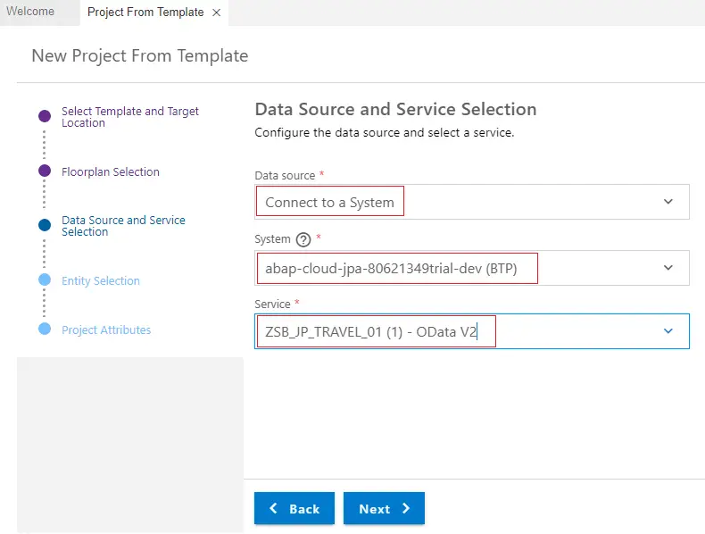

# ABAP RESTful Application Programming Model [7] – Create Fiori Element App from RAP Service – Unmanaged Scenario

In this post, you will learn how to use the Business Application Studio to create Fiori Element Application with the OData Service created using RAP model.

## 1. Log into SAP BTP and Launch Business Application Studio.

## 2. Create Project from Template
The Fiori Element app using the OData Service developed earlier can be created with ease by following the below steps.

### 2.1 Click on Start from template

Alternate to this is to select New Project from Template from File menu option.

### 2.2 Select Template and Target Location

Keep the default path and select SAP Fiori application. Click Start.

### 2.3 Floorplan Selection

In the application type, select SAP Fiori elements.

There are 5 Floorplan options available as of today –

1. List Report Object Page
2. Worklist
3. Analytical List Page
4. Overview Page
5. Form Entry Object Page

Select List Report Object Page. As the service we have created is for single table. This is the most appropriate template.

Click Next.

### 2.4 Data Source and Service Selection

Select Connect to a system in Data source dropdown, select connection to your ABAP instance from System. Usually you will have only one system in the dropdown.

From the service dropdown, search and select your service. Click Next.

Note: ZSB_JP_TRAVEL_01 is the service binding we created in earlier post.

### 2.5 Entity Selection

Select Travel as the root entity and to_Booking as Navigation entity. Click Next.

### 2.6 Project Attribute

Choose meaningful names/text for attributes. Application namespace needs to be unique for each application.

Click Finish.

### 2.7 The project is created.

The Travel and Booking entities are automatically handled on List Report and Object Page.

## 3. Open the Project
Open the project in explorer. Expand the travel app folder. Then expand webapp folder.

## 4. Run the application.

### 4.1 Right click on the travel folder and select Preview Application.

### 4.2 Select one of the highlighted options (with Fiori launch pad / without launch pad view)

### 4.3 Command line execution will start and you can see the commands and log at the bottom of the screen.

### 4.4 You may have to allow pop-ups and run again.

### 4.5 Application will launch as below.

## 5. Test the application

Click on Go to see the data on List page.

Select any row to see Object page.

