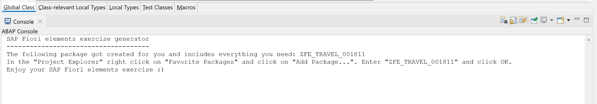
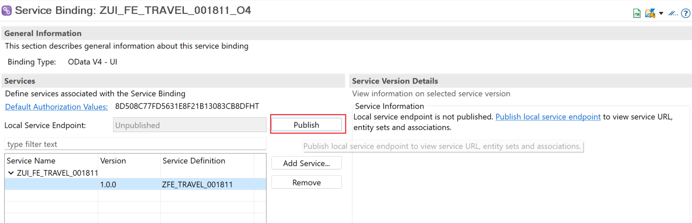

# ABAP RESTful Application Programming Model [9] – Use demo generator to create a Travel Service

In this post, you will learn to use SAP demo class to create a RAP service. We can use the generated RAP service to build Fiori element app from Business Application Studio, or to study the RAP model itself.

You need SAP Trial account to go through this Tutorial. Please follow below posts to set up yourself for the tutorial.

- Install Eclipse for ABAP Development
- Create SAP HANA Trial Account
- Connect to a SAP HANA Trial System – Its a free sandbox for ABAP on HANA/Cloud
- Working With Eclipse [1] : Open ABAP Perspective & Create A Project

## Run Service Generator

In earlier posts of this series we have created RAP services with managed and unmanaged scenarios. This time we will simply generate the service.

Search for class /DMO/CL_FE_TRAVEL_GENERATOR using the button marked below.

Add the class name. Chose okay once the class is displayed.

The class documentation also has instructions on how to run the generator.

Click on Run As…

Chose ABAP Application (Console) and click okay

Console shows below output.

Note that the suffix number i.e. 001811 in this case, is a generated number and you will get a different number.

## Add Package to Favourites

As per the instructions from the colsole output, add the package ZFE_TRAVEL_001811 as favourite package.

Select the package and click OK.

Expand the package and then the node ‘Service Binding’. OData V2 and V4 services are created.

## Publish and Test the Service

Publish the service that you want to see. I published both the services. Publish typically takes few minutes to complete.

### V2 OData Service

Once the service is published the Service Information Section will show below nodes.

Click on the node to test and click on Preview. This shows how the node would look like in a Fiori element App.

Remember, once the page loads, you need to click on Go to see the data.

If the data is not appearing, click on the settings and ensure that at least one column is selected.

### V4 OData Service

V2 and V4 have slightly different interface in the Service Binding Screen. Once the service is published the Service Information Section will show below nodes.

This can also be tested in similar way.

In the following posts, we will understand all generated objects for this RAP service and experiment with various code/annotation options to understand the RAP model in more detail.

Read about more such ABAP expres