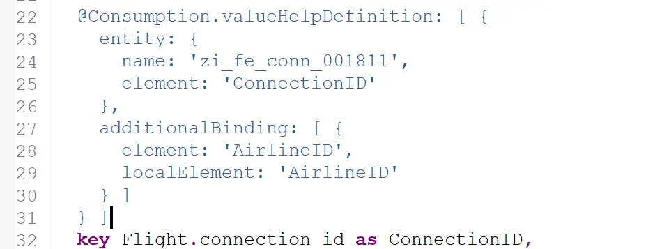

# ABAP RESTful Application Programming Model [10] – Travel Service – Generated Objects

In the previous post, ABAP RESTful Application Programming Model [9] – Use demo generator to create a Travel Service we created a RAP Service for Travel Application using generator class /DMO/CL_FE_TRAVEL_GENERATOR.

In this post, let us understand all the generated objects. This post is only the overview of all objects whereas, subsequent posts will deep dive into most of these to understand the impact on the OData service.

## Package

Package ZFE_TRAVEL_001811 is created. 001811 is the number generated by the class. This is used as a suffix for all names so that the names are unique for everyone who uses the generator and they can play around with the code.

This package should be added as a favorite.

## Database Table

Below are the database tables generated.

The relation between these tables is as below. Pay attention to arrows as well.

Table relations and their keys are as below.

1. Travel (Travel ID) is a collection of multiple bookings. It can also have status.
2. Each Booking(Travel ID, Booking ID) has an associated Flight
3. Each Flight(Carrier ID, Connection ID, Flight date) has a Connection
4. Each Connection(Carrier ID, Connection ID) has a Carrier (Carrier ID)

Each Carrier can have multiple connections, one connection has multiple flights and one flight will have multiple bookings. However, we are not considering reverse traversing here as the application considered here is to manage Travels where travels and bookings will be created/updated/deleted.

For this reason, we also have Draft tales for Travel and Booking Entities.

## Data Generator Class

The data generator class ZFE_DATA_GENERATOR_001811 can be run to generate initial data. This will only be needed if you do not see any data in your CDS views or when you want to reset the data and start again.

We will visit the other two classes later.

## CDS Entities

All CDS views that start with ZI_FE_ represent the CDS views for each persistent table mentioned above. View with the name containing ANALYTICS in it will be ignored in this post and we will visit them in later posts.

## ZI_FE_CARR_001811

ZI_FE_CARR, ZI_FE_CONN, ZI_FE_FLIG, ZI_FE_STAT are similar. These are supporting CDS Entities. All have SELECT from relevant tables and associations to get more information on the fields from the table.

## ZI_FE_Travel_001811

This is the root entity for the service. Travel consists of multiple bookings, which is indicated by the special type of association i.e. COMPOSITION.

## ZI_FE_Booking_001811

Similarly, a booking can not exists on its own and it must have a travel as its parent. This is indicated below.

Note: If we are creating this manually then we need to activate these entities together as each one refers to other.

## ZC_FE_Booking_001811 & ZC_FE_Travel_001811

These entities starting with ZC_ are consumption layer entities. This is the layer that is exposed to OData service.

The fields shown in the app can be assigned search helps in any of these views using the below annotations.

This is an example of a field with value help that only populates the same field.

This is an example of additional binding. Here, the value help shows two fields and populates both these fields.

## Behavior Definition

Behavior definitions are required for the Entities which are required to be displayed as lists or object pages on the application. Supporting entities do not need a behavior definition.

Also, one behavior definition can include multiple Entities.

Similar to CDS Entities, Behavior-Definition also has an additional Consumption layer.

## ZI_FE_Travel_001811

This is a Managed Scenario. This means that the create, update, and delete operations are handled automatically and do not need additional coding. This is a bit obvious as we have custom tables for storing all the data.

In addition, this service is ‘with draft’. This means the drafts and managed automatically. The draft table and draft actions are defined in this.

The same definition source contains behavior for the Booking entity as well.

Notice that the create operation is not mentioned along with update and delete but it is mentioned in the Travel behavior.

## ZC_FE_Travel_001811

Consumption-layer behavior definition is just a representation of operations.

## Behavior Implementation Classes

As this is managed scenario, the classes will only have additional determinations.

## ZBP_I_FE_BOOKING_001811

When you go from the behavior definition to the class it looks empty. Here, the class is actually as abstract class and the actual code can be found in the Local Types tab.

Here, the method implementation is blank and we will need to implement the code if we want the action to work.

## ZBP_I_FE_TRAVEL_001811

This is same as the booking class.

## Business Service – Service Definition

Service definition simply defines which CDS entities we need to expose as OData Service Entities.

## Business Service – Service Binding

This is the final step in creating a RAP service.

The binding includes at least one Service Definition and upon activation allows to publish the service.

All published services can be tested by selecting a node and clicking on Preview. Let us check for the Travel node.

In case you get the below issue, do not worry. This is the same error we get when we create OData service from SEGW using Flight Model.

Just comment Distance field from Connection Entity zi_fe_conn_001811. Start the preview again and it will work this time.

Click on Go.

Select Columns in settings.

