# ABAP RESTful Application Programming Model [11] – Travel Service – Annotations for List Page

From this post, we will start enhancing the service so that the Fiori element application becomes better and we understand which part of the backend code controls which part of the front-end.

The service binding ZUI_FE_TRAVEL_001811_O4 looks like below. Travel and Booking are the main entities from the service and Travel is the root.

Preview the Travel Entity.

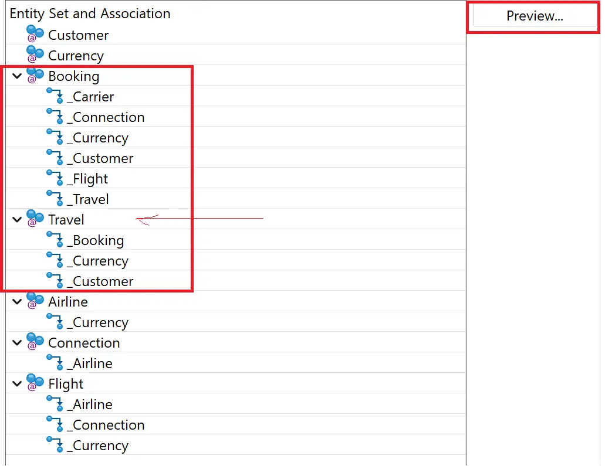

The app starts as below. The message reads “There are no visible columns in the table right now. Please select the columns you need in the table settings.”

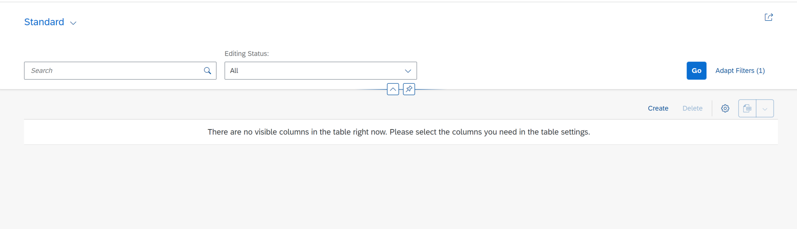

When we go to the settings and select columns, hit Go – data appears.

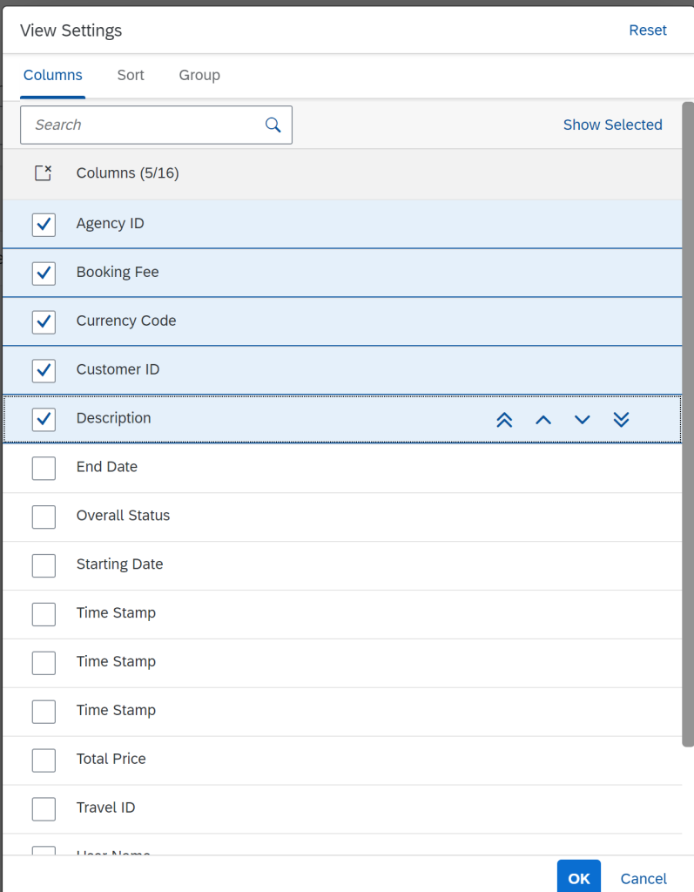
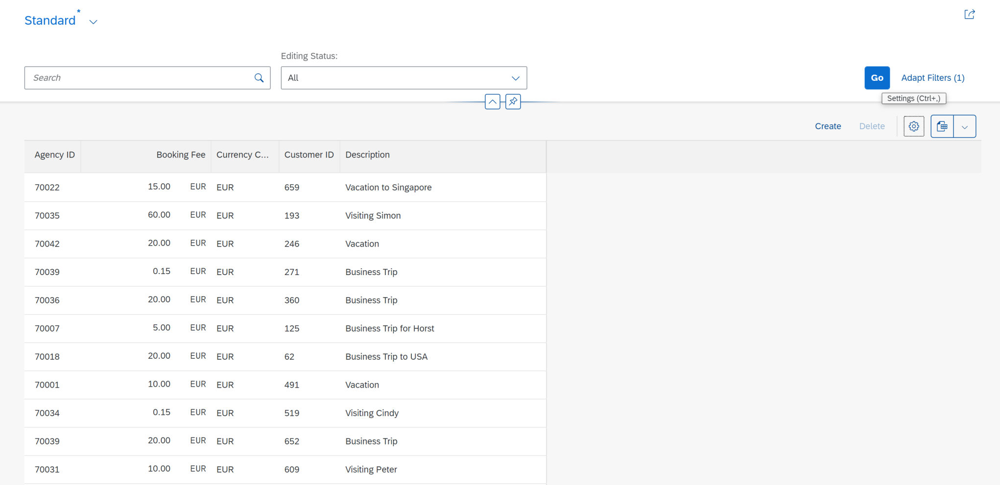

However, we don’t expect user to select required columns when the app starts. We need to make few columns visible by default. This can be done using Annotations. We can add annotations to CDS Entity directly but for easier maintenance we create Metadata Extension.

## Create Metadata Extension
Expand the package ZFE_TRAVEL_001811 and locate the consumption layer view ZC_FE_Travel_001811. This is also called as projection view.

Right click on ZC_FE_Travel_001811 and chose New Metadata Extension.

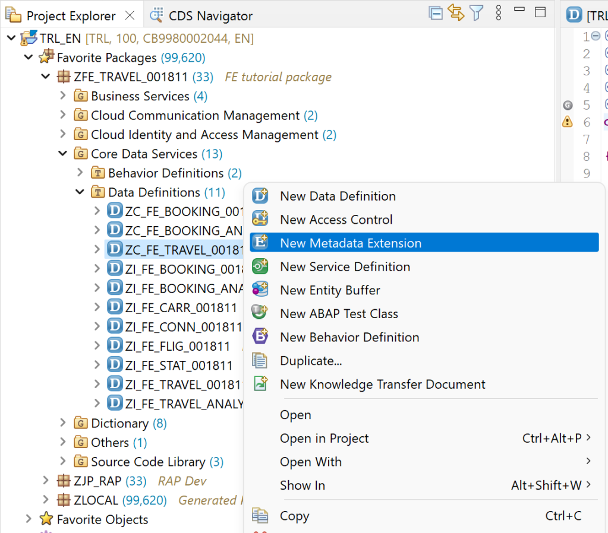

Enter Name and Description. The name can be same as the entity file itself. Click Next.

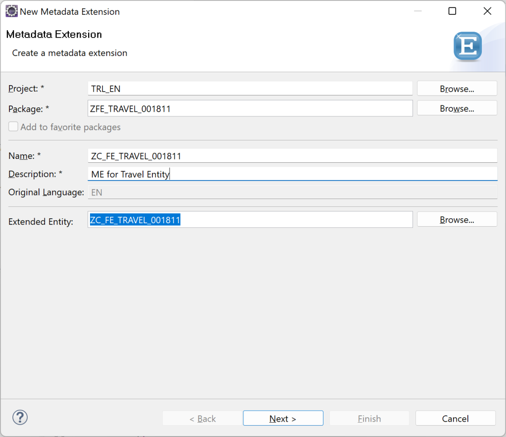

Chose a TR. Click Finish.

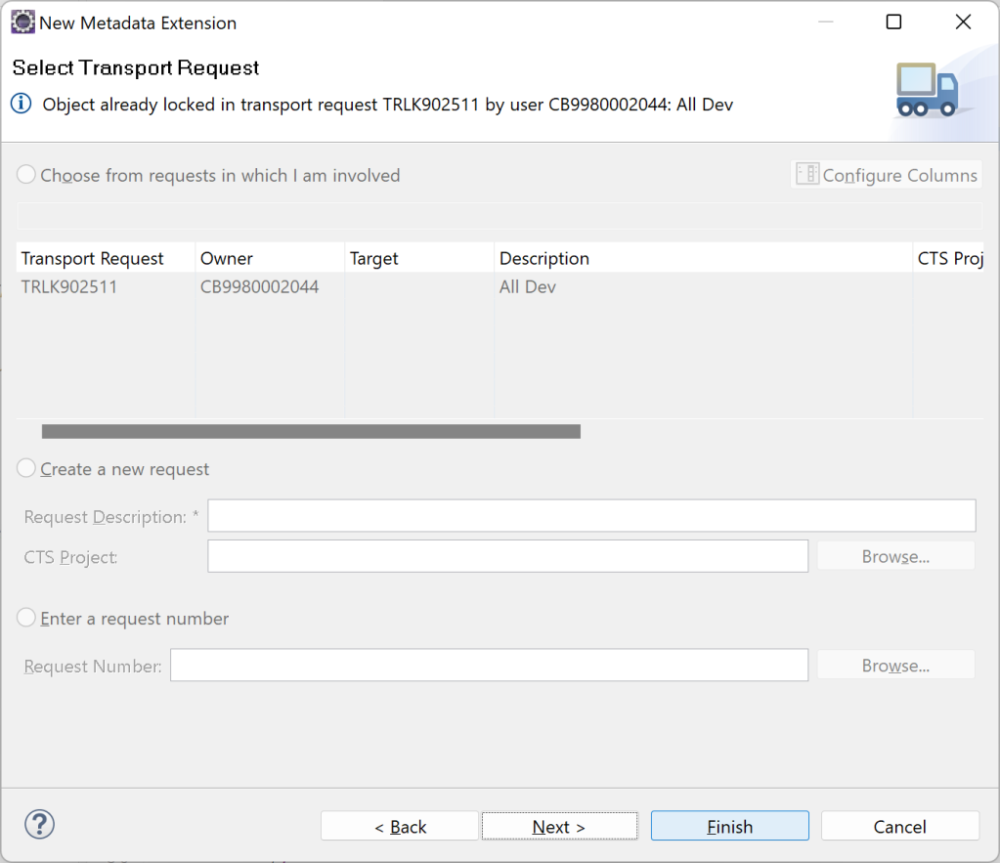

Metadata Extension will be created as below.

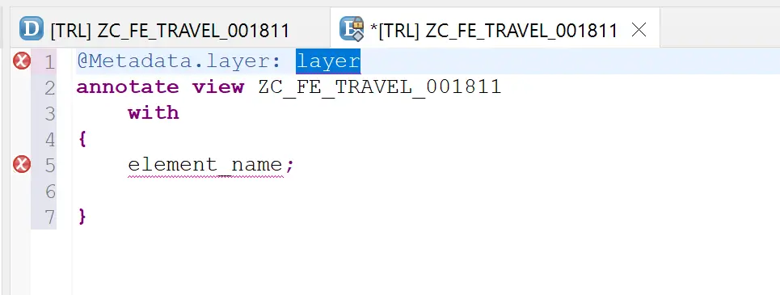

For layer chose value using CTRL + SPACE.

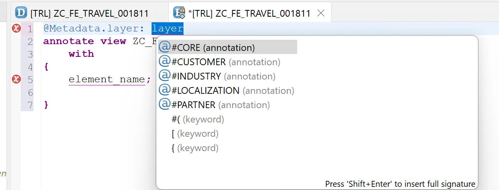

## Annotations to Define List Columns
Metadata extension uses annotation to specify which columns should appear on the list and in which sequence..

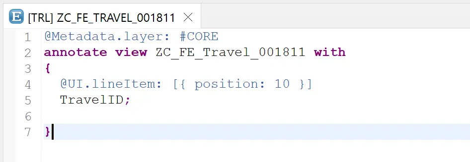

Code Reference

```
@Metadata.layer: #CORE
annotate view ZC_FE_Travel_001811 with
{
  @UI.lineItem: [{ position: 10 }]
  TravelID;
}
```

Here, only one field is added. Let us first see the impact and then add rest of the fields.

Preview the service again and click Go. This time the column appears by default.

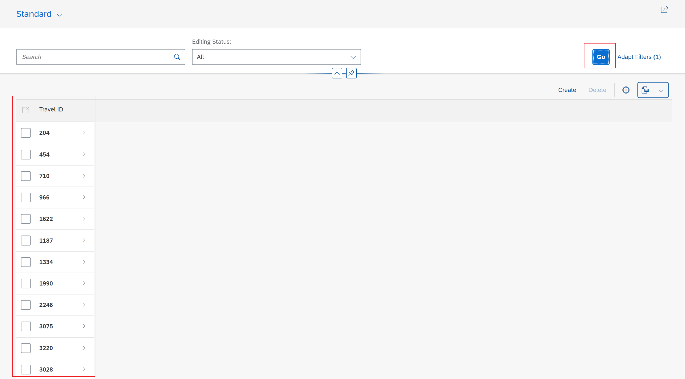

Now add rest of the columns.

Code Reference

```
@Metadata.layer: #CORE
annotate view ZC_FE_Travel_001811 with
{
  @UI.lineItem: [{ position: 10 }]
  TravelID;
  
  @UI.lineItem: [{ position: 20 }]
  AgencyID;

  @UI.lineItem: [{ position: 30 }]
  CustomerID;

  @UI.lineItem: [{ position: 40 }]
  BeginDate;

  @UI.lineItem: [{ position: 50 }]
  EndDate;

  @UI.lineItem: [{ position: 60 }]
  BookingFee;

  @UI.lineItem: [{ position: 70 }]
  TotalPrice;

  @UI.lineItem: [{ position: 80 }]
  OverallStatus;
  
  @UI.lineItem: [{ position: 90 }]
  CreatedAt;
    
  @UI.lineItem: [{ position: 100 }]
  LocalLastChangedAt;
}
```

All the columns appear now.

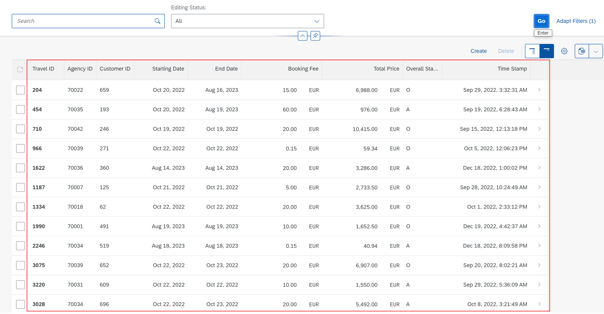

## Annotations for Filter Bar
The default filter bar is shown as below. This is default search box and the Editing Status drop down is for drafts and draft management is active.

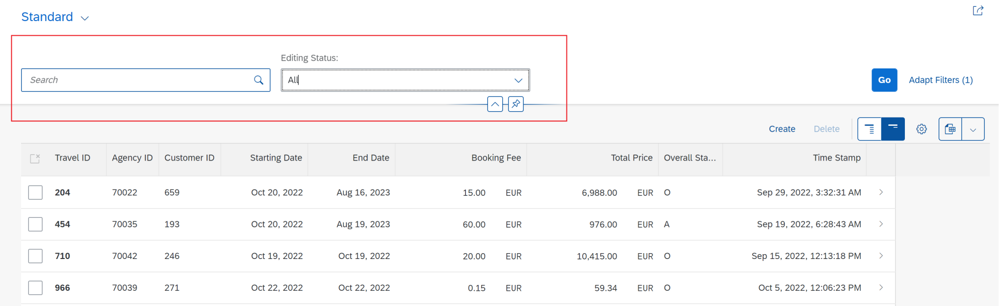

When we need to add any of the list column also as filter, we can simply do this with the annotation @UI.selectionField

Code Reference

```
@Metadata.layer: #CORE
annotate view ZC_FE_Travel_001811 with
{
  @UI.lineItem: [{ position: 10 }]
  @UI.selectionField: [{ position: 10 }]
  TravelID;
  
  @UI.lineItem: [{ position: 20 }]
  @UI.selectionField: [{ position: 30 }]
  AgencyID;

  @UI.lineItem: [{ position: 30 }]
  @UI.selectionField: [{ position: 20 }]
  CustomerID;

  @UI.lineItem: [{ position: 40 }]
  BeginDate;

  @UI.lineItem: [{ position: 50 }]
  EndDate;

  @UI.lineItem: [{ position: 60 }]
  BookingFee;

  @UI.lineItem: [{ position: 70 }]
  TotalPrice;

  @UI.lineItem: [{ position: 80 }]
  OverallStatus;
  
  @UI.lineItem: [{ position: 90 }]
  CreatedAt;
    
  @UI.lineItem: [{ position: 100 }]
  LocalLastChangedAt;
}
```

Activate the Metadata Extension, Refresh app page, hit Go. We can see the additional columns in filter.

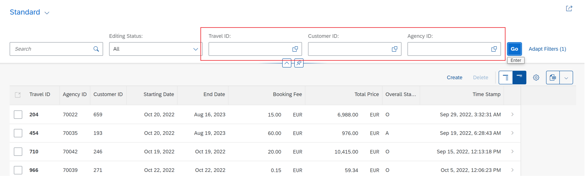

Notice that the sequence of list columns and sequence for filter is different. This is controlled in the annotation by specifying the position.

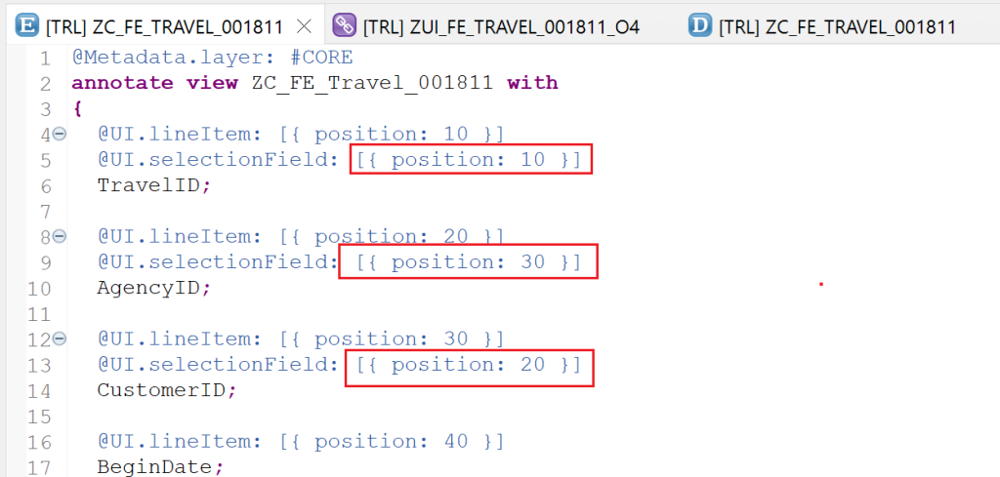

## Annotations for Header
We can add header description using annotations as below.

    @UI: {
        headerInfo: {
            typeName: 'Travel',
            typeNamePlural: 'Travels'
        }
    }

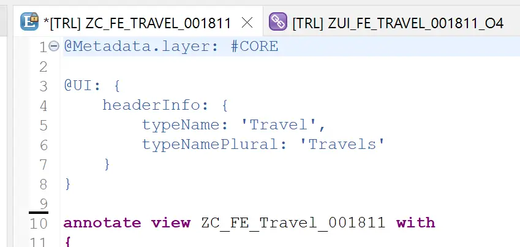

The header for the list starts appearing.

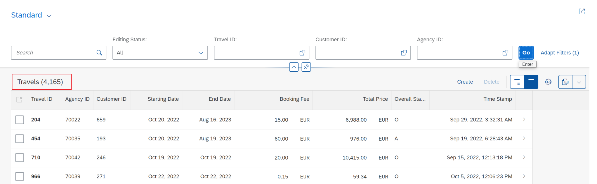

## Annotations for Sorting
In the header annotation, sorting information can also be added.

```
@UI: {
    headerInfo: {
        typeName: 'Travel',
        typeNamePlural: 'Travels'
    },
    presentationVariant: [{
        sortOrder: [{
            by: 'TotalPrice',
            direction: #DESC
        }],
        visualizations: [{
            type: #AS_LINEITEM
        }]
    }]
}
```

This way, using simple annotations the List Report Fiori element app is improved.