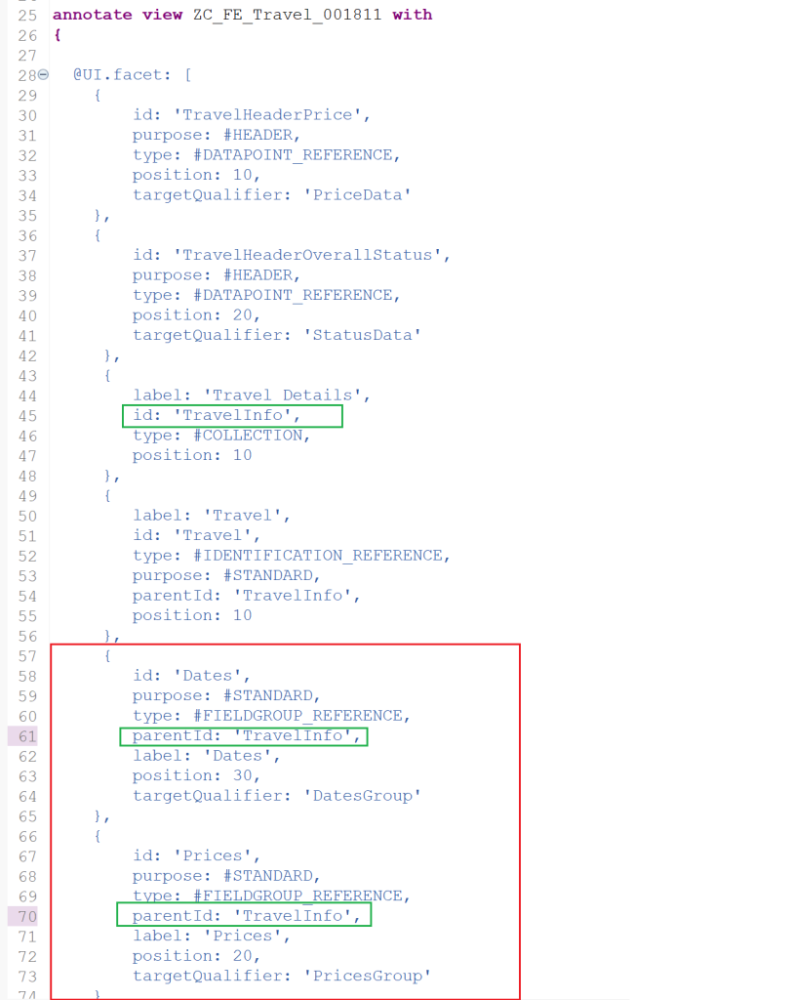

# ABAP RESTful Application Programming Model [12] – Travel Service – Annotations for object page

## Navigating to the Object Page
When the application is launched, it shows the List Page. Here, we have a navigation icon i.e. > at end of each row. This indicates that we can navigate to the Object Page.

Click on the icon or on the row anywhere to navigate to the object page.


Current object page. All you can see here is a blank object page.


Let us see how to have the fields visible on the object page.

## Object Page Header
Open metadata extension ZC_FE_Travel_001811. We defined header annotations for the list page earlier.


Now, we will enhance the annotation headerInfo for the object page title and description.


Do not forget to add a comma in the previous line while adding this section.

```
@UI: {
    headerInfo: {
        typeName: 'Travel',
        typeNamePlural: 'Travels',
        title: {
            type: #STANDARD, value: 'Description'
        },
        description: {
            value: 'TravelID'
        }
    },
    presentationVariant: [{
        sortOrder: [{
            by: 'TotalPrice',
            direction: #DESC
        }],
        visualizations: [{
            type: #AS_LINEITEM
        }]
    }]
}
```

The ‘Description’ word mentioned after the value is the field from the Travel Entity. Similarly, TravelID is also a field from the Entity.


Refresh the page. You will see the header section populated with the Travel Id and the description.


To add a few more fields to the header section, annotation @UI.facet with type #DATAPOINT_REFERENCE can be used. This annotation should be added after the ‘annotate view' statement.


```
"Annotations to be added 
  @UI.facet: [
    {
        id: 'TravelHeaderPrice',
        purpose: #HEADER,
        type: #DATAPOINT_REFERENCE,
        position: 10,
        targetQualifier: 'PriceData'
    },
    {
        id: 'TravelHeaderOverallStatus',
        purpose: #HEADER,
        type: #DATAPOINT_REFERENCE,
        position: 20,
        targetQualifier: 'StatusData'
     }
  ]


  @UI.lineItem: [{ position: 70 }]
  @UI.dataPoint: { qualifier: 'PriceData', title: 'Total Price'}
  TotalPrice;

  @UI.lineItem: [{ position: 80 }]
  @UI.dataPoint: { qualifier: 'StatusData', title: 'Status' }
  OverallStatus;
```

The TotalPrice and OverallStatus fields were already present in the metadata file. The annotation @UI.dataPoint is added for both of them.


The qualifiers mentioned in the facet are linked to the datapoints with the same qualifier.

Refresh the page to see the below results.


## Sections and Sub-sections
To add sections and subsections to the body area of the page, we enhance the annotation @UI.facet.

    {
        label: 'Travel Details',
        id: 'TravelInfo',
        type: #COLLECTION,
        position: 10
    },
    {
        label: 'Travel',
        id: 'Travel',
        type: #IDENTIFICATION_REFERENCE,
        purpose: #STANDARD,
        parentId: 'TravelInfo',
        position: 10
    }


Refresh the page to see the sections added.


## Add Properties to Subsection
Use annotation @UI.Identification to add new properties and also add it to the properties that we want to show in the section added.

    @UI.lineItem: [{ position: 10 }]
    @UI.selectionField: [{ position: 10 }]
    TravelID;

    @UI.identification: [{ position: 10 }]
    Description;


    @UI.lineItem: [{ position: 20 }]
    @UI.selectionField: [{ position: 30 }]
    @UI.identification: [{ position: 50 }]
    AgencyID;

    @UI.lineItem: [{ position: 30 }]
    @UI.selectionField: [{ position: 20 }]
    @UI.identification: [{ position: 20 }]
    CustomerID;

    @UI.lineItem: [{ position: 40 }]
    @UI.identification: [{ position: 30 }]
    BeginDate;

    @UI.lineItem: [{ position: 50 }]
    @UI.identification: [{ position: 40 }]
    EndDate;


Refresh the page to see the properties displayed on the page.


## Creating multiple sections
Multiple sections like Travel can be created using type #FIELDGROUP_REFERENCE. Here we can change the field grouping if required. For example, Dates can be grouped, price related information can be grouped.

First we add below to @UI.facet

     {
        id: 'Dates',
        purpose: #STANDARD,
        type: #FIELDGROUP_REFERENCE,
        parentId: 'TravelInfo',
        label: 'Dates',
        position: 30,
        targetQualifier: 'DatesGroup'
    },
    {
        id: 'Prices',
        purpose: #STANDARD,
        type: #FIELDGROUP_REFERENCE,
        parentId: 'TravelInfo',
        label: 'Prices',
        position: 20,
        targetQualifier: 'PricesGroup'
    }



Then add @UI.fieldGroup annotation at the field level to move the fields to the group.

    @UI.lineItem: [{ position: 10 }]
    @UI.selectionField: [{ position: 10 }]
    TravelID;

    @UI.identification: [{ position: 10 }]
    Description;

    @UI.lineItem: [{ position: 20 }]
    @UI.selectionField: [{ position: 30 }]
    @UI.identification: [{ position: 20 }]
    AgencyID;

    @UI.lineItem: [{ position: 30 }]
    @UI.selectionField: [{ position: 20 }]
    @UI.identification: [{ position: 30 }]
    CustomerID;

    @UI.lineItem: [{ position: 40 }]
    @UI.fieldGroup: [{ qualifier: 'DatesGroup', position: 10 }]
    BeginDate;

    @UI.lineItem: [{ position: 50 }]
    @UI.fieldGroup: [{ qualifier: 'DatesGroup', position: 20 }]
    EndDate;

    @UI.lineItem: [{ position: 60 }]
    @UI.fieldGroup: [ { qualifier: 'PricesGroup', position: 10} ]
    BookingFee;

    @UI.lineItem: [{ position: 70 }]
    @UI.dataPoint: { qualifier: 'PriceData', title: 'Total Price'}
    @UI.fieldGroup: [{ qualifier: 'PricesGroup', position: 20 }]
    TotalPrice;

The 3 groups are highlighted as below. Green shows the group identified under #IDENTIFICATION_REFERENCE with annotation @UI.identification. Red shows group created with type #FIELDGROUP_REFERENCE with targetQualifier: 'DatesGroup' and yellow shows #FIELDGROUP_REFERENCE with targetQualifier: 'PriceGroup' with annotation @UI.fieldGroup.


Note that initially, all fields were added with @UI.identification and later moved some of them to @UI.fieldGroup.

The entire source code for the metadata extension at this point is as below.

```
@Metadata.layer: #CORE

@UI: {
    headerInfo: {
        typeName: 'Travel',
        typeNamePlural: 'Travels',
        title: {
            type: #STANDARD, value: 'Description'
        },
        description: {
            value: 'TravelID'
        }
    },
    presentationVariant: [{
        sortOrder: [{
            by: 'TotalPrice',
            direction: #DESC
        }],
        visualizations: [{
            type: #AS_LINEITEM
        }]
    }]
}

annotate view ZC_FE_Travel_001811 with
{

  @UI.facet: [
    {
        id: 'TravelHeaderPrice',
        purpose: #HEADER,
        type: #DATAPOINT_REFERENCE,
        position: 10,
        targetQualifier: 'PriceData'
    },
    {
        id: 'TravelHeaderOverallStatus',
        purpose: #HEADER,
        type: #DATAPOINT_REFERENCE,
        position: 20,
        targetQualifier: 'StatusData'
     },
     {
        label: 'Travel Details',
        id: 'TravelInfo',
        type: #COLLECTION,
        position: 10
     },
     {
        label: 'Travel',
        id: 'Travel',
        type: #IDENTIFICATION_REFERENCE,
        purpose: #STANDARD,
        parentId: 'TravelInfo',
        position: 10
     },
     {
        id: 'Dates',
        purpose: #STANDARD,
        type: #FIELDGROUP_REFERENCE,
        parentId: 'TravelInfo',
        label: 'Dates',
        position: 30,
        targetQualifier: 'DatesGroup'
    },
    {
        id: 'Prices',
        purpose: #STANDARD,
        type: #FIELDGROUP_REFERENCE,
        parentId: 'TravelInfo',
        label: 'Prices',
        position: 20,
        targetQualifier: 'PricesGroup'
    }
  ]

  @UI.lineItem: [{ position: 10 }]
  @UI.selectionField: [{ position: 10 }]
  TravelID;

  @UI.identification: [{ position: 10 }]
  Description;

  @UI.lineItem: [{ position: 20 }]
  @UI.selectionField: [{ position: 30 }]
  @UI.identification: [{ position: 20 }]
  AgencyID;

  @UI.lineItem: [{ position: 30 }]
  @UI.selectionField: [{ position: 20 }]
  @UI.identification: [{ position: 30 }]
  CustomerID;

  @UI.lineItem: [{ position: 40 }]
  @UI.fieldGroup: [{ qualifier: 'DatesGroup', position: 10 }]
  BeginDate;

  @UI.lineItem: [{ position: 50 }]
  @UI.fieldGroup: [{ qualifier: 'DatesGroup', position: 20 }]
  EndDate;

  @UI.lineItem: [{ position: 60 }]
  @UI.fieldGroup: [ { qualifier: 'PricesGroup', position: 10} ]
  BookingFee;

  @UI.lineItem: [{ position: 70 }]
  @UI.dataPoint: { qualifier: 'PriceData', title: 'Total Price'}
  @UI.fieldGroup: [{ qualifier: 'PricesGroup', position: 20 }]
  TotalPrice;

  @UI.lineItem: [{ position: 80 }]
  @UI.dataPoint: { qualifier: 'StatusData', title: 'Status' }
  OverallStatus;

  @UI.lineItem: [{ position: 90 }]
  CreatedAt;

  @UI.lineItem: [{ position: 100 }]
  LocalLastChangedAt;
}
```

Activate the metadata extension and refreshed the page.


(Reference: https://developers.sap.com/tutorials/fiori-tools-rap-modify-object-page.html)