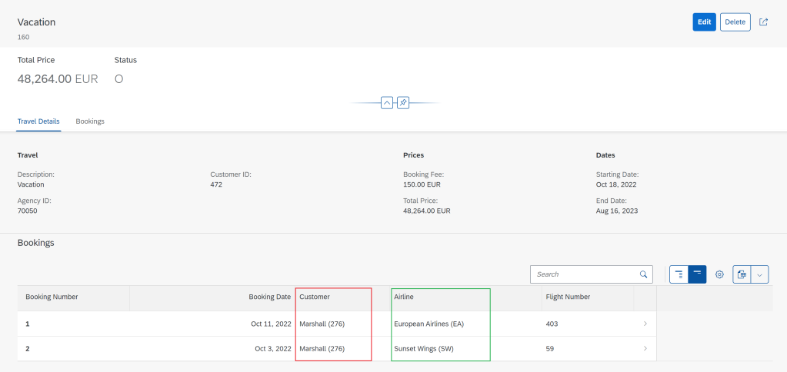
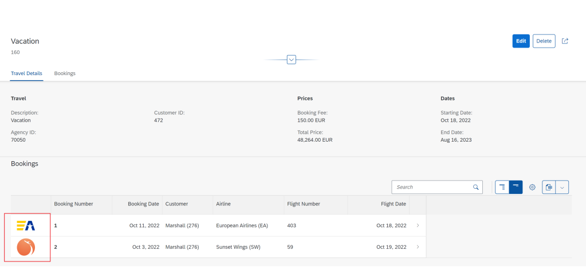

# ABAP RESTful Application Programming Model [13] – Travel Service – Annotations for adding associated entity table

The current status of the application is as below.


## Adding a table for Bookings on the Travel Object Page
The booking data comes from the Booking Entity. The bookings are linked to travel in a child-parent relationship.


Booking view entity is as below.


To add the table, we need to annotate the Booking Entity by creating a metadata extension for the projection view entity i.e. ZC_FE_Booking_001811.

## Create metadata extension for ZC_FE_BOOKING_001811
Right-click on the CDS view entity ZC_FE_BOOKING_001811 and choose New Metadata Extension.


Provide name and description and click Next. Use the name same as the view entity.


As the view entity is saved in a TR, the same TR will also be used for Metadata Extension. Just click Finish.


A metadata extension with a base template is created.


Complete the code as below.

```
@Metadata.layer: #CORE
annotate view ZC_FE_Booking_001811 with
{
  @UI.lineItem: [ { position: 10 } ]
  BookingID;

  @UI.lineItem: [ { position: 20 } ]
  BookingDate;

  @UI.lineItem: [ { position: 30 } ]
  CustomerID;

  @UI.lineItem: [ { position: 40 } ]
  CarrierID;

  @UI.lineItem: [ { position: 50 } ]
  ConnectionID;

  @UI.lineItem: [ { position: 60 } ]
  FlightDate;

  @UI.lineItem: [ { position: 70 } ]
  FlightPrice;
}
```


Activate the metadata extension.

## Update metadata extension for ZC_FE_TRAVEL_001811
Add a new section with an annotation @UI.facet with type #LINEITEM_REFERENCE.

    {
        id: 'Booking',
        purpose: #STANDARD,
        type: #LINEITEM_REFERENCE,
        label: 'Bookings',
        position: 20,
        targetElement: '_Booking'
    }


Activate the metadata extension. Refresh the page to see the table on the application.


## Showing names and descriptions instead of ids

In the above table, we show Customer ID and Airline ID where it could be more useful to show the description as well. This can be done with annotations in the projection view ZC_FE_Booking_001811.

Customer ID and Airline ID are defined in the entity as below.


The highlighted blocks are replaced by the below code.

    @Consumption.valueHelpDefinition: [ {
    entity: {
        name: '/DMO/I_Customer',
        element: 'CustomerID'
    }
    } ]

    @EndUserText.label: 'Customer'
    @ObjectModel.text.element: ['LastName']
    CustomerID,
    _Customer.LastName as LastName,
    
    @Consumption.valueHelpDefinition: [ {
    entity: {
        name: 'zi_fe_carr_001811',
        element: 'AirlineID'
    }
    } ]

    @EndUserText.label: 'Airline'
    @ObjectModel.text.element: ['CarrierName']
    CarrierID,
    _Carrier.Name      as CarrierName,


Note that _Customer and _Carrier are associations from the root view entity ZI_FE_BOOKING_001811.

Activate the view entity and Refresh the application page.



When the data model has information on the URL which stores the image/logo, it can be displayed on the page using the below annotation. Note the additional key-word value in the annotation @UI.lineItem.

    @UI.lineItem: [ { position: 05, label: ' ', value: '_Carrier.AirlinePicURL' } ]
        _Carrier;


Activate the metadata extension and refresh the page to get the below result.



## Object Page for Booking data

Everything that we learned in the last two posts of this series can be applied to create an object page for the booking so that when you click on booking it shows proper data.

### ZC_FE_Booking_001811

```
@Metadata.layer: #CORE

@UI: {
    headerInfo: {
        typeName: 'Booking',
        typeNamePlural: 'Bookings',
        title: {
            type: #STANDARD, value: 'BookingID'
        }
    },
    presentationVariant: [{
        sortOrder: [{
            by: 'FlightDate',
            direction: #ASC
        }],
        visualizations: [{
            type: #AS_LINEITEM
        }]
    }]
}

annotate view ZC_FE_Booking_001811 with
{

  @UI.facet: [
       {
          label: 'Booking Details',
          id: 'BookingInfo',
          type: #COLLECTION,
          position: 10
       },
       {
          label: 'Booking',
          id: 'Booking',
          type: #IDENTIFICATION_REFERENCE,
          purpose: #STANDARD,
          parentId: 'BookingInfo',
          position: 10
       }
    ]


  @UI.lineItem: [ { position: 05, label: ' ', value: '_Carrier.AirlinePicURL' } ]
  _Carrier;

  @UI.lineItem: [ { position: 10 } ]
  @UI.identification: [{ position: 10 }]
  BookingID;

  @UI.lineItem: [ { position: 20 } ]
  @UI.identification: [{ position: 20 }]
  BookingDate;

  @UI.lineItem: [ { position: 30 } ]
  @UI.identification: [{ position: 30 }]
  CustomerID;

  @UI.lineItem: [ { position: 40 } ]
  @UI.identification: [{ position: 40 }]
  CarrierID;

  @UI.lineItem: [ { position: 50 } ]
  @UI.identification: [{ position: 50 }]
  ConnectionID;

  @UI.lineItem: [ { position: 60 } ]
  @UI.identification: [{ position: 60 }]
  FlightDate;

  @UI.lineItem: [ { position: 70 } ]
  @UI.identification: [{ position: 70 }]
  FlightPrice;
}
```

Activate and refresh the page.


Note that there are no field groups or additional header details added on this page as those options are already covered with Object Page for Travel.

(Reference : https://developers.sap.com/tutorials/fiori-tools-rap-modify-object-page.html)